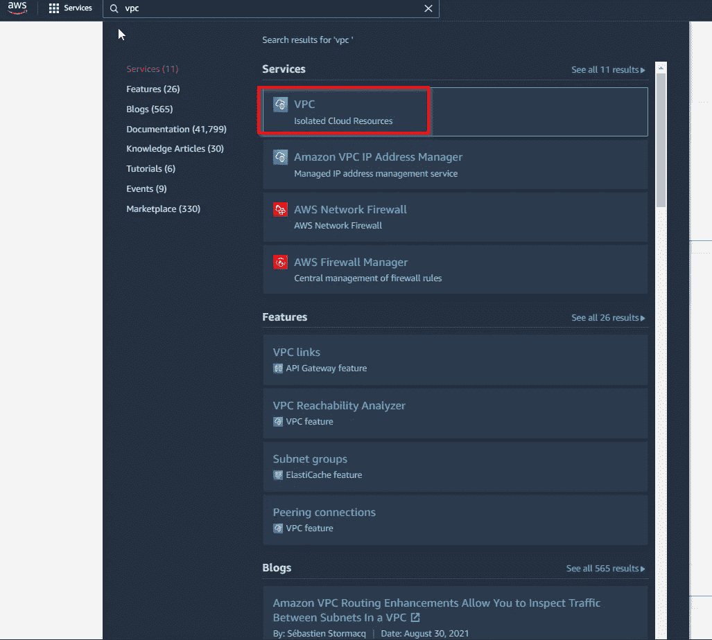
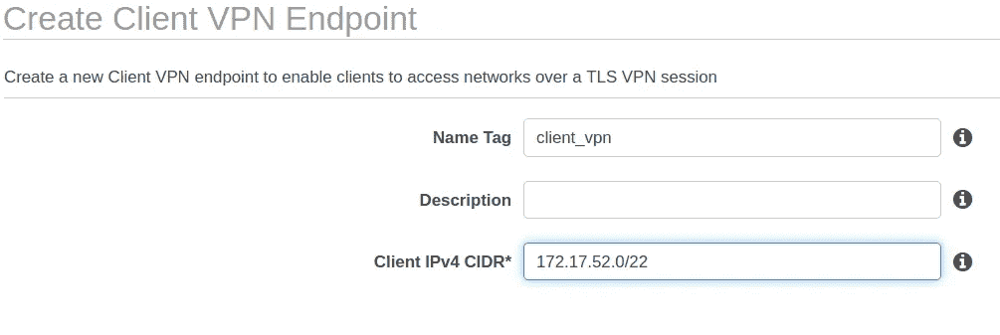

# 使用 AWS 客户端 VPN 访问 VPC 资源

> 原文：<https://blog.devgenius.io/accessing-vpc-resources-using-aws-client-vpn-e327aab9767b?source=collection_archive---------5----------------------->

在这篇文章结束时，我希望你能够解释什么是 VPN，虚拟专用网络，以及如何设置 AWS 客户端 VPN，以访问 VPC，虚拟专用云的 AWS 私有资源。

## **什么是 VPN？**

虚拟专用网络提供了一种在公共或共享网络上扩展专用网络的方式，并使终端能够像在同一网络上一样工作。该连接提供加密，有助于确保敏感数据安全传输，并防止窃听通信。有很多关于 VPN 的信息，所以我将提供一些概念的简要概述。两种主要的 VPN 技术是 IPsec(互联网协议安全)VPN 和 SSL/TLS(安全套接字层/传输层安全)VPN。

IPsec VPNs 直接运行在 Internet 协议上，在网络层运行。这种类型的 VPN 需要将 VPN 硬件设备放置在内部网络的前端。想要连接的用户必须安装能够连接到 VPN 设备的软件应用程序。一旦建立了安全连接，用户就可以访问整个网络。

SSL VPNs 使用传输层安全性来加密流量，并在第 4-7 层运行。SSL VPNs 不需要在主机上安装客户机，而是利用 web 浏览器。加密只发生在与浏览器相关的互联网活动中；在浏览器之外做的任何事情都不受保护。这种类型的 VPN 用于将用户连接到特定的应用程序和服务，而不是整个网络。

比较 IPsec 和 SSL VPNs

还有站点到站点 VPN 和远程访问 VPN。IPsec VPNs 通常用于站点到站点 VPN。站点到站点 VPN 将安全地连接不同物理位置的两个或多个 LAN(局域网)。这对于连接拥有多个办公室的组织的网络，创建 WAN(广域网)非常有用。在这里，一个远程局域网的 VPN 网关与另一个局域网的网关通信，以创建一个安全的隧道，因此不需要 VPN 客户端。网关负责数据的认证、加密和完整性。

另一方面，远程访问 VPN 允许单个用户连接到一个安全的网络，就像他们直接接入网络一样。当远程员工需要访问公司局域网上的安全资源时，通常会出现这种情况。远程用户的设备负责加密和解密发送或接收的数据。它需要 NAS(网络访问服务器)或 VPN 网关来验证试图登录 VPN 的设备的凭证。客户端软件需要与 VPN 网关进行通信，VPN 网关会将您验证为远程用户，并在局域网和网关之间创建一个安全的隧道。

站点到站点与远程访问 VPN

现在我们对 VPN 有了一点了解，我将介绍如何设置远程访问 VPN，以便访问我的 VPC 的专用子网中的资源。

## 设置您的环境

导航至 AWS 控制台，然后导航至 VPC 仪表板，选择您希望设置此功能的区域。请注意，某些服务在某些地区不可用。我用的是 us-east-1 N. Virginia，没有问题。

首先，我们需要为 NAT 网关提供一个弹性 IP 地址。点击侧边栏上的**弹性 IPs** 。

点击**分配弹性 IP 地址**。

我在这里保留默认设置。在“标签”下，为其提供一个名称，以便于识别。我把我的命名为 VPN 弹性 IP。完成后点击**分配**。记下分配的 IPv4 地址，因为我们将需要它来应用到 VPC。

返回侧边栏的 **VPC 仪表盘**。如果你还没有建立 VPC，你可以在这里查看我以前的帖子。但是，有一种简单的方法可以使用 VPC 向导快速设置带有公共和私有子网的 VPC。点击**启动 VPC 向导**。

选择第二个选项**带有公共和私有子网的 VPC**，然后点击**选择**。

提供一个名称来标识此 VPC。这里我将保留 IPv4 CIDR 块以及公共和私有子网的默认配置。请不要记下专用子网的地址，因为我们稍后在配置 VPN 端点时会用到它。为**弹性 IP 分配 ID** 选择我们在上一步中创建的弹性 IP。点击**创建 VPC** 。

这可能需要几分钟时间，以便 NAT 网关状态变为可用。

现在我们已经有了一个设置了公共和私有子网的 VPC，让我们开始创建远程访问 VPN。

## **创建远程访问 VPN**

创建远程访问 VPN 将允许我们访问专用网络上的资源。我们将使用 AWS 客户端 VPN 为我们的通信创建一个安全通道。

## **创建认证**

我将在我托管在虚拟机上的 Kali Linux 上设置客户端连接。在其他操作系统和发行版上进行设置可能与我在这里展示的不同。我将使用 easy-rsa，这是一个 CLI 实用程序，用于构建和管理 PKI CA(公钥基础设施认证中心)。它将创建一个根证书颁发机构，并请求和签署证书，包括中间 ca 和证书吊销列表(CRL)。可以在 [github](https://github.com/OpenVPN/easy-rsa) 上找到。

首先，创建一个目录，我们可以将这个存储库克隆到其中。取一个有助于你识别其用途的名字。我将把我的命名为“远程访问 vpn”

切换到您刚刚创建的目录。

将 easy-rsa 存储库从 Github 克隆到新创建的目录中。

转到 easy-rsa 目录中的 easyrsa3 目录。在这里你会发现 easyrsa 二进制。

执行 easyrsa 二进制文件为 VPN 创建一个新的 PKI 环境。这将允许我们创建一个证书颁发机构或请求，并将为 PKI 创建一个新目录。

创建新的 PKI 环境

我们将通过运行以下命令并在出现提示时提供一个可识别的名称来构建一个新的证书颁发机构(CA)。

创建新的证书颁发机构

既然已经创建了证书颁发机构，我们就可以生成服务器和客户端的密钥和证书了。使用以下命令创建服务器密钥和证书:

创建服务器密钥和证书

使用以下命令生成客户端密钥和证书:

创建客户端密钥和证书

创建一个目录，以便复制服务器和客户端的密钥和证书。将密钥和证书复制到新目录后，导航到该新目录。我创建了一个名为“VPN_certs”的目录，但是您可以使用您喜欢的任何目录。

## **将证书导入 AWS**

现在我们有了客户机和服务器的密钥和证书，我们需要将它们导入 AWS。在 AWS 控制台中搜索**证书管理器**并导航到那里

点击**导入证书**。

我们将设置证书，为用户提供一种方法来初始化 VPN 连接，验证身份，并提供访问私有子网的授权。

将 **client1.domain.tld.crt** 的内容复制粘贴到**证书体**字段中。对于所有证书和密钥，仅复制显示从证书开始到证书结束的文本，包括所有破折号。

将 **client1.domain.tld.key** 的内容复制粘贴到**证书私钥**字段。

最后，将 **ca.crt** 的内容复制粘贴到**证书链**字段，完成后点击**下一步**。

可选—添加标签以帮助您记住这是干什么用的。

您将被带到审查和导入页面。查看完所有内容后，点击**导入**。

对 **server.crt** 和 **server.key** 文件重复上述步骤。将 **server.crt** 放入**证书体**中。将 **server.key** 放入**证书私钥**中。对**证书链**使用与上述步骤相同的 **ca.crt** 。

**创建 VPN 端点**

导航回到 **VPC 控制台**。在侧边栏中选择**虚拟专用网络(VPN)下的**客户端 VPN 端点**。**

点击**创建客户端 VPN 端点**。

输入有助于识别端点的名称。为**客户端 IPv4 CIDR** 输入一个地址范围。当客户端连接到 VPN 时，它将被分配一个 CIDR 范围内的 IP 地址。

为**服务器证书 ARN 选择**服务器**。**

在**认证选项**中选择**相互认证**。这将允许您为**客户端证书 ARN** 选择**客户端**。为了建立 VPN 连接，服务器和客户端都需要被认证。

因为这个 VPN 的设置是为了更好地理解它是如何工作的，所以我不会记录客户端连接。然而，对于一个组织来说，我希望通过日志来查看是谁在与 VPN 建立这些连接。

将传输协议设置为 **TCP** 。

启用切分通道。分割隧道只会加密发往远程专用网络的流量。所有其他流量都不会通过安全隧道发送。这不同于所有流量都通过 VPN 隧道发送的全隧道。

点击**创建客户端 VPN 端点**。

**关联 VPC 并允许进入**

点击**关联**选项卡。

点击**关联**按钮。

选择之前创建的 **VPC** ，然后为**选择**专用子网**，选择要关联的子网**。您可能需要在另一个选项卡中打开 VPC 控制台，以检查**专用子网**的子网 ID 。点击**关联**和**关闭**。

接下来，导航到**授权**选项卡和**授权入口**。

输入您的**私有子网**的 **IPv4 CIDR** 作为**目的网络，启用**，然后**添加授权规则**。这定义了我们将能够通过 VPN 连接访问的专用网络。

## **连接到 VPN**

现在我们需要**下载客户端配置**到我们的主机。这是将用于启动 VPN 连接的文件。

将文件保存到我们之前创建的 VPN_certs 目录中。我们需要将客户端证书和密钥附加到 downloaded-client-config.ovpn 的末尾。这将允许我们对 vpn 进行身份验证。

我使用的是 vim，但是您可以使用您喜欢的任何文本编辑器。一直到底部，在“reneg-sec 0”后输入下面的两行。

**cert<path _ to _ VPN _ certs _ folder>/client 1 . domain . TLD . CRT**

**key<path _ to _ VPN _ certs _ folder>/client 1 . domain . TLD . key**

将证书和密钥行添加到 ovpn 配置文件的底部

用添加的密钥和证书保存文件。

现在我们有了启动 vpn 的 ovpn 文件，我们需要验证连通性。在测试之前，您必须确保客户端 VPN 端点状态在 AWS 上可用。创建 ovpn 文件后，可能需要一点时间才能从挂起变为可用。

既然 VPN 端点已经配置好并且可用，那么让我们看看是否可以通过新创建的 VPN 建立到 VPC 私有子网的连接。运行以下命令:

如果连接成功，最后一行应该说初始化序列完成。

既然连接已经建立，我们就可以测试是否可以访问私有子网中的资源。如果您没有设置任何 EC2 实例，请参考我以前的博文，了解如何在私有子网中设置实例。我将该实例上的安全组设置为默认，允许所有流量进入。不要将它放在公共子网中，因为让它开放会使它容易受到攻击。私有子网中的实例不应该对公共互联网可用，而只能对私有网络中的其他设备可用。

建立了 VPN 连接后，我的客户机就能够与服务器通信了——基本上就像我接入了私有子网一样。我能够 ping 通 Wordpress 服务器并建立 SSH 连接。

对私有子网中的实例执行 ping 操作

到专用子网中实例的 SSH 连接

如果不使用 VPN，我就无法建立到私有子网中实例的连接。我尝试 SSH，请求在返回连接被拒绝之前挂起了相当长的时间。

尝试在没有 VPN 的专用子网中 ping 实例

尝试在没有 VPN 连接的情况下进行 SSH

## 结论

尝试连接到 VPC 专用子网中的实例，无论有没有 VPN，都展示了远程访问 VPN 的概念。这是许多远程员工用来访问安全网络中的资源的方式。使用 VPN 有助于防止对安全网络中的资源进行未经授权的访问，并通过加密来保持机密性。希望通过设置远程访问 VPN，可以了解用户如何进行身份验证，并使用密钥和证书启动到专用网络的 VPN 连接，以确保身份验证。

*加入我们的* [***每周简讯***](https://blog.devgenius.io/) *了解开发者正在做的一切。更多内容请点击*[***blog . devgenius . io***](https://blog.devgenius.io/)*💻*