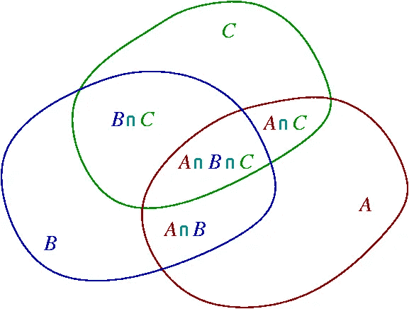

# 一周的 Leetcode(第 4/7 天)

> 原文：<https://blog.devgenius.io/ace-that-coding-interview-day-4-15-binary-search-bsgs-pie-fc5fb0a8a37e?source=collection_archive---------1----------------------->


克里斯托夫·高尔在 [Unsplash](https://unsplash.com?utm_source=medium&utm_medium=referral) 上拍摄的照片

欢迎来到我们技术面试准备系列的第四集。我们的目标是通过为您提供涵盖许多主题的真正的解决问题的技能，为您轻松获得梦想中的工作铺平道路。

不要忘记查看该系列的其他内容:

*   [日(1/15):基本算术](/15-days-of-leetcode-ace-that-coding-interview-day-1-15-9e2a76f5a62e)
*   [天(2/15):两点技术](/15-days-of-leetcode-ace-that-coding-interview-day-2-15-fc47b4c8996)
*   [日(3/15):贪婪的思维](/15-days-of-leetcode-ace-that-coding-interview-day-3-15-86cd0c1939f5)
*   ***天(4/15):二分搜索法+ BSGS +馅饼***

让我们不要浪费时间，直接开始吧！

第四天:[丑号三](https://leetcode.com/problems/ugly-number-iii/)

我假设你没有阅读任务描述，所以这里有一个摘要:

> 给出四个数字 ***n*** ， ***a*** ， ***b*** ， ***c*** 。
> 
> 打印能被 ***整除的第 n 个数 a*** ， ***b*** 或 ***c*** 。

> 声明:不要被简短的声明和简单的提示所迷惑。这个问题是冒名顶替。

**第一次尝试:暴力破解**

从 1 开始循环数，数出能被 ***a*** 、 ***b*** 或 **c** 整除的数字，当你的计数器达到 n 时停止。

这是绝对正确的，但它有效率吗？

这是一个 O( ***N*** )解但是作为 **n** 可以上升到*这需要很多时间来运行。在这篇文章的最后，我们将找到一个解决方案，运行在 ***50*** 毫秒之内！*

*让我们设定一些衡量标准，根据以下方面向我们提供关于我们解决方案的**优点**的反馈:*

*   *正确性(那个解决方案给了我一个正确的答案吗？)*
*   *效率(要等多久才能得到答案？)*

*这些标准足以决定我们是否在做正确的事情，或者我们放弃并考虑一种不同的方法。*

*让我们评价一下我们的**暴力男**的善良:*

***正确性** : 10/10*

***效率** : 2/10，对于小输入来说运行很快，但在其他情况下却慢得令人难以置信。*

***总体** : 6/10，不是很大:(*

*我们需要做得更好，不是吗？*

*像往常一样，我们试图将问题分解成更小的子问题。*

***更小的子问题:***

*让我们试着用 **a = b = c** 的条件来解决同样的问题。*

*原来我们有一个封闭形式的公式来计算那种情况下的答案(作为练习想出来的)，但是我们假装不知道。*

*我们还定义了一个**助手函数**(一个做一些辅助工作来帮助我们完成任务的函数)。请耐心听我说，你很快就会知道我们为什么这么做。*

*我们定义了辅助函数“ **Count_Ugly** ”，它以 ***X*** 为输入，返回小于或等于 ***X*** 的丑数的计数。*

*现在我们想知道最小的数 m，s . t Count _ Ugly(***m***)=***n***，我们最终的答案是 m，这就是通常所说的**下界**查询。*

> *事实:Count_Ugly 不减，那就是 Count _ Ugly(**x+1**)≥Count _ Ugly(**x**)，能看出为什么吗？*

*每当你遇到函数递增的情况时，选择二分搜索法是一个可以考虑的选择，但是二分搜索法是什么呢？！*

*这是二分搜索法的样子:)*

**

*“搜索”这个词用二进制写成*

***二分搜索法简介:***

*二分搜索法很聪明，它不做不必要的计算，而是利用函数不减的事实，以天文数字的方式减少迭代次数，让我们仔细看看，了解这是怎么回事。*

***二分搜索法在行动:***

*1-定义你要检查的范围[ ***L*** ， ***R*** ]，简单来说就是你在告诉算法“嘿二分搜索法，我想让你帮我查一下答案，它在 ***L*** 和 ***R*** 之间的某个地方，但是我不知道确切的位置”。*

*2-在范围[ ***L*** ， ***R*** ]中寻找中间数，一个标准的办法是用公式***M***=**(L+R)/2**(四舍五入)。*

*3-现在到了关键部分:算法仔细检查了 ***M*** ，并在此基础上决定下一步做什么。*

*——第一个场景是 Count_Ugly(***M***)<***n***，暗示[ ***L*** ， ***M*** ]中任意一个家伙的 Count _ Ugly 小于 n，暗示我们的答案在[ ***M + 1*** ， ***R 中的某处****

*-第二种场景是 Count _ Ugly(***M***)≥***n***)，暗示 M 是候选答案，但我们不能确定它是否是最小的可能答案，我们知道的是我们应该忽略范围[ ***M + 1*** 内的任何数字， ***R*** ]因为 ***M*** 是比他们所有人都更好的候选人(记住我们在寻找最小的答案)，现在调整你的范围[ ***L*** ， ***R*** ]成为[ ***L*** ，*

***4-最终你会得到 ***L = R = M*** ，这是算法的最终迭代，查 M 就足以知道最终答案，如果 Count _ Ugly(***M***)<***n***，则返回 ***M + 1*** ，否则返回***

*****迷茫？让我们试一个例子。*****

*****N = 5，a = b = c = 3*****

*****定义一个足够大的范围，这样你才有信心在里面找到答案。为了便于说明，我们将[ ***L*** ， ***R*** ]设置为[ ***1*** ， ***20*** ]，但在实际操作中，范围会大得多**。*******

*******迭代 1:*******

*******L = 1，R = 20，M = 10*******

*******count _ Ugly(**10**)=**3**，即小于 n 所以我们需要右转因为 range [ ***L*** ， ***M*** ]正好没用。*******

*****迭代 2:*****

*****L = 11，R = 20，M = 15*****

*****count _ Ugly(**15**)=**5**)，这很好，我们能够在仅仅两次迭代中找到答案，这是谁梦寐以求的，但我们应该持怀疑态度，不要忽略范围[L，M-1]，因为里面可能有一个**更小的**答案，所以让我们调整我们的范围，看看会发生什么。*****

*****迭代 3:*****

*****L = 11，R = 14，M = 12*****

*****count _ Ugly(**12**)=**4**<**n**，右转**。*******

*******迭代 4:*******

*******L = 13，R = 14，M = 13*******

*******count _ Ugly(***13***)=**4**<**n**，右转**。*********

*******迭代 5:*******

*******L = R = M = 14*******

*******count _ Ugly(***14***)=***4*<***n***，那就足以肯定地说 **14 + 1 = 15** 是现存的**最小的**答案。*********

***如果我们运行**线性搜索**(又名蛮力)，我们在 ***5*** 迭代中得到我们的答案，而不是 ***15*** 。***

***二分搜索法有多快？现在，我将省略任何数学术语，以尽可能让本教程对初学者友好。***

***相反，我会试着让你相信这真的很快，即使范围很大。***

*****二分搜索法的时间分析:*****

***我们从范围内的 S 个数字开始(***S***=***R***-***L***+***1***)。***

***每次迭代后，我们忽略几乎一半的范围。我们来做个模拟，让你更信服。***

*****S= 1024>512>256>128>64>32>16>8>4>2>1*****

***看看我们如何仅使用 ***10*** 次迭代来检查超过一千个元素的范围。事实上，在许多情况下，二分搜索法是最快的搜索算法之一。其时间复杂度为(log ***N*** )。***

***让我们评价一下我们的**二分搜索法**家伙的善良:***

*****正确性** : 10/10，爽！***

*****效率** : 10/10，对于小输入和大输入，算法运行相当快。***

*****总体** : 10/10，那就是你需要的家伙:)***

***我们可以尝试许多方法来回答下限查询:***

*****梅塔二分搜索法:*****

***这与我们刚刚所做的略有不同，它基于答案的**二进制表示**。***

***元二分搜索法用 Count _ Ugly(***L***)<***n***找出最大的数 ***L*** ，然后给 L 加 1 说就是答案。***

***它从最大到最小对 2 的幂进行迭代，并尝试将其添加到答案中，并检查 Count _ Ugly(**current _ answer**)是否为< ***n*** ，如果是这样，它什么也不做，否则它撤消该步骤，并继续下一个 2 的幂。***

***伪代码:***

```
***LowerBound(n)

   big_power = a big enough power of two 
   answer = 0 for i from big_power to 0
      add 2^i to answer
      if Count_Ugly(answer) >= n
         substract 2^i from answer
   return answer + 1***
```

***这只是二分搜索法的另一个视角，它有固定的迭代次数。***

***我们通常从***【2⁶】***开始，这在几乎所有情况下都绰绰有余，但是你可以根据最终答案的大小，设置一个较小的 2 的幂作为起点。***

*****婴儿步/巨人步(平方根分解):*****

***这是您可以尝试的另一种方法，让我们从一个场景开始:***

***你想从你在城市 ***X*** 的大学宿舍，到你在城市*的家，你乘坐公共汽车，它会带你到想要的目的地 ***Y*** ，你下车，沿着街道走，直到你到达你的家，恭喜你刚刚应用了小步/大步( **BSGS** )算法。****

****BSGS 很简单。它说“如果你想从点 ***A*** ，到点 ***B*** ，开始大步前进，直到你足够接近 B，然后你减速并开始小步前进，直到你碰到 ***B*** 。****

****在上面的场景中，你乘公共汽车(这说明了巨大的步伐)，也就是说每一步都带你去一个不同的城市，当你下车时，你开始醒来(这代表了微小的步伐)。****

****这个算法的运行时间取决于你的大步长 ***S*** 的大小。****

****如果距离是 ***N*** ，那么选择 ***S*** 会产生以下结果:****

*   ****我们使 ***N / S*** 大步长(向下舍入)，如果你做得比那个多，你将超过目标。****
*   ****我们最多使 ***S*** 小步前进，如果你使 ***S*** 小步前进，那么你为什么不反而使一大步前进呢？！****

****即( ***S + N / S*** )之和，当 ***S*** 约为*N 的平方根时，这个和是最小的可能，就变成了(sqrt(***N*【T39)+***N***/sqrt(***N**********

****也就是 O( sqrt( ***N*** ))，这在很多情况下已经足够快了。****

****伪代码:****

```
**LowerBound(n)

   big = squart_root(n)
   small = 1
   answer = 0 while Count_Ugly( answer + big) < n
      answer += big while (count_Ugly + small ) < n
      answer += small return answer + 1**
```

> ****记住，这不是实际问题，但解决它是解决大事的一个伟大里程碑。****

******一般情况:******

****但是我们现在不能庆祝，因为我们只解决了一般问题的一个特例。我们做了一个 a = b = c 的约束，但一般情况下不是这样。****

****原来我们只需要快速找到 **Count_Ugly** 就可以了。我们能做的最好的事情是找到一个 O(1)公式，但是它不是特别明显。****

****但是我们在***a***=**b**=***c***的时候怎么算 **Count_Ugly** ？****

****这是一个简单的问题。这只是一个简单的除法。****

> ****事实:区间[ ***1*** ， ***N*** ]中可被 ***X*** 整除的数的个数为**/N**(四舍五入)。****

****为了概括这个观点，让我们回忆一下[包含-排斥原理](https://en.wikipedia.org/wiki/Inclusion%E2%80%93exclusion_principle)****

********

****图片摘自[维基百科](https://commons.wikimedia.org/wiki/File:Inclusion-exclusion.png)****

****简而言之，这个原则是，如果你想列举满足两个条件之一的东西，你可以这样做:****

****设 **S1** 是满足第一个条件的东西的数量，同样将 **S2** 定义为满足第二个条件的东西的数量。****

****定义 **S12** 为同时满足**和**两个条件的事物的计数。****

****你的答案是 ***S1+S2 -S12*******

****请注意，我们减去了 **S12** ，因为它们被加了两次，因为它们在 **S1** 和 **S2** 中被重复计算，所以我们应该减去数量。****

****示例:****

****假设我们感兴趣的是在[1，20]范围内被 3 或 5 整除的数的计数****

****馅饼话不多，但让你看一看，亲眼看看内心的盘算(多么善良！).****

*****= 1***20***中有多少个数能被*整除，那就是 ***20 / 3*** 向下舍入= ***6*********

*******【S2】***= 1， ***20*** 中有多少个数能被*整除，即 ***20 / 5*** 向下舍入= ***4********

*******S12***= 1， ***20*** 中有多少个数能被 ***3*** 和 ***5*** 整除，这就比较难计算了，但还是可控的，只要回想一下这样一个事实，如果 ***Z*** 除以 ***A* 而 ***B*** 然后***Z***LCM*****A***和 ***B*** 的最小公倍数)，LCM(***3***，***5*)=**********

****S1+S2-S12**=**6**+**4**–**1**= 9，于是馅饼大喊“ ***9*** 就是答案”。**

**如果这是你第一次处理馅饼，你可能会持怀疑态度(这是一件好事)，所以让我们仔细检查一下我们已经得到了什么。**

**1，2， ***3*** ，4， ***5*** ， ***6*** ，7，8， ***9*** ， ***10*** ，11， ***12*** ，13，14**

**粗体的数字就是答案，而我们有其中的 ***9*** ，所以你至少应该对馅饼的力量有点信心。**

**为什么把自己限制在两个条件下，其实派并不在乎它们的数量。**

**在我们的例子中，我们有三个条件。**

*   ****Sxyz** 是同时满足第 x 个*， ***第 y 个*** 和 ***第 z 个*** 条件的事物的计数。***
*   ****Sxy** 是同时满足第 x 个*和第 y 个*条件的事物的计数。****
*   *****Sz** 是满足条件**z的事物的计数。*****

***现在派的工作更加复杂了:***

***它计算 **S1** ， **S2** ， **S3** ， **S12** ， **S13** ， **S23** ， **S123*****

***而最终的答案是**S1**+**S2**+**S3**-**S12**-**S23**-**S13**+**S123。说服你自己，我们没有重复计算任何东西。*****

***这就是我们所需要的，让我们写一些代码:***

***我的 C++实现***

***我的 Python 实现***

***我们如何完成今天的任务，以及如何应对其他挑战？***

*   ***将你手中的问题分解成更小的子问题:这种技术非常有用，因为更小的问题往往有更简单、有时是众所周知的解决方案。***
*   ***思考如何高效地解决更小的子问题，并将其组合成一个最终的快乐解决方案。***
*   ***改变问题的设定，做出有助于你更好地解读眼前问题的假设:注意我们假设了 a = b = c，后来我们找到了一般解。***
*   ***重读这篇文章很多次，直到你完全理解它，尤其是如果你是第一次看到二分搜索法或包含-排除原理的应用。***

# ***轮到你了:***

***恭喜你！如果你一口气做到了，我知道你能做到。***

***既然你有希望获得一些新技能，不要止步于此，将它们付诸实践。***

***去玩代码，自己从头开始写，挑战自己，想出可以用二分搜索法解决的问题的例子。***

***通过发明你自己的解决下限查询的方法来进行下一步，祝你好运；)***

*****练习附加题:*****

***[猜测数字变高还是变低](https://leetcode.com/problems/guess-number-higher-or-lower/)***

***[网上选举](https://leetcode.com/problems/online-election/)***

***[在上涨的水中游泳](https://leetcode.com/problems/swim-in-rising-water/)***

***[第 K 个最小素数分数](https://leetcode.com/problems/k-th-smallest-prime-fraction/)***

***[要移除的最短子阵列，使阵列排序](https://leetcode.com/problems/shortest-subarray-to-be-removed-to-make-array-sorted/)***

***如果你有问题想问我，可以在 [**LinkedIn**](https://www.linkedin.com/in/mohamed-sobhy-12181b165/) 联系我，在 [**Medium**](https://medium.com/@mohamedsobhi777) 关注我，获取更多有趣的文章。***

***今天到此为止。感谢阅读！***