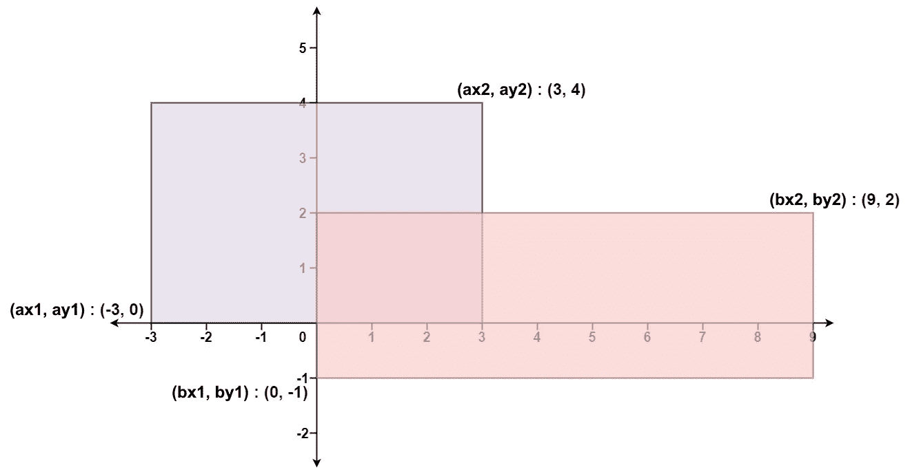

# 一周的 leet code(7/7 天)

> 原文：<https://blog.devgenius.io/ace-that-coding-interview-day-7-15-geometry-166564e38d94?source=collection_archive---------7----------------------->

欢迎来到我们技术面试准备系列的第七天。我们的目标是通过为您提供涵盖许多主题的真正的解决问题的技能，为您轻松获得梦想中的工作铺平道路。

别忘了查看之前的文章:

*   [日(1/15):基本算术](/15-days-of-leetcode-ace-that-coding-interview-day-1-15-9e2a76f5a62e)
*   [天(2/15):两点技术](/15-days-of-leetcode-ace-that-coding-interview-day-2-15-fc47b4c8996)
*   [日(3/15):贪婪的思维](/15-days-of-leetcode-ace-that-coding-interview-day-3-15-86cd0c1939f5)
*   [*天(4/15):二分搜索法+ BSGS +馅饼*](/ace-that-coding-interview-day-4-15-binary-search-bsgs-pie-fc5fb0a8a37e)
*   [*日(5/15):* 算算！](/ace-that-coding-interview-day-5-15-do-the-math-bea2b1e545d7)
*   日(6/15):蛮力的家伙。
*   ***日(7/15):计算几何***

让我们不要浪费时间，直接开始吧！

> **一段智慧**
> 
> -爸爸，我们为什么要学几何？
> 
> -这是唯一能让你保持身材的东西。


照片由 [nicontents 拍摄。](https://unsplash.com/@nick__?utm_source=medium&utm_medium=referral)[上](https://unsplash.com?utm_source=medium&utm_medium=referral)下

第七天:[矩形区域](https://leetcode.com/problems/rectangle-area/)

> 问题陈述:
> 
> 给定两个**直线**矩形在 2D 平面上的坐标，返回*两个矩形*覆盖的总面积。
> 
> 第一个矩形由它的**左下角**角`(ax1, ay1)`和它的**右上角**角`(ax2, ay2)`定义。
> 
> 第二个矩形由它的**左下角**角`(bx1, by1)`和它的**右上角**角`(bx2, by2)`定义。



我看到你们中的一些人举起了手，让我们听听:

人物 1:

“对我来说这似乎是一个微不足道的问题。回想一下小学数学，矩形的面积是底乘以高。

所以我们只需计算两个矩形的面积，并将它们相加，ez pz "

LeetCode:“好的，那么请写代码！”

*人员 1 编写代码并提交，但第一个样本失败*

LeetCode:“也许你需要再读一遍问题陈述！”

希望你发现了错误，这个方法是对的，但是——总有一个但是——它两次解释了两个矩形的交集。

我们将使用[包含-排除(PIE)](https://en.wikipedia.org/wiki/Inclusion%E2%80%93exclusion_principle) 原理来解决这个问题。

别忘了看关于馅饼的文章:[第四天:二分搜索法+ BSGS +馅饼](/ace-that-coding-interview-day-4-15-binary-search-bsgs-pie-fc5fb0a8a37e)

所以人 1 刚刚意识到自己的错误，我们再给他一次机会吧。

人 1:“嗯，所以我们将包括两个矩形的面积，然后排除相交的面积”

LeetCode:“好的，那么请写代码！”

*一小时后*

人 1:“相交面积怎么算？”

**路口问题**

现在我们有一个真正的问题要解决，它看起来很复杂，也许我们可以通过找到一个更容易解决的版本来简化它。

**更简单的版本**

由于矩形是二维形状，让我们在一维(数字线)中解决同样的问题。

假设你有两段[a1，b1]，[a2，b2]

假设他们的交集是[A，B]，我们知道如下:

(A≥ a1 且 A≥ a2 且 B≤ b1 且 B≤ b2)

换句话说，(A≥ max(a1，a2)，B ≤ min(b1，b2))

所以我们设置 A = max(a1，a2)和 B = min(b1，b2)就是这样: )

相交长度=最大值(0，B-A)

注意:如果你的结果是 A > B，那就意味着这两个线段首先没有相交，这就是为什么我们用零来最大化长度，用一个例子仔细检查一下！

**二维版本**

既然我们有了一维的解决方案，我们可以很容易地将其推广到二维。

回想一下，相交矩形的面积等于底*高。

请注意，如果只考虑 x 维度，底边就是较大矩形的两个底边的交点。

此外，如果只看 y 维度，高度只是较大矩形的两个高度的交点。

注意解决一个简单的问题是如何导致解决大问题的。

**伪代码**

```
Area1 = Area of rectangle 1
Area2 = Area of rectangle 2x_intersection = length of the intersection of the two bases
y_intersection = length of the intersection of the two heightsintersection_area = x_intersection * y_intersectionAnswer = Area1 + Area2 - intersection_areaThat is all we need, let's write some code!
```

C++实现

Python 实现

**要学的几课**

*   几何学让我们保持形状 XD
*   总是不止一次地阅读问题陈述，你不需要仅仅因为你错过了一些细节而花时间去解决一个不同的问题。
*   在编写代码之前，在示例上手动检查您的解决方案。
*   找到有效解决更小的子问题的方法，并将它们组合成一个最终的快乐解决方案:)
*   重读这篇文章很多次，直到你完全欣赏它。

# 轮到你了

恭喜你！你只是遵循了一个专家如何解决这个问题的一步一步的思考过程，记住你的几何之旅并没有在这里结束。你需要多练习，多接触代码。

**练习附加题:**

[有效方块](https://leetcode.com/problems/valid-square/)

[线上最大点数](https://leetcode.com/problems/max-points-on-a-line/)

[最小面积矩形](https://leetcode.com/problems/minimum-area-rectangle/)

[K-离原点最近的点](https://leetcode.com/problems/k-closest-points-to-origin/)

[圆形和矩形重叠](https://leetcode.com/problems/circle-and-rectangle-overlapping/)

你喜欢这篇文章吗？请给我买杯咖啡或与你的程序员朋友分享这篇文章来支持我:)

[](https://www.buymeacoffee.com/Mohamed.Sobhy)

如有疑问，在 [**LinkedIn**](https://www.linkedin.com/in/mohamed-sobhy-12181b165/) 上联系我，在 [**中**](https://medium.com/@mohamedsobhi777) 和 [**GitHub**](https://github.com/mohamedsobhi777) 上关注我，获取更多有趣的文章。