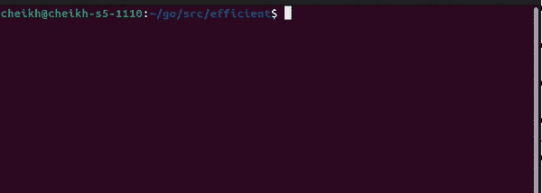

# 通过围棋中的“单飞”提高效率

> 原文：<https://blog.devgenius.io/achieving-efficiency-with-singleflight-in-go-4daf668e48d?source=collection_archive---------0----------------------->


如果你已经浏览了 Go 生态系统一段时间，你可能会看到一些前缀为`golang.org/x`的包。"这些包是 Go 项目的一部分，但是在主 Go 树之外."这些年来，这些包中的一些功能被转移到 Go 标准库中，反之亦然。在这篇文章中，我将写一个叫做`singleflight`的外部包。`singleflight`防止类似的函数同时调用。这是通过允许第二次调用等待第一次调用完成来实现的。一旦完成，第一次调用的结果将与第二次共享。我将演示它是如何工作的，并向您展示如何为您的程序塑造它。

# 一个基本例子

`singleflight`有一种类型叫群。Group 有一个方法叫做`Do`，这个方法将执行提供的函数并返回结果。以下是该函数的签名:

```
func (g *Group) Do(key string, fn func() (interface{}, error)) (v interface{}, err error, shared bool)
```

参数`key`是一个组如何知道我试图调用同一个函数。第二个参数`fn`将保存我的函数代码。返回的变量之一是`shared`，该变量指示调用是否等待前一个调用完成。可以把它想象成一个存在于函数调用生命周期中的缓存。对于我的用例，我将定义一个函数来模拟一个耗时的任务。该函数的代码如下:

```
func timeConsumingFunction() string { time.Sleep(10 * time.Second)
  return "Hello"
}
```

接下来，我将在主线程和 Goroutine 上执行一个函数。我这样做是为了确保两个调用同时运行。对于每次调用，我将记录结果和变量`shared`。以下是执行此操作的代码块:

```
func main(){ var g **singleflight.Group** **go func**(){
     **v**, _, **shared** := g.Do("key", func() (interface{}, error) { s := **timeConsumingFunction**()
       return s,nil 
     })
     fmt.Println("Goroutine result : ", v, shared)
  }() **time.Sleep(2 * time.Second)**

  **v**, _, **shared** := g.Do("key", func() (interface{}, error) { s := **timeConsumingFunction**()
    return s,nil 
  }) **fmt.Printf("%v %v\n", v, shared)**}
```

之前定义的代码应该运行 12 秒？将这一时间缩短到仅仅 10 秒。使线程休眠后进行的调用返回的结果与从 goroutine 进行的调用返回的结果相同。说明这一点的最佳方式是使用 gif。以下是终端上的命令，两个控制台日志同时出现(需要 10 秒钟) :



这和现实世界有什么关系？为了这篇文章，假设你工作的组织仍然使用 CSV 作为他们 web 服务器的数据源。现在，假设您有一个加载 CSV 并将其返回给用户的函数。优化的一种方法是缓存结果，对吗？是的，但是服务器会使用更多的内存。在某些情况下，开发人员没有根据需要使用 ram 的自由，因此缓存可能不是一个可行的选择。


# 抽象 Do 方法。

方法`Do`是有限的，因为它返回一个接口、错误和布尔值。我将提出抽象作为绕过这一限制的解决方案。我要做的第一步是定义我的基本函数:

```
func SayHello() string {
  return "Hello"
}
```

下一步我将添加函数`Do`并使用一个内嵌函数作为参数`fn`。下面是该函数之后的样子:

```
type **App** struct { G singleflight.Group
}func (s * **App**) SayHello() string { v, _, _ := s.G.Do("SayHello", func() (interface{}, error) {
     return "Hello",nil 
  })
  return v**.(string)**
}
```

还有一个问题，我如何传递变量 g？一种方法是定义一个定制的结构类型，并将`singleflight.Group`作为一个字段。如果你注意到了，我将变量`v`转换为字符串类型，这是因为 Do 将返回一个接口。同样，这可以用泛型来进一步完善。下面是修改后的代码:

```
func (s * App) SayHello[**T any**](fn func() (interface{}, error)) **T** { v, _, _ := s.G.Do("SayHello", **fn**)
  return **v.(T)**
}
```

有了这个修改后的函数，我可以实现`Do`函数，而不用担心它返回的接口。下面是 SayHello 函数的调用，它自动断言 int 的接口:

```
SayHello[**int**](func() (interface{}, error){
  return 20,nil
})
```

# 结论

通过强制一个函数的所有后续调用等待第一个调用完成，消除了同时运行重复函数的低效率。与缓存不同，只有同时调用函数时，结果才会被共享。它充当一个相当短命的缓存，不需要被无效或设置时间限制。然而，我不喜欢它返回一个`interface{}`类型，但是这可以用泛型来纠正。我不建议在生产中使用它，因为它仍然在外部存储库中可能有一个很好的原因。在文章的底部有一个链接指向这篇文章中使用的全部源代码。

 [## 子存储库

### 子库是 Go 项目的一部分，但是在主 Go 树之外。它们是在更宽松的兼容性下开发的…

pkg.go.dev](https://pkg.go.dev/golang.org/x) [](https://github.com/cheikhshift/medium_examples/tree/main/efficient) [## medium _ examples/main cheikh shift/medium _ examples 的效率

### 中型文章的代码示例。在 GitHub 上创建一个帐户，为 cheikhshift/medium_examples 开发做贡献。

github.com](https://github.com/cheikhshift/medium_examples/tree/main/efficient)  [## 单程航班

### Package singleflight 提供了一种重复函数调用抑制机制。此部分是空的。这一节是…

pkg.go.dev](https://pkg.go.dev/golang.org/x/sync@v0.0.0-20220722155255-886fb9371eb4/singleflight)