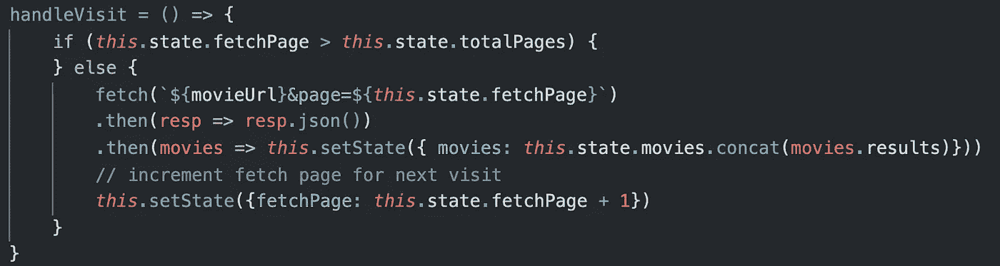

# 用 react-infinite-loader npm 包实现无限滚动

> 原文：<https://blog.devgenius.io/achieving-infinite-scroll-with-react-infinite-loader-npm-package-9d00e54935c7?source=collection_archive---------6----------------------->


无限滚动有助于让用户在你的网站上停留更长时间。在一个叫做 react-infinite-loader 的有用的 npm 包的帮助下，可以从 React 应用程序中消除点击按钮获取下一批信息的需要。

# 如何使用 InfiniteLoader 组件

首先，用命令`npm i react-infinite-loader`安装包。接下来，将代码行`import InfiniteLoader from ‘react-infinite-loader’;`包含在您想要包含它的任何组件中。现在你有了一个可以添加到组件底部的`<InfiniteLoader/>`组件。该组件包括一个“已访问”的属性，您可以向其传递一个函数，当访问 InfiniteLoader 组件时(当滚动到该组件时)将调用该函数。带有已访问属性的组件可能如下所示:

```
<InfiniteLoader *onVisited*={ () => *this*.handleVisit() } />
```

注意，传递给 onVisited 的值是一个匿名函数定义，它调用一个名为“handleVisit”的组件函数。在 handleVisit 函数中，定义如何为页面加载下一批信息。

# 访问 InfiniteLoader 时要做什么

为了让 InfiniteLoader 组件完成任何事情，您必须定义 handleVisit 函数。如果您的组件从一个 API 获取，您的 handleVisit 函数可能需要发送另一个获取请求。假设您的 API 有太多的信息要一次加载，所以它一次只发送有限的一批信息。当您的组件第一次挂载时，您从 API 获取第一批信息。当用户滚动到网页底部时，你已经用完了第一批信息，需要获取第二批。这个过程会一直继续下去，直到你的 API 不再提供更多的信息，你的用户不能再滚动了。

让我们看看这可能是什么样子。在您的状态中，您有一个对象数组，您将这些对象转化为页面上的元素，一个整数“pageNumber”表示您正在获取的 API 页码，一个整数“totalPages”表示 API 必须提供的总页数。访问 InfiniteLoader 组件后，pageNumber 将随着每个新的获取请求而递增。在发送获取请求之前，该函数在获取可能不存在的 API 页面之前检查 pageNumber 是否大于 totalPages。

每次提取的结果都连接到组件状态中的对象数组。通过这种方式，可以用更多的对象重新呈现组件，从而为用户创建更多的滚动元素。总而言之，您的 handleVisit 函数可能如下所示:

[](https://www.npmjs.com/package/react-infinite-loader) [## 无限加载器

### 一个基于 react 的无限加载器 react 组件-访问 npm 安装 react-无限加载器-保存添加无限…

www.npmjs.com](https://www.npmjs.com/package/react-infinite-loader) 

将 react-infinite-loader npm 包用于您自己的 react 应用程序，并保持您的用户滚动。