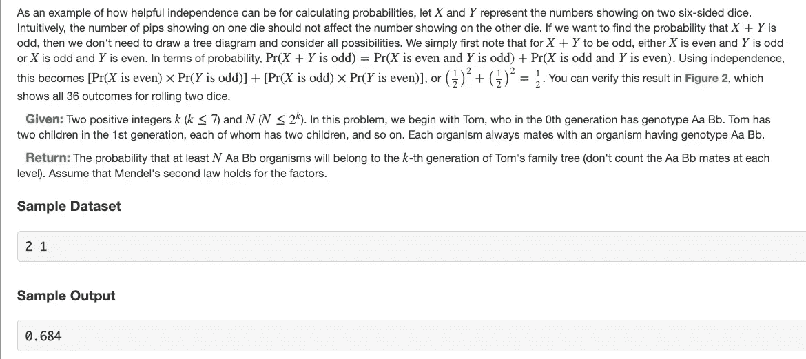
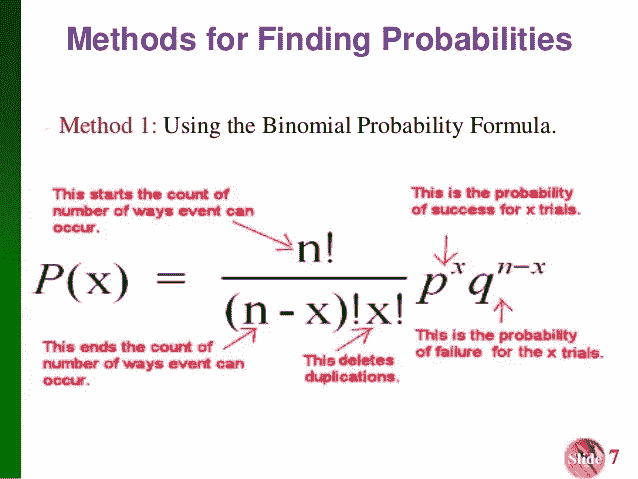
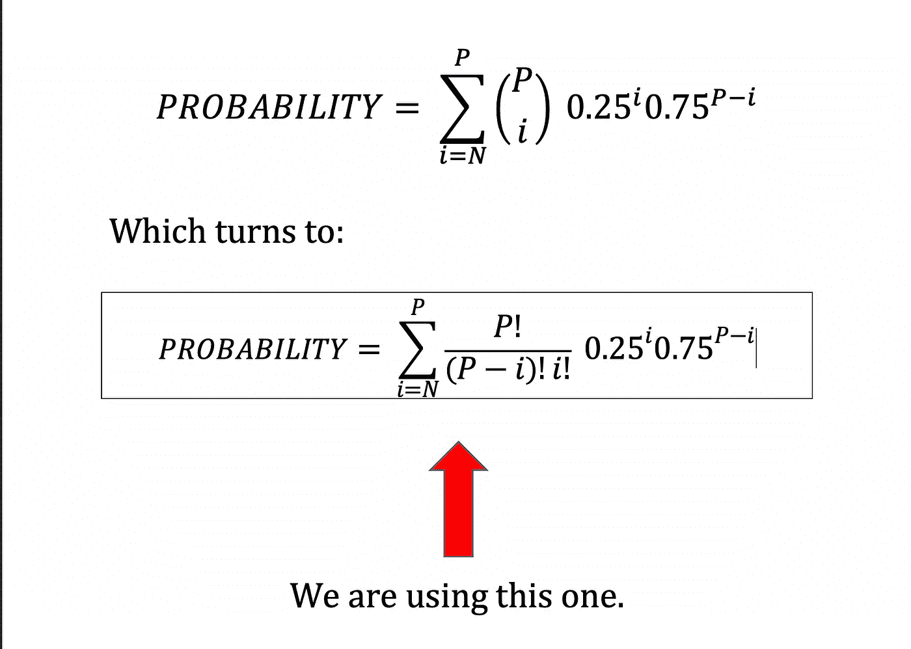
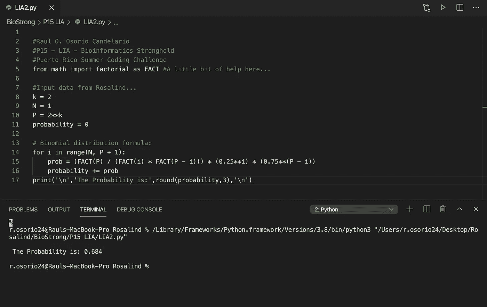

# 主动学习:生物信息学-2.0

> 原文：<https://blog.devgenius.io/active-learning-bioinformatics-2-0-87c94f36e4ad?source=collection_archive---------16----------------------->

我在波多黎各夏季编码挑战赛中的一小段经历

照片由[阿兹哈鲁尔·伊斯拉姆](https://unsplash.com/@azhar93)在 [Unsplash](https://unsplash.com/) 上拍摄

又见面了！

大约一个月前，我在这里告诉你们，我报名参加了 ***波多黎各夏季编码挑战*** 。由 ***组织的一场慈善比赛数学比数字多*** 创始人 [***达尼洛·t·佩雷斯-里维拉*** 。](https://medium.com/@SanchoBarriga)比赛旨在让个人解决超过 100 个(准确的说是 105 个！)生物信息学相关的经典问题和算法挑战。唯一的要求是热爱科学，并且在某种程度上与我美丽的波多黎各有血缘关系。

抬头！报名截止时间现在是 2020 年 7 月 14 日。

我在这里注册了:

 [## 波多黎各夏季编码挑战

### 波多黎各夏季编码挑战是一个学习生物学、编码等更多知识的机会，同时有可能…

rosalindpr.info](https://rosalindpr.info/) 

今天我想和你谈谈这个集合的另一个特别的问题，**一**一**真正容易的一个。**这个问题需要一点遗传学和概率论的知识。

# 问题是:独立的等位基因

> 两个[事件](http://rosalind.info/glossary/probabilistic-event/) AA 和 BB 是 [**独立**](http://rosalind.info/glossary/independent-events/) 如果 Pr(A 和 B)Pr(A 和 B)等于 Pr(A)×Pr(B)Pr(A)×Pr(B)。换句话说，这些事件互不影响，所以我们可以简单地分别计算每个概率，然后相乘。
> 
> 更一般地说，[随机变量](http://rosalind.info/glossary/random-variable/) XX 和 YY 是 [**独立的**](http://rosalind.info/glossary/independent-random-variables/) 如果每当 AA 和 BB 分别为 XX 和 YY 的事件时，AA 和 BB 是独立的(即 Pr(A 和 B)=Pr(A)×Pr(B)Pr(A 和 B)=Pr(A)×Pr(B))。
> 
> **给定:**两个正整数 k (k≤7)和 N (N≤2**k)。在这个问题中，我们从汤姆开始，他在第 0 代中具有 Aa Bb 基因型。汤姆第 1 代有两个孩子，每个孩子有两个孩子，以此类推。每种生物总是与基因型为 Aa Bb 的生物交配。
> 
> **返回:**至少有 N 个 Aa Bb 生物属于汤姆家谱第 k 代的概率(不要统计每一级的 Aa Bb 配偶)。假设孟德尔第二定律适用于这些因素。

**图一。** [**问题截屏 Rosalind.info**](http://rosalind.info/problems/lia/)

# 我们开始工作吧！

我们又回到概率上了。这次我们关注的是**独立事件**，在这种情况下，是两个独立遗传的等位基因(**孟德尔第二定律**)。我们从性状 A 和 b 的基因型为 AaBb(杂合)的生物开始。它与基因型为 AaBb 的生物交配，产生两个后代。两个后代都与相同基因型(AaBb)的生物交配，各自得到两个后代。这种情况持续了 k 代，**总是**与 AaBb 基因型的生物交配，得到两个后代。我们的任务是计算 k 代中至少有 N 个生物(不包括配偶)具有 AaBb 基因型的概率。

这个问题的关键是认识到，无论与 AaBb 基因型的人交配的生物是什么基因型，后代是 AaBb 的概率总是 0.25(你可以画出 9 个不同的 4x4 普内特正方形来说服自己，或者用这个工具 [**普内特 O' MATIC 计算器 3000 超级**](https://scienceprimer.com/punnett-square-calculator) **，**巴杜姆 tss！).当你意识到这一点时，你只需要弄清楚如何计算 k 代人口中 N 或更多的人具有正确基因型的概率，这就导致了二项分布。

**图二。资料来源:**[**Tayab Ali-JOR hat 工程学院的二项式概率分布**](https://www.slideshare.net/TayabAli/binomial-probability-distributions-ppt)

对于最终的种群 P，我们想知道 N 到 P 生物有正确等位基因的概率。这意味着我们想要所有独立概率的总和[N，N+1，N+2，…，P]。我们可以使用二项式分布的公式来分别计算所有的概率，然后将它们相加，得到我们所追求的总体概率。对于 P = 2**k 的群体，其中 k 是世代数，当 N 是我们正在寻找的具有基因型 AaBb 的群体的最小数目时，我们得到总体概率的以下公式(从二项式分布的一般公式导出):

**图 3。出于科学目的，在 Word 中使用一点微软方程式。**

# 让我们…

# 还有…

# **巴赞加！**

图 4。我的代码和结果。 [Github](https://gist.github.com/raulosorio24/a92d51bfa9c3ee7d7a0dc69339f8cfd3) 要点。

# 我告诉过你这很容易！对吗？

正如你所看到的，Rosalind.info 是一个很好的平台，我们可以在这个平台上结合我们在课程中获得的知识，并应用它来实现互动的学习方式。如果你喜欢生物信息学、生物学、计算机科学或任何其他科学领域，我邀请你加入我们这个美妙的夏季之旅。

PS:我觉得是时候谈谈更复杂的问题了……

…下次吧。

# **后会有期！**