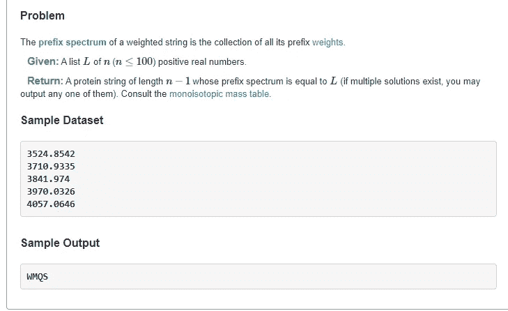
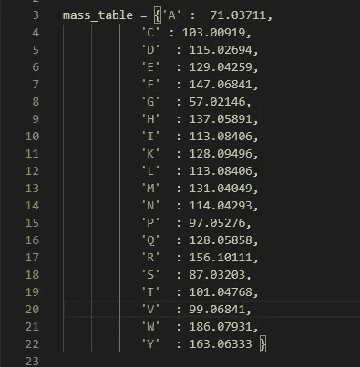
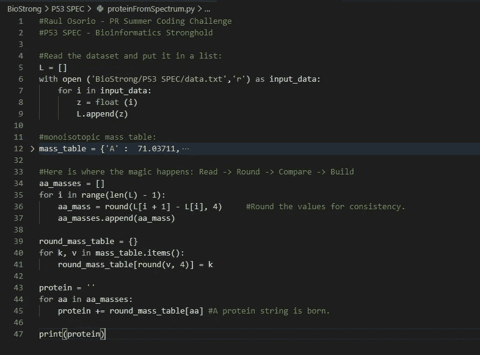
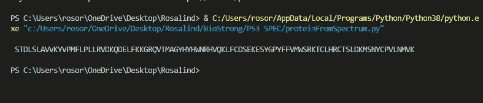

# 主动学习:生物信息学-3.0

> 原文：<https://blog.devgenius.io/active-learning-bioinformatics-3-0-42eafdf226d0?source=collection_archive---------18----------------------->

我在波多黎各夏季编码挑战赛中的一小段经历

由[克里斯多夫·高尔](https://unsplash.com/@cgower)在 [Unsplash](https://unsplash.com/) 上拍摄的照片

你好！

大约两个月前，我告诉你们我报名参加了 ***波多黎各夏季编程挑战赛*** 。由 ***组织的一场慈善比赛数学比数字多*** 创始人 [***达尼洛·t·佩雷斯-里维拉*** 。](https://medium.com/@SanchoBarriga)比赛旨在让个人解决超过 100 个(准确的说是 105 个！)生物信息学相关的经典问题和算法挑战。唯一的要求是热爱科学，并且在某种程度上与我美丽的波多黎各有血缘关系。

 [## 波多黎各夏季编码挑战

### 波多黎各夏季编码挑战是一个学习生物学、编码等更多知识的机会，同时有可能…

rosalindpr.info](https://rosalindpr.info/) 

上次我告诉你，也许是时候谈谈更复杂的问题了，好吧，让我们看看！

来自[http://rosalind.info/problems/spec/](http://rosalind.info/problems/spec/)

> **质谱学简介**
> 
> 在[“计算蛋白质质量”](http://rosalind.info/problems/prtm/)中，我们简单提到了一种叫做[质谱](http://rosalind.info/glossary/mass-spectrometry/)的分析化学方法，目的是测量一个粒子或一个分子的质荷比。在质谱仪中，样品被汽化(变成气体)，然后样品中的粒子被[电离](http://rosalind.info/glossary/ion/)。产生的离子被放入电磁场中，电磁场根据它们的电荷和质量对它们进行分离。质谱仪的输出是 [**质谱**](http://rosalind.info/glossary/mass-spectrum/) ，或者是具有这些质荷比值的离子的 [**强度**](http://rosalind.info/glossary/intensity/) (实际观察频率)的离子的可能质荷比值的图。
> 
> 目前，我们将忽略电荷，并将离子的[单同位素质量](http://rosalind.info/glossary/monoisotopic-mass/)列表视为简化的**。研究人员没有廉价的技术来一次一个氨基酸地研究蛋白质(分子太微观了)。相反，为了确定蛋白质的结构，我们将蛋白质的几个拷贝分成更小的片段，然后对产生的片段进行称重。为此，我们假设每个 [**切割**](http://rosalind.info/glossary/cut/) (断裂点)发生在两个[氨基酸](http://rosalind.info/glossary/amino-acid/)之间，并且我们可以测量所有可能切割产生的片段的质量。**
> 
> **例如，(未知的)蛋白质“PRTEIN”可以有五种可能的切割方式:“P”和“RTEIN”；“PR”和“TEIN”；“PRT”和“EIN”；“PRTE”和“在”；“PRTEI”和“N”。然后我们可以测量所有碎片的质量，包括整个字符串。蛋白质的“左”端称为其 N 端**，对应于蛋白质串的[前缀](http://rosalind.info/glossary/prefix/) (P，PR，PRT，PRTE，PRTEI)的离子称为 [**b 离子**](http://rosalind.info/glossary/b-ion/) 。蛋白质的“右”端称为其 [**C 端**](http://rosalind.info/glossary/c-terminus/) ，对应于串的[后缀](http://rosalind.info/glossary/suffix/) (N，in，ein，tein，RTEIN)的离子称为 [**y 离子**](http://rosalind.info/glossary/y-ion/) 。两个相邻 b 离子(或 y 离子)的质量差给出一个氨基酸残基[的质量](http://rosalind.info/glossary/residue/)；例如，“PRT”和“PR”的质量之差一定是“t”的质量。推而广之，知道蛋白质的每个 b 离子的质量就可以推断出蛋白质的身份。****

******问题:从光谱推断蛋白质******

********

******图一。**[**Rosalind . info**](http://rosalind.info/problems/spec/)的问题截屏****

# ****我们开始工作吧！****

****在这个问题中，我们得到一个前缀谱，并被要求使用[单同位素质量表](https://en.wikipedia.org/wiki/Proteinogenic_amino_acid#Mass_spectrometry)从中推断出一个蛋白质序列。****

********

******图二。单同位素质量表图解。—** [**要旨**](https://gist.github.com/raulosorio24/d2bd9e9facfe457d28bc89549c6427c8)****

****为了将数据集中的数字与质量表中的数字进行比较，我们需要将所有数字四舍五入到四位小数，否则，它们会略有不同，结果将被 Rosalind.info 标记为错误。****

****让我们来看看这个例子:给定一个蛋白质“PRT”。它的前缀是 P=["P "，" PR "，" PRT"]。前缀谱的计算包括汇总每个氨基酸前缀的重量。所以对于这个前缀谱 L=[Weght(P)，Weight(P)+Weight(R)，Weight(P)+Weght(R)+Weght(T)]****

****换句话说，P[i]的重量等于 P[I 1]的重量加上两者相差的氨基酸的重量减去 P[i]的最后一个符号。****

****现在，我们可以计算给定前缀光谱中相邻元素之间的所有差异，并将它们与质量表中具有匹配质量的氨基酸进行比较。找到合适的氨基酸后，将其添加到结果字符串的末尾。****

# ******让我们……******

# ******和……******

# ******在这里！******

********

******图三。代码—** [**要旨**](https://gist.github.com/raulosorio24/d2bd9e9facfe457d28bc89549c6427c8)****

********

******图 4。结果符合预期(使用大型数据集)。******

****正如我经常说的，Rosalind.info 是一个很好的平台，我们可以在这个平台上结合我们在课程中获得的知识，并应用它来实现互动的学习方式。如果你喜欢生物信息学、生物学、计算机科学或任何其他科学领域，试试吧。****

# ****再见了！****