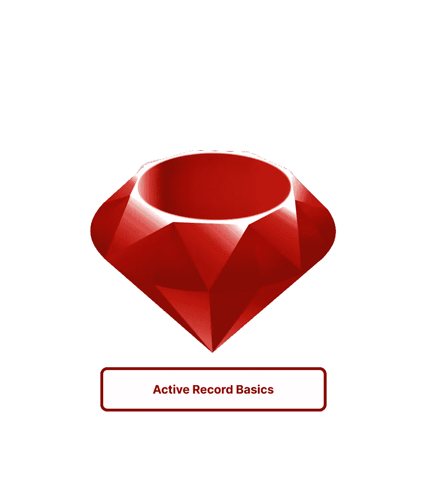

# Rails 中的活动记录|基础

> 原文：<https://blog.devgenius.io/active-record-in-rails-part-1-2-85bffa15315?source=collection_archive---------7----------------------->



这将是一篇很长的文章，所以拿一杯你想喝的，来找点乐子吧！

让我们首先创建一个新项目，创建一个卡片模型，它具有:

1.  标题:字符串
2.  发布者:字符串
3.  发布时间:日期时间

打开 rails 控制台(在终端中键入`rails console`),让我们开始吧！

一个 **活动记录**是 Ruby 对象关系映射(ORM)库，它为 Rails 处理数据库抽象和交互。它把你写的 Ruby 翻译成数据库能理解的语言。

Active Record 是数据库不可知的，这意味着它不关心您使用什么数据库软件，并且支持几乎所有可用的数据库。因为它是一种高级抽象，所以无论使用哪种数据库，您编写的代码都是相同的。

在 rails 中切换数据库:`*rails db:system:change*`

活动记录基于**设计模式**。事实证明，当您在面向对象的环境中工作时，如何有效地与数据库(不是面向对象的)通信的问题是很常见的。正因为如此，许多聪明人致力于解决如何将面向对象编程和关系数据库结合在一起的问题。Martin Fowler 是那些聪明人之一，他在《企业应用架构模式》(Addison Wesley，2002)一书中首次描述了一种他称之为活动记录的模式。在 Fowler 的模式中，数据库记录和表示它的对象之间存在一对一的映射。当 Rails 创建者 David Heinemeier Hansson 为他的框架开发 ORM 时，Fowler 的模式为他提供了指导。

**引入活动记录:Rails 上的对象关系映射**

**ORM** :将表映射到类、对象和表中的属性，在软件开发领域，这种技术被称为对象关系映射(ORM)。

为了使活动记录工作，表到类的映射几乎不需要任何配置。创建一个以您希望映射的表命名的 Ruby 类，并扩展活动记录基类，这就是所有需要做的事情。

```
class Book < ApplicationRecord
end
```

注意写着`< ApplicationRecord`的部分。小于号表示左边的 Book 类是右边的 ApplicationRecord 的子类。

举个例子，在 Ruby 中，从这样的类继承可以让你访问父类的所有特性。你的*app/models/application _ record . Rb*定义了 ApplicationRecord。ActiveRecord::Base 是最初的实现。ActiveRecord::基类包含了很多代码，但是不需要看。你的类简单地继承它，你就完成了。

在这种情况下，如果 Active Record 知道在哪里查找您的数据库，并且您有一个名为 books 的表(注意，表名是复数，而类名是单数)，那么该表将被自动映射。如果您知道您的 books 表包含字段 title、publisher 和 published at，那么您可以在任何 Ruby 上下文中这样做。

```
book = Book.new
book.title = "Lovely Book"
book.publisher = "Loush"
book.published_at = "2022-07-10"
book.save
```

读完这五行，书架上又增加了新的记录。子类化是提高技能的好方法。因此，活动记录很容易使用。使用对象的方法读写表的字段(如标题、出版商和出版时间)(图书)。此外，您不必告知活动记录您的字段的名称或您有任何字段的事实。那是它自己想出来的。活动记录不仅仅是创建新记录。它还可以读取、更新和删除记录，以及许多其他功能。

既然你提出来了，SQL 怎么样？

关系数据库和面向对象编程之间存在着根本不同的范例。关系范式的数学本质反映在它对关系的关注上。尽管面向对象的范例处理对象、它们的属性以及它们之间的关系，但它不是唯一的范例。乍一看，当您试图通过使用关系数据库使对象持久化时，对象-关系的裂痕变得很明显。Active Record 是一个 ORM 库，可以帮助您缩小这个差距。

使用活动记录来抽象您的 SQL 生成并不意味着 SQL 是邪恶的。对于那些需要 SQL 的时候，活动记录使得直接使用 SQL 成为可能。即使 ORM 不是在所有情况下都有效，事实是 SQL 是数据库的本地语言。

使用活动记录，您可以在程序中模拟物理对象。在 Rails 中，这些现实世界的对象被称为模型，因此是 MVC 中的 M。对于这些模型名称中的每一个，数据库都有一个表:例如，person、product 或 book。app/models 目录包含每个模型的 Ruby 类。活动记录提供了类到表的连接，这使您能够处理看似常规的对象，并将它们保存到数据库中。这消除了使用低级 SQL 与数据库通信的需要。相反，您可以像处理对象一样处理数据，Active Record 会为您处理所有的 SQL 转换。这一政策的结果是，Rails 成为了一个单一语言平台:Ruby。

**主动记录约定**

活动记录的零配置信誉建立在惯例的基础上。它采用的大多数约定都很容易理解。因为它们是约定俗成的，所以每个人都已经熟悉并习惯了这些想法和实践。约定，即使您可以覆盖其中的大部分来适应您的数据库设计，从长远来看，也会节省大量的时间和精力。
使用单数类名；多个表名，每个表都有一个 id 列，用作标识符。

假设表中的 id 列是唯一的。理想情况下，该列中的值将作为表的主键。在数据库设计中，这是一种常见的做法。

在 Rails 哲学中，约定比配置更受青睐，所以有比这里列出的更多的约定就不足为奇了。如果你像大多数人一样，你可能会发现它们都有道理，不需要太多思考。

**活动记录基础:CRUD**

让我们从活动记录的基础开始。这里有所谓的“四大”:创建、读取、更新和删除(CRUD)。一般来说，您对活动记录和数据库所做大部分工作都以某种方式与 CRUD 相关。为了简化建模过程，Rails 采用了 CRUD 作为设计技术。

C创造新纪录

为了开始，您首先需要在数据库中创建一本书。创建新模型对象的方法多种多样，但它们都属于同一范畴。

**使用*新的*构造函数**

new 构造函数是创建新模型对象的最简单的方法。速成 ruby 班的读者会马上认出它。否则，知道 new 是创建任何类型的新对象的标准方法就足够了。在这方面，活动记录类与其他类型的类没有什么不同。

```
book = Book.new
# {"id"=>nil, "title"=>nil, "publisher"=>nil, "published_at"=>nil, "created_at"=>nil, "updated_at"=>nil}
```

创建一个新的 book 对象并将其存储在本地变量 Book 中就是您在这里所做的全部工作。该方法的返回值(在本例中是模型对象的字符串表示)被返回到控制台。当你检查一个 Ruby 对象时，它可能看起来有点奇怪，但这就是它的样子。响应中列出了课本属性。你可以从这里开始调用书中的一些变量方法。新纪录？告诉您该对象是否已保存到数据库中，attributes 返回活动记录通过反映表中的列获得的属性的散列。每个列的名称(标题、创建时间等。)将是散列中的一个键。

```
book.new_record?
# true
book.attributes
# {"id"=>nil, "title"=>nil, "publisher"=>nil, "published_at"=>nil, "created_at"=>nil, "updated_at"=>nil}
```

这些 reader 方法读取并返回有问题的属性值，这就是您在这里所做的。您的属性都是空的，因为这是一条新记录，您没有用任何信息填充它。现在让我们借助作者的方法来解决这个问题:

```
book.title = 'Rails Is Fun!'
# "Rails Is Fun!"
```

现在，当您检查您的 Book 对象时，您可以看到它具有属性:

```
# {"id"=>nil, "title"=>”Rails Is Fun”, "publisher"=>nil, "published_at"=>nil, "created_at"=>nil, "updated_at"=>nil}
```

你还没有发行新专辑。在数据库中，您正在处理的对象在 books 表中没有记录。注意，如果仔细观察，前面的 object-inspection 字符串中仍然没有分配 id。)因此，该对象不会出现在您的数据库中。由于下面的过程很简单，保存一个活动的记录对象很容易。

```
book.save
```

每当您保存一条新记录时，Rails 都会生成一条 SQL INSERT 语句；注意，Rails 已经为您显示了生成的 SQL。如果插入操作成功，Save 返回 true，如果失败，则返回 false。为了确定是否创建了记录，您可以请求对表的行数进行计数。

```
Book.count
# 1
```

**注意**尽管事实上写方法看起来是赋值，但它们的本质是方法之一。书。Loush 在功能上相当于 book for title。在这种情况下，方法是 title =(“Loush”)。Ruby 的语法糖给了作者更自然的外观。

**使用*创造*的方法**

当您想一次性创建并保存一个对象时，可以使用 create 方法。现在使用它来创建另一本书:

```
Book.create(title: "Ruby is Great!", publisher: "Loush world", published_at: '2022-07-12')
```

在这种情况下，create 方法不返回 true 或 false，而是返回它创建的对象，在这种情况下是一本书。属性的散列实际上被传递给了 create 方法。当散列是 Ruby 方法的最后一个参数时，没有必要用花括号括起来。或者，您可以先创建属性的散列，然后将其作为命令参数提供给创建者:

```
book_attributes = { title: "Lets have some fun", publisher: "Coffee Publisher", published_at: "2022-07-11"}
coffee_book = Book.create(book_attributes)
```

***总结；*创建和保存对象有两种方法:使用 new 构造函数或同时创建和保存。**

现在就去创作越来越多的书吧！

**读取(查找)记录**

从基本面开始。类成员可以使用 find 方法。像 new 和 create 方法一样，您可以在模型类上使用它，而不是在该类的实例上使用它。如果查找操作成功，将返回一个新的对象，就像 new 和 create 一样。

您可以通过四种方式调用 find:

*   全部:查找表中的所有记录
*   first:查找第一条记录
*   last:查找最后一条记录
*   find(:id):根据唯一 id 查找单个记录，如果:id 是 id 数组，则查找多个记录

**使用 ID 查找单个记录**

find 方法通常返回一条记录，第一个和最后一个方法也是如此。如果您正在寻找一个特定的记录，并且对它的惟一标识符有信心，那么您只需要使用:id 选项。要么返回一个 id(如果有的话)，要么引发一个异常(如果有的话)。[1，7]是一个参数示例，它返回与给定 id 匹配的所有记录的数组。更宽容的 first 方法返回表中的第一条记录，如果没有任何记录，则返回 nil。

通过使用 find(:id)，可以使用唯一的 id 来查找单个记录。它是这样工作的:

```
Book.find(1)
```

如您所见，您找到了 id 为 1 的书。如果您想仔细查看返回的内容，可以将结果存储在一个局部变量中:

```
found_book = Book.find(1)
found_book.id 
# This will return found_book id
```

在这里，您将 find 返回的对象存储在本地变量 book 中。然后，你可以审问它，询问它的属性。

所有这些工作都是因为 id 为 1 *的书确实存在*。相反，如果您搜索一个您知道不存在的记录(比如说 9999)，活动记录会引发一个异常:

```
ActiveRecord::RecordNotFound: (Couldn't find Book with ‘id’=9999)
```

你知道没有这样的记录。当您在查找已知存在的东西时，使用 find(:id)来查找特定的记录是一个很好的做法。因此，如果未找到请求的记录，活动记录将引发 RecordNotFound 异常。

当使用带有单个 id 的 find 时，您希望记录存在。Rails 错误消息不必直接显示给用户，但是其中使用的语言可以改变。因此，如何优雅地从 RecordNotFound 异常中恢复呢？您可以使用 Ruby 的错误处理特性 begin 和 rescue。有两种方法可以做到这一点:

```
begin
	Book.find(9999)
rescue ActiveRecord::RecordNotFound
	puts "We couldn't find a book record matching the id"
end
```

这从 begin 块开始。为了得到 RecordNotFound 错误，您搜索了一个您知道不存在的记录。如果出现错误，Ruby 会执行 rescue body 代码，打印一条有用的消息。

在 rescue block 中，您可以放置任何您想要的东西:您可以显示特定的视图、记录错误，甚至重定向到另一个位置。其他错误消息以同样的方式处理。如果您需要从任何类型的错误中解救出来，可以使用 rescue 而不指定错误类。

**先用*找单记录***

*使用第一种方法可以找到数据库返回的第一条记录。这总是恰好返回一项，除非表是空的，在这种情况下返回 nil:*

```
*Book.first*
```

*请记住，这可能不是表中的第一条记录。使用数据库软件的默认检索顺序，或者根据需要进行更改。在大多数情况下，记录是按照它们的创建或更新日期来排序的。如果您想确保收到您订购的第一条记录，您应该指定一个顺序。您可以将其视为 SQL 的 SELECT * FROM table LIMIT 1 的等价物。当您需要定位一个记录，但不关心它是哪一个记录时，first 可能是一个有用的工具。*

*请注意，如果找不到记录，first 不会引发异常。*

*最后一种方法与第一种方法相同，只是记录的返回顺序与第一次添加到数据库中的顺序相反。第一次看到按时间顺序排列的书籍中的记录，然后以相反的时间顺序检索，这并不罕见:*

```
*Book.last*
```

***查找所有记录***

*如果运行 all 方法，它将返回该类的所有记录:*

```
*all_books = Book.all*
```

*如果仔细观察，会发现响应中返回了 ActiveRecord::Relation。ActiveRecord::Relation 由大多数查询方法返回。与其返回 Book 实例的数组，为什么不这样做呢？因此，可以将更多的查询方法链接在一起，并通过返回 ActiveRecord::Relation 尽可能晚地执行 SQL。*

*为了获得相同的结果，您还可以通过使用所有数组都响应的第一种方法来利用更自然的语法。*

```
*all_books.first.title*
```

*如果您想要迭代集合，您可以使用 each 方法，该方法同样适用于所有数组。在这里，您遍历数组，将每一项提取到一个名为 book 的变量中，并使用 puts 命令打印它的 title 属性:*

```
*all_books.each { |book| puts "Book #{book.id} #{book.publisher}" }*
```

***订购结果***

*有时你希望你的结果是有序的。例如，如果您要列出您的所有书籍，您可能希望它们按出版商的字母顺序排列。为此，可以使用 order 方法，该方法接受一列或多列的名称作为参数:*

*`all_books = Book.order(:publisher)`*

*请注意，当您调用 order 方法时，它返回一个 Relation 对象，正如您可能已经猜到的那样，在将命令提交给数据库之前，使用 ActiveRecord::Relation 将调用链接到多个方法的特性，您可以构造更精确的数据库查询。在本例中，当您调用 each 方法时，活动记录将使用延迟加载，仅在绝对必要时才访问数据库。*

***带条件查找***

*使用主键来查找记录是有用的，但是它要求您已经知道 id，但情况并非总是如此。其他标准可能需要搜索记录。这就是游戏规则的由来。条件相当于 SQL 中的 WHERE 子句。使用 where 方法，您可以根据标题搜索记录。您可以将条件数组或 SQL 片段作为值传递。*

*这里，您使用一组条件来表示您想要标题为“Ruby 太棒了！”的第一本书：*

```
*Book.where(title: 'Ruby is Great!').first*
```

*因为使用 first，所以只得到一条记录(结果集中的第一条记录，即使有多个结果)。如果改为使用 all，您将得到一个集合，即使该集合中只有一项。*

***更新记录***

*更新记录很像创建记录。您可以一次更新一个属性，然后保存结果，也可以一次性更新属性。当您更新记录时，SQL UPDATE 语句在后台构建。首先，使用 find 操作来检索您想要更新的记录；接下来，修改它的属性；最后，将它保存回数据库:*

```
*first_book = Book.first
first_book.title = "Loush Is Editing"
first_book.save*
```

*现在，这应该看起来很熟悉了。在这个过程中，不是创建一个新行，而是检索一个现有行。这是唯一真正的区别。遵循更新属性和保存记录的相同过程。保存现有记录时，它将根据操作是否成功返回 true 或 false，就像创建新记录时一样。*

*如果要一次更新一个对象的属性并全部保存，可以使用 update 方法。这与创建新记录不同，在创建新记录时，您不需要先获取记录。这是另一个小区别。Update 不同于 create，因为它是一个实例方法，而不是一个类方法。可以使用实例方法来访问类的实例。举例来说，请考虑以下情况:*

```
*first_book = Book.first
first_book.update(title: "Updating book", published_at: 5.month.ago)*
```

***删除记录***

*C RUD 的最后一步是删除，你终于做到了。使用数据库需要定期删除记录。一旦订单被取消，一本书缺货，或者数据库中的一行被错误地删除，您可能希望从数据库中删除该行。有时您需要删除表中的所有行，而有时您只需要删除一行。使用活动记录，删除行就像添加行一样简单。删除行有两种方法:销毁行或删除行。可以使用销毁样式销毁该实例。对象被实例化，这意味着它首先在数据库中找到一行，然后删除它。从表格中删除行时，删除样式应用于整个表格，而不仅仅是单行。*

***使用销毁***

*当您想要删除记录时，第一步是找到您想要删除的记录:*

```
*first_book = Book.first
first_book.destroy*
```

*这意味着图书 1 已经从数据库中永久删除。但对象还在变量本里，不可能没了。答案是，这个物体是 ***冻结的*** ，尽管它仍然是 ***水合的*** (保留了它的所有属性)。您仍然可以访问对象的属性，但不能对其进行任何更改。被删除的那本书似乎被搁置了。只读对象是不能修改的对象。因此，如果只是删除记录，并不需要创建显式的 Book 对象。*

*如果你想提高，你仍然可以这样做。为了查找，可以使用类方法 destroy。您不需要在使用 destroy 之前创建对象，因为您可以使用 find 和 create。必须告诉它应该以哪些行为目标，而不是逐行工作，因为它只在整个表上工作。下面是如何摆脱 id 1 标识的书:*

```
*Book.destroy(1)*
```

***使用*删除*和***

*delete 方法是删除行的第二种方式。类方法 delete 和 delete all 在每个活动记录类中都可用。例如，与 destroy 方法不同，delete 方法族不实例化或回调它要删除的对象。他们会立即从数据库中删除该行。*

*Delete 和 delete all 是直接用在类上的，就像 find 和 create 一样；不会先创建任何对象。告诉该方法您要将哪些行作为目标是很重要的，因为该方法操作的是表而不是行。*

```
*Book.delete(1)*
```

*您可以通过在此输入单个主键来删除图书。当删除一条记录时，操作的响应是从数据库中减去记录数。只删除一条记录，因为主键唯一标识一条记录。*

***带条件删除***

*所有满足特定条件的行都可以使用 delete by class 方法删除。使用以下命令删除指定日期之后出版的所有图书:*

```
*Book.delete_by("published_at > '2022-07-11'")*
```

*这将返回删除的行数。*

# *现在你终于学会了如何创建、读取、更新和销毁模型对象。*

# *下一篇文章将讨论关联和验证。*