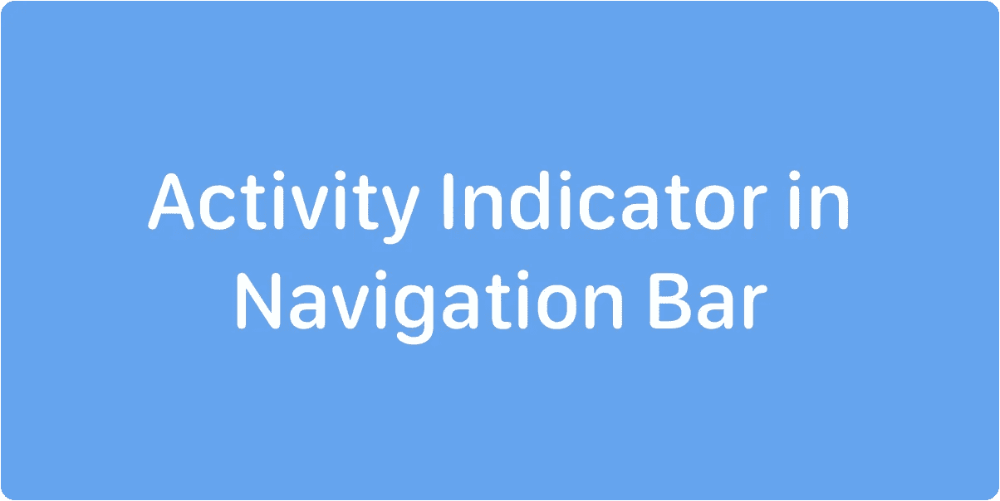
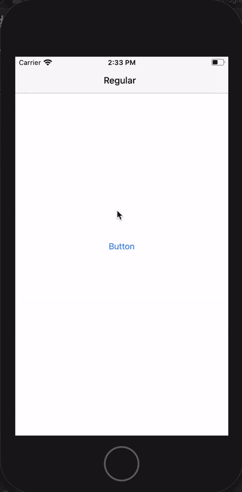

# 导航栏中的活动指示器(教程)

> 原文：<https://blog.devgenius.io/activity-indicator-in-navigation-bar-tutorial-484b2614f6e4?source=collection_archive---------0----------------------->

有很多方法可以向用户显示在后台有一些长时间运行的进程。最明显和简单的方法是使用阻塞进度视图。Github 上有很多图书馆，MBProgressHUD[https://github.com/jdg/MBProgressHUD](https://github.com/jdg/MBProgressHUD)就是其中之一。

但是这种方式只有在我们不希望用户在执行操作时与应用程序交互时才是好的。

默认的非阻塞方法是更改应用程序实例对象的 networkActivityIndicatorVisible，如下所示:

> ui application . shared . isnetworkactivityindicatorvisible = true

这样，用户将在状态栏中看到一个活动指示器。但这是一种隐晦的方式。每次打开 Twitter 应用程序时，我们都可以看到它。但 Twitter 也有一个指标，表明有新内容可用。

那么，还有什么？我们来查一下 Telegram，WhatsApp 等一些热门的信使。他们在导航栏中有一个活动指示器。每次聊天列表更新或建立互联网连接时都会显示。

# 这是怎么回事？

我们在 UINavigationItem 中有一个 titleView 属性，它是 UIView 类型的可选属性。文件表明这是一个

> 代替标题使用的自定义视图。可以水平调整大小。仅在项目位于堆栈顶部时使用。

因此，让我们制作自己的 NavigationBarProgressView，并使其可重用并易于附加到任何 UIViewController。

首先，我们需要一个 UIActivityIndicatorView 和一个 UILabel 对象来显示文本。让我们在自定义 UIView 中将它们分组。

但是我们也希望能够配置它们。要完全配置我们的视图，我们至少需要一种字体、字体颜色、文本、活动指示器的样式和一个视图框架。让我们编写一个描述我们的视图的配置器结构:

然后我们向视图类添加配置代码:

我们现在没事了吗？是和不是。我们需要把我们的标签和活动指标。我们可以使用自动布局或手动布局。让我们手动完成它，没有必要在这样一个简单的视图中使用沉重的线性不等式(Autolayout 就是这样)。

你可能已经注意到有一些悬而未决的财产。这是一个简单的标志，我们需要正确定位我们的子视图。我们希望标题标签居中，当没有进程运行时看起来像一个简单的标题，当它运行时，我们希望标题标签为活动指示器提供一些空间。所以，isPending 是一个简单的 Bool 标志。

现在我们看到视图在其生命周期中至少有两个事件。当它开始挂起和停止时。让我们把它变成一个协议。我们希望我们的代码漂亮且可重用，对吗？

好了，我们再进一步。现在，我们希望我们的控件可以方便地附加到任何 UIViewController 上。我们需要定义一个容器协议来保存对活动视图的引用，并操作视图的状态。我们还需要添加一些方法来将视图附加到我们的 UIViewController。

现在，我们可以在导航项目标题视图中任何需要活动指示器的地方使用它了。

示例控制器可能如下所示:

我们将得到以下结果:

今天到此为止。感谢您的时间，在这里看到完整的代码[https://github.com/SergeyPetrachkov/NavigationBarProgress](https://github.com/SergeyPetrachkov/NavigationBarProgress)