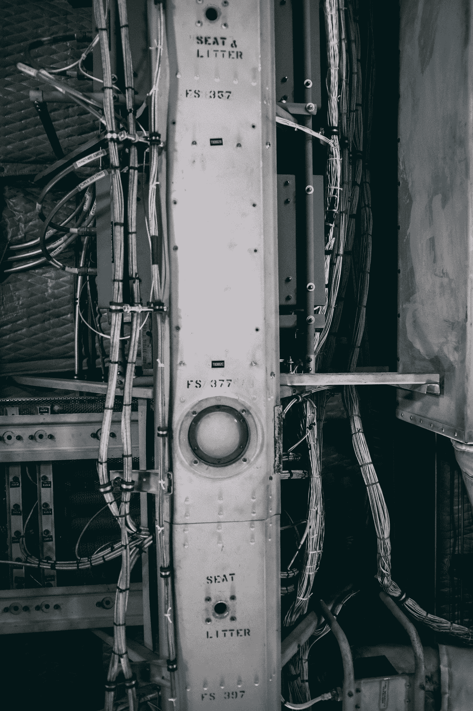

# 实际上使用深度神经网络层，甚至不知道它们是什么！

> 原文：<https://blog.devgenius.io/actually-using-deep-neural-network-layers-without-learning-what-they-even-are-a63425c4470b?source=collection_archive---------18----------------------->



[汉森卢](https://unsplash.com/@hansonluu?utm_source=medium&utm_medium=referral)在 [Unsplash](https://unsplash.com?utm_source=medium&utm_medium=referral) 上的照片

最近，我在 [Freecodecamp](http://freecodecamp.org/) 上开始了一个深度学习课程，并偶然发现了 Jovian.ml，这就像是我第一次开始觉得即使是我也可以学习[深度学习。通过这门课程，我将分享我的旅程，因为我每周都做作业和项目。这是为数不多的博客中的第三篇。](https://www.youtube.com/watch?v=vo_fUOk-IKk&t=543s)

正如我已经说过的，我真的不知道什么是神经网络，直到我在 4 层架构的帮助下完成了这个 CIFAR10 数据集预测模型的构建后两天。我看过 Pytorch 的第三次演讲:从零到甘斯课程。很明显，我被指向了几个资源，但很明显，我只是在完成实际任务后才查看它们。

对于作业，跳到这个博客的结尾。这里的大部分代码都是不言自明的，除了线性和逻辑回归模型之外，我真的不知道更多的东西，这是我在以前的博客中学习和讨论过的。事实上，我很惊讶地看到，添加一个非线性元素，并在选择的层中训练它，会给我带来实际的深度神经网络实践经验！

下面是作业的问题陈述。

> 使用神经网络对日常物体的图像进行分类

尝试许多不同的神经网络架构来解决问题的能力是深度学习真正强大的原因，特别是与线性回归、逻辑回归等浅层学习技术相比。

在这项任务中，你将:

探索 CIFAR10 数据集:[https://www.cs.toronto.edu/~kriz/cifar.html](https://www.cs.toronto.edu/~kriz/cifar.html)

建立训练管道，在 GPU 上训练神经网络

尝试不同的网络架构和超参数

> 进口

```
# Uncomment and run the commands below if imports fail# !conda install numpy pandas pytorch torchvision cpuonly -c pytorch -y# !pip install matplotlib --upgrade --quietimport torchimport torchvisionimport numpy as npimport matplotlib.pyplot as pltimport torch.nn as nnimport torch.nn.functional as Ffrom torchvision.datasets import CIFAR10from torchvision.transforms import ToTensorfrom torchvision.utils import make_gridfrom torch.utils.data.dataloader import DataLoaderfrom torch.utils.data import random_split%matplotlib inline# Project name used for jovian.commitproject_name = '03-cifar10-feedforward'
```

> 探索 CIFAR10 数据集

```
dataset = CIFAR10(root='data/', download=True, transform=ToTensor())test_dataset = CIFAR10(root='data/', train=False, transform=ToTensor())Downloading [https://www.cs.toronto.edu/~kriz/cifar-10-python.tar.gz](https://www.cs.toronto.edu/~kriz/cifar-10-python.tar.gz) to data/cifar-10-python.tar.gz
```

170500096/?[00:20 <00:00, 80989446.23it/s]

```
Extracting data/cifar-10-python.tar.gz to data/
```

**问:训练数据集包含多少幅图像？**

```
dataset_size = len(dataset)dataset_size50000
```

**问:测试数据集包含多少幅图像？**

```
test_dataset_size = len(test_dataset)test_dataset_size10000
```

**问:数据集包含多少个输出类？你能列出它们吗？**

提示:使用`dataset.classes`

```
classes = dataset.classesclasses['airplane',
 'automobile',
 'bird',
 'cat',
 'deer',
 'dog',
 'frog',
 'horse',
 'ship',
 'truck']num_classes = len(dataset.classes)num_classes10
```

问:来自数据集的图像张量的形状是什么？

```
img, label = dataset[0]img_shape = img.shapeimg_shapetorch.Size([3, 32, 32])
```

注意，该数据集由三通道彩色图像(RGB)组成。让我们看一个来自数据集的样本图像。`matplotlib`期望通道是图像张量的最后一个维度(而在 PyTorch 中它们是第一个维度)，所以我们将通过`.permute`张量方法将通道转移到最后一个维度。让我们也为图像打印标签。

```
img, label = dataset[0]plt.imshow(img.permute((1, 2, 0)))print('Label (numeric):', label)print('Label (textual):', classes[label])Label (numeric): 6
Label (textual): frog
```

**(可选)问:你能确定属于每一类的图像数量吗？**

提示:遍历数据集。

```
numb_of_image= np.zeros(len(dataset.classes), dtype= 'int64')numb_of_image[0]​for image,label in dataset:numb_of_image[label]+=1for i in range(num_classes):print (" Class "+classes[i]+" : \t\t"+str(numb_of_image[i])+" images.")Class airplane : 		5000 images.
 Class automobile : 		5000 images.
 Class bird : 		5000 images.
 Class cat : 		5000 images.
 Class deer : 		5000 images.
 Class dog : 		5000 images.
 Class frog : 		5000 images.
 Class horse : 		5000 images.
 Class ship : 		5000 images.
 Class truck : 		5000 images.
```

在继续之前，让我们把工作留给木星吧。

```
!pip install jovian --upgrade --quietimport jovianjovian.commit(project=project_name, environment=None)[jovian] Attempting to save notebook..
[jovian] Detected Kaggle notebook...
[jovian] Uploading notebook to [https://jovian.ml/aakashkrsingh1/03-cifar10-feedforward](https://jovian.ml/aakashkrsingh1/03-cifar10-feedforward)
```

提交成功:[https://jovian.ml/aakashkrsingh1/03-cifar10-feedforward](https://jovian.ml/aakashkrsingh1/03-cifar10-feedforward)

> **准备培训数据**
> 
> 我们将使用包含 5000 张图像(数据集的 10%)的验证集。为了确保每次都得到相同的验证集，我们将 PyTorch 的随机数生成器设置为种子值 43。

```
torch.manual_seed(43)val_size = 5000train_size = len(dataset) - val_size
```

让我们使用`random_split`方法来创建训练&验证集

```
train_ds, val_ds = random_split(dataset, [train_size, val_size])len(train_ds), len(val_ds)(45000, 5000)
```

我们现在可以创建数据加载器来批量加载数据。

```
batch_size=128train_loader = DataLoader(train_ds, batch_size, shuffle=True, num_workers=4, pin_memory=True)val_loader = DataLoader(val_ds, batch_size*2, num_workers=4, pin_memory=True)test_loader = DataLoader(test_dataset, batch_size*2, num_workers=4, pin_memory=True)
```

让我们使用 Torchvision 的`make_grid`助手函数来可视化一批数据。

```
for images, _ in train_loader:print('images.shape:', images.shape)plt.figure(figsize=(16,8))plt.axis('off')plt.imshow(make_grid(images, nrow=16).permute((1, 2, 0)))breakimages.shape: torch.Size([128, 3, 32, 32])
```

你能通过观察给所有的图片贴上标签吗？尝试手动标记数据的随机样本是估计问题难度和识别标记中的错误(如果有的话)的好方法。

> GPU 基础模型课程和培训

让我们创建一个基础模型类，它包含除模型架构之外的所有内容，也就是说，它不包含`__init__`和`__forward__`方法。稍后我们将扩展这个类来尝试不同的架构。事实上，您可以扩展这个模型来解决任何图像分类问题。

```
def accuracy(outputs, labels):_, preds = torch.max(outputs, dim=1)return torch.tensor(torch.sum(preds == labels).item() / len(preds))class ImageClassificationBase(nn.Module):def training_step(self, batch):images, labels = batchout = self(images)                  # Generate predictionsloss = F.cross_entropy(out, labels) # Calculate lossreturn lossdef validation_step(self, batch):images, labels = batchout = self(images)                    # Generate predictionsloss = F.cross_entropy(out, labels)   # Calculate lossacc = accuracy(out, labels)           # Calculate accuracyreturn {'val_loss': loss.detach(), 'val_acc': acc}def validation_epoch_end(self, outputs):batch_losses = [x['val_loss'] for x in outputs]epoch_loss = torch.stack(batch_losses).mean()   # Combine lossesbatch_accs = [x['val_acc'] for x in outputs]epoch_acc = torch.stack(batch_accs).mean()      # Combine accuraciesreturn {'val_loss': epoch_loss.item(), 'val_acc': epoch_acc.item()}def epoch_end(self, epoch, result):print("Epoch [{}], val_loss: {:.4f}, val_acc: {:.4f}".format(epoch, result['val_loss'], result['val_acc']))
```

我们也可以使用与之前完全相同的训练循环。我希望您开始看到将我们的代码重构为可重用函数的好处。

```
def evaluate(model, val_loader):outputs = [model.validation_step(batch) for batch in val_loader]return model.validation_epoch_end(outputs)​def fit(epochs, lr, model, train_loader, val_loader, opt_func=torch.optim.SGD):history = []optimizer = opt_func(model.parameters(), lr)for epoch in range(epochs):# Training Phasefor batch in train_loader:loss = model.training_step(batch)loss.backward()optimizer.step()optimizer.zero_grad()# Validation phaseresult = evaluate(model, val_loader)model.epoch_end(epoch, result)history.append(result)return history
```

最后，让我们定义一些将数据和标签转移到 GPU 的工具，如果有的话。

```
torch.cuda.is_available()Truedef get_default_device():"""Pick GPU if available, else CPU"""if torch.cuda.is_available():return torch.device('cuda')else:return torch.device('cpu')device = get_default_device()devicedevice(type='cuda')def to_device(data, device):"""Move tensor(s) to chosen device"""if isinstance(data, (list,tuple)):return [to_device(x, device) for x in data]return data.to(device, non_blocking=True)​class DeviceDataLoader():"""Wrap a dataloader to move data to a device"""def __init__(self, dl, device):self.dl = dlself.device = devicedef __iter__(self):"""Yield a batch of data after moving it to device"""for b in self.dl:yield to_device(b, self.device)​def __len__(self):"""Number of batches"""return len(self.dl)
```

让我们也定义几个辅助函数来绘制损耗和精度。

```
def plot_losses(history):losses = [x['val_loss'] for x in history]plt.plot(losses, '-x')plt.xlabel('epoch')plt.ylabel('loss')plt.title('Loss vs. No. of epochs');def plot_accuracies(history):accuracies = [x['val_acc'] for x in history]plt.plot(accuracies, '-x')plt.xlabel('epoch')plt.ylabel('accuracy')plt.title('Accuracy vs. No. of epochs');
```

让我们将数据加载器移动到适当的设备上。

```
train_loader = DeviceDataLoader(train_loader, device)val_loader = DeviceDataLoader(val_loader, device)test_loader = DeviceDataLoader(test_loader, device)
```

> **训练模型**
> 
> 我们将多次尝试训练该模型。每次，尝试不同的架构和不同的学习速率。以下是一些可以尝试的想法:

*   增加或减少隐藏层的数量
*   增加或减少每个隐藏层的大小
*   尝试不同的激活功能
*   尝试不同次数的训练
*   在每个时期尝试不同的学习速度

你能达到的最高验证准确度是多少？

> 你能达到 50%的准确率吗？60%呢？

[***剧透预警:我达到了 56%的准确率！***](https://jovian.ml/aakashkrsingh1/03-cifar10-feedforward)

```
input_size = 3*32*32output_size = 10
```

**问:扩展** `**ImageClassificationBase**` **类完成模型定义。**

提示:定义`__init__`和`forward`方法。

```
class CIFAR10Model(ImageClassificationBase):def __init__(self):super().__init__()self.layer1 = nn.Linear(input_size,2048)self.layer2 = nn.Linear(2048, 1024)self.layer3 = nn.Linear(1024, 64)self.layer4 = nn.Linear(64, output_size)def forward(self, xb):# Flatten images into vectorsout = xb.view(xb.size(0), -1)# Apply layers & activation functionsout = F.relu(self.layer1(out))out = F.relu(self.layer2(out))out = F.relu(self.layer3(out))out = self.layer4(out)return out
```

您现在可以实例化该模型，并将其移动到适当的设备上。

```
model = to_device(CIFAR10Model(), device)
```

在训练模型之前，最好使用初始权重集来检查验证损失和准确性。

```
history = [evaluate(model, val_loader)]history[{'val_loss': 2.3046696186065674, 'val_acc': 0.09804687649011612}]
```

**问:使用** `**fit**` **函数训练模型，减少验证损失&提高精度。**

利用 Jupyter 的交互特性在多个阶段中训练模型，每次都根据前一个训练阶段的结果调整时期数和学习率。

```
history += fit(20, 1e-1, model, train_loader, val_loader)Epoch [0], val_loss: 1.9074, val_acc: 0.3133
Epoch [1], val_loss: 1.9483, val_acc: 0.3256
Epoch [2], val_loss: 1.7978, val_acc: 0.3590
Epoch [3], val_loss: 1.8224, val_acc: 0.3625
Epoch [4], val_loss: 1.6472, val_acc: 0.4050
Epoch [5], val_loss: 1.6542, val_acc: 0.3990
Epoch [6], val_loss: 1.6782, val_acc: 0.3990
Epoch [7], val_loss: 1.6896, val_acc: 0.4114
Epoch [8], val_loss: 1.5654, val_acc: 0.4446
Epoch [9], val_loss: 1.8320, val_acc: 0.4041
Epoch [10], val_loss: 1.5664, val_acc: 0.4380
Epoch [11], val_loss: 1.4741, val_acc: 0.4813
Epoch [12], val_loss: 1.4432, val_acc: 0.4832
Epoch [13], val_loss: 1.4054, val_acc: 0.4977
Epoch [14], val_loss: 1.4874, val_acc: 0.4856
Epoch [15], val_loss: 1.5399, val_acc: 0.4665
Epoch [16], val_loss: 1.5237, val_acc: 0.4644
Epoch [17], val_loss: 1.3979, val_acc: 0.5097
Epoch [18], val_loss: 1.6656, val_acc: 0.4508
Epoch [19], val_loss: 1.4789, val_acc: 0.4879history += fit(10, 1e-3, model, train_loader, val_loader)Epoch [0], val_loss: 1.3157, val_acc: 0.5477
Epoch [1], val_loss: 1.3072, val_acc: 0.5530
Epoch [2], val_loss: 1.3045, val_acc: 0.5524
Epoch [3], val_loss: 1.3043, val_acc: 0.5542
Epoch [4], val_loss: 1.3032, val_acc: 0.5545
Epoch [5], val_loss: 1.3038, val_acc: 0.5549
Epoch [6], val_loss: 1.3032, val_acc: 0.5545
Epoch [7], val_loss: 1.3030, val_acc: 0.5561
Epoch [8], val_loss: 1.3032, val_acc: 0.5543
Epoch [9], val_loss: 1.3033, val_acc: 0.5530history += fit(10, 1e-5, model, train_loader, val_loader)Epoch [0], val_loss: 1.3033, val_acc: 0.5534
Epoch [1], val_loss: 1.3032, val_acc: 0.5534
Epoch [2], val_loss: 1.3032, val_acc: 0.5532
Epoch [3], val_loss: 1.3032, val_acc: 0.5537
Epoch [4], val_loss: 1.3032, val_acc: 0.5537
Epoch [5], val_loss: 1.3032, val_acc: 0.5537
Epoch [6], val_loss: 1.3032, val_acc: 0.5539
Epoch [7], val_loss: 1.3032, val_acc: 0.5541
Epoch [8], val_loss: 1.3032, val_acc: 0.5545
Epoch [9], val_loss: 1.3032, val_acc: 0.5547history += fit(10, 2e-6, model, train_loader, val_loader)Epoch [0], val_loss: 1.3032, val_acc: 0.5547
Epoch [1], val_loss: 1.3032, val_acc: 0.5547
Epoch [2], val_loss: 1.3032, val_acc: 0.5547
Epoch [3], val_loss: 1.3032, val_acc: 0.5547
Epoch [4], val_loss: 1.3032, val_acc: 0.5547
Epoch [5], val_loss: 1.3032, val_acc: 0.5547
Epoch [6], val_loss: 1.3032, val_acc: 0.5549
Epoch [7], val_loss: 1.3032, val_acc: 0.5549
Epoch [8], val_loss: 1.3032, val_acc: 0.5549
Epoch [9], val_loss: 1.3032, val_acc: 0.5549history += fit(10, 5e-8, model, train_loader, val_loader)Epoch [0], val_loss: 1.3032, val_acc: 0.5549
Epoch [1], val_loss: 1.3032, val_acc: 0.5549
Epoch [2], val_loss: 1.3032, val_acc: 0.5549
Epoch [3], val_loss: 1.3032, val_acc: 0.5549
Epoch [4], val_loss: 1.3032, val_acc: 0.5549
Epoch [5], val_loss: 1.3032, val_acc: 0.5549
Epoch [6], val_loss: 1.3032, val_acc: 0.5549
Epoch [7], val_loss: 1.3032, val_acc: 0.5549
Epoch [8], val_loss: 1.3032, val_acc: 0.5549
Epoch [9], val_loss: 1.3032, val_acc: 0.5549epoch_list=[ (20,1e-1),(10,1e-3),(10,2e-6),(10,5e-8) ]
```

绘制损失和精度，以检查您是否开始触及模型在该数据集上的性能极限。如果你能看到进一步提高的空间，你可以多训练一些。

```
plot_losses(history)plot_accuracies(history)
```

最后，在测试数据集上评估模型并报告其最终性能。

```
eval=evaluate(model, test_loader)eval{'val_loss': 1.2519348859786987, 'val_acc': 0.564453125}
```

你对准确性满意吗？通过完成下面的部分来记录您的结果，然后您可以回来尝试不同的架构&超参数。

> **记录结果**

当您执行多个实验时，以系统的方式记录结果是很重要的，以便您可以在以后查看它们，并确定您可能希望在以后重现或建立的最佳方法。

问:用简短的总结描述一下模型的架构。

如`"3 layers (16,32,10)"` (16，32，10 代表每层的输出大小)

```
arch = "4 layers (2048,1024,64,10)"
```

**问:提供培训时使用的学习率列表。**

```
lrs = [i for _, i in epoch_list]lrs[0.1, 0.001, 2e-06, 5e-08]
```

**问:提供训练时使用的历元数列表。**

```
epochs = [j for j, _ in epoch_list]epochs[20, 10, 10, 10]
```

**问:最终测试精度&测试损失是多少？**

```
test_acc = eval['val_acc']test_loss = eval['val_loss']test_loss, test_acc(1.2519348859786987, 0.564453125)
```

最后，让我们将训练好的模型权重保存到磁盘，这样我们可以在以后使用这个模型。

```
torch.save(model.state_dict(), 'cifar10-feedforward.pth')
```

`jovian`库提供了一些实用功能，让你的工作有条不紊。对于你的 notebok 的每一个版本，你都可以从你的实验中附加一些超参数和指标。

```
# Clear previously recorded hyperparams & metricsjovian.reset()jovian.log_hyperparams(arch=arch,lrs=lrs,epochs=epochs)[jovian] Hyperparams logged.jovian.log_metrics(test_loss=test_loss, test_acc=test_acc)[jovian] Metrics logged.
```

最后，我们可以将笔记本提交给 Jovian，附上超参数、度量和训练好的模型权重。

```
jovian.commit(project=project_name, outputs=['cifar10-feedforward.pth'], environment=None)[jovian] Attempting to save notebook..
[jovian] Detected Kaggle notebook...
[jovian] Uploading notebook to [https://jovian.ml/aakashkrsingh1/03-cifar10-feedforward](https://jovian.ml/aakashkrsingh1/03-cifar10-feedforward)
```

提交成功:[https://jovian.ml/aakashkrsingh1/03-cifar10-feedforward](https://jovian.ml/aakashkrsingh1/03-cifar10-feedforward)

提交后，您可以在 Jovian 的“记录”选项卡中找到记录的指标和超参数。您可以在“文件”选项卡中找到保存的模型权重。

> [**继续实验**](https://jovian.ml/aakashkrsingh1/03-cifar10-feedforward)

现在，在我的笔记本分叉后，回到**“训练模型”**部分，尝试另一个具有不同超参数集的网络架构。随着您尝试不同的实验，您将开始了解不同架构&超参数如何影响最终结果。如果你不能达到非常高的精度，不要担心，我们将在下一讲中对我们的模型做一些基本的改变。

一旦你尝试了多个实验，你可以使用 Jovian 上的**“比较”**按钮来比较你的结果。

这是我的 Jupyter 笔记本，用于[课程](https://jovian.ml/forum/c/pytorch-zero-to-gans/18)的第三次作业。

我