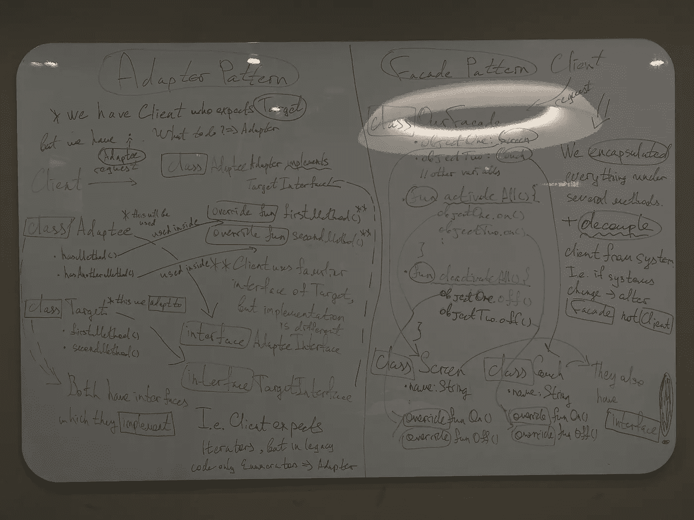

# 适配器和门面模式实现完美包装

> 原文：<https://blog.devgenius.io/adapter-facade-pattern-for-perfect-adapting-kotlin-ccbc8f8cfcd6?source=collection_archive---------9----------------------->

嘿，花样磨工伙伴！😲欢迎来到设计模式系列！这是我写的一系列关于模式的文章，以传播它们的愚蠢🙌

我建议你阅读以前的文章，在那里你可以挑选过多的知识:

*   策略模式:[https://medium . com/toward sdev/strategy-pattern-for-independent-algorithms-kot Lin-70 ed 24 c 7 BD 8 b](/towardsdev/strategy-pattern-for-independent-algorithms-kotlin-70ed24c7bd8b)
*   观察者模式:[https://medium . com/toward sdev/observer-pattern-for-loose-coupling-kot Lin-f5ab 804609 bb](/towardsdev/observer-pattern-for-loose-coupling-kotlin-f5ab804609bb)
*   装饰模式:[https://medium . com/toward sdev/decorator-decorator-pattern-for-object-composition-kot Lin-7 CEC 92 cbaf 7b](/towardsdev/decorator-decorator-pattern-for-object-composition-kotlin-7cec92cbaf7b)
*   工厂模式:[https://medium . com/dev-genius/factory-patternS-to-hide-instantiation-kot Lin-D5 f 01 cf 01921](/dev-genius/factory-patterns-to-hide-instantiation-kotlin-d5f01cf01921)
*   单例模式:[https://medium . com/dev-genius/singleton-pattern-for-one-of-a-class-objects-Java-a63c 774 d9d 4](/dev-genius/singleton-pattern-for-one-of-a-kind-objects-java-a63c774d9d4)
*   命令模式:[https://medium . com/dev-genius/command-pattern-for-encapsulated-invocation-kot Lin-4338 EB 23 D2 ca](https://medium.com/dev-genius/command-pattern-for-encapsulated-invocation-kotlin-4338eb23d2ca)

然后像往常一样支持[奥赖利传媒](https://medium.com/u/fbfa235a954c?source=post_page-----ccbc8f8cfcd6--------------------------------)因为他们的书很宏伟:[https://www . oreilly . com/library/view/head-first-design/9781492077992/](https://www.oreilly.com/library/view/head-first-design/9781492077992/)

结构:

*   介绍
*   问题:适配器
*   额外第一部分
*   问题:外观
*   要遵循的设计原则
*   额外第二部分
*   最终解决方案代码:两种模式
*   图画

❗️At 首先，我给了一个运行到适配器&然后切换到门面，这将需要更少的时间。我们去 go☄️吧

# 适配器和外观模式

# 适配器

## 介绍

模式是深入 OOP 世界的好选择。至少对我来说，这是那扇神奇的门，它的开启帮助我理解 OOP 不仅仅是类、继承、组合，而是内化为坚实的基础😱从头开始，看看如何炮制复杂的系统，所以 on🧑🏼‍💻

即使你不会记住世界上的每一个模式(你也不应该记住)，它们是银弹，抓住了它们，就会在你的头脑中为更优化的结构、更好的软件铺平道路&结果，你会成为一流的软件工程师😎

## 问题:适配器

假设您有一个知道如何与某个类交互的客户端。

基本例子:交流插头->插座。然后你搬到另一个国家🎌而现在你用的是以下结构:交流插头->交流电源**适配器** - >插座

编程中的适配器以同样的方式工作:它们接受**客户端类**，包装到**最终类**已知的接口中(假设它是我们的**供应商**)。

> 请特别注意下面的代码。我起初认为这种模式极其容易，但却陷入了误解和损失时间的深渊😫

首先观察这个适配器的基本例子，然后我将做一个测试

1.  我们有两个接口:`Duck`和`Turkey`
2.  每个类都有自己的实现
3.  想象一下**客户端**知道如何与 **Duck** 类型的接口交互，但是我们有实现 **Turkey** 接口的类(我写了`MallardDuck`作为例子，但是客户端对此一无所知)
4.  在适配器中，我们实现了‼️ **适应‼️**的接口，在我们的例子中是`Duck`
5.  将**adapter-to-Interface**方法放入，将所使用的真实类的方法放入(PS:提供类的实例，这些实例将在内部利用那些方法)，在上面的代码中是:`.gobble()` & `turkeyFly()`

除了前面的文章，我特别从代码示例开始。希望这篇笔记能让你理解得更顺畅🙉

现在，让我使用一些与模式相关的术语，使它更学术化👨🏼‍🎓

1.  客户端是针对**目标接口**实现的，其中*目标*是客户端知道如何与之交互的接口
2.  **适配器**实现**目标接口**路由客户端的请求。在上面的例子中，`TurkeyAdapter`实现了**目标接口**，也就是`Duck`
3.  适配器内部使用的实例是一个**适配器接口**(即我们提供给**适配器**的`CoolTurkey`实现了`Turkey`接口)
4.  客户愉快地收到回复，而且永远不知道门后有任何黑魔法！🦹‍♂️

> 实际上，我将在本文中进一步讨论一些注意事项

*   适配器**将客户端与最终代码(实现的接口)解耦。因此，我们的**客户端&最终代码**不需要改变，如果某些部分可能会改变(在许多时候，我们不能这样做)**
*   注意**适配器**如何将客户的请求映射到接口而不是具体的类，这意味着我们可以编写多个**适配器**来转换不同的类集合

## 额外第一部分

1.  老实说，有两种类型的适配器。上面的例子是一个规范的**对象适配器**，带有*单一继承*和*组合*。而且是很好的一个(加上我们在 Java 中没有多重继承& Kotlin)。但是，还有第二种类型:**类适配器**使用*多重继承* & *无组合*。我用 Python 写了一段代码来展示它的样子:

看，我们有两个抽象类(在 Python 中我们没有真正的接口)。然后我们有两个具体的类。最后，**适配器**从一个知道如何使用美国类型套接字`=>`的客户端获取请求，将美国套接字的`abstract class`作为继承中的第一个对象，并实现该方法。继承中的第二个对象是我们将重定向到的具体类。在我们的例子中是`EuSocket`

哪种适配器更好？不知道🤔甚至奥莱利媒体公司也没有声称自己是这本书的赢家。每个都有与组合继承方法相关的优点和缺点。

2.如果我们在使用的代码中没有一些方法呢？(我的意思是，**适配者代码**)。例如，我们的客户端/代码知道如何与**迭代器**交互，但是在最终代码中，我们坚持使用**枚举器**。侧注:前者比后者新。
那么，我们能绕过吗？不幸的是，只有借助例外。对于这种情况，请编写文档🤷‍♂️

[奥赖利媒体](https://medium.com/u/fbfa235a954c?source=post_page-----ccbc8f8cfcd6--------------------------------)代码示例:

看，我们的对象是`enumerator`，但是公开的方法是**迭代器**

3.**适配器**可能与**装饰器**混淆。但是前者将对象包装到现有的*接口*中，而后者增加了*职责*。要了解更多信息，请阅读我关于**装饰模式**的文章:[https://medium . com/towardsdev/Decorator-Decorator-pattern-for-object-composition-kot Lin-7 CEC 92 cbaf 7b](https://medium.com/towardsdev/decorator-decorator-pattern-for-object-composition-kotlin-7cec92cbaf7b)

## 问题:外观

在我看来，这种模式更接近我们 write✍人的日常生活🏻

想象一下，你有许多需要按顺序调用的类。此外，你有**接口**，然后它由某个类实现。像几十个这样的东西...👀为什么不将实现接口的实例提供到一个包含类中，该类公开方法，这些实例调用它们的方法？🧐

```
 Facade class
                 * instance_one = newA()
                 * instance_two = newB()

                  methodA()
                     instance_one.callA()
                     instance_two.callAA()

                  methodB()
                     instance_one.callB()
                     instance_two.callBB()interface A                         interface B
    |                                   |
class newA implements A             class newB implements B
    * callA()                          * callAA()
    * callB()                          * callBB()
```

我希望你得到了这个粗略的图表(我将在指定的部分进行代码运行)🤘

*   如果你需要访问那些底层组件的方法->你可以自由使用它们
*   我们**将** *客户端*通过**门面**发出的请求与*系统*解耦。如果接口改变了，hand❓❓No 中的类的实现需要改变我们的客户(通常我们不能)，但是重新做 **Facade** 你就很棒了！💯

> **外观**不仅简化了接口，而且**将**客户端从最终系统中解耦

## 要遵循的设计原则

1.  知识最少原则(德米特法则):只和你最亲近的朋友交谈🌝

简而言之，这意味着我们需要**非常清楚**我们在开发系统时使用的类。也就是说，不要盲目地从其他类调用一些方法，因为这在 bugs🪲会适得其反

**错误方法调用**的例子:

我们在从另一个方法返回的实例上调用方法:

1.  `getThermometer()`返回实例
2.  我们从`1`打电话给`getTemperature()`

调用方法时的准则:

1.  来自同一个班级
2.  来自当前类的组件
3.  从传入方法的参数(可能是对象)
4.  从方法中创建/实例化的对象

‼️Danger:‼️不会在方法内部调用另一个方法返回的对象上调用方法。它增加了与方法/类相关的**朋友**的数量，这在我们的例子中是不好的(参见上面的例子)

让我在实践中向你展示一切是如何工作的:

1.  主类是`Car`，在这里我们触发`start()`方法
2.  下面我们来分解一下方法是如何在方法中被调用的:
    *第 30 行:对提供给方法
    的**参数**使用方法*第 32 行:对类的组件使用方法，**引擎**
    *第 33 行:使用当前类的方法，`Car`
    *第 34 行:使用在方法中创建/实例化的类的方法

**最后**，让我向你展示如何修改上面的方法调用(糟糕的例子)🎉：

1.  我们调用`giveHouseTemperature()`，但是我们不能盲目地在`currentStation`上调用方法&然后马上在`thermometer`上调用。因此我们**解耦**调用
2.  首先从`currentStation`中取出温度计:在当前**类组件**上使用方法
3.  然后在我们提供**温度计**实例的类中调用**方法**
4.  在提供给该方法的**参数上调用`giveTemperature()`**
5.  最后，结果被返回到之前的方法，然后返回给我们🙌🏼

## 额外部分:两个

1.  **最小知识原则**用于**门面模式** :
    *客户端只与门面交互:好东西(一个朋友)
2.  系统代码可以升级而不影响**客户端**(如果我们不改变**接口**的东西。如果是这样，只有**立面**会改变)
3.  如果**门面**本身混杂而失去了上述*原则*:在我们的主**门面**内添加额外的**门面**图案

## 最终解决方案代码:两种模式

让我们浏览一下代码🤟🏼

*   首先我们有**适配器**模式:

[](https://github.com/SleeplessChallenger/KotlinDesignPatterns/tree/main/src/main/kotlin/7_Adapter_Facade/Adapter) [## KotlinDesignPatterns/src/main/kotlin/7 _ Adapter _ Facade/Adapter at main…

### O'Reilly 设计模式在 Kotlin 的实现。为 sleep less challenger/KotlinDesignPatterns 开发做出贡献…

github.com](https://github.com/SleeplessChallenger/KotlinDesignPatterns/tree/main/src/main/kotlin/7_Adapter_Facade/Adapter) 

1.  `main.kt`封装了我们的客户**的请求**。在这里，我们创建我们的最终对象，并封装到实现**目标接口**的**适配器**中
2.  所以，`TargetInterface.kt`是最初的接口。`Target.kt`是我们实现的类
3.  `AdapteeInterface.kt`是我们新的代码接口& `Adaptee.kt`是我们新实现的类
4.  `Adapter.kt`是我们的**适配器**，它再次实现了**旧的**接口，因此公开了它的方法。但是我们向**适配器**提供了我们的**新**实例，这样我们就可以从公开的方法中调用实例上的那些方法

*我希望你得到了结构。如果有事不点击->写在 comments✌🏼*

*   *现在我们转移到**门面**模式:*

*[](https://github.com/SleeplessChallenger/KotlinDesignPatterns/tree/main/src/main/kotlin/7_Adapter_Facade/Facade) [## KotlinDesignPatterns/src/main/kotlin/7 _ Adapter _ Facade/Facade at main…

### O'Reilly 设计模式在 Kotlin 的实现。为 sleep less challenger/KotlinDesignPatterns 开发做出贡献…

github.com](https://github.com/SleeplessChallenger/KotlinDesignPatterns/tree/main/src/main/kotlin/7_Adapter_Facade/Facade) 

1.  `ProjectorInterface.kt` & `AmplifierInterface.kt`都是来自系统的接口
2.  `Projector.kt` & `Amplifier.kt`是**从上面实现**接口的具体类
3.  `OurFacade.kt`是**门面**本身，其**将**系统从客户端请求中解耦
4.  `main.kt`是我们客户的要求。我们向 **Facade** 提供类的实例。它有现在由客户端拉的方法。在这些方法中，我们有调用它的方法的实例

> 同样，如果系统的**接口**发生变化(类的**实现**也发生变化)，我们不需要对**客户端-系统**的东西进行大的修改，只需要调整**外观**

## 图画🎨



在图片上你可以看到:

*   左侧是**适配器图案**
*   右侧是**立面图案**

这是一个有点乱，但希望你得到了要点💫

## Outro✌🏼

> **适配器模式**的学术定义:适配器作为一个中间人，将我们现在系统中的接口转换成客户期望的接口(即之前已经在我们的系统中)。适配器让那些由于不兼容而没有(客户端&我们的最终代码)就无法协同工作的类协同工作
> 
> **门面模式**的学术定义:它为系统中的一组接口(已实现)提供统一的接口/访问点。Facade 是一个高级接口(实际上，它不是一个接口，而是一个类，但在经典术语中是这么说的)，它简化了与低级系统的交互

哇，信息量真大！🤯仔细再读一遍，如果有模糊的地方，在评论中提问💬

你可以找到我:

*   领英:[www.linkedin.com/in/sleeplesschallenger](http://www.linkedin.com/in/sleeplesschallenger)
*   GitHub:【https://github.com/SleeplessChallenger 
*   leet code:【https://leetcode.com/SleeplessChallenger/】T4
*   电报:@无眠挑战者*