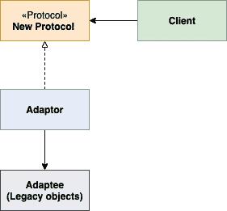
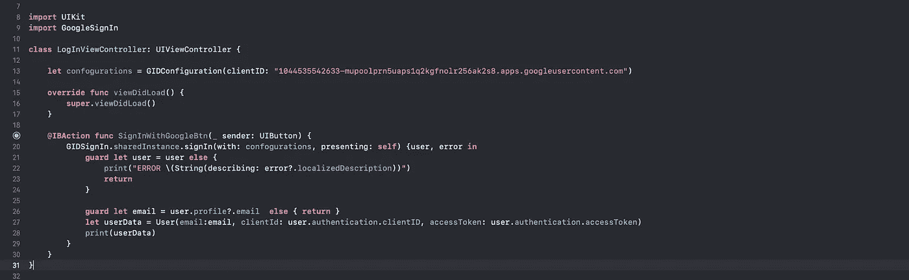
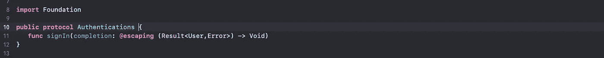
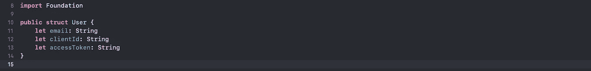
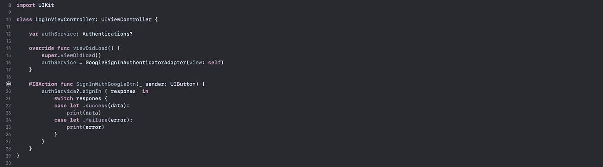

# swift 实践中的适配器模式

> 原文：<https://blog.devgenius.io/adapter-pattern-in-practice-by-swift-bec8338728ed?source=collection_archive---------7----------------------->

适配器模式是结构化设计模式之一，它允许我们在不改变组件的情况下，使组件的接口适应客户期望的接口。

例如，如果你从美国买了一部 iPhone，然后去了英国，你需要一个适配器来给你的 iPhone 充电。在这种情况下，客户端就是 iPhone。

适配器设计模式图

客户端:使用适配器的对象。

NewProtocol:由于 swift 不支持多重继承，我们正在使用该协议。

适配器:符合新协议，并传递给遗留对象。

Adaptee(遗留对象):这是不能像第三方库那样修改的代码。

理论定义谈得够多了🙁让我们深入研究几个真实的例子。

*   我们希望在像谷歌，脸书或我们自己的身份验证应用程序中使用多重身份验证实施。在这种情况下，使用适配器模式是一个不错的选择，为什么呢？因为如果我们希望在应用程序中使用谷歌和脸书认证，并将每个认证的实现分离到单独的适配器中，并且我们只有一个协议，所有适配器都符合该协议。在这种情况下，我们将客户端从遗留代码中分离出来，这意味着我们可以独立测试我们的业务逻辑，并且可以在不破坏代码的情况下自由添加或删除任何认证。
*   我们希望我们的应用程序支持缓存，例如使用核心数据或领域。在这种情况下，使用适配器是一个不错的选择。为什么？假设你已经使用了 Realm 而没有使用适配器，在那之后，我们决定使用核心数据，在这种情况下会发生什么，你应该修改所有的应用程序代码，而不是练习的方式。如果我们使用了一个适配器，将领域实现与客户端分离开来，会怎么样呢？您可以自由地删除领域或添加核心数据实现，而不会破坏遗留代码或测试。

这个适配器有很多用途，并且是一个强大的分离代码的模式。

## 认证示例

不使用适配器模式

在这个例子中，我已经用 Google 实现了登录，如果你想了解更多关于 [googleSignIn](https://developers.google.com/identity/sign-in/ios/start) 的信息。现在你可以看到这是干净的代码，但 loginViewController 与 google SignIn 紧密耦合第三方库想象你添加了一个新的依赖项，如脸书登录或使用 Apple 登录你将增加 LoginViewController 中的依赖项在这种情况下很难测试你的代码，因为是紧密耦合的，如果你添加或删除任何依赖项将需要时间😩😩😩。

**让我们为这个问题实现适配器模式🥳🥳**

1-创建抽象协议'身份验证'，并添加一个方法登录。至此，我们可以在不依赖任何第三方库的情况下测试 signIn 方法的行为。

新协议

2-创建“用户”模型。我已经选择了那些属性，你可以添加任何你想要的。🤗

用户模型

3-创建一个新类“GoogleSignInAuthenticatorAdapter”，并确认身份验证能够实现 SigIn 方法。我们已将 GoogleSignIn 实现(遗留代码)与“LoginViewController”隔离开来，将此责任交给适配器。

适配器

4-创建一个类型为身份验证协议的新属性“authService ”,并在“viewDidLoad”中初始化“GoogleSignInAuthenticatorAdapter ”,然后声明按钮“SignInWithGoogleBtn”以便能够实现“signIn”。

现在 LoginViewController 与 Google SignIn 解耦了，我们可以在不破坏现有代码的情况下自由地更改任何依赖关系的 google signIn😊。

客户

如果你想看源代码[https://github.com/amralkhayat/AdpaterPatternInPractice](https://github.com/amralkhayat/AdpaterPatternInPractice)