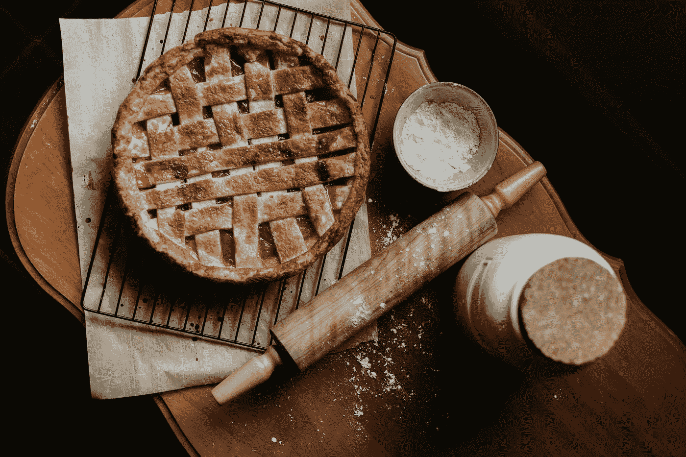

# 使用 Visx 库将饼图和圆环图添加到 React 应用程序中

> 原文：<https://blog.devgenius.io/add-a-pie-and-donut-charts-into-our-react-app-with-the-visx-library-f7397c52446c?source=collection_archive---------4----------------------->



照片由[普里西拉·杜·普里兹](https://unsplash.com/@priscilladupreez?utm_source=medium&utm_medium=referral)在 [Unsplash](https://unsplash.com?utm_source=medium&utm_medium=referral) 上拍摄

Visx 是一个库，让我们可以轻松地将图形添加到 React 应用程序中。

在本文中，我们将了解如何使用它将饼图和圆环图添加到 React 应用程序中

# 安装所需的软件包

我们必须安装一些模块。

首先，我们运行:

```
npm i @visx/gradient @visx/group @visx/mock-data @visx/responsive @visx/scale @visx/shape
```

安装软件包。

# 创建饼图和圆环图

我们可以通过编写以下内容来创建饼图和圆环图:

```
import React, { useState } from "react";
import Pie from "@visx/shape/lib/shapes/Pie";
import { scaleOrdinal } from "@visx/scale";
import { Group } from "@visx/group";
import { GradientPinkBlue } from "@visx/gradient";
import letterFrequency from "@visx/mock-data/lib/mocks/letterFrequency";
import browserUsage from "@visx/mock-data/lib/mocks/browserUsage";
import { animated, useTransition, interpolate } from "react-spring";const letters = letterFrequency.slice(0, 4);
const browserNames = Object.keys(browserUsage[0]).filter((k) => k !== "date");
const browsers = browserNames.map((name) => ({
  label: name,
  usage: Number(browserUsage[0][name])
}));const usage = (d) => d.usage;
const frequency = (d) => d.frequency;
const getBrowserColor = scaleOrdinal({
  domain: browserNames,
  range: [
    "rgba(255,255,255,0.7)",
    "rgba(255,255,255,0.6)",
    "rgba(255,255,255,0.5)",
    "rgba(255,255,255,0.4)",
    "rgba(255,255,255,0.3)",
    "rgba(255,255,255,0.2)",
    "rgba(255,255,255,0.1)"
  ]
});
const getLetterFrequencyColor = scaleOrdinal({
  domain: letters.map((l) => l.letter),
  range: [
    "rgba(93,30,91,1)",
    "rgba(93,30,91,0.8)",
    "rgba(93,30,91,0.6)",
    "rgba(93,30,91,0.4)"
  ]
});const defaultMargin = { top: 20, right: 20, bottom: 20, left: 20 };function Example({ width, height, margin = defaultMargin, animate = true }) {
  const [selectedBrowser, setSelectedBrowser] = useState(null);
  const [selectedAlphabetLetter, setSelectedAlphabetLetter] = useState(null); if (width < 10) return null; const innerWidth = width - margin.left - margin.right;
  const innerHeight = height - margin.top - margin.bottom;
  const radius = Math.min(innerWidth, innerHeight) / 2;
  const centerY = innerHeight / 2;
  const centerX = innerWidth / 2;
  const donutThickness = 50; return (
    <svg width={width} height={height}>
      <GradientPinkBlue id="visx-pie-gradient" />
      <rect
        rx={14}
        width={width}
        height={height}
        fill="url('#visx-pie-gradient')"
      />
      <Group top={centerY + margin.top} left={centerX + margin.left}>
        <Pie
          data={
            selectedBrowser
              ? browsers.filter(({ label }) => label === selectedBrowser)
              : browsers
          }
          pieValue={usage}
          outerRadius={radius}
          innerRadius={radius - donutThickness}
          cornerRadius={3}
          padAngle={0.005}
        >
          {(pie) => (
            <AnimatedPie
              {...pie}
              animate={animate}
              getKey={(arc) => arc.data.label}
              onClickDatum={({ data: { label } }) =>
                animate &&
                setSelectedBrowser(
                  selectedBrowser && selectedBrowser === label ? null : label
                )
              }
              getColor={(arc) => getBrowserColor(arc.data.label)}
            />
          )}
        </Pie>
        <Pie
          data={
            selectedAlphabetLetter
              ? letters.filter(
                  ({ letter }) => letter === selectedAlphabetLetter
                )
              : letters
          }
          pieValue={frequency}
          pieSortValues={() => -1}
          outerRadius={radius - donutThickness * 1.3}
        >
          {(pie) => (
            <AnimatedPie
              {...pie}
              animate={animate}
              getKey={({ data: { letter } }) => letter}
              onClickDatum={({ data: { letter } }) =>
                animate &&
                setSelectedAlphabetLetter(
                  selectedAlphabetLetter && selectedAlphabetLetter === letter
                    ? null
                    : letter
                )
              }
              getColor={({ data: { letter } }) =>
                getLetterFrequencyColor(letter)
              }
            />
          )}
        </Pie>
      </Group>
    </svg>
  );
}const fromLeaveTransition = ({ endAngle }) => ({
  startAngle: endAngle > Math.PI ? 2 * Math.PI : 0,
  endAngle: endAngle > Math.PI ? 2 * Math.PI : 0,
  opacity: 0
});const enterUpdateTransition = ({ startAngle, endAngle }) => ({
  startAngle,
  endAngle,
  opacity: 1
});function AnimatedPie({ animate, arcs, path, getKey, getColor, onClickDatum }) {
  const transitions = useTransition(arcs, getKey, {
    from: animate ? fromLeaveTransition : enterUpdateTransition,
    enter: enterUpdateTransition,
    update: enterUpdateTransition,
    leave: animate ? fromLeaveTransition : enterUpdateTransition
  });
  return (
    <>
      {transitions.map(({ item: arc, props, key }) => {
        const [centroidX, centroidY] = path.centroid(arc);
        const hasSpaceForLabel = arc.endAngle - arc.startAngle >= 0.1; return (
          <g key={key}>
            <animated.path
              d={interpolate(
                [props.startAngle, props.endAngle],
                (startAngle, endAngle) =>
                  path({
                    ...arc,
                    startAngle,
                    endAngle
                  })
              )}
              fill={getColor(arc)}
              onClick={() => onClickDatum(arc)}
              onTouchStart={() => onClickDatum(arc)}
            />
            {hasSpaceForLabel && (
              <animated.g style={{ opacity: props.opacity }}>
                <text
                  fill="white"
                  x={centroidX}
                  y={centroidY}
                  dy=".33em"
                  fontSize={9}
                  textAnchor="middle"
                  pointerEvents="none"
                >
                  {getKey(arc)}
                </text>
              </animated.g>
            )}
          </g>
        );
      })}
    </>
  );
}export default function App() {
  return (
    <div className="App">
      <Example width={500} height={300} />
    </div>
  );
}
```

我们创建了`letters`变量来为饼图添加数据。

`browerNames`和`browsers`有环形图的数据。

`usage`和`frequency`是数据的存取函数。

`getBrowserData`是一个返回浏览器圆环图颜色的函数。

`getLetterFrequencyColor`是一个返回浏览器饼图颜色的函数。

`defaultMargin`为图表留有页边距。

`Example`组件是主图表容器。

我们有`selectedBrowser`和`selectedAlphabetLetter`状态来分别跟踪选择的甜甜圈和饼图片段。

当我们点击它们时，它们被选中。

接下来，我们定义`innerWidth`、`innerHeight` n `radius`、`centerY`、`centerX`和`donutThickness`变量来计算图表的尺寸。

在`return`语句中，我们有带背景的`GradientPinkBlue`组件。

在`Group`组件中，我们有`Pie`组件。

它们定义了饼图和圆环图。

第一个`Pie`有饼图。

第二个`Pie`是圆环图里面的饼图。

它们中的每一个都有一个 render prop，它返回`AnimatedPie`组件来为饼图和圆环图添加动画。

他们有`onClickDatum`道具，让我们分别设置`selectedBrowser`和`selectedAlphabetLetter`状态。

`getColor`属性有一个返回饼图和甜甜圈段颜色的函数。

`AnimatedPie`组件是通过渲染`animated.path`来渲染饼图或甜甜圈而创建的。

我们使用`useTransition`钩子来添加过渡效果。

# 结论

我们可以通过 Visx 库轻松地将饼图和圆环图添加到 React 应用程序中。