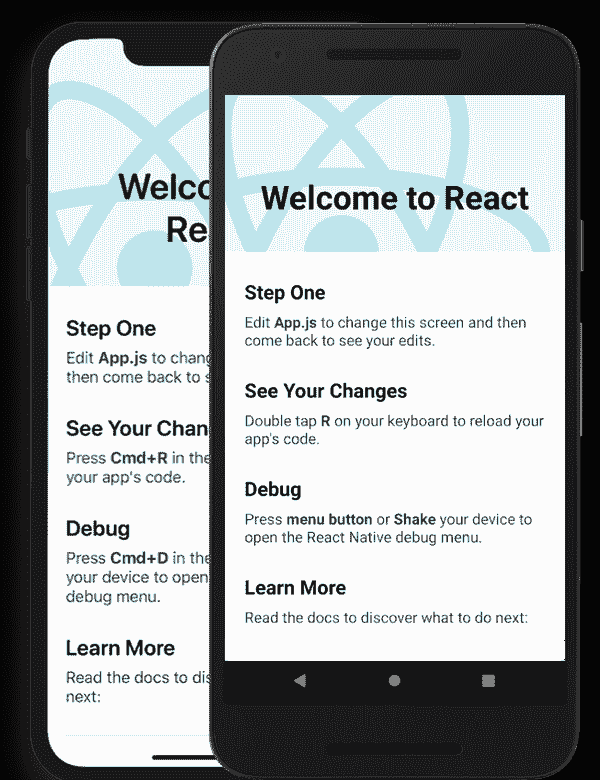

# 添加底部表来反应-原生应用程序。

> 原文：<https://blog.devgenius.io/add-bottom-sheets-to-react-native-app-6f4d9bf3bd6e?source=collection_archive---------1----------------------->

当你试图展示一些比应用程序中的其他组件更需要用户注意的内容时，底部表单会非常方便。底板也是 react-native 为我们提供的传统模型的很好的替代品。

今天我们要讨论的不是一个，而是两个底层包装，可以根据我们的要求使用。所以不要再拖延了，让我们开始吧！

类型 1:当您的内容很小时[通常用于呈现几个按钮(2–3)]:当您从设备的本地存储中上传图像或视频时，这些类型的模态被广泛使用。

附注:你也可以在任何其他场景中使用它。

类型 2:当你的内容更多，你希望用户通过向上滑动来扩展内容！这些类型的模态可以占据窗口的 90%。

让我们给它们编码！！

先决条件:

使用以下命令开始 react 本地项目。

```
npx react-native init modalExample
```



图片来源:reactnative.dev

类型 1:

1.  让我们安装依赖项。在这种情况下，我们将使用[复活底板](https://github.com/osdnk/react-native-reanimated-bottom-sheet)。这个包有一些依赖项，我们也将安装它们。

使用纱线:

```
yarn add reanimated-bottom-sheet react-native-reanimated@1.7.0 react-native-gesture-handler
```

或者

使用 npm:

```
npm install reanimated-bottom-sheet react-native-reanimated@1.7.0 react-native-gesture-handler
```

1.  现在转到您想要实现它的文件。
2.  在文件顶部导入 useRef、动画和底部表单。

```
import React, { useRef } from "react";
import BottomSheet from "reanimated-bottom-sheet";
import Animated from "react-native-reanimated";
```

3.创建对底部工作表和回调节点的引用。

```
sheetRef = useRef(null);
fall = new Animated.Value(1);
```

4.现在让我们将 BottomSheet 组件放到 UI 上。

```
<BottomSheet
         ref={this.modalRef}
         snapPoints={[330, 0]}
         initialSnap={1}
         callbackNode={this.fall}
         enabledGestureInteraction={true}
         renderContent={this.showContent}
         renderHeader={this.showHeader}
/>
```

*   对齐点决定了组件将在 UI 上占用的空间量。
*   默认情况下，initialSnap 为 1 会保持工作表关闭。

5.现在让我们创建头和内容方法来显示我们的内容。

```
showHeader = () => (
    <View style={styles.panelHeader}>
      <View style={styles.modalHeader}>
        <View style={styles.panelHandle} />
        <Text style={styles.modalHeaderText}>
          Swipe down to close the modal
        </Text>
      </View>
    </View>
  );showContent = () => (
    <>
      <View style={styles.panel}>
        <Text style={{ marginBottom: 10 }}>
          Hello World!
        </Text>
      </View>
    </>
  );
```

6.展示具有这些属性的样式。

```
panelHeader: {
    backgroundColor: "#ffffff",
    paddingTop: 20,
    borderTopLeftRadius: 20,
    borderTopRightRadius: 20,
    borderColor: "#ffffff",
  },
  panel: {
    padding: 20,
    backgroundColor: "#ffffff",
    paddingTop: 20,
    marginBottom: 0,
  },
  modalHeader: {
    justifyContent: "center",
    alignItems: "center",
  },
  modalHeaderText: {
    fontSize: 15,
    fontFamily: "ubuntu-semibold",
  },
  panelHandle: {
    width: 40,
    height: 8,
    borderRadius: 4,
    backgroundColor: "#00000040",
    marginBottom: 10,
  },
```

仅此而已。你完了。

附加功能(可选) :如果你想创建一个背景覆盖，然后添加这个功能，就在底层之上。

```
const renderShadow = () => {
    const animatedShadowOpacity = Animated.interpolate(fall, {
      inputRange: [0, 1],
      outputRange: [0.5, 0],
    });
    return (
      <Animated.View
        pointerEvents="none"
        style={[
          styles.shadowContainer,
          {
            opacity: animatedShadowOpacity,
          },
        ]}
      />
    );
  };/* The Styles Section */
shadowContainer: {
    ...StyleSheet.absoluteFillObject,
    backgroundColor: "#292C36",
    zIndex: 10,
  },
```

最后，应该是这样的:

```
{renderShadow()}
 <BottomSheet
 ref={this.modalRef}
 snapPoints={[330, 0]}
 initialSnap={1}
 callbackNode={this.fall}
 enabledGestureInteraction={true}
 renderContent={this.showContent}
 renderHeader={this.showHeader}
 />
```

故障排除:

1.  如果出现任何错误，请仔细检查 showContent()中的代码。您可能肯定忘记了从函数中返回组件。
2.  如果您收到错误消息:

```
TypeError: undefined is not a function
```

然后执行以下任一操作:

*   将你的反应-原生-复活降级到 v1 (1。X.X)。
*   在 renderShadow()内替换 interpolate 以插值节点。在这里看文件[。](https://docs.swmansion.com/react-native-reanimated/docs/migration)

现在，让我们进入第二种类型。

类型 2:

1.  让我们安装依赖项。在这种情况下，我们将使用 [react-native-modalize](https://github.com/jeremybarbet/react-native-modalize) 。这个包有一些依赖项，我们也将安装它们。

使用纱线:

```
yarn add reanimated-bottom-sheet react-native-gesture-handler
```

或者

使用 npm:

```
npm install reanimated-bottom-sheet react-native-gesture-handler
```

1.  现在让我们进行所需的配置。搬到 MainActivity.java，添加以下几行:

```
import com.facebook.react.ReactActivityDelegate;
import com.facebook.react.ReactRootView;
import com.swmansion.gesturehandler.react.RNGestureHandlerEnabledRootView;/*  Inside MainActivity class */
[@Override](http://twitter.com/Override)
  protected ReactActivityDelegate createReactActivityDelegate() {
    return new ReactActivityDelegate(this, getMainComponentName()) {
      [@Override](http://twitter.com/Override)
      protected ReactRootView createRootView() {
       return new RNGestureHandlerEnabledRootView(MainActivity.this);
      }
    };
  }
```

*   现在将这一行添加到根 index.js 文件中:

```
import 'react-native-gesture-handler';
```

2.转到您想要实现它的屏幕(在这个例子中我使用 App.js):

```
import React, {useRef} from 'react';
import {StyleSheet, Text, View, Pressable} from 'react-native';
import {Modalize} from 'react-native-modalize';const App = () => {
  const modalRef = useRef(null);
  return (
    <View style={styles.container}>
      <Pressable onPress={() => modalRef.current?.open()}>
        <Text>Launch Modal</Text>
      </Pressable><Modalize ref={modalRef} snapPoint={180}>
          <YourModalContent />
      </Modalize>
    </View>
  );
};export default App;const styles = StyleSheet.create({
  container: {
    flex: 1,
    alignItems: 'center',
    justifyContent: 'center',
  },
  button: {
    alignItems: 'center',
    justifyContent: 'center',
    padding: 15,
    borderRadius: 10,
  },
});
```

就这样，伙计。你的底部床单现在可以放你的东西了。我希望这对你有帮助。干杯！✌🏻

如果你有任何问题，请在评论区提出来。我会尽力帮忙。**关注**我获取更多此类内容。谢了。祝你有美好的一天！