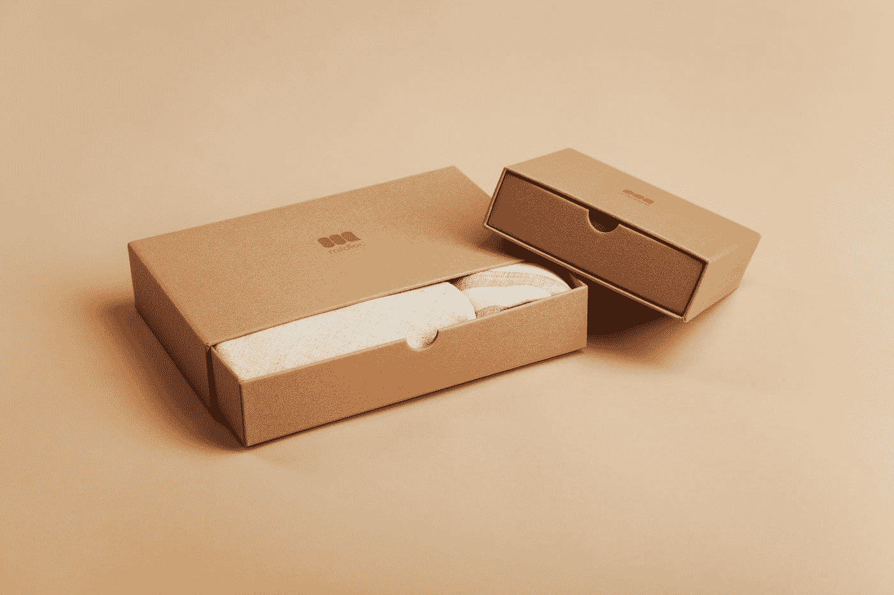

# 使用 Visx 库将箱线图添加到 React 应用程序中

> 原文：<https://blog.devgenius.io/add-box-plots-into-our-react-app-with-the-visx-library-1f8ed9a093c2?source=collection_archive---------9----------------------->



由[在](https://unsplash.com/@mildlee?utm_source=medium&utm_medium=referral) [Unsplash](https://unsplash.com?utm_source=medium&utm_medium=referral) 上拍摄的照片

Visx 是一个库，让我们可以轻松地将图形添加到 React 应用程序中。

在本文中，我们将了解如何使用它来将盒状图添加到 React 应用程序中。

# 安装所需的软件包

我们必须安装一些模块。

首先，我们运行:

```
npm i @visx/gradient @visx/group @visx/mock-data @visx/pattern @visx/responsive @visx/scale @visx/stats @visx/tooltip
```

安装软件包。

# 添加方框图

现在，我们可以使用以下内容添加箱线图:

```
import React from "react";
import { Group } from "@visx/group";
import { ViolinPlot, BoxPlot } from "@visx/stats";
import { LinearGradient } from "@visx/gradient";
import { scaleBand, scaleLinear } from "@visx/scale";
import genStats from "@visx/mock-data/lib/generators/genStats";
import {
  Tooltip,
  defaultStyles as defaultTooltipStyles,
  useTooltip
} from "@visx/tooltip";
import { PatternLines } from "@visx/pattern";const data = genStats(5);
const x = (d) => d.boxPlot.x;
const min = (d) => d.boxPlot.min;
const max = (d) => d.boxPlot.max;
const median = (d) => d.boxPlot.median;
const firstQuartile = (d) => d.boxPlot.firstQuartile;
const thirdQuartile = (d) => d.boxPlot.thirdQuartile;
const outliers = (d) => d.boxPlot.outliers;const Example = ({ width, height }) => {
  const {
    tooltipOpen,
    tooltipLeft,
    tooltipTop,
    tooltipData,
    hideTooltip,
    showTooltip
  } = useTooltip(); const xMax = width;
  const yMax = height - 120;
  const xScale = scaleBand({
    range: [0, xMax],
    round: true,
    domain: data.map(x),
    padding: 0.4
  }); const values = data.reduce((allValues, { boxPlot }) => {
    allValues.push(boxPlot.min, boxPlot.max);
    return allValues;
  }, []);
  const minYValue = Math.min(...values);
  const maxYValue = Math.max(...values); const yScale = scaleLinear({
    range: [yMax, 0],
    round: true,
    domain: [minYValue, maxYValue]
  }); const boxWidth = xScale.bandwidth();
  const constrainedWidth = Math.min(40, boxWidth); return width < 10 ? null : (
    <div style={{ position: "relative" }}>
      <svg width={width} height={height}>
        <LinearGradient id="statsplot" to="#8b6ce7" from="#87f2d4" />
        <rect
          x={0}
          y={0}
          width={width}
          height={height}
          fill="url(#statsplot)"
          rx={14}
        />
        <PatternLines
          id="hViolinLines"
          height={3}
          width={3}
          stroke="#ced4da"
          strokeWidth={1}
          orientation={["horizontal"]}
        />
        <Group top={40}>
          {data.map((d, i) => (
            <g key={i}>
              <ViolinPlot
                data={d.binData}
                stroke="#dee2e6"
                left={xScale(x(d))}
                width={constrainedWidth}
                valueScale={yScale}
                fill="url(#hViolinLines)"
              />
              <BoxPlot
                min={min(d)}
                max={max(d)}
                left={xScale(x(d)) + 0.3 * constrainedWidth}
                firstQuartile={firstQuartile(d)}
                thirdQuartile={thirdQuartile(d)}
                median={median(d)}
                boxWidth={constrainedWidth * 0.4}
                fill="#FFFFFF"
                fillOpacity={0.3}
                stroke="#FFFFFF"
                strokeWidth={2}
                valueScale={yScale}
                outliers={outliers(d)}
                minProps={{
                  onMouseOver: () => {
                    showTooltip({
                      tooltipTop: yScale(min(d)) ?? 0 + 40,
                      tooltipLeft: xScale(x(d)) + constrainedWidth + 5,
                      tooltipData: {
                        min: min(d),
                        name: x(d)
                      }
                    });
                  },
                  onMouseLeave: () => {
                    hideTooltip();
                  }
                }}
                maxProps={{
                  onMouseOver: () => {
                    showTooltip({
                      tooltipTop: yScale(max(d)) ?? 0 + 40,
                      tooltipLeft: xScale(x(d)) + constrainedWidth + 5,
                      tooltipData: {
                        max: max(d),
                        name: x(d)
                      }
                    });
                  },
                  onMouseLeave: () => {
                    hideTooltip();
                  }
                }}
                boxProps={{
                  onMouseOver: () => {
                    showTooltip({
                      tooltipTop: yScale(median(d)) ?? 0 + 40,
                      tooltipLeft: xScale(x(d)) + constrainedWidth + 5,
                      tooltipData: {
                        ...d.boxPlot,
                        name: x(d)
                      }
                    });
                  },
                  onMouseLeave: () => {
                    hideTooltip();
                  }
                }}
                medianProps={{
                  style: {
                    stroke: "white"
                  },
                  onMouseOver: () => {
                    showTooltip({
                      tooltipTop: yScale(median(d)) ?? 0 + 40,
                      tooltipLeft: xScale(x(d)) + constrainedWidth + 5,
                      tooltipData: {
                        median: median(d),
                        name: x(d)
                      }
                    });
                  },
                  onMouseLeave: () => {
                    hideTooltip();
                  }
                }}
              />
            </g>
          ))}
        </Group>
      </svg> {tooltipOpen && tooltipData && (
        <Tooltip
          top={tooltipTop}
          left={tooltipLeft}
          style={{
            ...defaultTooltipStyles,
            backgroundColor: "#283238",
            color: "white"
          }}
        >
          <div>
            <strong>{tooltipData.name}</strong>
          </div>
          <div style={{ marginTop: "5px", fontSize: "12px" }}>
            {tooltipData.max && <div>max: {tooltipData.max}</div>}
            {tooltipData.thirdQuartile && (
              <div>third quartile: {tooltipData.thirdQuartile}</div>
            )}
            {tooltipData.median && <div>median: {tooltipData.median}</div>}
            {tooltipData.firstQuartile && (
              <div>first quartile: {tooltipData.firstQuartile}</div>
            )}
            {tooltipData.min && <div>min: {tooltipData.min}</div>}
          </div>
        </Tooltip>
      )}
    </div>
  );
};export default function App() {
  return (
    <div className="App">
      <Example width={500} height={300} />
    </div>
  );
}
```

`data`变量包含箱线图的数据。

然后我们在它下面添加 getter 方法。

在`Example`组件中，我们调用`useTooltip`钩子，当鼠标悬停在箱线图上时显示工具提示。

`showTooltip`显示工具提示。`hideTooltip`隐藏工具提示。

我们添加了`values`变量来收集箱线图所需的值。

`yScale`具有 y 轴的刻度。

为了添加盒图，我们调用`data.map`来映射数据值盒图组件。

我们使用`ViolinPlot`组件来渲染盒子图周围的小提琴图。

然后我们使用`BoxPlot`组件来呈现箱线图。

我们将所有的 getter 方法作为道具传入`ViolinPlot`和`BoxPlot`。

我们调用`onMouseOver`方法中的`showTooltip`来显示一个工具提示。

在`onMouseLeave`处理程序中，我们调用`hideTooltip`来隐藏工具提示。

`minProps`获取当我们悬停在箱线图底部时运行的处理程序。

`maxProps`获取当我们悬停在箱线图顶部时运行的处理程序。

`boxProps`获取当我们悬停在盒状图的盒子上时运行的处理程序。

`medianProps`获取当我们悬停在箱线图中点上时运行的处理程序。

最后，我们用`Tooltip`组件添加工具提示内容。

现在我们应该看到一个盒子和小提琴情节。当我们将鼠标悬停在胡须或方框上时，我们会看到一个带有值的工具提示。

# 结论

我们可以使用 Visx 库将盒子和小提琴图添加到 React 应用程序中。