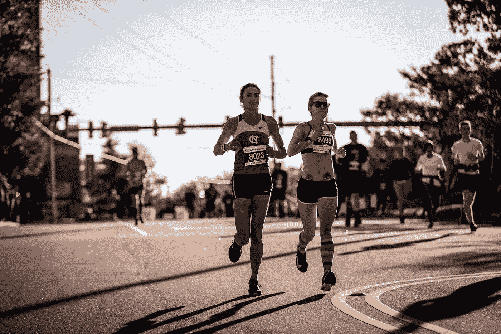

# 使用 Victory 将图表添加到我们的 React 应用程序中—自定义标签和点数

> 原文：<https://blog.devgenius.io/add-charts-into-our-react-app-with-victory-custom-labels-and-points-7e7cbb44d89f?source=collection_archive---------5----------------------->



照片由[顶石事件](https://unsplash.com/@capstoneeventgroup?utm_source=medium&utm_medium=referral)在 [Unsplash](https://unsplash.com?utm_source=medium&utm_medium=referral) 上拍摄

胜利让我们能够将图表和数据可视化添加到 React 应用程序中。

在本文中，我们将了解如何使用 Victory 将图表添加到 React 应用程序中。

# 更改默认标签组件

我们可以覆盖伴随胜利而来的组件的外观。

例如，我们可以通过编写以下代码来更改条形图显示的标签:

```
import React from "react";
import { VictoryBar, VictoryLabel } from "victory";export default function App() {
  return (
    <VictoryBar
      data={[
        { x: 1, y: 3, label: "Alpha" },
        { x: 2, y: 4, label: "Bravo" },
        { x: 3, y: 6, label: "Charlie" },
        { x: 4, y: 3, label: "Delta" },
        { x: 5, y: 7, label: "Echo" }
      ]}
      labelComponent={
        <VictoryLabel angle={90} verticalAnchor="middle" textAnchor="end" />
      }
    />
  );
}
```

我们设置`VictoryLabel`的`angle`来垂直显示标签。

`textAnchor`设置为`end`将它们向右移动。

# 包装组件

我们可以包装组件来显示我们想要的。

例如，我们可以创建自己的包装器组件来向图表添加标签:

```
import React from "react";
import { VictoryChart, VictoryLabel, VictoryScatter } from "victory";const WrapperComponent = (props) => {
  const renderChildren = () => {
    const children = React.Children.toArray(props.children);
    return children.map((child) => {
      const style = { ...child.props.style, ...props.style };
      return React.cloneElement(
        child,
        Object.assign({}, child.props, props, { style })
      );
    });
  }; return (
    <g transform="translate(20, 40)">
      <VictoryLabel text={"add labels"} x={110} y={30} />
      <VictoryLabel text={"offset data from axes"} x={70} y={150} />
      <VictoryLabel text={"alter props"} x={280} y={150} />
      {renderChildren()}
    </g>
  );
};export default function App() {
  return (
    <VictoryChart>
      <WrapperComponent>
        <VictoryScatter
          y={(d) => Math.sin(2 * Math.PI * d.x)}
          samples={15}
          symbol="square"
          size={6}
          style={{ data: { stroke: "tomato", strokeWidth: 3 } }}
        />
      </WrapperComponent>
    </VictoryChart>
  );
}
```

`WrapperComponent`从`children`道具中取出子组件，用`React.cloneElement`渲染。

我们也通过合并来自`child`和道具的样式来合并样式。

在`return`语句中，我们使用`VictoryLabel`并调用`renderChildren`函数来呈现子项。

然后在`App`中，我们渲染`WrapperComponent`中的`VictoryScatter`来渲染带有`VictoryLabel` s 的正弦曲线。

# 自定义点数

例如，我们可以创建`CatPoint`组件，并将其作为`VictoryScatter`组件中`dataComponent`的值进行传递:

```
import React from "react";
import { VictoryChart, VictoryScatter } from "victory";const CatPoint = (props) => {
  const { x, y, datum } = props;
  const cat = datum._y >= 0 ? "😀" : "😹";
  return (
    <text x={x} y={y} fontSize={30}>
      {cat}
    </text>
  );
};export default function App() {
  return (
    <VictoryChart>
      <VictoryScatter
        y={(d) => Math.sin(2 * Math.PI * d.x)}
        samples={25}
        dataComponent={<CatPoint />}
      />
    </VictoryChart>
  );
}
```

我们从`datum`属性中获取数据条目，并且`_y`属性具有 y 值。

`x`和`y`都有这个位置。

# 结论

我们可以在 React 应用程序中使用 Victory 创建的图表定制标签和点数。