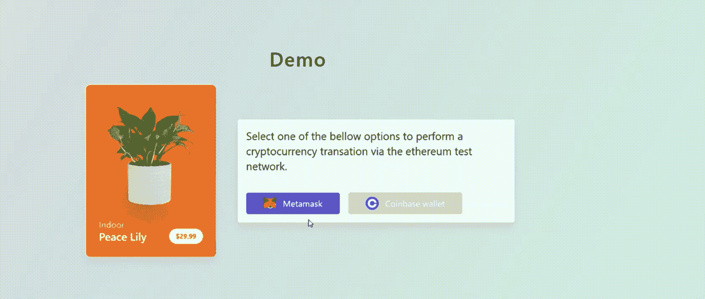

# 使用 metamask 和 javascript 将加密货币支付添加到您的网站

> 原文：<https://blog.devgenius.io/add-cryptocurrency-payments-to-your-website-with-metamask-and-javascript-5e11326431c6?source=collection_archive---------0----------------------->

如何让顾客使用 Metamask 钱包进行支付的分步指南。

[托安楚](https://unsplash.com/@toanchu?utm_source=unsplash&utm_medium=referral&utm_content=creditCopyText)在 [Unsplash](https://unsplash.com/s/photos/washington?utm_source=unsplash&utm_medium=referral&utm_content=creditCopyText) 上拍摄的背景照片

假设您有一家在线商店，并希望允许您的客户使用加密货币进行购物。在本文中，我们将介绍用 Javascript 和元掩码实现一个简单的加密货币支付流程的步骤。

整个流程将如下所示:

元掩码付款流程

然后，您将在 Etherscan 中看到如下所示的交易页面:

[https://ethers can . io/tx/0x6d 63 a 635 c 853d 251900 b 9 b 76 c 970 a 028 FD 71 f 24 bb 8 d0c 2 a 82262126023085 f5e](https://etherscan.io/tx/0x6d63a635c853d251900b9b76c970a028fd71f24bb8d0c2a82262126023085f5e)

## 支付流程

执行支付的流程如下所示:

1.  应用程序加载并自动检查 Metamask 钱包是否已连接。如果没有，显示连接按钮。
2.  如果用户没有连接，他按下连接按钮，并签署消息连接到应用程序。
3.  用户查看并确认付款。
4.  创建元掩码事务请求，并显示一个弹出窗口供用户确认事务。
5.  用户确认交易，生成 Eherscan url，用户和应用程序都会收到支付确认。

## 检查用户是否登录

首先，当页面第一次加载时，我们要检查用户是否已经将钱包连接到应用程序。为此，我们只需使用“eth_accounts”方法获取用户的帐户。如果没有帐户返回，这意味着用户没有连接。以下是执行此操作的代码:

如果用户登录了，我们显示结帐菜单，如果没有，我们显示连接按钮。

## 将用户连接到应用程序

如果用户没有连接，我们希望为我们的连接按钮分配一个功能，将钱包连接到应用程序。这可以通过使用“eth_requestAccounts”方法来实现。该方法将创建一个 Metamask 弹出窗口，供用户签署消息并确认他想要连接到应用程序。

以下是该函数的代码:

用户现在将连接到网站，并能够继续进行结帐。

## 处理付款

对于最后一部分，我们希望提示用户通过元掩码确认事务。这可以通过“eth_sendTransaction”方法实现:

## 完整的代码片段

这个代码的完整工作版本可以在下面的链接中看到。这个代码片段使用 Vue.js 和 Tailwindcss 来实现本文开头所示的接口。

[https://gist . github . com/duartefdias/95f 3808 EB 05 e 60 c 2426 a9 FD 7423 cc 24](https://gist.github.com/duartefdias/95f3808eb05e60c2426aa9fd7423cc24)

## 结论

这篇文章是一个简短实用的指南，介绍了如何使用 Metamask 快速实现一个基本的区块链支付系统。

这是可能的最简单的实现，但如果您想跟踪您的客户和订单，则不推荐这样做。如果你有兴趣学习**如何创建一个更健壮的架构**来处理订单跟踪和更健壮的流程，请在 Medium 上关注我，因为我将很快发布一篇关于我如何创建一个具有无服务器云功能的全栈实现的文章。

编码快乐！