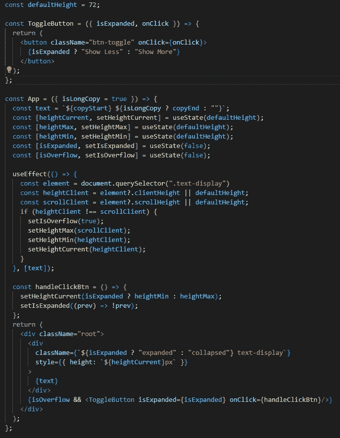
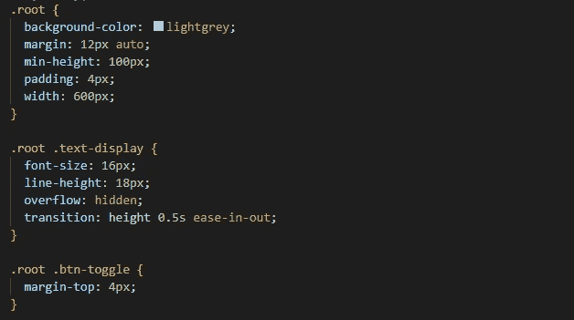
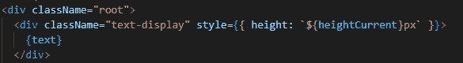
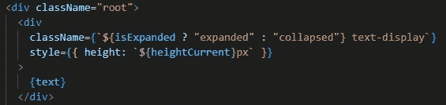
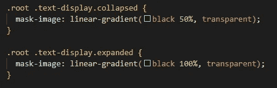
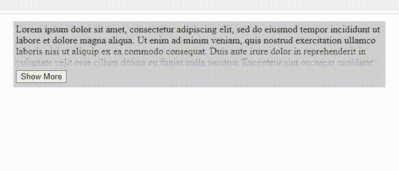
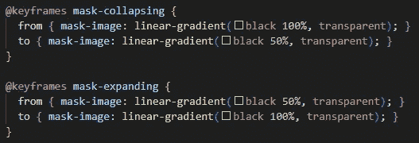
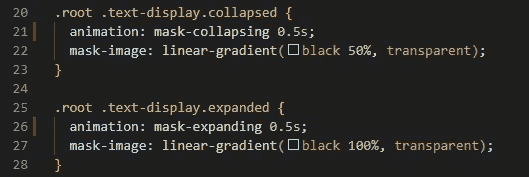
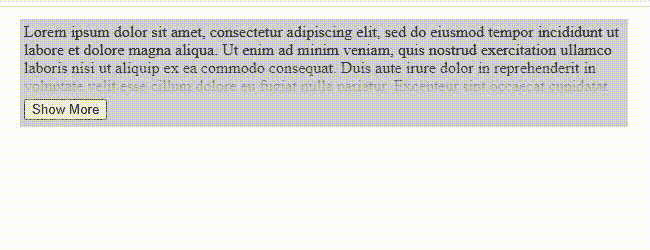

# 使用 CSS 过渡和动画在 React 组件中添加淡化文本

> 原文：<https://blog.devgenius.io/add-faded-text-in-react-components-using-css-transitions-and-animations-cdb7a2cdacae?source=collection_archive---------7----------------------->

在现代网络应用中，创造流畅的用户界面体验是关键。让我们看看如何在处理褪色的文本时创造这种体验..


[Florian Wehde](https://unsplash.com/@florianwehde?utm_source=medium&utm_medium=referral) 在 [Unsplash](https://unsplash.com?utm_source=medium&utm_medium=referral) 上拍摄的照片

本文的目标是，到最后，您将能够在 React 应用程序的文本显示上添加淡入淡出，该应用程序具有展开/折叠切换，这是 web 上常见的模式。

## 先决条件

你需要在你的机器上安装带有`npm`的`git`和`node`。这种效果也是在最新版本的 Chrome 上开发的。

# 首先:设置项目

这篇文章是一篇珍贵文章的延续，在这篇文章中，我们完成了[创建“更多/更少”文本按钮](https://javascript.plainenglish.io/create-a-react-component-for-more-less-text-transition-b8896f098773)。我们将从文章停止的地方开始，使用一个简单的切换开关来展开和折叠，但没有为褪色的文本效果添加其他样式。您可以使用下面的命令从标签`v1.0.0`处的文章中提取存储库:

```
git clone -b v1.0.0  [https://github.com/cameronDz/more-less-medium-app.git](https://github.com/cameronDz/more-less-medium-app.git)
```

你可以做的另一个选择是使用`create-react-app`来生成一个新项目，并使用下面的两个部分作为你的`App.js`和`index.css`文件。



App.js 启动文件。



index.css 开始文件。

一旦你下载了应用程序，或者将上面的代码添加到你生成的应用程序中，你就可以运行`npm install`和`npm run start`来运行应用程序。该功能将如所述，一个非常简单的扩展和折叠按钮，带有一些 Lorem 益普生文本。

# 接下来:添加淡入淡出

现在应用程序已经设置好了，我们可以开始添加淡入淡出的功能。

## 设置课程

第一步是设置类来决定文本何时展开或折叠。这是在文本的包装器`div`的`className`中使用字符串文字的简单三元组。我们目前在`div`包装器中有以下内容。



初始文本包装元素。

变化 add 将是一个三进制对着`isExpanded`标志，当它是`true`时，我们将添加一个`.expanded`类，当`false`时，我们将添加一个`.collapsed`类。它看起来会像这样。



完成的文本包装元素。

## 褪色的 CSS 属性

现在我们可以进入样式表，根据这两个类添加一些新的样式。



设置`mark-image` ( [docs](https://developer.mozilla.org/en-US/docs/Web/CSS/mask-image) )属性会将键中定义的图像应用到元素上。元素中的任何文本都将显示图像。函数`linear-gradient()` ( [文档](https://developer.mozilla.org/en-US/docs/Web/CSS/gradient/linear-gradient))根据参数生成图像。

在`.collapsed`类中，`black 50%, transparent`表示创建一个从元素顶部到`50%`底部的图像，然后为图像的其余部分创建一个从黑色到透明的渐变。当文本折叠时，这给了“褪色”的外观。

在`.expanded`类中，`black 100%, transparent`表示创建一个图像，它是`black`元素的整个高度。

运行应用程序，你现在应该有一个可折叠的文本字段，在底部有轻微的褪色，如下所示。



# 最后:平稳过渡

淡入淡出的文本很好，但是你可以看到上面的`.gif`，当你展开和折叠文本时淡入淡出。再用几行 CSS 就可以把`transition`弄平滑了。

## 使用关键帧

这里我们只需要添加两个`@keyframes` CSS 属性( [docs](https://developer.mozilla.org/en-US/docs/Web/CSS/@keyframes) )用于文本的展开和折叠。这是我们将添加到样式表中的代码片段。



动画的关键帧会淡化。

`@keyframes`定义了动画是如何工作的。为了使用动画，我们已经指向了我们想要拥有动画的类中的`@keyframes`。

对于`mask-collapsing`，这是我们希望文本折叠时动画的工作方式。蒙版将从 100%开始，并过渡到 50%的值，该值已经在类中为我们想要的线条渐变开始的位置定义。这将使淡入淡出的外观慢慢显现出来，而不是一按下按钮就迅速出现。

在`mask-expanding`中，我们定义了当我们扩展文本时动画是如何工作的。我们将黑色部分的 50%开始慢慢增加到 100%，这将使淡入淡出看起来像是慢慢消失，而不是立即被移除。

## 添加动画

现在我们只需要将`animation`属性应用到类中。将`animation: mask-collapsing;`添加到`.collapsed`类，将`animation: mask-expanding;`添加到`.expanded`类。我们还添加了动画发生的时间。我们在`0.5s`匹配文本的`transition`速度。



当我们查看正在运行的应用程序时，我们看到



现在，淡入淡出不会像扩展/折叠时那样强烈，当显示更多文本时，过渡会变得平滑。

## 结论

就这样，希望你已经为你的工具包学习了一些新的 CSS 工具，并且能够在任何展开/折叠的文本上添加淡入淡出。最终代码可以在标签`v1.1.0`下找到，存储在 [GitHub](https://github.com/cameronDz/more-less-medium-app/releases/tag/v1.1.0) 上。

祝你好运，编码快乐！