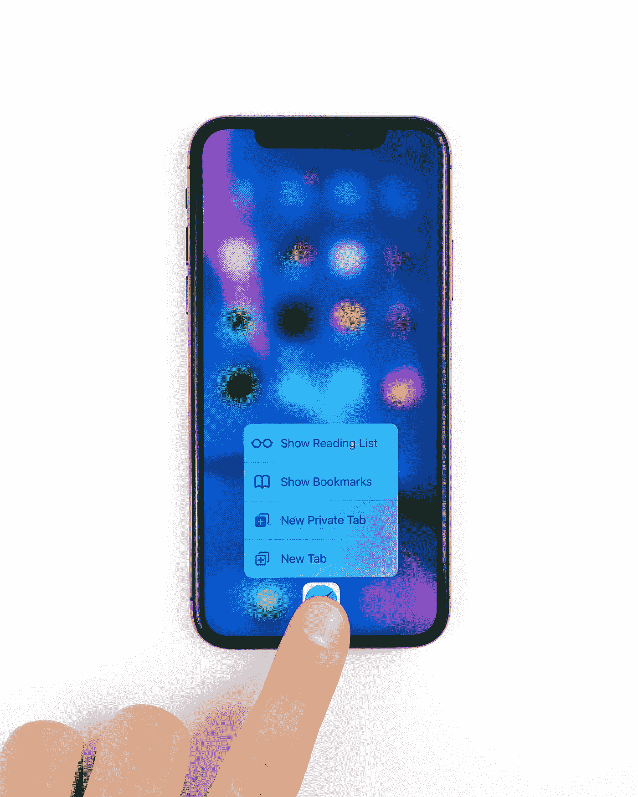
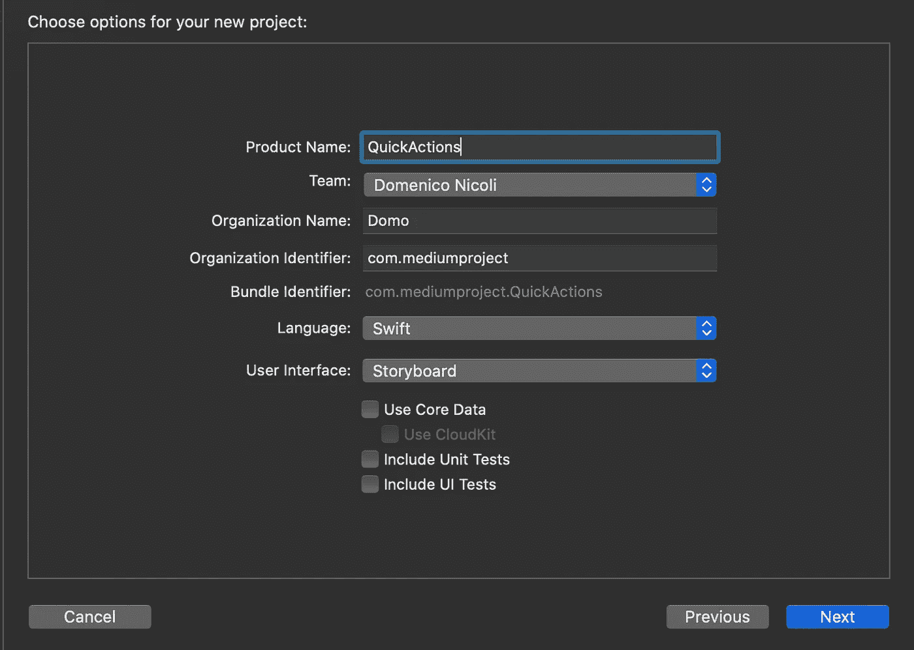
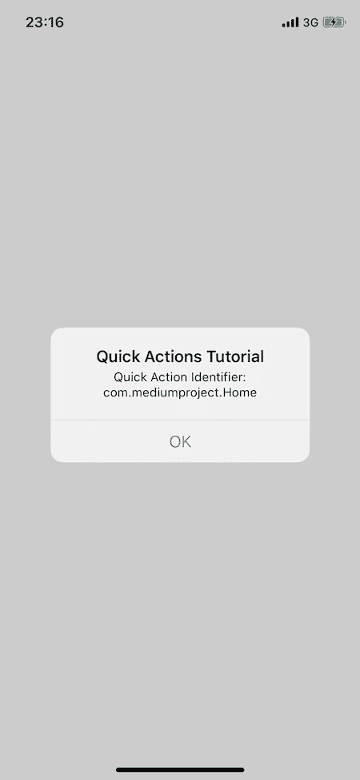
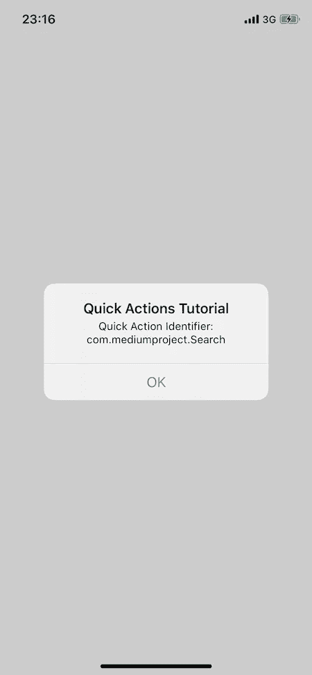
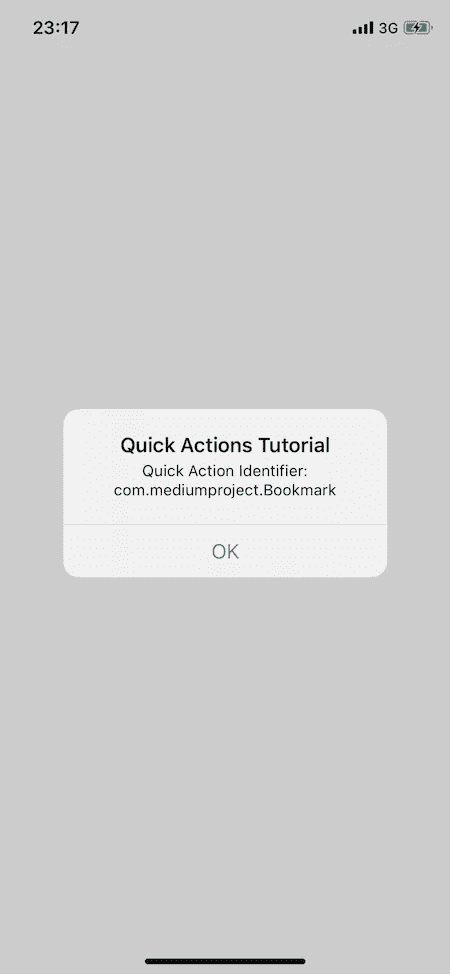
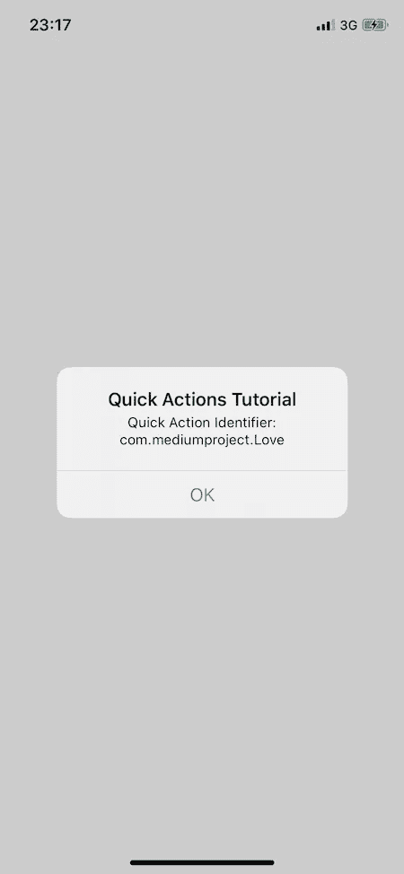

# 在 Swift 和 iOS 13 中添加主屏幕快速操作

> 原文：<https://blog.devgenius.io/add-home-screen-quick-actions-in-swift-and-ios-13-71615f805eff?source=collection_archive---------0----------------------->

## 如何在你的应用中轻松实现快速操作

丹尼尔·科尔派在 [Unsplash](https://unsplash.com?utm_source=medium&utm_medium=referral) 上拍摄的照片

# 介绍

在 iOS 13 的新版本中， [3D Touch](https://developer.apple.com/ios/3d-touch/) 、 [Haptic Touch](https://developer.apple.com/documentation/ios_ipados_release_notes/ios_ipados_13_1_release_notes) 和长按手势(针对所有没有 3D Touch 的设备)现在是一个单上下文菜单系统。如果您按住图标大约一秒钟，快速操作菜单将与“共享”(与您的朋友共享应用程序)和“重新排列应用程序”(更改应用程序位置或删除应用程序的新功能)一起显示。

# 入门指南

首先，打开 [Xcode](https://developer.apple.com/xcode/) ，新建一个项目。选择“单视图应用程序”

首先，请记住，我们最多只能添加四个动作。

创建一个新的快速动作:打开`Info.plist` 文件，添加一个名为`UIApplicationShortcutItems`的新元素。将“数组”设置为类型。在此元素下，为您想要添加到应用程序的每个快速操作创建一个项目，并将该项目设置为“Dictionary”在此项中，您需要添加以下全部或部分密钥:

*   `UIApplicationShortcutItemType` (必选):标识快速动作的唯一字符串。比如:`com.mediumproject.helloWorld`。
*   `UIApplicationShortcutItemTitle`(必选):显示给用户的快速动作标题。
*   `UIApplicationShortcutItemSubtitle` (可选):快速动作的字幕。
*   `UIApplicationShortcutItemIconType`(可选):在这里您可以设置一个苹果制造的[预定义图标](https://developer.apple.com/documentation/uikit/uiapplicationshortcuticon/icontype)。
*   `UIApplicationShortcutItemIconFile`(可选):用于设置自定义图标。
*   `UIApplicationShortcutItemUserInfo`(可选):保存数据的字典。

如果你启动应用程序，你应该会看到四个快速动作，但现在如果你点击其中任何一个，什么都不会发生。

# 履行

现在我们终于可以开始写一些代码了！

首先，我们需要在`SceneDelegate.swift`文件中添加以下方法，当用户在主屏幕上点击快速动作时会调用该方法。然后，我们需要检查哪个动作被调用，并执行我们的代码逻辑。在本例中，我将显示一个带有快速动作类型标识符的警报。

# 是时候测试一下了

我们终于准备好推出我们的应用程序，并尝试一些快速行动！

**更新**:我改了爱和书签快速行动的代码。现在他们使用两种不同的逻辑(如果你使用故事板或者编程)来调用另一个`ViewController`内部的特定方法。

这是第二个`ViewController`作为例子:

感谢您的阅读。如果你有任何问题或建议，请在评论中告诉我。

**这里** **可以找到完整的代码** [**。**](https://github.com/domeniconicoli/QuickActions)