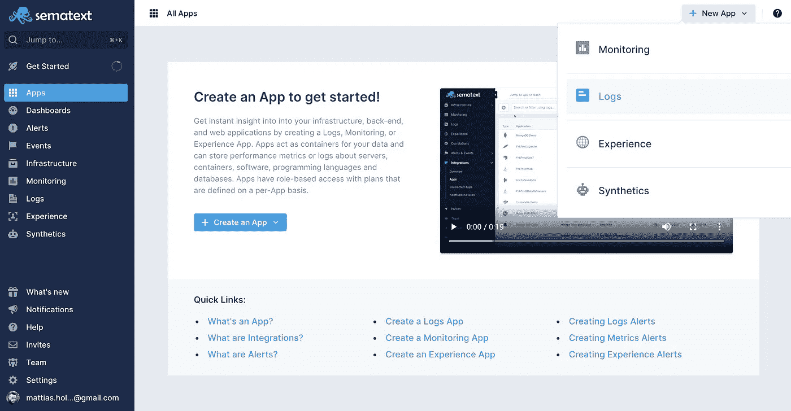
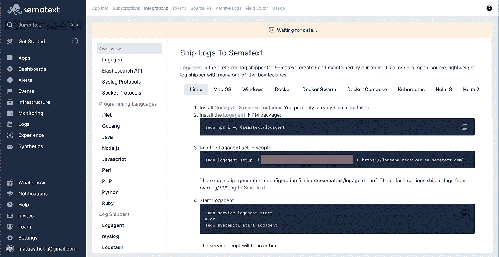

# 如何使用 Sematext 将日志添加到 Dropwizard 应用程序中

> 原文：<https://blog.devgenius.io/add-logging-to-your-dropwizard-application-using-sematext-d65f1cad6f48?source=collection_archive---------2----------------------->


[德索拉·兰若洛贡](https://unsplash.com/@desola?utm_source=medium&utm_medium=referral)在 [Unsplash](https://unsplash.com?utm_source=medium&utm_medium=referral) 拍摄的照片

我们从一开始就使用 Sematext 作为日志提供者，我们对此非常满意。他们还通过他们的 web 界面使用 Kibana 提供日志可视化。在这篇文章中，我们将看看如何将它与你的 Dropwizard 应用程序集成。

Sematext 的另一个好处是，他们在免费层提供了一个非常好的交易，所以初创公司可以使用它快速免费地开始。

这是我们将在本文中涉及的技术和产品的总结:

*   [Dropwizard](http://dropwizard.io/)
*   [语义文本](https://sematext.com/)
*   [美文](https://maven.apache.org/)
*   [码头工人](https://www.docker.com/)
*   [基巴纳](https://www.elastic.co/kibana)

# 什么是 Dropwizard？

Dropwizard 是一个非常好的构建基于 Java 的 web 服务的小框架。从某种意义上来说，它是固执己见的，因为它引入了许多非常适合构建微服务的库，比如 HTTP 的 Jetty、JSON 编组的 Jackson 和日志记录的 Logback/SLF4J。然而，它并没有给你的应用程序添加太多的框架，这意味着没有 Spring 应用程序或 Java EE 应用程序那么神奇。

我们喜欢 Dropwizard 如何平衡一组好的库，而又不太像一个框架。多年来，它一直是我们构建 Java 服务的默认选择。

# Dropwizard 的默认日志系统

默认情况下，Dropwizard 提供了人/机可读格式的组合。看起来是这样的:

```
WARN [ 2010-04-06 06:42:35,275] com.example.dw.Thing: Doing a thing ERROR [ 2010-04-06 06:42:35,275] com.example.dw.Thing: This may get ugly. ! java.lang.RuntimeException: oh noes! ! at com.example.dw.Thing.run(Thing.java:16) !
```

为了向 Sematext 等外部服务提供日志，我们需要修改输出目的地和格式。Dropwizard 支持通过改变`Configuration`类中的底层`LoggingFactory`来扩展它的日志系统。我们将实现我们自己的`LogbackAutoConfigLoggingFactory`,它将 Logback 的自动配置功能添加到 Dropwizard，这样我们就可以定制 Logback 配置，这样它将产生一种 Sematext 可以解释的格式，并通过 Syslog 转发日志。

# 创建 Sematext 日志记录应用程序

首先，你需要注册一个新的 Sematext 日志应用程序。他们提供一个免费层，所以去[https://sematext.com](https://sematext.com)，注册并创建一个新的应用程序。

您将获得一个应用程序令牌，我们将在下面的日志配置中使用它。



# 通过系统日志转发日志

在您的项目中创建以下类。当它被配置时，它将自动发现项目的`resources`文件夹中的日志配置文件，这样您就可以覆盖 Dropwizard 的默认设置。

```
public class LogbackAutoConfigLoggingFactory implements LoggingFactory {[@JsonIgnore](http://twitter.com/JsonIgnore)
  private LoggerContext loggerContext;[@JsonIgnore](http://twitter.com/JsonIgnore)
  private final ContextInitializer contextInitializer;public LogbackAutoConfigLoggingFactory() {
    this.loggerContext = LoggingUtil.getLoggerContext();
    this.contextInitializer = new ContextInitializer(loggerContext);
  }[@Override](http://twitter.com/Override)
  public void configure(MetricRegistry metricRegistry, String name) {
    try {
      contextInitializer.autoConfig();
    } catch (JoranException e) {
      throw new RuntimeException(e);
    }
  }[@Override](http://twitter.com/Override)
  public void stop() {
    loggerContext.stop();
  }[@Override](http://twitter.com/Override)
  public void reset() {
    loggerContext.reset();
  }}
```

现在，我们需要覆盖 Dropwizard 配置类中的`getLoggingFactory()`方法来使用我们的新类。

```
public class SematextDropwizardLoggingConfiguration extends Configuration {[@Override](http://twitter.com/Override)
  public LoggingFactory getLoggingFactory() {
    return new LogbackAutoConfigLoggingFactory();
  }}
```

接下来，向`src/main/resources`添加一个`logback.xml`文件，它包含以下内容。注意`{{TOKEN}}`,这是您将添加 Sematext 应用程序令牌的地方:

```
<?xml version="1.0" encoding="UTF-8"?>
<configuration><appender name="STDOUT" class="ch.qos.logback.core.ConsoleAppender">
    <encoder>
      <pattern>%date %level %logger %thread - %message%n</pattern>
    </encoder>
  </appender><appender name="SYSLOG" class="ch.qos.logback.classic.net.SyslogAppender">
    <syslogHost>logsene-syslog-receiver.eu.sematext.com</syslogHost>
    <port>514</port>
    <facility>LOCAL0</facility>
    <suffixPattern>{{TOKEN}}:[@cee](http://twitter.com/cee): {"thread":"%thread", "logger":"%logger",
      "message":"%message", "throwable":"%throwable"}
    </suffixPattern>
  </appender><root level="info">
    <appender-ref ref="SYSLOG"/>
    <appender-ref ref="STDOUT"/>
  </root></configuration>
```

**注意:**我们在上面的 Sematext 中使用`**eu.sematext.com**`表示欧洲地区。您需要对此进行修改，以便使用不同的区域。

# 测试集成

通过运行以下命令启动 Dropwizard 应用程序:

```
java -Duser.timezone=UTC -jar target/sematext-dropwizard-logging-1.0-SNAPSHOT.jar server config.yml
```

**注意:** `-Duser.timezone=UTC`将 Java 应用程序设置为以 UTC 作为时区运行，这样您将在 Sematext 中获得 UTC 格式的应用程序日志。

现在，我们使用 Sematext 为 Dropwizard 应用程序提供了全功能日志记录。

# 解决纷争

如果您在查找日志时遇到问题，请仔细检查以下内容:

*   您的`pom.xml`中的依赖项
*   时间戳。尽量不要在 Kibana/Sematext 中使用基于时间的过滤，并且

# 从 Docker 容器转发日志

如果您将应用程序部署为 Kubernetes 集群中的一个 [Docker](https://docker.io) 容器，Sematext 提供了一个[agent，安装在您的 as 集群中非常简单。如果您使用 Docker 代理来发送日志，它将转发从您的应用程序附加到控制台的日志。您可以直接将日志写入控制台，而不是将其发送到 Syslog，代理将获取这些日志并将其转发到 Sematext](https://github.com/sematext/sematext-agent-docker)

# 完整的代码示例

这种设置的完整项目示例可以在我们的 Github 帐户中找到:

*   [带语义日志记录的 Dropwizard 项目](https://github.com/serialized-io/sematext-dropwizard-example)

祝你伐木好运！

*最初发布于*[*https://serialized . io*](https://serialized.io/blog/logging-dropwizard-sematext/)*。*