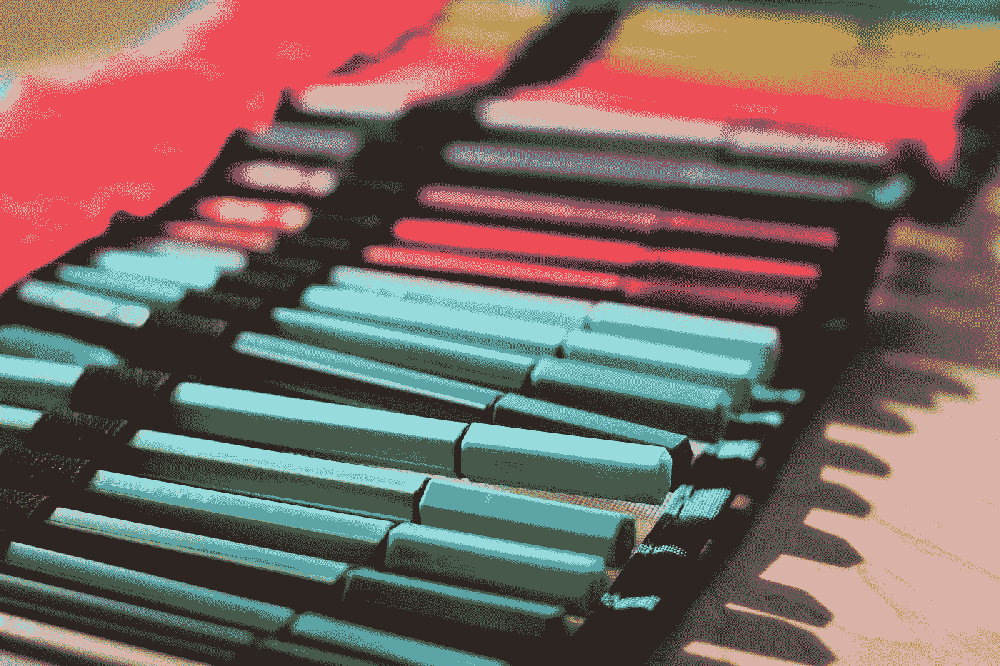

# 使用 Visx 库将标记图标添加到线条上

> 原文：<https://blog.devgenius.io/add-markers-onto-lines-with-the-visx-library-25ac00e55191?source=collection_archive---------5----------------------->



照片由 [Teo Zac](https://unsplash.com/@teo?utm_source=medium&utm_medium=referral) 在 [Unsplash](https://unsplash.com?utm_source=medium&utm_medium=referral) 上拍摄

Visx 是一个库，让我们可以轻松地将图形添加到 React 应用程序中。

在本文中，我们将了解如何使用它在 React 应用程序中添加带有标记的线条。

# 安装所需的软件包

我们必须安装一些模块。

首先，我们运行:

```
npm i @visx/curve @visx/glyph @visx/group @visx/mock-data @visx/responsive @visx/scale @visx/shape
```

安装软件包。

# 创建带标记的线条

我们可以用`@visx/glyph`模块添加标记来创建带有标记的线条。

为此，我们写道:

```
import React from "react";
import { Group } from "@visx/group";
import {
  Glyph as CustomGlyph,
  GlyphCircle,
  GlyphCross,
  GlyphDiamond,
  GlyphSquare,
  GlyphStar,
  GlyphTriangle,
  GlyphWye
} from "@visx/glyph";
import { LinePath } from "@visx/shape";
import genDateValue from "@visx/mock-data/lib/generators/genDateValue";
import { scaleTime, scaleLinear } from "@visx/scale";
import { curveMonotoneX, curveBasis } from "@visx/curve";const defaultMargin = { top: 10, right: 10, bottom: 10, left: 10 };export const primaryColor = "#8921e0";
export const secondaryColor = "#00f2ff";
const contrastColor = "#ffffff";const Glyphs = [
  GlyphCircle,
  GlyphCross,
  GlyphDiamond,
  GlyphStar,
  GlyphTriangle,
  GlyphSquare,
  GlyphWye,
  ({ left, top }) => (
    <CustomGlyph left={left} top={top}>
      <circle r={12} fill={secondaryColor} />
      <text fontSize={16} textAnchor="middle" dy="0.5em">
        {"💜"}
      </text>
    </CustomGlyph>
  )
];const data = genDateValue(Glyphs.length * 2);const date = (d) => d.date.valueOf();
const value = (d) => d.value;const xScale = scaleTime({
  domain: [Math.min(...data.map(date)), Math.max(...data.map(date))]
});
const yScale = scaleLinear({
  domain: [0, Math.max(...data.map(value))]
});const getX = (d) => xScale(date(d)) ?? 0;
const getY = (d) => yScale(value(d)) ?? 0;function Example({ width, height, margin = defaultMargin }) {
  if (width < 10) return null;
  const innerWidth = width - margin.left - margin.right;
  const innerHeight = height - margin.top - margin.bottom;
  xScale.range([0, innerWidth]);
  yScale.range([innerHeight, 0]);return (
    <svg width={width} height={height}>
      <rect
        x={0}
        y={0}
        width={width}
        height={height}
        fill={secondaryColor}
        rx={14}
      />
      <Group left={margin.left} top={margin.top}>
        <LinePath
          data={data}
          x={getX}
          y={getY}
          stroke={primaryColor}
          strokeWidth={2}
          strokeDasharray="2,2"
          curve={curveBasis}
        />
        <LinePath
          data={data}
          x={getX}
          y={getY}
          stroke={primaryColor}
          strokeWidth={2}
          curve={curveMonotoneX}
        />
        {data.map((d, i) => {
          const CurrGlyph = Glyphs[i % Glyphs.length];
          const left = getX(d);
          const top = getY(d);
          return (
            <g key={`line-glyph-${i}`}>
              <CurrGlyph
                left={left}
                top={top}
                size={110}
                stroke={secondaryColor}
                strokeWidth={10}
              />
              <CurrGlyph
                left={left}
                top={top}
                size={110}
                fill={i % 2 === 0 ? primaryColor : contrastColor}
                stroke={i % 2 === 0 ? contrastColor : primaryColor}
                strokeWidth={2}
              />
            </g>
          );
        })}
      </Group>
    </svg>
  );
}export default function App() {
  return (
    <div className="App">
      <Example width={500} height={300} />
    </div>
  );
}
```

我们用变量`defaultMargin`为图表添加边距。

`primaryColor`、`secondaryColor`有线条的颜色。

`contrastColor`有背景色的标记。

数组有图标和一个返回带有图标的自定义组件的函数。

`CustomGlyph`使用`left`和`top`属性来设置它的位置。

`data`有该行的数据。

`date`和`value`是返回给定条目的值的函数。

`xScale`具有 x 轴的刻度。

并且`yScale`具有 y 轴的刻度。

`Example`组件是我们将图表放在一起的地方。

我们用`innerWidth`和`innerHeight`变量设置图表的宽度和高度。

`Group`组件环绕图表的各个部分。

`LinePath`有线条为图形。

我们传入`getX`和`getY`函数来将数据渲染为线条。

第一个`LinePath`渲染一条虚线。

第二个渲染的是实线。

使用`data.map`回调函数渲染标记。

它返回`CurrGlyph`组件来呈现我们的标记。

我们设置`left`和`top`道具来设定位置。

`CurrGlyph`是从`Glyphs`数组中创建的，方法是让图标根据其索引进行渲染。

现在我们应该看到两条线，每一条都有标记。

# 结论

我们可以使用 Visx 库在 React 应用程序中轻松创建带标记的线条。