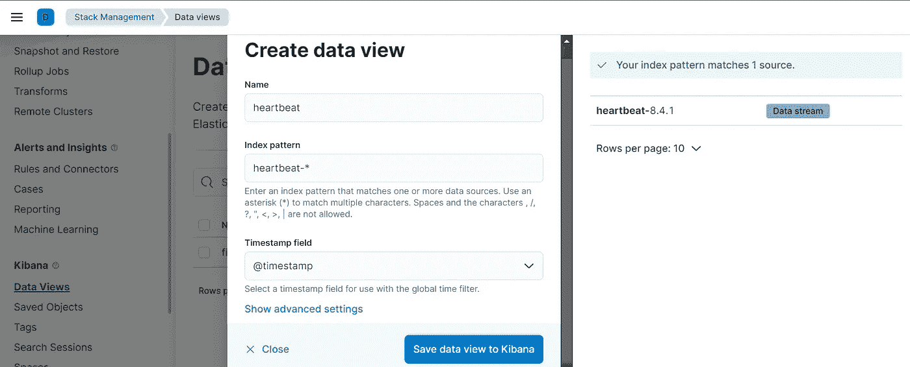

# 向心跳监视器添加地理信息，并创建热图仪表板

> 原文：<https://blog.devgenius.io/add-observer-metadata-processor-add-geo-information-to-heartbeat-monitors-and-create-a-heatmap-3436749341f4?source=collection_archive---------6----------------------->


[粘土银行](https://unsplash.com/@claybanks?utm_source=unsplash&utm_medium=referral&utm_content=creditCopyText)在 [Unsplash](https://unsplash.com/s/photos/heatmap?utm_source=unsplash&utm_medium=referral&utm_content=creditCopyText) 拍摄的照片

欢迎回到关于弹性堆栈的这个系列😊，今天我们将了解更多关于添加 Heartbeat 生成的事件的地理信息。

在我们开始之前，我推荐阅读这篇关于 Heartbeat 及其安装的文章，以便跟上讨论。我们将使用*处理器*来包含心跳生成事件的地理信息。

正如最近看到的，*处理器*提供了一种在边缘处理事件的简单方法，所以所有的处理都发生在 Heartbeat 将事件发送到配置的输出之前。这里我们将使用名为**的特定处理器添加观察者元数据**。让我们看看如何！

## 配置处理器

在[上一篇文章](/heartbeat-with-local-elasticsearch-and-kibana-69b99f7e23a6)中，我们修改了`heartbeat.yml`文件，以便从我们的 *hello-microservice* 中探测正常运行时间数据，该服务通过端口 *3001* 公开了一个 http 端点。我们现在需要确保包含上面提到的处理器。为此，我们添加了以下部分:

```
processors:
  - add_observer_metadata:
      cache.ttl: 5m
      geo:
        name: rabat-dc-01
        location: "33.9715904, -6.8498129"
        continent_name: Africa
        country_iso_code: MAR
        region_name: Rabat-Salé-Kénitra
        region_iso_code: MA-07
        city_name: Rabat
```

注意:你可以将你所有的心跳配置组合在一个`.yml`文件中，并在启动心跳时使用`-c`标志来使用这些配置。

虽然在本节中您可以配置许多处理器，但是在我们的例子中，只有一个处理器就够了。 *add_observer_metadata* 处理器需要两条信息:

*   第一个是关于 **cache.ttl** 或缓存到期时间，我们将把它设置为 *5m* 。
*   然后，我们必须指定 **geo** 参数或当前位置(*经纬度*，并为其输入一个名称。除了位置和名称，我们还可以选择指定其他参数，如*洲名*、*国家 iso 代码*、*地区名称*、*地区 iso 代码*或*城市名称*。填写完必填字段后，我们的处理器就配置好了，我们只需使用以下命令启动 Heartbeat:

```
./heartbeat -e
```

从这一点开始，Heartbeat 将开始探测微服务的正常运行时间信息。我们的处理器将在每次生成新事件时使用，它将修改事件以包含新信息，然后将其发送到指定的输出。

一旦我们的事件被发送到 Elasticsearch，我们就可以使用 Kibana 来检查一切是否正常。实际上，除了与我们的监视器相关联的位置之外，与先前获得的显示没有任何变化。单击最右侧的箭头，在我们的显示器上展开更多信息，或者只需单击显示器名称。


## 创建热图

现在我们已经有了我们的位置信息，让我们创建一个仪表板，显示一个包含这些信息的**热图**。为此，我们首先需要建立一个*索引模式*。在*管理部分*，打开*堆栈管理*，在 Kibana 部分下寻找*数据视图*。在这里，我们将创建一个新的*数据视图* ( *您可以为其选择一个名称*)和一个索引模式，该索引模式与包含来自 Heartbeat 的信息的已配置索引和别名相匹配。所以只需提供这个索引模式`heartbeat-*`，它将匹配所有现有的索引和别名，并从时间戳字段中选择 *@timestamp* 。



完成后，我们现在可以转到`Analytics > Visualize library`部分并创建一个新的仪表板。点击创建新的可视化，并将类型设置为**地图**。


随着地图的显示，继续点击*添加图层*按钮。从列表中选择*热图*，并选择我们之前配置的索引模式。在*群集*字段中，我们将选择选项 *observer.geo.location* 。Kibana 会自动更新地图并突出显示已写入的数据。只需添加图层并可视化热图，热图将显示监视器从微服务收集正常运行时间数据的确切位置。你可以放大来检查信息的准确性或获得更高的精确度。


一切似乎都正常😎！我们今天就说到这里，为了获得更多的细节，请随意查阅关于这个主题的官方文件。

感谢您的阅读，如果您对本文有任何问题或评论，请在下面留下您的评论。

我们下次再见，看更多的帖子🚀。

阿卜杜尔-巴吉