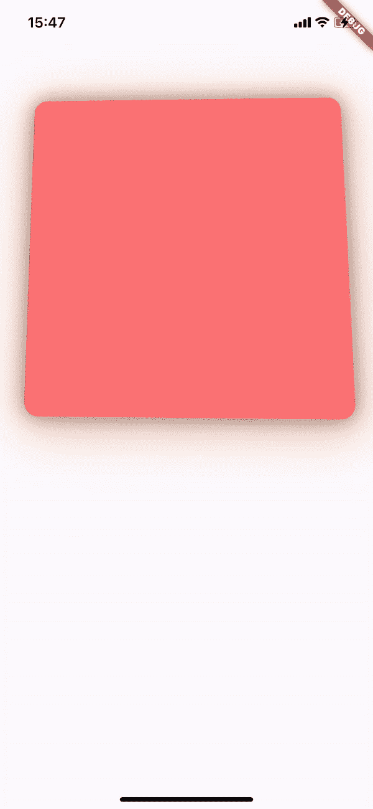

# 使用 VelocityX 和 Sensor Plus 将视差动画添加到您的 Flutter 应用程序

> 原文：<https://blog.devgenius.io/add-parallax-animation-to-your-flutter-app-using-velocityx-and-sensor-plus-c0a832e4e12f?source=collection_archive---------6----------------------->

## 了解在 Flutter 中使用补间动画的新方法

每个人都知道视差动画看起来很酷，真的很有趣，但不是每个人都知道将其实际应用到应用程序中有多困难。在这篇文章中，我将向你展示一个快速简单的方法，使用`TweenAnimationBuilder`小部件、transform 小部件和 2 个方便的包，将它添加到你的 Flutter 应用程序中。

 [## 使用 Flutter、VelocityX 和 Sensor_Plus 制作的视差效果

### 展示本文最终产品的快速视频

youtube.com](https://youtube.com/shorts/jOK9zFSLhzU?feature=share) 

## 首先，我们需要什么来实现这个目标:

1.  颤动(当然)
2.  VelocityX 颤振包(不是强制性的，但帮助很大)
3.  传感器+颤振组件(非常重要)
4.  最后但并非最不重要的一点是在 Flutter 中使用构建器小部件的知识

 [## TweenAnimationBuilder 类-小部件库- Dart API

### 小部件生成器，每当目标值改变时，它将小部件的属性动画化为目标值。的类型

api.flutter.dev](https://api.flutter.dev/flutter/widgets/TweenAnimationBuilder-class.html) 

# 我们开始吧

好吧！现在您已经浏览了 TweenAnimationBuilder 文档，应该对它有了基本的了解。我鼓励您快速阅读 Sensor_Plus 软件包文档和 VelocityX 文档，因为它们将来会对您有所帮助。

为了开始这样做，请确保您已经有一个想要添加的 Flutter 应用程序，或者只需在您的终端中运行`flutter create app-name`。

首先你需要打开`pubspec.yaml`文件，安装我之前提到的包(velocityx 和 sensor_plus)。

完成后，你要做的第二件事是进入你的`app-name/lib`目录并打开 main.dart。在这里你会看到许多生成的代码，你可以暂时不要它，只需创建另一个。`app-name/lib`中的 dart 文件，它将包含视差动画小部件。您可以随意命名该文件。

# 现在让我们开始编码

一旦您在代码编辑器中打开这个文件，您就可以继续创建有状态小部件，或者使用附带 Flutter VSCode 扩展的`stfl` —有状态小部件生成器代码片段。你应该有这样的东西

好了，现在你已经生成了一个基本的有状态小部件，是时候修改一些东西了。首先让我们将`TickerProviderStateMixin`添加到`_MyWidgetState`类中。

有了它，你就可以随心所欲地制作每秒 60 帧的动画了。并尽力阅读代码中的注释，因为代码在注释中的解释要比在文章中多得多。

## 把价值排除在外

这里，我们将定义变量来保存我们将从 Sensor_Plus 包接收的角度值。

花点时间看看评论

好的，正如注释中已经解释的那样，带有角度的值用于存储我们将从`accelerometerEvents.listen`方法接收的数据。另一方面,`streamsub`值将被用作流订阅的数组。这里的 StreamSubscription 类用于正确键入数组，让 flutter 知道这是 StreamSubscription 对象的数组。每当你在流上使用`.listen`方法时，返回的对象是一个`StreamSubscription`对象。更多关于 StreamSubscription 如下。

 [## StreamSubscription 类- dart:异步库- Dart API

### dart:async 库中 StreamSubscription 类的 API 文档，用于 dart 编程语言。

api.flutter.dev](https://api.flutter.dev/flutter/dart-async/StreamSubscription-class.html) 

我们让`build`函数返回一个`Column`小部件，因为如果没有返回任何东西，就会出现错误。

现在让我们调用`void initState`和`void dispose`，这样我们就可以初始化我们的`accelerometerEvents.listen`。我们还将在`.listen()`回调函数中改变 xAngle、prevXAngle、杨乐、prevYAngle、zAngle 和 prevZAngle 变量的状态。我们走吧👇

我们利用`initState`和`dispose`函数来分别订阅和取消订阅流。

注意，在`streamsub.add`方法中，我们将`accelerometerEvents.listen()`添加到我们的流订阅数组中。在 listen 方法中，我们有一个函数，它给出了加速度计事件的实时值。事件对象有 3 个值:x、y 和 z。请确保在设置角度值的新状态之前设置了先前角度值的状态，这对接下来的操作非常重要。

## 动画时间到了

现在这些值正在实时更新，我们可以开始使用名为`**TweenAnimationBuilder**` 的 flutter 小部件来使用它们。我们将使用我们之前添加的`Column`小部件，当然你可以使用任何你想要的容器小部件，但是我使用`Column`以防我想在小部件后添加任何东西。好吧，让我们开始吧

注意小部件旁边的注释

在上面的代码片段中，我们使用了 2 个`TweenAnimationBuilder`小部件。这是因为我们将为 2 个轴的值制作动画，首先是 X 轴，然后是 y 轴。我们将通过`Transform`小部件来实现这一点。你可能想知道为什么我们要使用 zAngle 值，如果我们要制作 Y 轴的动画。这是因为你在 3D 空间移动设备的方式，利用 zAngle 可以产生最好的效果。正如您稍后将看到的，被解析为`rotateX`和`rotateY` `Matrix4.indentity()`方法的值看起来有点不匹配。好了，现在让我们来看看实际使用的值

*(星号)注释将在下面解释

*   *1.这里我们传入了由`TweenAnimationBuilder`提供的动画`zValue`的负片。你可能会问为什么是负的，就像我之前说的，这是因为你在 3D 空间移动设备的方式。In 以一种更理想的方式翻译，就好像我们要使用正的`zValue`或生成一个 yValue。
*   *2.在这里我们通过了`xValue`。是的，不是负面的，只是正面的`xValue`。

我相信你有兴趣知道为什么这些值要除以 10。这是因为如果它们不除以 10，视差运动将是太多的事件，如果设备稍微转动。

*   *3.我们在这里使用了`xValue`和`zValue`，并将它们乘以 8，以便为视差卡获得更好的阴影效果。

这样我们就完成了视差动画，现在我们可以在我们的应用程序中看到它。我们需要做的就是将这个小部件作为一个小部件添加到我们的`main.dart`文件中。像这样

要让你的`main.dart`文件看起来像这样，只要确保去掉你之前生成应用程序时附带的所有样板文件。将`NameOfParallaxWidget()`替换成你自己命名的视差小部件。

# 结论

现在，当你运行你的 flutter 应用程序时，你应该有这样的东西

这就是你的视差动画。您可以将这种方法应用到任何您想要制作动画的小部件上，只需将`VxBox`小部件更改为您想要制作动画的另一个小部件。你甚至可以在文本上使用它，但是最好是在文本容器上使用它😅。

这是我的回购的链接

 [## 主 michaelessiet/flutter-test/parallaxnft _ widget . dart

### 此文件包含双向 Unicode 文本，其解释或编译可能与下面显示的不同…

github.com](https://github.com/michaelessiet/flutter-test/blob/master/lib/widgets/parallaxnft_widget.dart) 

希望这篇文章能帮到你。如果是的话，为什么不留下掌声呢👏和分享😁。

如果您想添加到回购中，请随意留下一个 PR 或 fork 并进行试验。如果我做错了什么，不要不好意思在评论中告诉我。我一直在寻找改进的方法。

感谢阅读❤️有一个伟大的时间玩忽职守。

 [## 使用 Flutter 拉动以刷新或搜索

### 嗨，伙计们，这篇文章将讲述如何使用 Flutter，VelocityX 和 Simple……

devshogun.medium.com](https://devshogun.medium.com/pull-to-refresh-or-search-using-flutter-e06e57b3b5e2) 

## 看看我的其他一些文章👆