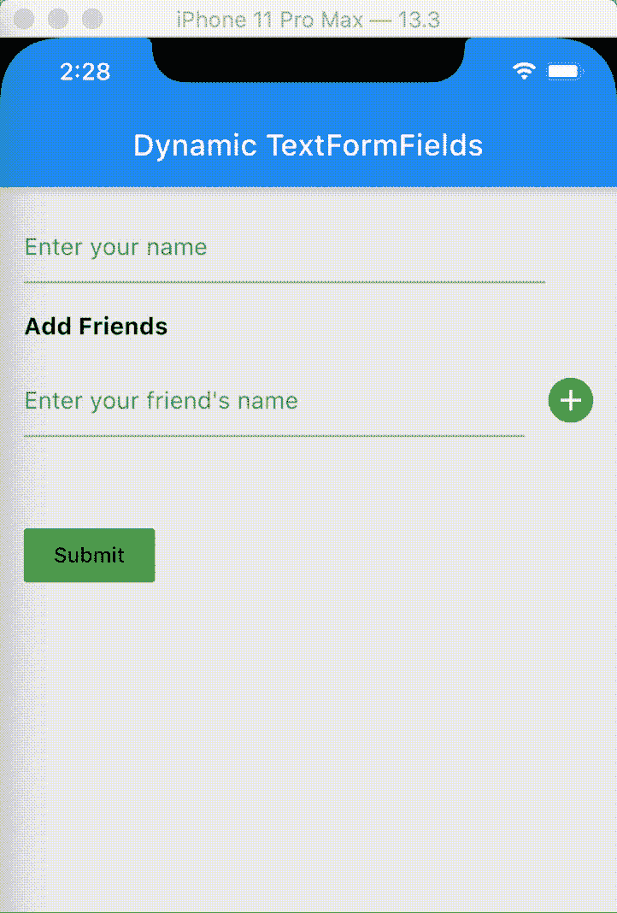

# 在 Flutter 中动态添加和删除文本表单域

> 原文：<https://blog.devgenius.io/add-remove-textformfields-dynamically-in-flutter-5bef6948e778?source=collection_archive---------0----------------------->

对了，你的 flutter 表单需要动态添加和删除 TextFormFields 吗？启动时你将初始化多少个文本编辑控制器？当字段被移除时，您将如何正确处理这些控制器？

本文将帮助您解决这些问题。



> 在这里，我来透露一下节省你时间的秘诀:-)。所有动态添加的文本字段本身将是一个有状态的小部件。

如果你愿意，现在可以跳过这篇文章。

还在吗？想看看我是怎么做到的吗？谢谢！

> 好，先立个项目。
> 
> 我们的表格将有一个文本字段输入我们的名字，有/有文本字段输入我们的朋友的名字，可以动态添加和删除。

1.  为我们的表单创建一个有状态的小部件类。

```
class MyForm extends StatefulWidget {
  @override
  MyFormState createState() => MyFormState();
}class MyFormState extends State<MyForm> {
  @override
  Widget build(BuildContext context) {
    return Scaffold(
      backgroundColor: Colors.grey[200],
      appBar: AppBar(title: Text('Dynamic TextFormFields'),),
      body: Container(),
    );
  }
}
```

2.添加一个带有文本字段的表单，以输入我们在该班级中的姓名。

```
class MyFormState extends State<MyForm> { final _formKey = GlobalKey<FormState>();
  TextEditingController _nameController; @override
  void initState() {
    super.initState();
    _nameController = TextEditingController();   
  } @override 
  void dispose() {
    _nameController.dispose(); 
    super.dispose();
  } @override
  Widget build(BuildContext context) {
    return Scaffold(
      backgroundColor: Colors.grey[200],
      appBar: AppBar(title: Text('Dynamic TextFormFields'),),
      body: Form(
        key: _formKey,
        child: Padding(
          padding: const EdgeInsets.all(16.0),
          child: Column(
            crossAxisAlignment: CrossAxisAlignment.start,
            children: [
              *// name textfield*
              Padding(
                padding: const EdgeInsets.only(right: 32.0),
                child: TextFormField(
                  controller: _nameController,
                  decoration: InputDecoration(
                    hintText: 'Enter your name'
                  ),
                  validator: (v){
                    if(v.trim().isEmpty){
                      return 'Please enter something';
                    }
                    return null;
                  },
                ),
              ),
              SizedBox(height: 20,),
              Text('Add Friends', 
                style: TextStyle(
                  fontWeight: FontWeight.w700,  
                  fontSize: 16,
                ),
              ),
           ],
         ),
       ),
     ),
   );
}
```

3.创建一个列表，该列表将告诉显示多少个动态文本字段，并将存储每个文本字段数据。

```
static List<String> friendsList = [null];
```

> friendsList 已经用一个空值列表初始化，因为我们每次至少需要显示一个朋友文本字段。

3.为动态文本字段创建一个有状态小部件类。

> 并传递为其创建文本字段的朋友列表索引，以便它可以在该索引处保存数据，并且我们可以在将来使用这些数据。

```
class FriendTextFields extends StatefulWidget { final int index;
  FriendTextFields(this.index); @override
  _FriendTextFieldsState createState() => _FriendTextFieldsState();
}class _FriendTextFieldsState extends State<FriendTextFields> { TextEditingController _nameController; @override
  void initState() {
    super.initState();
    _nameController = TextEditingController();
  } @override
  void dispose() {
    _nameController.dispose();
    super.dispose();
  } @override
  Widget build(BuildContext context) { WidgetsBinding.instance.addPostFrameCallback((timeStamp) {
      _nameController.text = _MyFormState.friendsList[widget.index]   
        ?? '';
    }); return TextFormField(
      controller: _nameController, ***// save text field data in friends list at index 
      // whenever text field value changes***
      onChanged: (v) => _MyFormState.friendsList[widget.index] = v,
      decoration: InputDecoration(
        hintText: 'Enter your friend\'s name'
      ),
      validator: (v){
        if(v.trim().isEmpty) return 'Please enter something';
        return null;
      },
    );
  }
}
```

> 现在我们必须将这些动态文本字段添加到主表单中。

5.在 MyFormState 中创建一个方法，该方法将根据 friendsList 的长度生成朋友文本字段的列表。

```
List<Widget> _getFriends(){
  List<Widget> friendsTextFieldsList = [];
  for(int i=0; i<friendsList.length; i++){
    friendsTextFieldsList.add(
      Padding(
        padding: const EdgeInsets.symmetric(vertical: 16.0),
        child: Row(
          children: [
             Expanded(child: FriendTextFields(i)),
             SizedBox(width: 16,),
             ***// we need add button at last friends row only***
             _addRemoveButton(i == friendsList.length-1, i),
          ],
        ),
      )
    );
  }
  return friendsTextFieldsList;
}
```

> 朋友文本字段的最后一行将有添加按钮，其余的所有行将有删除按钮。

6.创建一个方法来提供添加和删除按钮部件，该部件被添加到上面每个朋友文本字段的行中。

```
Widget _addRemoveButton(bool add, int index){
  return InkWell(
    onTap: (){
      if(add){
        ***// add new text-fields at the top of all friends textfields***
        friendsList.insert(0, null);
      }
      else friendsList.removeAt(index);
      setState((){});
    },
    child: Container(
      width: 30,
      height: 30,
      decoration: BoxDecoration(
        color: (add) ? Colors.green : Colors.red,
        borderRadius: BorderRadius.circular(20),
      ),
      child: Icon(
        (add) ? Icons.add : Icons.remove, color: Colors.white,
      ),
    ),
  );
}
```

> 我们通过在 friends 列表中的索引 0 处插入一个空值，在所有现有的 friends 文本字段行之上添加一个新行。

7.现在将朋友文本字段列表添加到表单列中。

```
Form(
  key: _formKey,
  child: Padding(
    padding: const EdgeInsets.all(16.0),
    child: Column(
      crossAxisAlignment: CrossAxisAlignment.start,
        children: [ 
          // name textfield
          Padding(
            padding: const EdgeInsets.only(right: 32.0),
            child: TextFormField( 
              controller: _nameController,
              decoration: InputDecoration(
                hintText: 'Enter your name'
              ),
              validator: (v){
                if(v.trim().isEmpty){
                  return 'Please enter something';
                }
                return null;
              },
            ),
          ),
          SizedBox(height: 20,),
          Text('Add Friends', style: TextStyle(
            fontWeight: FontWeight.w700, fontSize: 16),),
          **..._getFriends(),**
          SizedBox(height: 40,),
          FlatButton(
            onPressed: (){
              if(_formKey.currentState.validate()){
                _formKey.currentState.save();
              }
          },
          child: Text('Submit'),
          color: Colors.green,
        ),
      ],
    ),
  ),
),
```

就是这样！现在，您可以在 flutter 中使用动态文本表单字段了。

## 从[这里](https://gist.github.com/Hitesh822/086267e8b394aa1049cfbbfa95bac133)获得完整的代码片段。

请在评论区分享你的想法。有不同的解决方案很好:-)