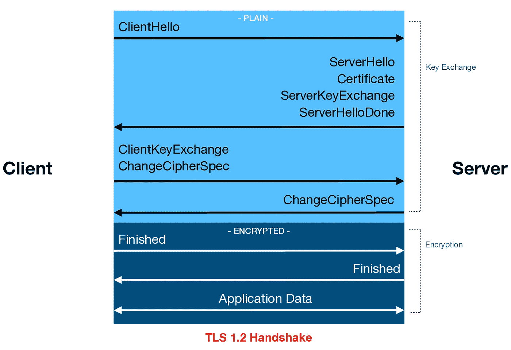
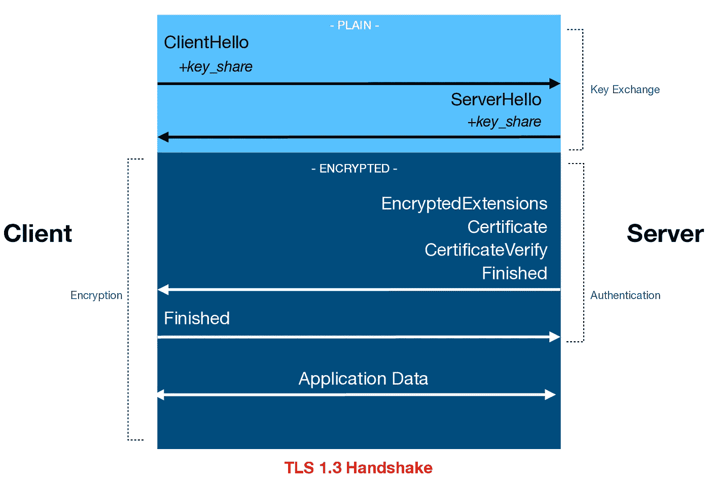
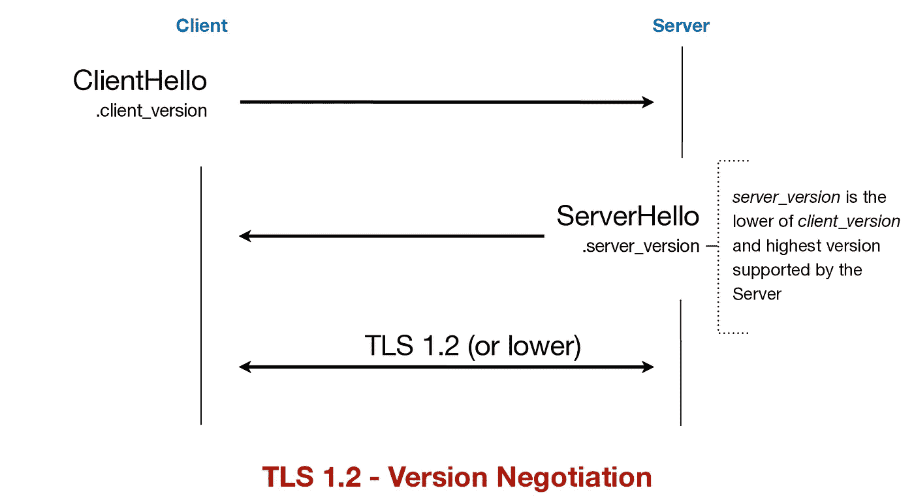
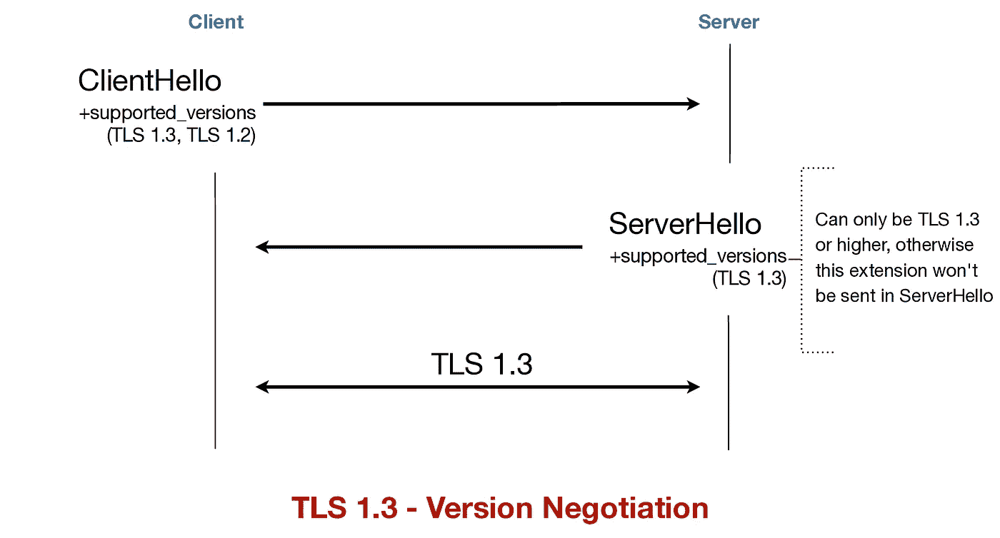
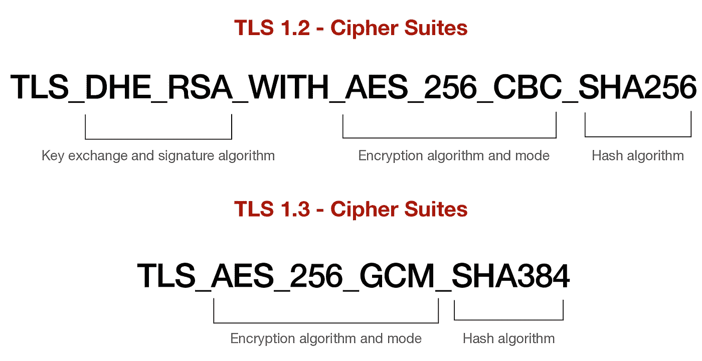
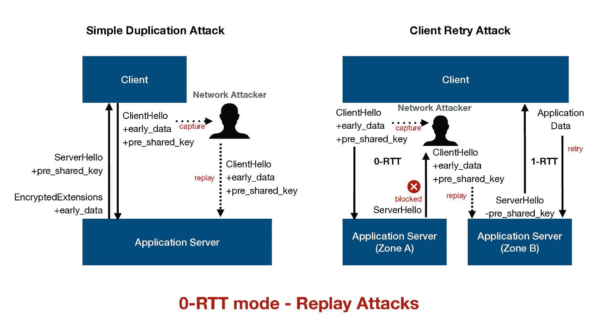

# TLS 1.3 中增加了安全措施和变化

> 原文：<https://blog.devgenius.io/added-security-measures-and-changes-in-tls-1-3-fd93bbfecb8f?source=collection_archive---------0----------------------->

## [第 0 根安全网络(0SNET)](https://www.0snet.com/)

## 看看 TLS 协议的新版本以及对其前身的更新

由[paweczerwi ski](https://unsplash.com/@pawel_czerwinski?utm_source=medium&utm_medium=referral)在 [Unsplash](https://unsplash.com?utm_source=medium&utm_medium=referral) 上拍摄的照片

当一个新版本的软件发布时，它可能是为了修补安全漏洞，修正错误，提供新的功能和增强。类似地，每隔几年就会发布新的协议版本。这些较新的版本在很大程度上保留了相同的目标，但加入了新的要求和挑战。

一些协议，如 **SMTP** 甚至没有版本，可能永远不会有更新的版本，而 **TLS —传输层安全**协议将永远有。在 **TLS** 协议中保持了可用性、兼容性和安全性的良好平衡。并且，随着技术的成熟，提供了额外的安全保证，例如前向保密，并且旧的加密算法被废弃或者它们的弱点被解决。

**TLS 1.3** 的变化是显著的。这个新版本修改了建立加密参数的握手序列，更新了版本协商机制，加密了所有消息(除了前两条)，并提供了新的零往返时间( **0-RTT** )模式，以降低延迟，但代价是安全性。

> **0-RTT** 要求服务器维护状态，在没有状态的情况下，范围需要被限制到幂等应用

# 信号交换协议

在握手过程中，客户端和服务器相互验证身份，协商协议版本，并生成加密密钥。在 **TLS 1.2** 中，这一切都很清楚，即。，人们可以对网络上的数据包进行解码和解析，以查看整个 TLS 握手过程。

这仍然是安全的，并且保持了应用数据的机密性，因为一旦握手完成，它们总是被加密发送。但是，作为握手一部分的应用程序细节没有加密。这包括 TLS 证书中的 **commonName** 、 **subjectAltName** 字段、 *server_name* extension 中的域名等。

在 **TLS 1.3** 中，不再是这种情况。该协议的新版本引入了两个新的加密通道，它们可以交错使用。一个是在握手期间发送早期应用数据(下面在 **0-RTT** 模式中解释),另一个是加密握手消息。

除了 **ClientHello** 和 **ServerHello** 消息外， **TLS 1.3** 中的所有内容都是加密的。

# 向后兼容性

TLS 兼容服务器有一个协商机制，可以与不支持较新版本的客户端一起使用较旧版本的 TLS。这种机制以前非常简单，客户端公布它支持的最高 TLS 版本，服务器根据它可以支持的内容选择 TLS 版本。

**TLS 1.3** 通过扩展 *supported_versions* 引入了新的机制，在 **ClientHello** 消息中包含了客户端支持的版本列表，以及服务器在 **ServerHello** 消息中选择的 TLS 版本。缺少此扩展表示 **TLS 1.2** 或更低。

在 **TLS 1.3** 中增加了一个额外的降级保护机制，也建议用于旧版本，以防止版本降级攻击。

## 更改密码规格

关于 *change_cipher_spec* 消息的注释。这些消息在 **TLS 1.3** 中的握手中不起作用，但是在握手期间仍然可能存在，只是被客户端和服务器忽略。它们只是为了[中间盒兼容性](https://tools.ietf.org/html/rfc8446#appendix-D.4)而存在。

# 密码套件

密码组表示在 TLS 会话建立过程中使用的一组特定的加密算法。在以前的 TLS 版本中，密码套件将包括密钥交换、加密和 mac 算法，如[TLS _ DHE _ RSA _ WITH _ AES _ 256 _ CBC _ sha 256](https://tools.ietf.org/html/rfc5246#appendix-A.5)。

**TLS 1.3** 将密钥交换算法与[密码套件](https://tools.ietf.org/html/rfc8446#appendix-B.4)分离。因此，例如，当您在浏览器中检查所使用的密码套件时，如果您没有看到公钥算法，请不要感到惊讶。密钥交换算法通过 TLS 扩展 [*supported_groups*](https://tools.ietf.org/html/rfc8446#section-4.2.7) 和[*signature _ algorithms*](https://tools.ietf.org/html/rfc8446#section-4.2.3)单独协商。

# 0-RTT 模式-零往返时间

顾名思义， **TLS 1.3** 允许客户端立即发送数据，无需等待服务器的响应。这减少了应用程序中的延迟，但要求服务器在早期会话中通过 **NewSessionTicket** 消息向客户端发送预共享密钥。

从预共享密钥中导出的[早期秘密](https://tools.ietf.org/html/rfc8446#page-93)用于加密紧随 **ClientHello** 之后发送的应用数据。 **ClientHello** 中出现的扩展 *early_data* 是服务器切换到 **0-RTT** 模式的指示。

没有预共享密钥和对 [*early_data*](https://tools.ietf.org/html/rfc8446#section-4.2.10) 扩展的支持， **0-RTT** 模式是不可能的。此外，为了避免重放攻击， **0-RTT** 要求服务器[维护状态](https://tools.ietf.org/html/rfc8446#section-8)，否则需要将范围限制在[幂等应用](https://tools.ietf.org/html/rfc8446#appendix-E.5)。

> 第二类攻击无法在 TLS 层阻止，必须由任何应用程序来处理。请注意，其客户端实现任何类型的重试行为的任何应用程序都已经需要实现某种类型的防重放防御。

除非客户端和服务器实现的 **0-RTT** 模式可以确保一个密钥只使用[一次](https://tools.ietf.org/html/rfc8446#section-8.1)，应用层将需要决定服务器接受 **0-RTT** 数据是否安全。在许多情况下，处理 **0-RTT** 数据可能是安全的，例如通过 **HTTPS** 提供静态内容。

# 将来的

较新版本的 TLS 比以前的版本提供了更好的安全性。它几乎完全加密了握手，提供了前向保密，并抛弃了许多旧的/不安全的算法。虽然这对个人来说很好，但组织可能会发现使用这一新版本很难审计加密的 TLS 流量。

最初的 **TLS 1.2** 协议于 2008 年 3 月获得批准。它多年来不断更新，经受住了时间的考验。因此，没有理由认为它会很快消失。不过， **TLS 1.3** 是未来。

# 参考资料:

1.  **TLS 1.2** ，[https://tools.ietf.org/html/rfc5246](https://tools.ietf.org/html/rfc5246)
2.  **TLS 1.3** ，[https://tools.ietf.org/html/rfc8446](https://tools.ietf.org/html/rfc8446)

*在第 0 根，我们提供解决方案* [*第 0 根安全网络— 0SNet*](https://www.0snet.com/) *使用 TLS 客户端证书保护组织的内部 web 应用。看看我们的产品吧，它很容易部署，可以在*[*AWS*](https://0snet.info/#install.aws)*[*GCP*](https://0snet.info/#install.gcp)*和*[*Azure*](https://0snet.info/#install.azu)*上找到。**