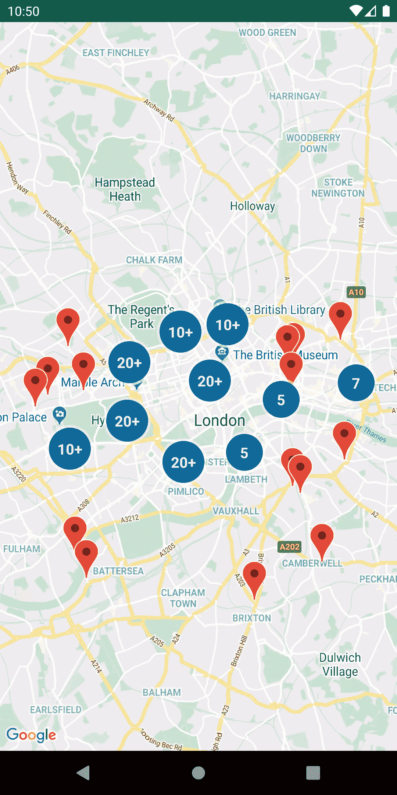

# 使用 Kotlin 将 Google 地图添加到您的 Android 项目

> 原文：<https://blog.devgenius.io/adding-a-google-map-to-your-android-project-using-kotlin-62bf44e629b4?source=collection_archive---------3----------------------->


来源:谷歌

1.  注册一个谷歌地图 API 密钥。此密钥用于验证您的应用程序并跟踪 Google Maps API 的使用情况。您可以按照以下链接中的说明获取 Google Maps API 密钥:

[](https://developers.google.com/maps/documentation/android-sdk/signup) [## 使用 API 键 Android 地图| Google 开发者

### 本主题介绍如何为 Android 版地图 SDK 创建 API 密钥，将其添加到您的应用程序，并通过以下方式保护应用程序

developers.google.com](https://developers.google.com/maps/documentation/android-sdk/signup) 

2.安装 Google Play 服务 SDK。Google Play 服务 SDK 包括 Google Maps Android API，您需要使用它才能在应用程序中使用地图。您可以使用 Android Studio 中的 SDK 管理器安装 Google Play 服务 SDK。

3.将谷歌地图 Android API 添加到您的项目中。为此，在 Android Studio 中打开“项目”面板，然后点击“添加模块”按钮。在出现的窗口中，选择“谷歌地图 Android API”选项，然后单击“安装”。

4.将 Google Maps Android API 密钥添加到您的项目中。一旦您获得了 Google Maps API 密钥，您需要将它添加到您的项目中。为此，在 Android Studio 中打开“项目”面板，然后点击“Gradle”按钮。在“项目”窗格中，展开“Gradle Scripts”文件夹，然后打开“build.gradle (Module: app)”文件。在此文件中，将以下行添加到 defaultConfig 部分:

```
defaultConfig {
    ...
    manifestPlaceholders = [google_maps_api_key: "YOUR_API_KEY_HERE"]
}
```

5.添加 Google Maps Android API 作为依赖项。要在您的项目中使用 Google Maps Android API，您需要将其添加为一个依赖项。为此，在 Android Studio 中打开“项目”面板，然后点击“Gradle”按钮。在“项目”窗格中，展开“Gradle Scripts”文件夹，然后打开“build.gradle (Module: app)”文件。在该文件中，将下面一行添加到 dependencies 部分:

```
dependencies {
    ...
    implementation 'com.google.android.gms:play-services-maps:17.0.0'
}
```

6.将 MapView 添加到布局中。要在应用程序中显示 Google 地图，您需要在布局中添加一个 MapView。为此，打开要显示地图的活动或片段的布局文件，然后添加以下元素:

```
<com.google.android.gms.maps.MapView
    android:id="@+id/map_view"
    android:layout_width="match_parent"
    android:layout_height="match_parent" />
```

7.初始化 MapView 并显示地图。在您想要显示地图的活动或片段中，您需要初始化 MapView 并显示地图。为此，您需要执行以下操作:

*   通过调用`findViewById`获得对 MapView 的引用。
*   在 MapView 上调用`getMapAsync`方法，传递一个回调函数，当地图准备好可以使用时，这个回调函数将被调用。
*   在回调中，获取对`GoogleMap`对象的引用，并使用它来配置和显示地图。

下面是如何在片段中实现这一点的示例:

```
class MapFragment : Fragment {

    private lateinit var mapView: MapView
    private lateinit var googleMap: GoogleMap

    override fun onCreateView(inflater: LayoutInflater, container: ViewGroup?, savedInstanceState: Bundle?): View? {
        // Inflate the layout for this fragment
        val view = inflater.inflate(R.layout.fragment_map, container, false)

        // Get a reference to the MapView
        mapView = view.findViewById(R.id.map_view)

        // Initialize the MapView and display the map
        mapView.onCreate(savedInstanceState)
        mapView.getMapAsync { googleMap ->
            // Save a reference to the GoogleMap
            this.googleMap = googleMap

            // Configure and display the map
            val latLng = LatLng(37.4219999, -122.0862462)
            val cameraUpdate = CameraUpdateFactory.newLatLngZoom(latLng, 10f)
            googleMap.moveCamera(cameraUpdate)
        }

        return view
    }

    override fun onResume() {
        super.onResume()
        mapView.onResume()
    }

    override fun onPause() {
        super.onPause()
        mapView.onPause()
    }

    override fun onDestroy() {
        super.onDestroy()
        mapView.onDestroy()
    }

    override fun onLowMemory() {
        super.onLowMemory()
        mapView.onLowMemory()
    }
}
```

此代码创建了一个显示 MapView 的片段，初始化 MapView 并在地图准备就绪时显示地图，并处理 MapView 必要的生命周期事件。

然后，您可以使用`GoogleMap`对象定制地图并与之交互，比如添加标记、绘制形状和处理用户手势。您可以在 Google Maps Android API 文档中找到有关可用选项的更多信息:

[](https://developers.google.com/maps/documentation/android-sdk/intro) [## Android 版地图 SDK 概述|谷歌开发者

### 使用 Android 版地图 SDK，使用谷歌地图数据、地图等将地图添加到您的 Android 应用程序，包括 Wear OS 应用程序

developers.google.com](https://developers.google.com/maps/documentation/android-sdk/intro) 

地图标记是放置在地图上特定位置的图标。它们用于识别和标记兴趣点，如地标、企业或其他位置。



来源:谷歌

在 Google Maps Android API 中，地图标记由`Marker`类表示。您可以通过在一个`GoogleMap`对象上调用`addMarker`方法并传入一个指定标记位置、外观和其他选项的`MarkerOptions`对象来创建一个标记。

以下是如何在 Kotlin 中向地图添加标记的示例:

```
val latLng = LatLng(37.4219999, -122.0862462)
val markerOptions = MarkerOptions()
    .position(latLng)
    .title("My Marker")
    .snippet("This is my marker")
val marker = googleMap.addMarker(markerOptions)
```

这段代码在指定位置创建一个标记，当单击该标记时，将显示该标记的标题和代码片段。

您也可以通过设置标记图标、颜色和锚点等选项来自定义标记的外观。您可以在`MarkerOptions`类文档中找到关于可用选项的更多信息:

[](https://developers.google.com/android/reference/com/google/android/gms/maps/model/MarkerOptions) [## MarkerOptions | Google Play 服务| Google 开发者

### 编辑描述

developers.google.com](https://developers.google.com/android/reference/com/google/android/gms/maps/model/MarkerOptions) 

要在 Google Maps Android API 中处理地图上的用户手势，可以使用`GoogleMap`对象的`setOnMapClickListener`、`setOnMapLongClickListener`和`setOnMarkerClickListener`方法。

以下是在 Kotlin 中如何使用这些方法处理地图单击和标记单击的示例:

```
googleMap.setOnMapClickListener { latLng ->
    // Handle map click
}

googleMap.setOnMapLongClickListener { latLng ->
    // Handle map long click
}

googleMap.setOnMarkerClickListener { marker ->
    // Handle marker click
    true
}
```

`setOnMapClickListener`和`setOnMapLongClickListener`方法接受一个 lambda 函数，当用户在地图上单击或长时间单击时调用该函数。lambda 函数被传递一个代表点击位置的`LatLng`对象。

`setOnMarkerClickListener`方法接受一个 lambda 函数，当用户点击一个标记时调用这个函数。lambda 函数被传递一个代表被点击的标记的`Marker`对象。该函数应返回一个布尔值，指示是否应抑制默认的标记单击行为。

您可以在 Google Maps Android API 文档中找到有关这些方法和其他手势的更多信息:

[](https://developers.google.com/maps/documentation/android-sdk/events) [## 活动 Android 地图| Google 开发者

### 使用 Android 版的 Maps SDK，你可以收听地图上的事件。GitHub 上的 ApiDemos 库包含示例…

developers.google.com](https://developers.google.com/maps/documentation/android-sdk/events) 

谢谢大家！