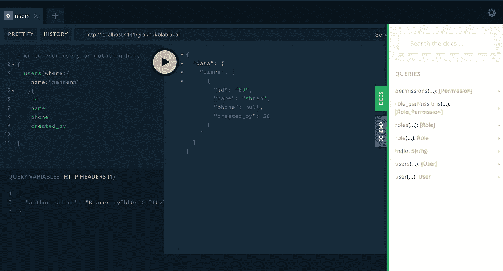
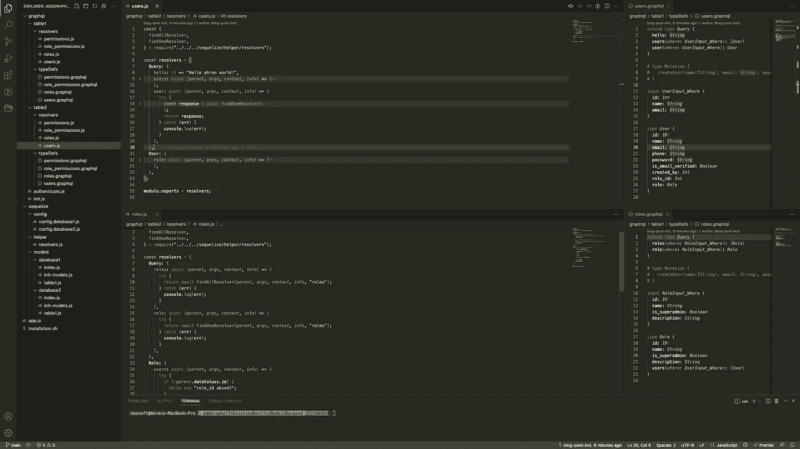
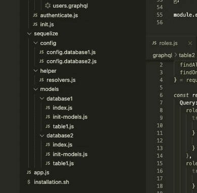
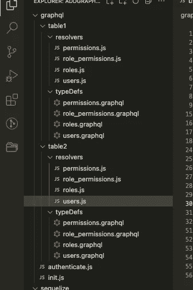
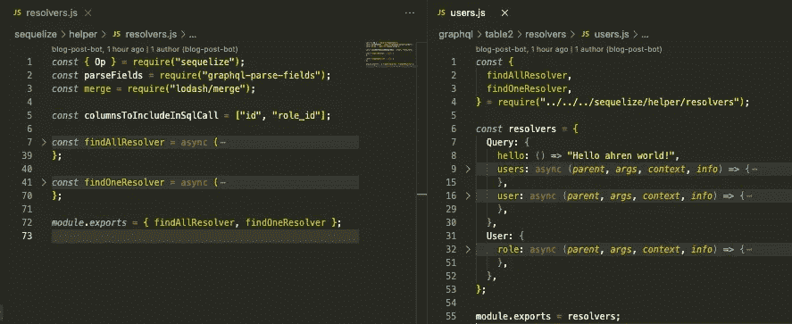
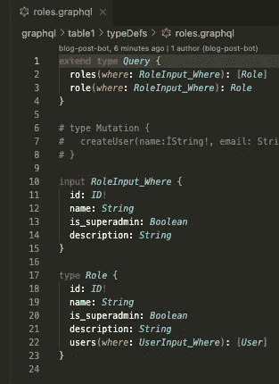
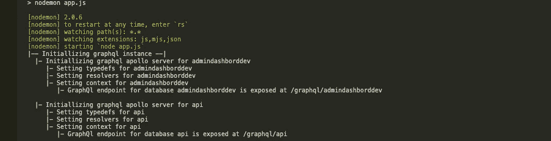
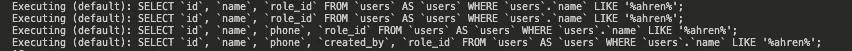
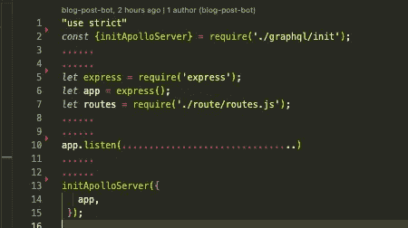

# 将 Graphql 终结点添加到现有 RESTful 节点 Js [express]具有多个数据库的后端——

> 原文：<https://blog.devgenius.io/adding-a-graphql-endpoint-to-an-existing-restful-nodejs-express-backend-with-multiple-databases-b7cd309b84e9?source=collection_archive---------7----------------------->

如果你正在阅读这篇文章，它的意思是，你正在研究 POC(概念证明)或试图实现这一点…

在实现它的情况下，我假设您已经了解了 Graphql 中 typeDefs 和解析器的非常基本的概念，可以更改与 JS 相关的源代码以适应您的需求，最后为下面列出的 npm 包选择适当的版本以支持您的节点版本、开发环境等

> 我喜欢把事情做得尽可能的短，所以恰到好处的部分你需要重点关注…

## 简而言之，这是直接和可能的，假设你对我正在使用的包是 OK 的，或者可以根据你的特定包/要求来编辑代码——

1.  GraphQL 服务器

*   [*Apollo-server-express*](https://www.npmjs.com/package/apollo-server-express)*(*[*也有其他的根据你的使用情况*](https://www.apollographql.com/docs/apollo-server/integrations/middleware#basic-usage) *)*

2.Graphql 本身

*   [*graphql*](https://www.npmjs.com/package/graphql)
*   [*graphql-parse-field*](https://www.npmjs.com/package/graphql-parse-fields)*(可选)*

3.一个 ORM(与 ORM 或 DB 相关的东西可能因人而异+有可能你必须修改旅游源代码来满足你的需求)。这些将在你的依赖套件挖掘的情况下起作用

*   [*续*](https://www.npmjs.com/package/sequelize)
*   [*sequelize-auto*](https://www.npmjs.com/package/sequelize-auto)*(可选)*
*   [*sequelize-CLI*](https://www.npmjs.com/package/sequelize-cli)*(可选)——使用它自动生成代码，创建所有基于 sequelize 的表目标代码(我们管它叫什么，因为我现在不记得了)*

4.因为我使用 mysql 作为数据库(你可能不需要它)

*   [MySQL 2](https://www.npmjs.com/package/mysql2)(sex Elize 依赖于此)

## 步骤和诀窍(简介)—

1.  我们需要建立一个 ORM，尽管这不是必需的，它将极大地帮助我们进行代码抽象，从而帮助我们提高代码的可读性
2.  我们正在遵循这个文件夹格式，以帮助我们目前的可伸缩性，这有助于我们与不同的 graphql 端点专用于不同的数据库
3.  初始化 graphql 服务器并将不同的类型定义、解析器、上下文附加到每个特定的数据库
4.  向查询调用添加 auth，因为我们不想公开这些

# 设置 ORM(您可以跳过这一步，但是一定要回来继续，以便修改 apollo 初始化函数来适应您的需求)

> 这是我们当前的结构，帮助我们初始化更多的数据库/模型/表，并在代码库中用每个数据库/模型/表的一个 ApolloServer 水平地(逻辑地)扩展它们

**/序列化**

**……/config**
……/config . database 1 . js
……/config。<你的数据库名>。射流研究…

**……/helpers**
……/resolvers . js(我正在使用的通用解析器代码，如果您已经创建了所有必要的 db 调用，您可能不需要这个特定的代码)

**……/models**(特定于 sequelize)
**……/<YOUR DATABASE _ 1 NAME>**
………/index . js(init function-same-要包含在每个数据库文件夹中)
………/init-models(特定于 sequelize)
……/<另一个表名>。js
**……/ <你的数据库 _2 名称>**
………/index . js
………/init-models
………/<表名>。射流研究…

## 有点简短-

我们使用 index.js 文件(对于每个数据库文件夹都是一样的)来导入所有 js 文件并初始化 sequelize 对象。因此**require('/sequel ize/models/<database 1>')**将返回一个 DB 对象，其中包含 **database1** 的所有表。

# 设置 GraphQL 相关的东西

## 首先是文件夹结构

> 这是我们当前的结构，帮助我们初始化更多的 typedef/resolver，并使用 ApolloServer 在代码库中对每个数据库/模型/表进行水平(逻辑)扩展

**/graphql**

**……/<您的数据库名称>**
**……/解析器**
……/<表 1 >。js
…………/<表 2 >。js **……/typeDefs**
……/<表 1 >。图表 QL
…………/<表 2 >。graphql

## 简要描述

我还分享了这段代码，它支持
——嵌套查询，在嵌套部分有额外的参数(使用/sequel ize/helper/resolvers . js)
——避免过度提取列

—供参考的类型定义

—安慰 apolloserver 初始化过程

—已执行内部 sql 查询

# 现在简单地理解—

[GITHUB REPO—https://GITHUB . com/ahrenpradhan/addgraphqltoexistingrestfulnodejsback end](https://github.com/ahrenpradhan/addGraphqlToExistingRestfulNodeJsBackend)

在/ **app.js** 中，我们导入 apollo 初始化器，并将 app 对象作为参数传递。

现在在 **/graphql/init.js** 中，我使用 fs 和 path 模块来导入所有的 typeDef、解析器和 sequelized DB 对象，根据它们各自的入门指南进行一些处理，并在 apollo 服务器函数中传递它们，以公开它(不同的 DB)自己的端点。我使用目录名来跟踪数据库名，文件名可以是除了分隔类型定义、解析器和它们的特定名称之外的任何名称。我只是使用 **/graphql/authenticate.js** 中的 verifyToken 函数来认证不记名令牌，按照你的要求编辑它。

现在只需按照文件夹结构添加新的数据库/表，而无需查看/编辑主初始化器。

> 这不是最好的方法，我 100%确定有比我的更好的实现，并且可能覆盖所有你必须自己处理的用例。但我觉得我还是应该这样做，因为这是我的逻辑，我控制着它能做的一切。

> 以上是我的观点，你可以随意问我任何你喜欢的问题，如果我有足够的经验，我一定会尽力帮助你。