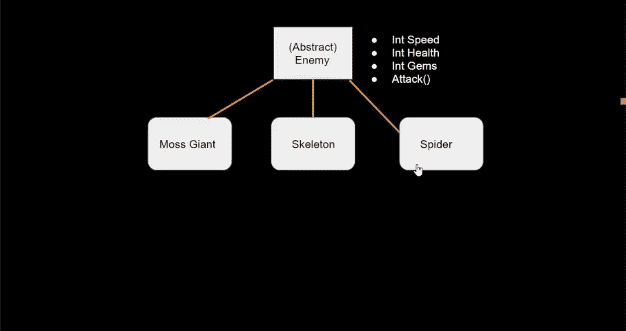
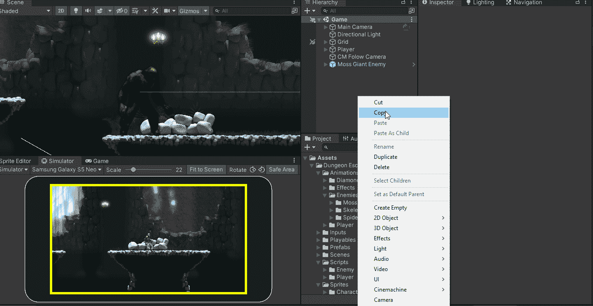
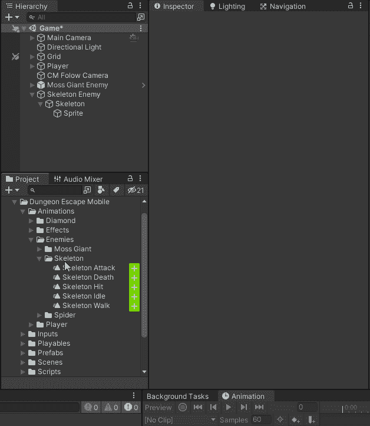
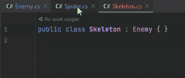
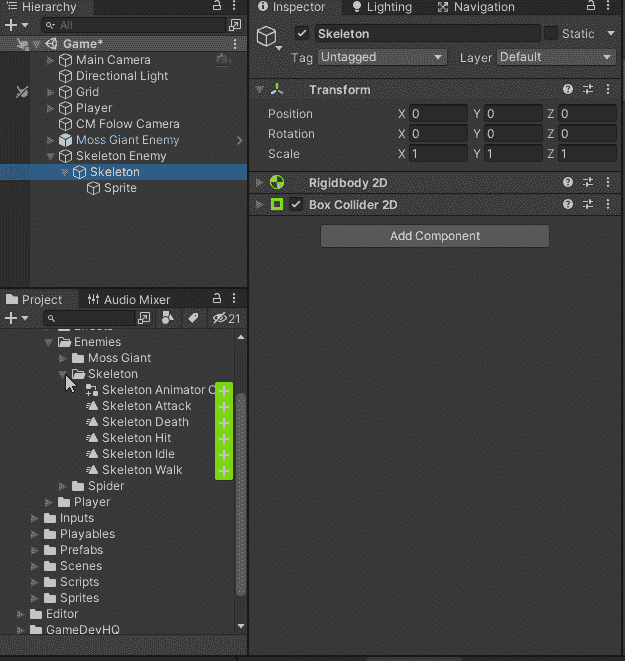
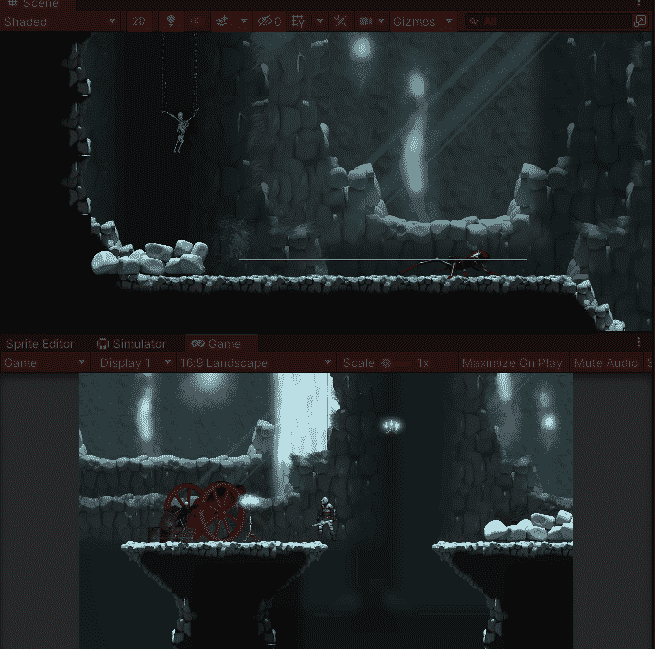

# 添加更多敌人

> 原文：<https://blog.devgenius.io/adding-additional-enemies-551ac57c987a?source=collection_archive---------5----------------------->

## 骷髅和蜘蛛

我创建了我的骨骼和蜘蛛，就像我创建苔藓巨人一样。

对于动画控制器，我创建了一个覆盖控制器。

然后我让骷髅和蜘蛛脚本从敌人那里继承

我把这些行为加到了敌人身上。

现在我不得不在游戏中加入新的敌人类型。

