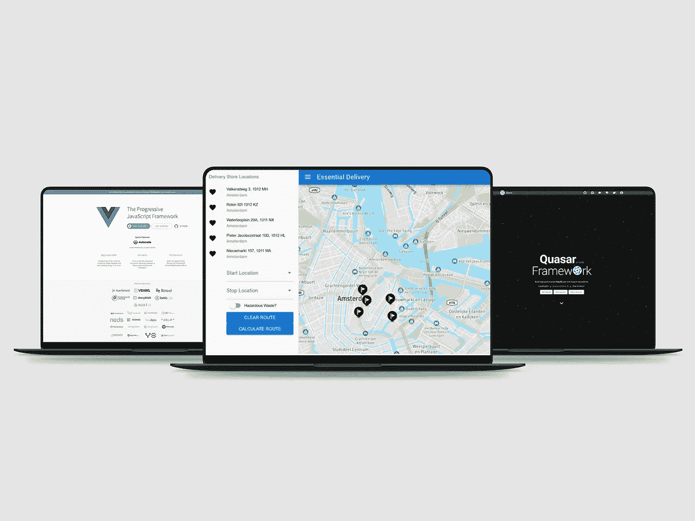

# 向现代 Vue + Quasar 应用程序添加高级 TomTom 地图功能

> 原文：<https://blog.devgenius.io/adding-advanced-tomtom-mapping-features-to-a-modern-vue-quasar-app-97268f3f49c2?source=collection_archive---------10----------------------->

## 了解如何添加搜索功能，然后使用计算路线来计算和显示地图路线



基于地理位置的应用程序帮助用户找到位置，跟踪地点，并在地图上显示这些位置。TomTom Maps API 和 SDK 使开发人员能够更容易地构建这些 web 应用程序，并在不同的设备上提供各种地图服务。

在本教程中，我们将构建一个 Quasar 应用程序来帮助用户搜索和跟踪到特定位置的路线。我们将使用 TomTom 的搜索 API、路由 API 和矩阵路由服务。

你应该熟悉 JavaScript 和 Vue，但你不需要 Quasar 的经验来遵循这个教程。请随意查看我们的另一篇文章，[将 TomTom 地图添加到 Vue + Quasar 应用程序。](https://developer.tomtom.com/blog/build-different/adding-tomtom-maps-vue-quasar-app)

# 先决条件

首先，确保节点在本地开发机器上。通过在终端中运行以下命令来检查您是否拥有它:

```
node –v
```

如果你没有节点，[下载它](https://nodejs.org/en/download/)。另外，[如果你还没有安装 Quasar CLI](https://quasar.dev/start/quasar-cli) 。

你还需要一个 TomTom 开发者账户。你每天都会收到成千上万的免费请求，甚至是商业应用。随着您的成长而付费！

# 设置项目

我们将设置类星体应用程序。首先，使用 Quasar CLI 创建一个新的 Vue 项目:

```
quasar create route-tracker
```

该命令创建一个提示，让您添加关于项目和合适的开发环境的详细信息。成功创建应用程序后，Quasar CLI 会显示命令，以切换到新创建的目录。运行以下命令启动您的应用程序:

```
quasar dev
```

结果应该是这样的:

接下来，我们通过安装所需的 Map SDKs 和 API 在应用程序中设置 TomTom。因此，我们将安装 TomTom 的服务:

```
npm install @tomtom-international/web-sdk-maps @tomtom-international/web-sdk-services
```

然后，安装地图 SDK:

```
npm i @tomtom-international/web-sdk-maps
```

您将需要在这个项目中使用您的 TomTom API 密钥。[这里有一个简单的免费创建指南——不需要信用卡。](https://developer.tomtom.com/how-to-get-tomtom-api-key)

# 创建布局

应用程序布局包括用于搜索地点的搜索栏、用于显示地图的地图容器以及分别显示计算距离和时间的结果。此图像演示了用户界面布局:

将此代码添加到 MainLayout 文件的 template 部分:

```
<q-layout view="lHh Lpr lFf">
    <q-header elevated>
      <q-toolbar class="bg-deep-purple-8  text-white">
        <q-toolbar-title >
          Route Tracker
        </q-toolbar-title>
      </q-toolbar>
    </q-header>
     <q-page-container>
     <!-- To handle the search for location -->
      <div class="q-pa-md" >
    <q-form  class="q-gutter-md" >
      <q-input filled v-model="locationQuery" label="Search for an address/location"/>
      <div>
        <q-btn label="Search" type="submit" color="deep-purple-8"/>
      </div>
    </q-form>
    <div>
    <!-- To display the result-->
      <p>Destination -  {{routeAddress}} </p>
      <p> Estimated Route Distance(KM) - {{destinationDistance}}
        <br>
           Estimated Time(MINS) -  {{timeToDestination}}
      </p>
      <p>
        {{errorMessage}}
      </p>
    </div>
    </div>
    </q-page-container>
  </q-layout>
```

这段代码创建了应用程序的用户界面(UI)布局。

# 显示地图

TomTom Maps APIs 使我们能够在应用程序中显示地图。我们也可以根据自己的喜好设计地图。

Index.template.html，包含 CSS 样式表来处理映射:

```
<link rel='stylesheet' type='text/css' href='https://api.tomtom.com/maps-sdk-for-web/cdn/6.x/6.13.0/maps/maps.css'>
```

同样，在类星体应用程序中导入 index.template.html TT 物体。这个对象代表了访问与 TomTom 地图和服务相关的所有内容的对象库。

```
import tt from '@tomtom-international/web-sdk-maps'
```

我们在 components 文件夹中创建一个 mapDisplay.vue 文件来处理这个部分。该组件将在我们的应用程序中显示地图。然后，我们将地图容器布局添加到 mapDisplay.vue 文件:

```
<template>
        <div id='map' class='window-height'></div>
</template>
```

接下来，我们创建一个函数来显示地图，并将其添加到 mapDisplay.vue 文件中:

```
displayMap(){
            const map = tt.map({  
            key: "8h504Wc4AXL6OPndqhrtKf70AovVBL3V",  
            container:'map', // Container ID 
            style: 'tomtom://vector/1/basic-main',  //the specified map style 
        });  
        map.addControl(new tt.FullscreenControl());  
        map.addControl(new tt.NavigationControl()); 
        const location = [this.longitude,this.latitude];
        const popupOffset = 25; 
        const marker = new tt.Marker().setLngLat(location).addTo(map); 
        const popup = new tt.Popup({ offset: popupOffset }).setHTML("Your Destination"); 
        marker.setPopup(popup).togglePopup();       
       }
```

然后，我们调用函数，使用 mounted()生命周期方法在 mapDisplay.vue 文件中显示地图:

```
mounted() {  
        this.displayMap()
     }
```

# 集成搜索 API

TomTom 的搜索 API 执行各种功能，如模糊搜索、自动完成、地理编码和反向地理编码。

# 模糊搜索

我们将主要关注模糊搜索，它搜索医院、酒吧和餐馆等地址和地点。我们还可以将搜索限制在特定的区域或几何图形。

查询结果给出了与特定查询文本部分匹配的位置的详细描述。

要实现模糊搜索，首先从 MainLayout.vue 中的 SDK 导入 tt 对象:

```
import tt from "@tomtom-international/web-sdk-services";
```

然后，在 MainLayout.vue 中，创建表单来处理搜索:

```
<div class="q-pa-md" >
    <q-form @submit="SearchAndCalculateRoute()" class="q-gutter-md" >
      <q-input filled v-model="locationQuery" label="Search for an address/location"/>
      <div>
        <q-btn label="Search" type="submit" color="deep-purple-8"/>
      </div>
    </q-form>
```

接下来，创建一个函数来处理搜索:

```
const _this = this
      // Using the fuzzySearch service
    await tt.services.fuzzySearch({
      key: 'INSERT API KEY HERE',
      query: this.locationQuery //The input gotten from the search
    }).then(function (response) {
      _this.routeAddress = response.results[0].address.freeformAddress
      _this.routeLatitude =  response.results[0].position.lat
      _this.routeLongitude = response.results[0].position.lng
    })
```

这段代码执行搜索功能并显示地址的第一个结果，同时存储纬度和经度以供其他服务使用。

我们还可以添加边界框参数来优化搜索。边界框是搜索结果中的一个有限区域，没有它，搜索将考虑整个世界。该参数接受要搜索的地点的经度和纬度值。

```
<!-- Display the result of the search -->
<p> Destination -  {{routeAddress}} </p>
```

# 兴趣点搜索

我们将添加到地图中的另一个功能是能够在所搜索的位置周围找到特定的地方。我们使用兴趣点搜索来做到这一点，这是 TomTom 提供的一种服务，使我们能够找到特定类型的地方，如餐馆、艺术中心，甚至是中转站。

我们将在 mapDisplay.vue 文件中实现这一点，以在地图上显示地点。例如，我们将搜索附近的加油站。要实现模糊搜索，首先从 MainLayout.vue 中的 SDK 导入 tt 对象。tts 对象导入到 mapDisplay.vue 中:

```
import tts from "@tomtom-international/web-sdk-services";
```

然后，创建一个函数，以便在页面上呈现地图时调用服务:

```
tts.services.poiSearch({
            key: 'INSERT API KEY HERE'
            query: Gas Stations,
            center: [ _this.latitude, _this.longitude ]
            })
            .then(function(data) {
              _this.stations = data.results})
              .catch((err) => {
                console.log(err)
            });
```