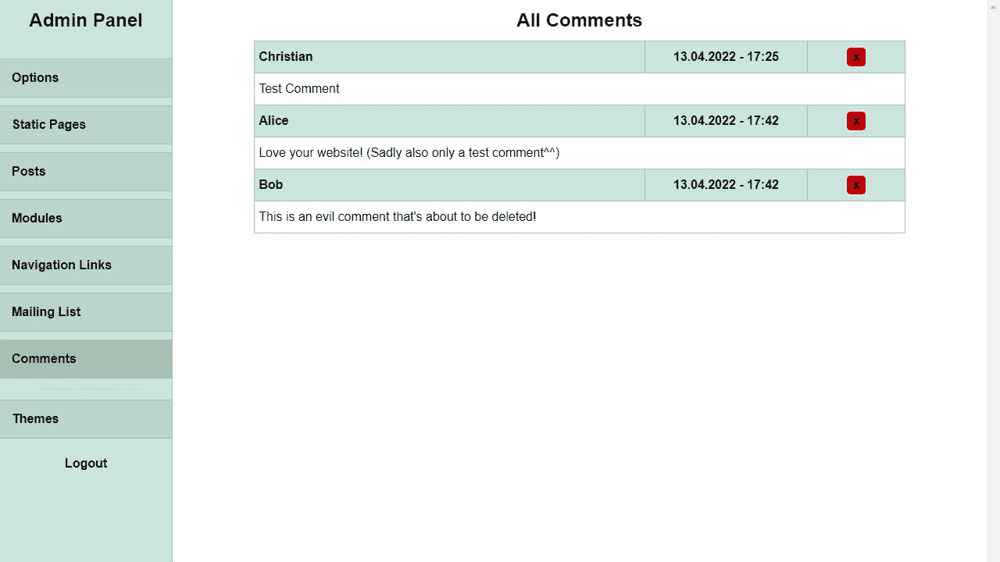

# 向我的网站添加评论审核工具

> 原文：<https://blog.devgenius.io/adding-comment-moderation-tools-to-my-website-afc90b9e98a1?source=collection_archive---------16----------------------->

## 为什么有人发垃圾邮件？

照片由[汉尼斯·约翰逊](https://unsplash.com/@hannes?utm_source=medium&utm_medium=referral)在 [Unsplash](https://unsplash.com?utm_source=medium&utm_medium=referral) 上拍摄

我最近在我的网站上收到一些非常讨厌的垃圾评论。当我向公众公开评论时，我一直知道这是一个风险。正因为如此，我已经内置了几个选项来处理它:首先，有一个核心选项，可以完全关闭公众评论，这可以通过一个按钮来完成。第二，可以基于每个帖子关闭评论，第三，我已经添加了删除评论的方法。然而，现在我不得不使用这些函数来处理垃圾评论，我注意到了一些问题并做了一些改变。

# **更快删除评论的方法**

到目前为止，我每天只收到一两条垃圾评论，所以我还不想在全球范围内关闭公众评论。受影响的帖子似乎完全是随机的，而不仅仅是我在其他地方转发的那些，所以只关闭对它们的评论也不是一个选项。

这意味着我唯一能做的就是手动删除评论。然而，它的用户界面/UX 很糟糕。我必须记住通知邮件中的帖子标题，在所有帖子的列表中找到它，然后滚动到底部并单击显示评论按钮，在那里我可以最终删除它。

现在，我在管理面板中添加了一个新的部分，显示网站上的所有评论。只需从主菜单中单击一下，即可访问它。这将大大加快删除评论的速度。

管理面板中的一个新部分可以更快地删除评论。图片作者。

# **防止垃圾评论**

当我进一步思考这个问题时，我意识到所有垃圾评论都有一个共同点:它们都包含链接。尽管这可能会伤害一些合法的评论者(如果有的话)，我还是决定添加一段非常简单的代码，不再允许包含链接的评论。我说的非常简单的一段代码就是这个意思。我只是检查字符串是否包含 *http://* 或 *https://* 。这将阻止我收到的所有类型的垃圾评论。然而，它不是很复杂，所以垃圾邮件发送者可能只是用不同的格式发送他们的消息，但是我担心如果他们这样做了。

# **人们为什么会发垃圾邮件？**

我一直在想，这些人为什么要在我的网站上发垃圾邮件呢？因为我有消息给他们。我的网站几乎没有访客。没有人会看到他们的垃圾邮件。我猜除了我之外。

此外，一定有人对在我的网站上发表评论所需的帖子请求进行了逆向工程，因为根据我的[分析工具](https://pingpoli.de/magpie-analytics)，这些评论不是从实际的网站访问者那里创建的。虽然这并不特别困难，但这不是任何垃圾邮件发送者都能做到的。我假设在这一点上，张贴评论到我的网站是包含在一个大的自动列表中的，这个列表可以在 darknet 上的某个地方找到，所以我阻止带有链接的评论的改变现在会打破它。

最后，让我们来看看我最近收到的一封垃圾邮件:

> https://##########。com/—Cialis Lpffjh Viagra prix pharmacie Paris en dijon Mlfehp[Cialis 在美国发售](”https://##########.com/")指挥官 Du Viagra Myemqg https://# # # # # # # # # # #。com/ — Cialis Iabxrh 通常最少的鼻腔液体就足以清洁气流。

这根本没有任何意义。一半的单词都不是单词，除非 *Lpffjh* 或者 *Mlfehp* 对你来说有什么意义？对谷歌来说没有。除此之外，它似乎是一个医疗药品的 SEO 术语随机收集。如果他们想愚弄任何人，至少应该写一些看起来真实的垃圾邮件。

综上所述，这对所有相关人员来说都是极大的时间浪费。我不得不删除垃圾评论，并改进我的评论审核工具，而垃圾邮件制造者花时间对代码进行逆向工程，以获得他们的时间和金钱投资的零回报。希望我的改变能让他们安静一会儿，但我毫不怀疑他们会回来的。

*原发布于*[*https://ping poli . de*](https://pingpoli.de/comment-moderation-tools)*。*