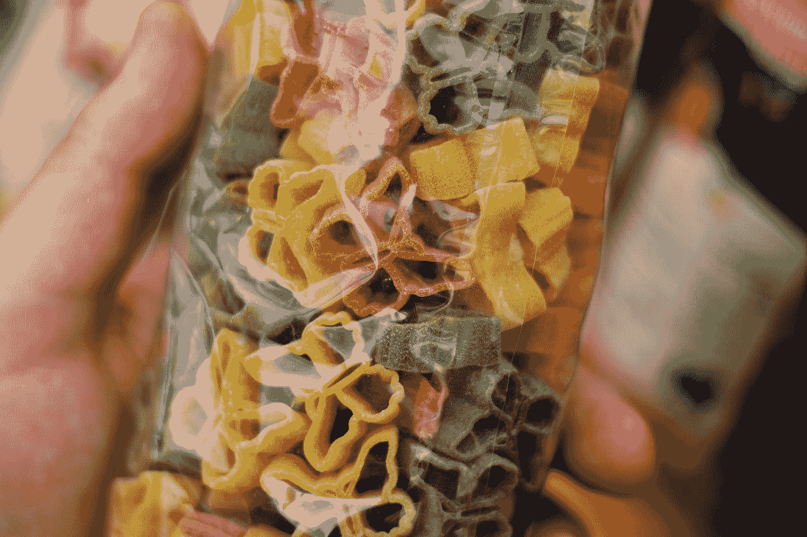

# 使用 D3 向 React 应用程序添加图形—形状和颜色

> 原文：<https://blog.devgenius.io/adding-graphics-to-a-react-app-with-d3-shapes-and-colors-4617825df826?source=collection_archive---------4----------------------->



弗雷德里克·科贝尔在 [Unsplash](https://unsplash.com?utm_source=medium&utm_medium=referral) 上拍摄的照片

D3 让我们可以轻松地向前端 web 应用添加图形。

Vue 是一个流行的前端 web 框架。

他们合作得很好。在本文中，我们将了解如何使用 D3 为 Vue 应用添加图形。

# 形状

我们可以将带有 D3 的形状添加到 React 应用程序中。

例如，我们可以使用`d3.arc`方法创建一个圆弧。

我们可以写:

```
import React, { useEffect } from "react";
import * as d3 from "d3";export default function App() {
  useEffect(() => {
    const arc = d3.arc().innerRadius(50).outerRadius(40).cornerRadius(15); const svg = d3.select("svg"),
      width = +svg.attr("width"),
      height = +svg.attr("height"),
      g = svg
        .append("g")
        .attr("transform", `translate(${width / 2} , ${height / 2})`); const data = [1, 1, 2, 3, 5, 8, 63, 31];
    const arcs = d3.pie()(data);
    g.selectAll("path")
      .data(arcs)
      .enter()
      .append("path")
      .style("fill", function (d, i) {
        return d3.color(`hsl(120, 50%, ${d.value}%)`);
      })
      .attr("d", arc);
  }, []); return (
    <div className="App">
      <svg width="400" height="300"></svg>
    </div>
  );
}
```

首先，我们通过书写来创建弧:

```
const arc = d3.arc().innerRadius(50).outerRadius(40).cornerRadius(15);
```

我们分别指定内半径、外半径和拐角半径。

然后我们从我们的`App`组件中得到`svg`元素。

我们得到它的宽度和高度。

接下来，我们创建我们的`g`元素，这样我们就可以将弧线添加到我们的 SVG 中。

然后我们通过书写添加不同阴影的弧线:

```
const data = [1, 1, 2, 3, 5, 8, 63, 31];
const arcs = d3.pie()(data);
g.selectAll("path")
  .data(arcs)
  .enter()
  .append("path")
  .style("fill", function(d, i) {
    return d3.color(`hsl(120, 50%, ${d.value}%)`);
  })
  .attr("d", arc);
```

`data`有我们要添加的数据。

`path`元素将有弧线。

我们通过在其中添加另一个`path`元素来添加弧线。

然后我们调用`style`来改变每个弧的填充颜色。

然后我们调用`attr`来设置圆弧的`d`属性来添加它们。

# 颜色；色彩；色调

我们可以用`d3.color`方法创建一种颜色。

例如，我们可以写:

```
import React, { useEffect } from "react";
import * as d3 from "d3";export default function App() {
  useEffect(() => {
    const color = d3.color("green");
    console.log(color);
  }, []); return <div className="App"></div>;
}
```

来创造颜色。

那么`color`就是:

```
{r: 0, g: 128, b: 0, opacity: 1}
```

我们用`color.rgb()`方法得到同样的结果:

```
import React, { useEffect } from "react";
import * as d3 from "d3";export default function App() {
  useEffect(() => {
    const color = d3.color("green");
    console.log(color.rgb());
  }, []); return <div className="App"></div>;
}
```

我们可以用`toString`得到颜色的字符串表示:

```
import React, { useEffect } from "react";
import * as d3 from "d3";export default function App() {
  useEffect(() => {
    const color = d3.color("green");
    console.log(color.toString());
  }, []); return <div className="App"></div>;
}
```

那么控制台日志将记录:

```
rgb(0, 128, 0)
```

# 结论

我们可以用 D3 在 React 应用程序中添加形状和创建颜色。