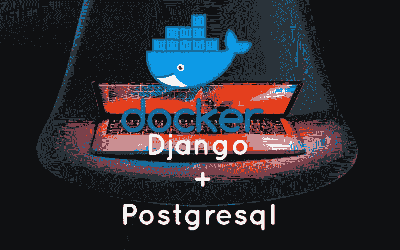

# 在 Docker 配置中将 PostgreSQL 添加到 Django。

> 原文：<https://blog.devgenius.io/adding-postgresql-to-django-in-docker-configuration-18cca442f174?source=collection_archive---------3----------------------->



在本教程中，我们将把 PostgreSQL 添加到我们在这里创建的[项目中。Django 提供了内置的 SQLite 支持，但是即使对于本地开发，您也最好使用像 PostgreSQL 这样的“真正的”数据库，与生产中的数据库相匹配。](https://paulawolesi.medium.com/django-docker-setup-tutorial-4c3e5f8d6def)

如果您遵循前面的教程，请进入虚拟环境并从那里继续。

# 心理战 2

现在停下来思考一下将一个包安装到 Docker 相对于本地虚拟环境意味着什么是很重要的。在传统项目中，我们会从命令行运行命令`python -m pip install psycopg2-binary`来安装 Pyscopg2。但我们现在和 Docker 合作。

有两种选择。首先是在本地安装`psycopg2-binary`，然后`pip freeze`我们的虚拟环境来更新`requirements.txt`。如果我们要使用本地环境，这可能是有意义的。但是由于我们致力于 Docker，我们可以跳过这一步，而是用`psycopg2-binary`包更新`requirements.txt`。我们不需要进一步更新实际的虚拟环境，因为我们不太可能会使用它。如果我们曾经做过，我们可以基于`requirements.txt`更新它。

在你的文本编辑器中，打开现有的`requirements.txt`文件，并将`psycopg2-binary`添加到底部。

```
psycopg2-binary
```

在 PostgreSQL 配置更改的最后，我们将构建新的映像并启动我们的容器。但还没有。

# 一种数据库系统

在现有的`docker-compose.yml`文件中添加一个名为`db`的新服务。这意味着我们的 Docker 主机中将运行两个独立的容器:`web`用于 Django 本地服务器，而`db`用于 PostgreSQL 数据库。

`web`服务依赖于`db`服务来运行，所以我们将在`web`中添加一行`depends_on`来表示这一点。

在`db`服务中，我们指定使用哪个版本的 PostgreSQL。在撰写本文时，Heroku 支持版本`13`作为最新发布版，所以我们将使用它。Docker 容器是短暂的，这意味着当容器停止运行时，所有信息都会丢失。这对我们的数据库来说显然是个问题！解决方案是创建一个名为`postgres_data`的`volumes`挂载，然后将其绑定到位于`/var/lib/postgresql/data/`的容器中的一个专用目录。最后一步是为`db`向`environment`添加一个[信任认证](https://www.postgresql.org/docs/current/auth-trust.html)。对于有许多数据库用户的大型数据库，建议使用更明确的权限，但是当只有一个开发人员时，这个设置是一个很好的选择。

更新后的文件如下所示:

```
**version**: "3.9"

services:
  web:
    build: .
    command: python **/**code**/**manage.py runserver 0.0.0.0:8000
    volumes:
      **-** .:**/**code
    ports:
      **-** 8000:8000
    depends_on:
      **-** db
  db:
    image: postgres:13
    volumes:
      **-** postgres_data:**/**var**/**lib**/**postgresql**/data/**
    environment:
      **-** "POSTGRES_HOST_AUTH_METHOD=trust"

volumes:
  postgres_data:
```

# 数据库

第三步也是最后一步是更新`django_project/settings.py`文件，使用 PostgreSQL 而不是 SQLite。在文本编辑器中，向下滚动到`DATABASES`配置。

默认情况下，Django 将`sqlite3`指定为数据库引擎，将其命名为`db.sqlite3`，并将其放在`BASE_DIR`处，这意味着在我们的项目级目录中。

```
*# django_project/settings.py*
DATABASES **=** {
    "default": {
        "ENGINE": "django.db.backends.sqlite3",
        "NAME": BASE_DIR **/** "db.sqlite3",
    }
}
```

为了切换到 PostgreSQL，我们将更新[引擎](https://docs.djangoproject.com/en/4.0/ref/settings/#std:setting-DATABASE-ENGINE)配置。PostgreSQL 需要一个`NAME`、`USER`、`PASSWORD`、`HOST`和`PORT`。为了方便起见，我们将前三个设置为`postgres`，将`HOST`设置为`db`，这是我们在`docker-compose.yml`中设置的服务的名称，将`PORT`设置为`5432`，这是默认的 PostgreSQL [端口](https://en.wikipedia.org/wiki/Port_%28computer_networking%29)。

```
# django_project/settings.py
DATABASES = {
    "default": {
        "ENGINE": "django.db.backends.postgresql",
        "NAME": "postgres",
        "USER": "postgres",
        "PASSWORD": "postgres",
        "HOST": "db",  # set in docker-compose.yml
        "PORT": 5432,  # default postgres port
    }
}
```

就是这样！我们可以构建包含`psycopg2-binary`的新映像，并使用以下单一命令在分离模式下启动这两个容器:

```
$ docker-compose up -d --build
```

如果你在`http://127.0.0.1:8000/`刷新 Django 欢迎页面，它应该可以工作，这意味着 Django 已经通过 Docker 成功连接到 PostgreSQL。

在 Docker 中运行命令与在传统的 Django 项目中略有不同。例如，为了`migrate`在 Docker 中运行的新 PostgreSQL 数据库，执行以下命令:

```
$ docker-compose exec web python manage.py migrate
```

如果你想运行`createsuperuser`，你也可以用`docker-compose exec web...`作为前缀，所以:

```
$ docker-compose exec web python manage.py createsuperuser
```

诸如此类。当你完成后，不要忘记关闭你的 Docker 容器，因为它会消耗大量的计算机内存。

```
$ docker-compose down
```

# 快速回顾

以下是我们在这篇文章中提到的术语和概念的简短版本:

*   **图片**:你项目的“定义”
*   **容器**:你的项目实际运行的地方(图像的一个实例)
*   **Dockerfile** :定义你的图像的样子
*   **docker-compose.yml** :一个 [YAML](http://yaml.org/) 文件，它接受 docker 文件，并为我们的 Docker 容器在生产中应该如何表现添加额外的指令

我们使用`Dockerfile`来告诉 Docker 如何建立我们的*形象*。然后我们在一个*容器*中运行我们的实际项目。`docker-compose.yml`文件提供了 Docker 容器在生产中应该如何表现的附加信息。

如果你喜欢这篇文章，请给它一两个掌声，如果你有任何问题或疑问，请在下面的评论中留下。