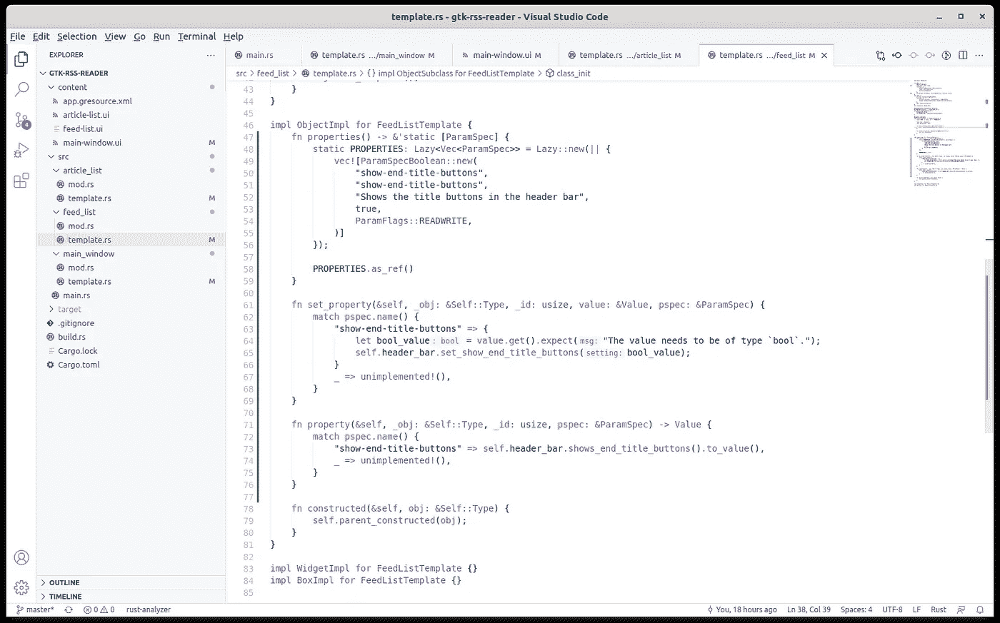
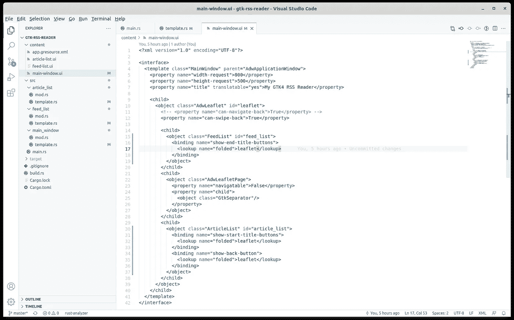

# 在 Rust 中向自定义 GTK4 小部件添加属性

> 原文：<https://blog.devgenius.io/adding-properties-to-custom-gtk4-widgets-in-rust-67d4bbed8b08?source=collection_archive---------5----------------------->


照片由[埃琳娜·莫日维洛](https://unsplash.com/@miracleday?utm_source=medium&utm_medium=referral)在 [Unsplash](https://unsplash.com?utm_source=medium&utm_medium=referral) 上拍摄

到目前为止，我们在 GTK4 Rust [教程](/initial-setup-for-a-gtk4-app-with-libadwaita-in-rust-using-vscode-b6f8c127a75e)上取得了不错的进展。我们学习了[模板文件](/using-template-files-in-rust-for-a-gtk4-libadwaita-ui-8322694cbc3c)、[资源](/bundling-templates-into-resources-in-rust-for-the-gtk4-ui-eb387a7918bf)和[属性绑定](/refactoring-gtk4-ui-templates-in-rust-68cbef1a1778)。但是上一次当我们将代码重构为定制的小部件时，我们发现在我们的`main-window.ui`模板文件中有轻微的表现力损失。我们必须将漂亮的声明性 XML 属性绑定转移到代码中。在本文中，我们将通过向小部件添加自定义属性来解决这个问题。

和往常一样，你可以在 [github](https://github.com/raduzaharia-medium/gtk-rss-reader-properties) 找到最终代码。当然，我总是建议遵循教程并尝试编写自己的代码，但如果您想快速启动您的项目，请随意使用可用的存储库。我们走吧。

## 什么是小部件属性？


照片由 [Edho Pratama](https://unsplash.com/@edhoradic?utm_source=medium&utm_medium=referral) 在 [Unsplash](https://unsplash.com?utm_source=medium&utm_medium=referral) 上拍摄

GTK 微件属性是允许微件和另一个数据源之间进行数据绑定的基本工具。另一个数据源可以是项目变量、来自另一个小部件的函数或属性的结果。每个小部件都有一个属性数组，以及每个属性的 getters 和 setters。属性也可能有默认值、取值范围或可用值等等。

数据绑定是一种自动机制，它从一个地方(例如一个小部件)读取一个变化的值，并将其分配给另一个地方(另一个小部件)。它可以是单向的，意味着值只从源小部件传递到目的地，也可以是双向的，意味着每次值在任何小部件中改变时，它也会传递到另一个小部件。

这种机制为用户界面提供了一种 MVC 模式。您将 UI 工程的各个方面在模型、视图和控制器之间进行了分离，从而使您的代码更加清晰，职责更加明确。由于您不再手动地在代码中将值从一个小部件复制到下一个小部件，而是“绑定”它以使这个过程自动化，这不仅分离了关注点，还简化了您的代码。如果能在 UI XML 定义中实现，那就更好了。

## 声明小部件属性



小部件中的典型属性声明

但是定义已经足够了。让我们看看如何为我们的`FeedList`小部件声明属性。属性声明是在小部件的内部部分完成的，所以我们转到`template.rs`来编辑`FeedListTemplate`。就像描绘一本好小说一样，故事发生在`ObjectImpl`:

```
impl ObjectImpl for FeedListTemplate {
  fn properties() -> &'static [ParamSpec] {
    static PROPERTIES: Lazy<Vec<ParamSpec>> = Lazy::new(|| {
      vec![ParamSpecBoolean::new(
        "show-end-title-buttons",
        "show-end-title-buttons",
        "Shows the title buttons in the header bar",
        true,
        ParamFlags::READWRITE)]
    }); PROPERTIES.as_ref()
  }

  fn set_property(&self, _obj: &Self::Type, _id: usize, value: &Value, pspec: &ParamSpec) {
    match pspec.name() {
      "show-end-title-buttons" => {
        let bool_value = value.get().expect("The value needs to be of type `bool`.");

        self.header_bar.set_show_end_title_buttons(bool_value);
      }
      _ => unimplemented!(),
    }
  } fn property(&self, _obj: &Self::Type, _id: usize, pspec: &ParamSpec) -> Value {
    match pspec.name() {
      "show-end-title-buttons" =>
        self.header_bar.shows_end_title_buttons().to_value(),
      _ => unimplemented!(),
    }
  } fn constructed(&self, obj: &Self::Type) {
    self.parent_constructed(obj);
  }
}
```

我们在这里看到三个新东西:定义属性数组的`properties`函数、`set_property` setter 和属性 getter。属性数组包含我们希望在小部件中包含的所有属性的描述。我们用`ParamSpecBoolean`或`ParamSpecInt`或任何我们想要的类型来声明它们。根据这种类型，一些声明将具有范围定义或可用值等等。

每个定义都以字符串形式的属性名开始，在我们的例子中是`show-end-title-buttons`，一个我通常设置为名称的昵称、一个描述、一个默认值和一些标志:在我们的例子中是`ParamFlags::READWRITE`。这些标志为只读模式或其他机制配置属性。

我不会展示`ArticleList`的代码，因为它看起来完全一样，但我要提醒这一点:`ArticleList`有两个属性需要绑定:`show-end-title-buttons`和`visible`来自标题中的 back 按钮。两者都是布尔值，就像这里一样。getter 和 setter 将属性链接到实际值。在我们的例子中，我们想要的是让`Leaflet`小部件控制内部的`HeaderBar`小部件，所以我们简单地给它一个`show-end-title-buttons`值。

基本上，我们想要能够将`Leaflet.folded`绑定到`FeedList.HeaderBar.show-end-title-buttons`的东西，但是因为我们不能从`Leaflet`进入`HeaderBar`，所以我们将它绑定到我们的新房产`FeedList.show-end-title-buttons instead`。这个名字可能是别的什么，但我选择复制它，因为它有同样的含义。我们的`FeedList`小部件将显示结束标题按钮。没人在乎`FeedList`内部是否有`HeaderBar`而实际上它本身也有`show-end-title-buttons`。这是我们不需要公布的内部知识。

## `Restoring the binding in main-window.ui`



更新的主窗口. ui

上次我们担心会丢失 XML UI 声明中的优秀属性绑定语法，但现在既然我们为自定义小部件定义了属性，我们就可以重新得到它:

```
<?xml version="1.0" encoding="UTF-8"?>
<interface>
  <template class="MainWindow" parent="AdwApplicationWindow"
    <property name="width-request">800</property>
    <property name="height-request">500</property>
    <property name="title" translatable="yes">
      My GTK4 RSS Reader
    </property> <child>
      <object class="AdwLeaflet" id="leaflet">
        <property name="can-swipe-back">True</property>

        <child>
          <object class="FeedList" id="feed_list">
            <binding name="show-end-title-buttons">
              <lookup name="folded">leaflet</lookup>
            </binding>
          </object>
        </child> <child>
          <object class="AdwLeafletPage">
            <property name="navigatable">False</property>
            <property name="child">
              <object class="GtkSeparator"/>
            </property>
          </object>
        </child>

        <child>
          <object class="ArticleList" id="article_list">
            <binding name="show-start-title-buttons">
              <lookup name="folded">leaflet</lookup>
            </binding>
            <binding name="show-back-button">
              <lookup name="folded">leaflet</lookup>
            </binding>
          </object>
        </child>
      </object>
    </child>
  </template>
</interface>
```

那里。XML 绑定再次有效。只是这一次，我们将绑定直接添加到我们的定制小部件中。我们以前见过这个语法，所以我不再详述了。

此外，现在属性绑定在模板 UI 文件中再次完成，我们可以将它们从`MainWindowTemplate`实现中移除，将`ObjectImpl`返回到其默认变体:

```
impl ObjectImpl for MainWindowTemplate {
  fn constructed(&self, obj: &Self::Type) {
    self.parent_constructed(obj);
  }
}
```

这都是关于财产的。这与科幻小说无关，但它确实需要一些关于小部件的数据绑定和数据封装的知识。我希望你在整个教程中玩得开心，也希望下次能见到你，届时我们将讨论[数据绑定](/using-models-to-bind-data-to-gtk4-custom-widgets-in-rust-379dd9d1bf4d)和[点击事件](/event-handling-for-gtk4-widgets-in-rust-d3c3f89b092f)。

不要介意使用评论部分获取您需要的额外知识。它帮助我将本文构建成一个更好的工具，供任何人使用。下次见！