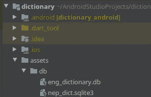
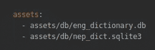
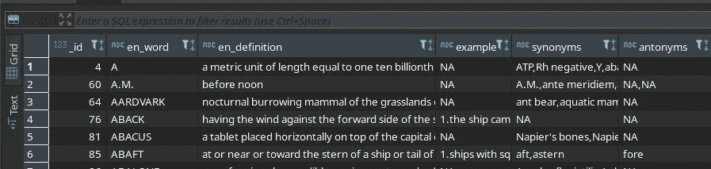

# 从资产/互联网添加 SQLite.db 文件(在 Flutter 中)。

> 原文：<https://blog.devgenius.io/adding-sqlite-db-file-from-the-assets-internet-in-flutter-3ec42c14cd44?source=collection_archive---------0----------------------->

马库斯·温克勒在 [Unsplash](https://unsplash.com?utm_source=medium&utm_medium=referral) 上的照片

感谢这个令人敬畏的 flutter 社区，因为它喜欢我的第一篇关于状态栏和导航栏颜色定制的简单文章，这启发了我写下一篇文章。你可以在这里阅读那篇文章。

如果您希望应用程序离线运行，那么在移动应用程序上本地存储数据是非常重要的。有多种方法可以做到这一点。今天我们将讨论如何在 Flutter 应用程序中使用现有的 SQLite 数据库。

首先，我们将寻找一种从资产导入数据库的方法。其次，我们将寻找一种从网络文件导入数据库的方法。如果我们的数据库很大，并且我们不希望我们的应用程序大得吓人，这是很方便的。

让我们开始:
第一步是添加必要的包。

1.sqflite 包。(较新的 flutter 版本支持 flutter 框架中的 SQLite，不知道是从哪个版本开始的，我懒得去做那个研究。😜 ).
2。[路径提供者](https://pub.dev/packages/path_provider/)。(获取应用程序目录的路径)。或者您可以使用 SQLite 包中的 getDatabasesPath()(当我写这篇文章时，我不知道这是可能的，所以我没有测试过。)

1.  从资产添加 SQLite 数据库。

要添加您的 ***database.db*** 文件，在根项目目录中创建一个名为 assets 的文件夹，并在 assets 下创建另一个名为 db 的目录，并在此添加数据库文件。

这里的 eng_dictionary.db 和 nep_dict.sqlite3 是 db 文件。

*(注意:flutter 插件 SQLite 两者都支持。db，. sqlite3，文件据我所知)*

现在在 pubspec.yaml 中添加资产。

在资产上添加字典。

2.为你的数据库表写一个模型。

一旦我们有了数据库，我们就需要数据库文件中存在的表的模型。

例如，在关于数据库***eng _ dictionary . db***中，有一个名为 ***words*** 的表，该表包含 6 列。要查看 db 文件中的数据，您可以使用 [dbeaver](https://dbeaver.io/) 等工具。

要为该表创建模型，您可以手动创建它。或者你可以使用工具自动生成模型，比如 [quicktype](https://app.quicktype.io/) 。但是 quiketype 从 JSON 创建模型。因此，您可以将数据库从 dbeaver 导出到 JSON，并使用该 JSON 数据从 [quicktype](https://app.quicktype.io/) 创建模型。

该模型将如下所示:

3.现在让我们创建 ***database_helper。dart*** 从资产创建并启动数据库。并执行数据库 crud 操作。

这里的***dictionarydatabasehelper . init()***函数初始化数据库。为了提高性能，只有一次 DB 文件是第一次从资产文件中创建的。

在这里，如果您想使用托管在互联网上的数据库，您可以下载并初始化数据库，如下所示:

而函数***dictionarydatabasehelper . getallthewordsenglish()***函数从表 ***字*** 中得到所有行的 ***en_word*** 和***en _ definition***。

如果数据库很大，这可能会严重影响性能。所以我建议在获取数据库时使用这些限制。您可以在 SQLite 中使用 *limit* 来查询数据库:

*注意:如果要做分页，总要用一个* `*oderBy*` *子句；否则，顺序是任意的。*

类似地，您可以在数据库上执行所有 CRUD 操作。

感谢大家阅读这篇文章。希望这有所帮助。请留下反馈，这样我可以改进我即将发表的文章。