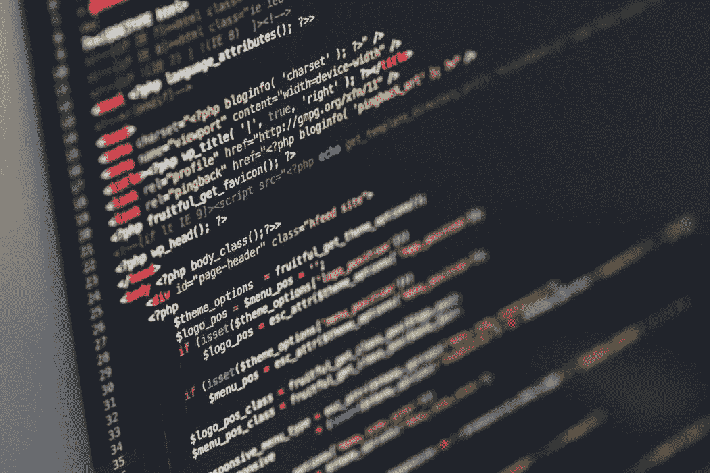

# 多动症可以成为软件开发人员吗？

> 原文：<https://blog.devgenius.io/adhd-and-code-17c5e1d0ca1b?source=collection_archive---------10----------------------->

我把我多动症的大脑生物黑进了一条违背其所有自然本能的职业道路，你也可以。

# 关于我的一点点

我叫索哈姆·杜塔。在写这篇文章的时候，我正在完成 F [ullStack Academy 编码训练营](http://fullstackacademy.com),到目前为止，我已经在我的旅程中取得了多项个人成就。我在两个月的时间里学到的东西比我一生中学到的都多，我对自己成为全栈开发人员的能力非常有信心。我在飞行中学习新话题的能力飞速提高…但情况并非总是如此。

我出生在印度，在我只有一个月大的时候移民到纽约皇后区。当我面临选择人生道路的压力时，在一个南亚移民家庭长大，同时又是独生子，这是一个非常有趣的动态。从很小的时候起，我就接受了这一点:我被期望像我的大多数家人一样进入 STEM 领域，成为我父母可以夸耀的东西。我见证了我的父母为了给我一个好的生活付出了多少努力，我只想成为他们希望我成为的人；但是在这条道路上，我面临着许多内部斗争。

# 问题是

我在很小的时候就被诊断出患有多动症，但我不知道这意味着什么，也不知道它会如何影响我的学业。我的父母拒绝对我进行药物治疗(对此我很感激),而是把它藏在地毯下，认为这是我童年的一个阶段，随着年龄的增长，我会克服它。就我的记忆所及，我在创造性努力方面总是很有天赋，我在所有的文学和艺术课上都很优秀，但在数学和科学等科目上却很挣扎。每当我在学校开始一个新学期时，我总是在所有的课上尽我最大的努力，并且总是告诉自己“这次将会不同”。不幸的是，从来没有什么不同，在我不感兴趣的课上，我的动力和注意力迅速下降。

我记得我盯着我的老师，听着每一点信息，但只保留了大约 10%,而不是在我疯狂的想象中进进出出。这反映在我的成绩上，我感到如此沮丧和崩溃。我很快在青少年生活的大部分时间里形成了这样的自我形象:我太“笨”了，无法在任何“聪明人的职业生涯”中取得成功，我必须找到一种方式来利用我的创造力谋生。尽管心存疑虑，我还是申请了大学，目标是成为一名药剂师，这样我就能取悦我的家人。在我上学的两年里，我尽了最大的努力，但我发现自己跟不上，因为我不能盯着课本足够长的时间来学习任何东西。我甚至两次转专业到我认为我喜欢的科目，然后因为我无法集中注意力而放弃了那些科目。我最终退学了，并决定不再浪费时间和金钱，寻找某种我能坚持的道路。

# 代码之旅

我现在是一个年轻的成年人，知道我的多动症是我与教育斗争的原因。我以此为借口，决定完全放弃教育，直接去工作，直到我想明白自己一生想做什么。我工作的这段时间教会了我很多关于自己的事情；我知道我并不像我认为的那样“愚蠢”，而是需要找到一份值得克服我多动症的职业。

在花了几个月的时间搜索互联网后，我最终萌生了成为一名软件开发人员的想法。我一直对技术感兴趣，但更重要的是，让我的想象变成现实。在做了研究并与已经是开发人员的朋友交谈后，有人建议我加入一个编码训练营，以获得最大的回报，而不是再花 4 年时间获得一个计算机科学学位。

我从一个训练营的预备课程开始，这个课程给了我一个关于编码的介绍，我意识到这远没有我想象的那么可怕。我记得我陷入了代码中，花了几个小时试图找出如何修复它。当我最终让它工作时，我感受到了从未有过的巨大成就感；那一刻，我意识到这是我在可预见的未来可以做的事情。尽管我为自己创造了这就是“那一个”的所有确定性，但我仍然有许多疑问。

在看了各种训练营的评论并意识到这并不容易后，自我怀疑开始出现了。我很冲动，无法集中注意力，坐不住，几乎读不出一句话就走神！我知道，学习编码和成为一名软件开发人员不仅需要在学校里投入大量的精力，还需要在工作中投入大量的精力，因为技术总是在变化，我需要有相应的纪律来适应它。我不确定我该怎么做，但我需要找到一种方法。

在最初的恐惧消退后，我决定制定一个游戏计划。我参加了入学考试(我花了比大多数同龄人更长的时间来学习)并进入了这个项目。我知道这是我将被迫面对自己的恶魔的时刻，这个恶魔拖了我这么久。

# 克服问题

我们通常都知道多动症的负面影响

*   不耐烦
*   无法集中注意力
*   冲动
*   极度活跃
*   解体
*   拖延

但是听到好处并不常见；以下是我发现的一些

*   源源不断的新想法
*   对真正令我感兴趣的事物的痴迷
*   大量的物理能量
*   不断学习新主题的必要性(对我来说，就是技术)

考虑到这些优点和缺点，我为我参加编码训练营和以后的时间设计了一本规则书，以最终驯服我的大脑。

# 我的成功法则

## -彻底改变你的睡眠时间表

我发现在学习新概念和新技术一整天后，我无法集中注意力。相反，我允许自己课后放松和娱乐，并尽可能早地上床睡觉。我的大脑是一个顽固的大脑，强迫它做它不想做的事情几乎是不可能的。相反，围绕你大脑的感觉来计划你的一天。当我开始感到精神疲惫时，我会在晚上 7-8 点左右睡觉，每天早上 4 点左右醒来。

## -利用一天的开始，尽可能多地完成工作

利用你新鲜的脑力和清晨的优势；当你比所有人都醒得早时，你就失去了通过社交媒体或面对面与他人互动的选择。这将允许患有 ADHD 的人消除大量可能完全干扰他们的注意力。它还会让大部分困难提前解决，这样你就可以期待以后的放松。

## -使用[番茄工作法](https://en.wikipedia.org/wiki/Pomodoro_Technique)

间隔 25 分钟学习或编码，然后休息 5 分钟让你的大脑做它的事情，冲洗，重复。

## -创建一份清单

把最重要的话题和任务放在一天的开始，把最不重要的放在最后。核对每项任务，并在完成后奖励自己。

## 改变你的饮食

少吃碳水化合物，甚至在起床后禁食。如果你从未尝试过[间歇禁食](https://www.healthline.com/nutrition/intermittent-fasting-guide#:~:text=Intermittent%20fasting%20(IF)%20is%20an,described%20as%20an%20eating%20pattern.)；这是一个可以让你的注意力加倍的工具。简而言之，当你体内进行的过程减少时，你的大脑会更加警觉。戒掉含糖的食物和饮料以及任何其他可能影响你已经分散的大脑的刺激物。相反，当你完成一项任务时，试着用这些兴奋剂作为奖励。

## -创造一种紧迫感

为你想开始的每个项目或任务设置一个闹钟，并让自己对闹钟负责。ADHD 的大脑喜欢把重要的任务放在后面，以换取能够立即获得满足感的任务。通过制造紧迫感来彻底改掉这个习惯。不要让你的大脑说服你去 YouTube 狂欢，或者浏览 Instagram，而不是面对困难。将自己置于别无选择的境地。

## -改变你的心态

开始害怕失败。许多患有多动症的人可能已经经历过这种情况，但利用这种恐惧继续前进，不要只是转向下一个闪亮的东西。虽然它有其优点，但当涉及到学术时，多动症是一个真正的挑战，你需要接受这一点并继续前进。给自己更多的时间去完成任务。保持自己的状态，不要因为挑战而气馁，也不要拿自己和别人比较。

## -有备而来

患有多动症的人发现很难跟上讲座和课堂设置；取而代之的是，在教授之前，留出一段时间来复习主题。当你已经对正在发生的事情有了一个大致的概念时，这将允许你让那些走神的想法不那么有害。

## -训练你的大脑

制造惩罚。当你没有达到目标的时候，练习剥夺你所爱的东西。这听起来可能有点刺耳，但是把你的大脑想象成一只宠物。你不想用你喜欢的东西来强化不好的行为，多动症的大脑缺乏奖励系统，所以创造你自己的奖励系统。

## 有人让你负责吗

我注意到那些患有多动症的人在被注视的情况下很擅长完成任务，独处是问题所在。如果你有家人或朋友，让他们拿着你的任务清单，并在每项任务完成后向他们汇报。

## -确定你的动机

永远记住你的最终目标。无论你踏上什么样的旅程，你可能会多次忽略这一点，但这应该是你痴迷的地方。不要看所有你必须做的艰难的事情，这只会让你失去注意力，想换成更有趣的事情；相反，想想当你找到那份工作，买下那栋房子，或者创造出你非常想要的东西时，你会感觉有多棒。

这些规则有些是物理的，有些是心理的，但是最重要的概念是结构和计划。患有多动症的人可能天生就没有轻松实现学业目标的内部结构，但我们用一个异常活跃的大脑弥补了这一点。想象一下，当你创造了一个驯服野兽的系统后，你会取得怎样的成就。

我希望有需要的人都能收到这封信。患有多动症的人进入像软件开发这样的领域可能会令人生畏，但如果我能做到，任何人都可以:)