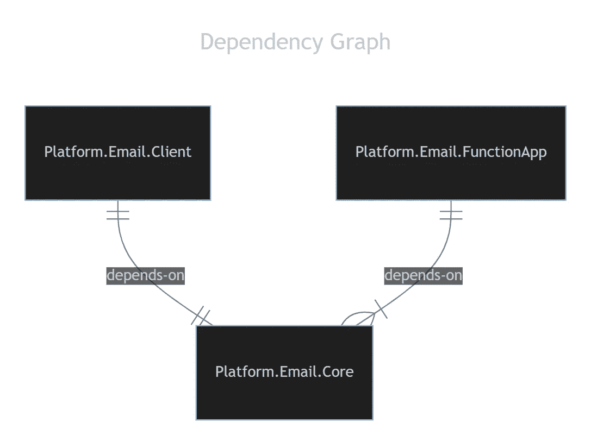
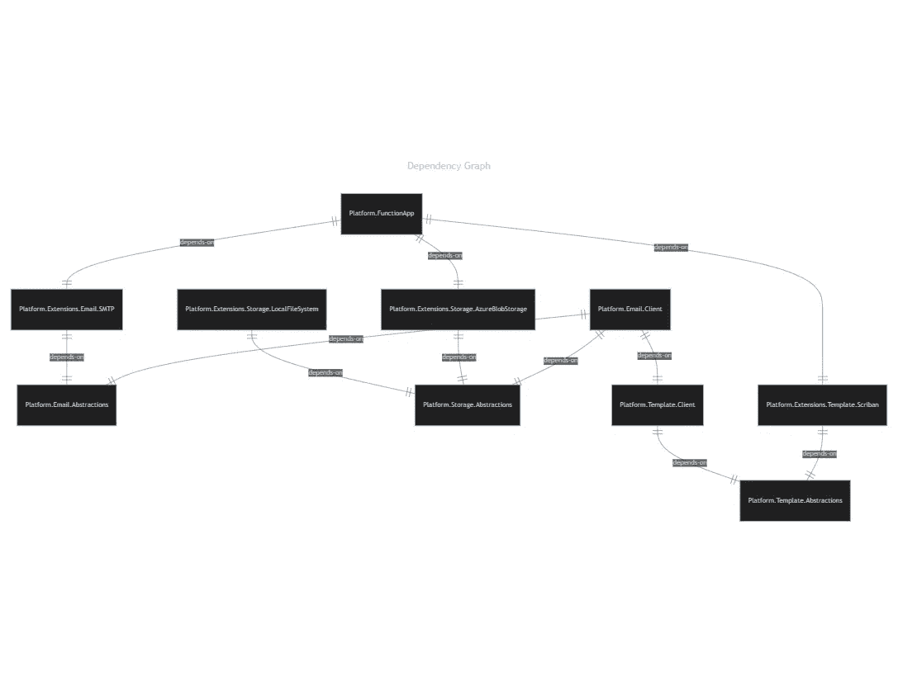

# 高级。NET 控制与程序集的依赖关系

> 原文：<https://blog.devgenius.io/advanced-c-controlling-dependencies-with-assemblies-2bb8cf6c1119?source=collection_archive---------0----------------------->

当我们构建软件时，我们真的应该考虑如何在程序集中隔离代码。


由[瓦迪姆·谢尔巴科夫](https://unsplash.com/it/@madebyvadim?utm_source=medium&utm_medium=referral)在 [Unsplash](https://unsplash.com?utm_source=medium&utm_medium=referral) 拍摄的照片

我想介绍一个我们可能想要构建的系统示例，用于集中 Azure Cloud 的电子邮件交付。它将允许组织内任意数量的产品团队使用相同的机制发送电子邮件。这允许很好地重用代码，简化了产品开发人员在处理电子邮件时的认知负荷，并开始了组织平台的出现。

# 要求

以下是基本要求:

1.  该系统必须是可访问的 RESTful API。
2.  该系统必须托管在 Azure 云。
3.  该系统必须允许从存储的模板(无论是在云或本地)渲染电子邮件正文。
4.  系统必须允许从存储的模板中呈现 HTML 和 PDF 附件(无论是在云中还是在本地)。
5.  出于审计目的，生成的附件必须存储在 Azure Cloud 中。
6.  系统应该为产品开发人员提供一个客户端 API 来使用，而不需要直接了解 RESTful API。

这个需求列表非常短，忽略了编写实际代码的细节。然而，目标并不是真正向您展示代码本身，而是如何根据这些需求组织代码。

# 第一遍设计

编写这段代码的第一步是创建三个新项目:

*   包含满足需求所需的所有抽象、模型和服务。
*   `Platform.Email.Client`:定义产品开发者访问云服务时使用的客户端 API。
*   `Platform.Email.FunctionApp`:保存所有与 Azure Function App 和 RESTful API 相关的代码。

这些程序集中的文件夹结构可能如下所示，

```
.
├── Platform.Email.Core/
│   ├── Abstractions
│   ├── Extensions
│   ├── Models
│   └── Services/
│       ├── Storage
│       ├── Template
│       └── Email
├── Platform.Email.Client/
│   └── Services
└── Platform.Email.FunctionApp/
    ├── EmailFunctions
    └── TemplateFunctions
```



依赖图

乍一看，这可能看起来没有害处。从某种程度上来说，事实并非如此。您可以满足以这种方式定义您的结构的需求。也许，对你来说，这就足够了。事实上，这已经足够好了，如果你知道这个系统在未来不会改变的话。

然而，如果你已经是一个超过 3 个月的开发人员(专业的)，你应该知道这个系统的需求将会改变。

例如，最初，我们将提供两种主要类型的存储:

*   `LocalFileStorage`:允许将模板存储在本地，并直接从产品应用程序中使用。
*   `AzureBlobFileStorage`:允许模板存储在云中(Azure Blob 存储)并在 FunctionApp 环境中本地使用。它还将用于存储呈现的附件。

结合起来，这些类应该允许我们从 Azure 或本地文件系统中提取模板。它还允许我们使用`AzureBlobFileStorage`在 Azure 中存储生成的附件。

但是我们知道事情可以而且确实会改变。如果企业决定从`FTP`站点获取文件，会发生什么？或者，也许我们正在与客户集成，而他们利用了`AWS`？如果我们想将生成的附件存储在 blob 存储之外，该怎么办？

我们将不得不改变，最有可能的是，所有三个组件。我们必须改变`Core`的装配，因为新的`FTP`和`AWS`职业将在那里生活。`Client`将需要版本更新，因为`Core`内的车型很可能会发生变化。自然地，`FunctionApp`也使用了新的类。这并不理想…

这就是我不喜欢这个的原因，

1.  添加新技术需要重新部署所有的库，因为`Core`库已经更新，并且有了版本更新。
2.  每个客户端现在都需要带上`Core`的所有依赖项，包括任何用于访问 Azure、FTP、AWS 等的库。随着时间的推移，这可能会变成数百个依赖项。
3.  模板功能本身在电子邮件之外非常有用，但是，我们不能在没有所有电子邮件依赖的情况下使用它。

我们没有真正让我们的产品开发人员选择他们需要什么。可能一个团队只需要`Local`和`FTP`，而另一个团队只需要`Azure`和`AWS`。可能一个团队只想利用我们组装的模板系统。

无论如何，我们需要考虑如何更好地分解这些碎片。

# 更好的解决方案

让我们做一个假设，我们确信有人最终将需要为模板和附件使用不同的模板引擎和不同的存储机制。

> 顺便说一句，我不是 YAGNI 咒语的粉丝。对于更多的初级开发人员来说，这意味着我们不应该为改变而设计，因为我们“不需要改变”当然，更多的高级开发人员明白事实并非如此。为变化而构建，只是不要在需要时才实施变化。

所以这是我的提议，

```
.
├── Platform.Email.Abstractions/
│   ├── Services
│   ├── Extensions
│   └── Models
├── Platform.Extensions.Email.SMTP/
│   ├── Extensions
│   └── Services
├── Platform.Template.Abstractions/
│   ├── Services
│   ├── Extensions
│   └── Models
├── Platform.Extensions.Template.Scriban/
│   ├── Extensions
│   └── Services
├── Platform.Storage.Abstractions/
│   ├── Services
│   ├── Extensions
│   └── Models
├── Platform.Extensions.Storage.LocalFileSystem/
│   ├── Extensions
│   └── Services
├── Platform.Extensions.Storage.AzureBlobStorage/
│   ├── Extensions
│   └── Services
├── Platform.Email.Client/
│   └── Services
├── Platform.Template.Client/
│   └── Services
└── Platform.FunctionApp/
    ├── EmailFunctions
    └── TemplateFunctions
```



依赖图

所以，我们刚刚从 3 次集会增加到 10 次集会。呀！看看这些线条。！这看起来更复杂！

是的，它“看起来”更复杂。真的，你是对的。第一次建造它的时候。但是如果你读过鲍勃叔叔的《清洁建筑》,那么你可能会明白我们在这里想要完成什么。让我看看能不能解释清楚，

## **第 1 层—抽象组件**

底部是我们所有的稳定依赖项。这些是像`Platform.Email.Abstractions`、`Platform.Storage.Abstractions`和`Platform.Template.Abstractions`这样的集合。如果你预先设计好契约，这些集合将永远不会改变。

## 第 2 层—实现程序集

我们需要创建抽象的具体实现。这包括`Platform.Extensions.Email.SMTP`、`Platform.Extensions.Storage.LocalFileSystem`、`Platform.Extensions.Storage.AzureBlobStorage`和`Platform.Extensions.Template.Scriban.`

这些不太稳定。这是因为，当补丁出现在它们各自的平台和引擎中时，我们也必须修补我们的平台和引擎。因此，我们希望尽可能减少对这些产品的依赖。这是为什么这种分离是有益的关键原因。

在第一个设计中，每次 Azure 或 AWS 更新设计时，我们都必须更新`Core`库。在这里，我们只需要更新一个库和后续的依赖项。那些选择不使用这些库的人不需要担心。

## 第 3 层— Web 服务/ API

这就是`Platform.FunctionApp`中系统的核心功能。我重命名了这个程序集，因为我真的想优化我对 Azure 的使用，所以我想把模板和电子邮件服务放在一起。然而，这个名称与包含的模板服务不太匹配。相比之下，如果您愿意，您可以将这些分成两个服务，这样会更好。

这一层本质上是不稳定的。这种变化的原因比其他任何原因都多。我们可能希望将存储转移到其他地方。您的线程模型和并发性可能存在问题。我怀疑当需求改变时，你的大部分努力将会在这个库中。

但同样，它可能会受到变化类型的限制。例如，如果您只是简单地更改存储的新技术，那么您实际上只是更改了该程序集的依赖根。这是微不足道的。您将构建新的扩展程序集，引用它，更改依赖项根，并进行部署。这可以在几个小时内完成。不错！

## **第 4 层—客户端组件**

列表的最后是我们的客户端程序集，`Platform.Email.Client`和`Platform.Template.Client`。图中没有显示这些库依赖于`Platform.FunctionApp`，因为它们没有引用它。然而，实际上，它是这些客户端的依赖。

如果端点的模式以任何方式改变，客户端必须更新。这是客户固有的想法。如果你预先构建了一个灵活的 API，这应该不会经常发生。即便如此，这些库的稳定性与功能应用的稳定性没有直接联系。变更的主要原因只有一个:合同变更。

## 设计结论

如您所见，我们已经创建了更多的程序集。然而，我们也建立了责任明确的较小的议会。他们每个人都有一个需要关注的责任。这样，当其他团队需要使用变更时，就可以对变更进行控制和隔离。

# 经验法则

这里有一些关于程序集分支的指南，您可能会觉得有用，

1.  接口、契约以及它们相关的模型应该放在一个稳定的`Abstractions`集合中进行共享。
2.  消息传递模式通常应该放在一个稳定的`Schema`程序集中进行共享。这是针对用例的，比如为队列、消息总线定义消息，以及在程序集之间共享的数据定义(比如 Azure 表存储)。 ***注意*** *，有时候我会把 Web API 模式放在一个单独的* `*Schema*` *程序集里，与* `*Client*` *程序集共享。为什么要创建这些模型两次？！*
3.  应该根据所使用的技术来创建和命名程序集。(例如:`Platform.Inventory.SqlServer` vs `Platform.Inventory.MySql`)
4.  对于任何与外部服务交互的类，不通过进程内方法，应该被分组到`Client`库中。
5.  对于顶级的程序集/可执行文件，我更喜欢根据它们的目标类型来命名。(`FunctionApp` : Azure 功能 App 组装，`Web` : Web 应用，`WebApi`:仅 Web 服务，`WPF` : WPF 桌面应用等。)

# 结论

将所有东西都放在一个大的组件中通常更容易。然而，随着需求的变化，我们创建的分离为未来提供了一个灵活的架构。我所做的决定是基于我所能预见的未来可能发生的“潜在”变化。我不得不考虑如何改变和设计这些场景。例如，以下是我想到的变化，

*   企业可能会根据成本决定更改附件的存储位置。
*   技术小组可能决定 **Scriban** 不是我们应该使用的最高效的引擎，并可能实现另一个。
*   企业可能决定让非开发人员帮助设计模板，而 **Scriban** 语法并不理想。因此，选择并实现了一个不同的。
*   企业可能决定停止托管 **SMTP** 服务器，转而使用 Mailgun 的 API 等外部服务来发送电子邮件(很可能是因为性能问题)。
*   企业非常喜欢模板引擎，以至于他们想用它在主网站上生成 PDF 收据。然而，他们不需要系统的电子邮件部分。

通过想象可能发生的事情，我们可以创建一个灵活的系统，为业务和技术团队提供发展他们的代码库的机会，而没有改变意大利面条式编码的程序集的巨大风险。

> 最好的代码是永远不需要改变的代码。

如果你能设计一个系统，其中你只添加程序集和添加代码到程序集，而不是改变已经写好的代码，你已经完善了架构设计。

希望这能给你一些启发！下次见！