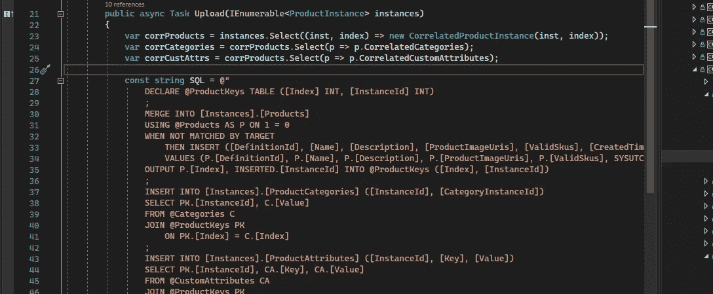

# 高级 C# — SQL Server 批量上载

> 原文：<https://blog.devgenius.io/advanced-c-sql-server-bulk-upload-57ad6be6e6a1?source=collection_archive---------5----------------------->

代码片段

在本文中，我将介绍一组批量上传数据的技术。从性能的角度来看，数据库集成可能是一个严重的瓶颈。这个瓶颈可能来自网络延迟、写处理时间和低效的往返。

为了缓解这些问题，我们希望优化我们的服务方法，使从服务器到数据库只有一次往返。

为了实现这一目标，我们将介绍以下技术:

1.  关联多个集合模型以便在 SQL Server 中进行处理
2.  使用 Dapper 将数据列表转换为自定义参数
3.  利用 SQL Server 的 MERGE 语句保持数据的适当连接

让我们跳进来。

# 数据模型

让我们首先从我们的数据模型开始。我们正试图将产品批量插入库存系统。这些产品可以有任意数量的相关类别和属性(键值对)。我们希望一次上传很多，而不必多次访问数据库。

> 注意:为了简洁起见，这段代码的大部分被删减了。生产版本包含的检查和平衡比上面显示的更多。

类的层次结构可能会被掩盖。但是有继承的原因是由于系统的本质。我们在所有主要类型中使用相似的定义/实例模型。这里不讨论这个，所以类`Definition`被有意地排除了。

以下代码旨在为您提供一个更符合逻辑的数据模型，而不是生产中所做的事情。这是为了便于阅读。

接下来让我们看看存储这些信息的 SQL 表

> 同样，我们故意忽略了这里引用的一些表，因为它们与代码的其余部分无关。

如您所见，我们有 3 个主表。这些表中有 2 个表有指向主表`Products`的外键引用。C#数据模型也通过核心的`ProductInstance`、`CategoryCollection`和`CustomAttributes`类支持这一点。

> 这个模型是为了通用而创建的，为存储产品及其细节提供了一种灵活的方法。由于产品可以包含如此多类型的信息，我们利用这种动态结构来根据应用考虑特定的参数。

# 关联集合模型

> 目标:重申一下，我们想要批量上传多个产品，这些产品可以有多个类别和多个属性。

为了实现这个目标，我们首先需要有一种方法在一次调用中将这些数据上传到 SQL Server。我们可以使用用户定义的表类型来实现这一点。UDTT 是 SQL Server 中的自定义类型，它允许我们获取一个`DataTable`并上传到一个特定的表结构以进行 T-SQL 处理。在我们当前的场景中，我们需要 3 种表类型，每个集合一种:产品、定制属性和类别。

我们应该记住，这些是我们上传的产品的新实例，这意味着我们还没有标识符。那么，我们如何关联 3 个集合中的数据呢？我们将不得不索引我们的数据。我们在设计中应该考虑到这一点。

以下是我们将使用的 UDTT。

我们在每个表类型中都有一个索引，对应于产品列表中的索引。尽管产品列表的每一行都有一个唯一的索引，但是整数列表(类别)和自定义属性列表可能有多个具有相同索引的行。

如果我们创建遵循这些 SQL 模型的 C#模型，我们的生活会变得更加轻松。

有了这个模型，我们现在可以将这些模型转化为 SQL 查询语句的合适的自定义参数。

# 将集合数据转换为 SQL UDTT

为了利用我们之前创建的 UDTTs，我们必须使用`DataTable`类型。我还将利用 [Dapper](https://github.com/DapperLib/Dapper) 库来创建和转换这些数据。Dapper 为此提供了一个名为`ICustomQueryParameter`的接口。

我们在每种方法中都做了以下工作:

1.  创建一个与 UDTT 同名的`DataTable`(尽管我不认为这是绝对必要的)
2.  为模型的每个属性设置`DataColumn`
3.  将列表中的行添加到`DataTable`
4.  使用 Dapper 的`AsTableValuedParameter`方法将`DataTable`转换为`ICustomQueryParameter`。

这些功能将使批量上传更加容易。

# SQL Server 的 Merge 语句

在 SQL Server 中，没有很多方法可以轻松地批量插入记录并返回创建的标识符。然而，微软以他们特有的 SQL 风格提供了 [Merge](https://docs.microsoft.com/en-us/sql/t-sql/statements/merge-transact-sql?view=sql-server-ver15) 语句。

> MERGE (Transact-SQL):根据与源表的联接结果，在目标表上运行插入、更新或删除操作。

让我们看看我们将如何利用这一声明。

让我们稍微分解一下这个陈述。

1.  我们创建一个本地表变量`@ProductKeys`,它将保存我们的索引和新创建的标识符
2.  我们将从我们的主`[Instances].[Products]`表中`MERGE`记录和上传的参数`@Products`(这是我们的产品集合)。我们使用条件`1 = 0`来确保它永远不会被目标匹配，并强制我们使用`INSERT`语句。
3.  我们用后跟 insert 语句本身的`WHEN NOT MATCHED BY TARGET`子句执行插入。
4.  最后，我们将`OUTPUT`中的`[Index]`和新的`[InstanceId]`放入我们设置的`@ProductKeys`表中。

此时，我们将拥有使用标准连接插入其他记录所需的所有细节。

# 把所有的放在一起

最后，让我们把所有这些技术放在一起，形成一个批量上传类。

> 我之前写过关于`ISqlExecutor`的文章。在这里参考文章。

事情是这样的，

1.  我们使用 Linq 利用我们的相关类来转换我们的`ProductInstance`集合。
2.  接下来，我们用`MERGE`语句设置我们的 SQL 语句。
3.  我们在类别和属性表上使用基本的`INSERT`语句，我们在`@ProductKeys`表上加入提供适当标识符的语句。
4.  最后，我们通过将数据集合转换成之前创建的`ICustomQueryParameter`方法来运行 SQL 语句。

# 结论

这种批量上传数据的方法对性能有很多积极的影响(数据将在另一篇文章中提供)。我们避免了多次往返数据库服务器。我们将查询优化为只需要 3 条语句，而不是多个单独的 insert 语句。我们优化了集合论调用的使用，避免了任何 while 循环或 if 语句(我猜这是解决问题的一种方法……)。我们已经产生了一套技术来为未来的需求创造一个高性能的过程。

不可否认，处理这段代码中发生的事情确实需要更大的认知负荷。对更多表类型的需求增加了复杂性。但是这种方法的性能提升是显而易见的，并且在一些高强度的负载下，将会使开发人员在解决为什么他们的系统“慢”的问题时省去很多麻烦因此，即使我们不得不做一些更复杂的代码设置，投资回报(ROI)足够高(在我看来)来保证额外的复杂性。

希望这有助于提供一些技术，更好地上传数据到您的数据库系统。直到下一次！