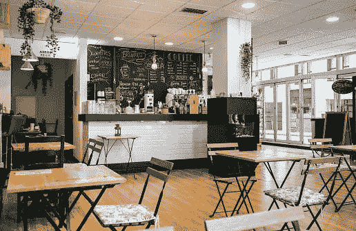
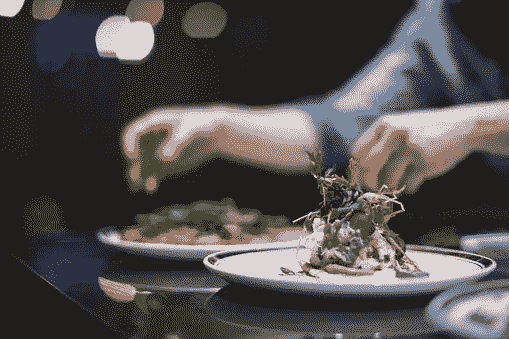
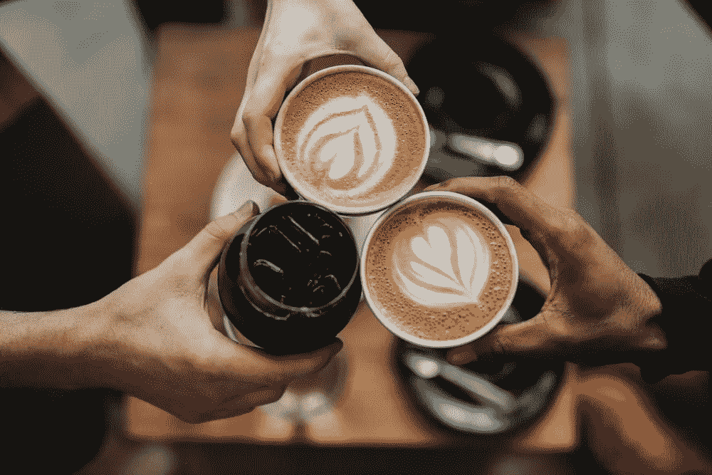

# 用人工智能推进今天的咖啡馆

> 原文：<https://blog.devgenius.io/advanced-cafes-today-with-artificial-intelligence-79c903774344?source=collection_archive---------10----------------------->

# 用 Prisma AI 解决方案让咖啡馆再次成为现实

咖啡馆在某种程度上被餐馆所掩盖，餐馆在餐饮方面有更多的选择。充其量，咖啡馆是休闲和短暂的座位。与高级餐厅相比，小的尺寸和有限的空间，以及可消费的选择，使它们整体上缺乏吸引力。因此，随着当今技术的快速发展，咖啡馆需要更新换代。

# 人工智能发挥作用的地方

[人工智能](https://prisma.ai/)是一种新时代的创新，有可能为当今世界任何过时的东西带来新的生命和功能。[应用于咖啡馆的人工智能解决方案](https://prisma.ai/prisma-solutions.html)可以改善它们的功能并增加新的可能性，导致更多的顾客在体验升级的设施后被吸引到咖啡馆。Prisma AI 提出了许多解决方案，通过改进流程和增加改进的功能来帮助咖啡馆。

# 监控酒类盗窃

能够跟踪、计数、分析情况并有助于实时监控的系统，这将有助于处理酒类盗窃。在这个系统中，视觉人工智能摄像机将跟踪提供的酒杯，并显示最终提供的酒的总数，这将有助于检测调酒师或工人是否正在饮用下落不明的酒或果汁。

# 交互式表格

互动桌是一种透过玻璃的电容式触摸屏技术。这项技术用于捕捉用户在玻璃/丙烯酸表面上的实际触摸。这项技术提供了完全互动的体验。它有无限的创造性使用的可能性，特别是作为一种向客户传递信息的媒介，以及作为客户娱乐的来源。

# 跟踪所供应菜肴的数量

通过在场所中安装智能人工智能摄像机，可以监控菜肴的流动，并可以分析产品的数量。这还可以检测是否有工人正在吃这些盘子，或者是否有食物下落不明/消失。

# 明天的咖啡馆就在今天

随着人工智能和更多即将到来的技术的使用，咖啡馆的升级潜力很大，在未来将是一个正常的景象，今天有可能成为一个常见的景象。这些高级咖啡馆将吸引更多的顾客，功能和技术流程将更加高效和简化，减轻咖啡馆员工的负担，并延长任何连锁咖啡馆的寿命

