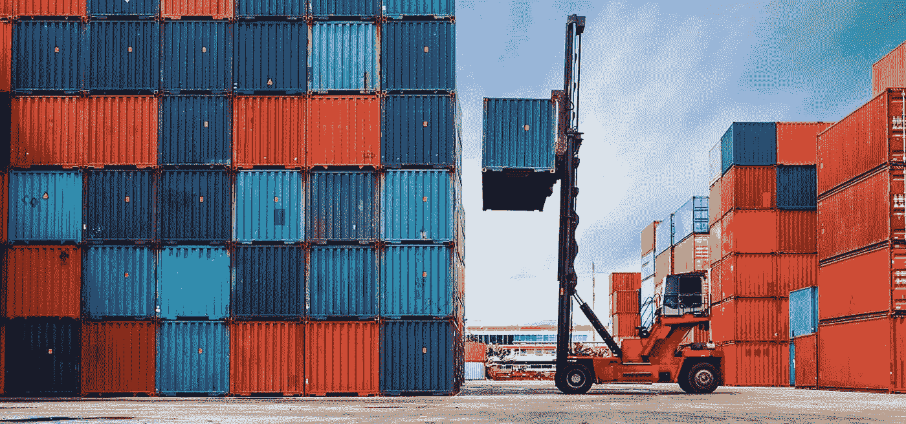
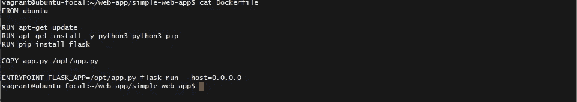
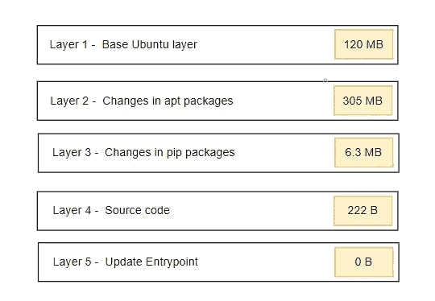
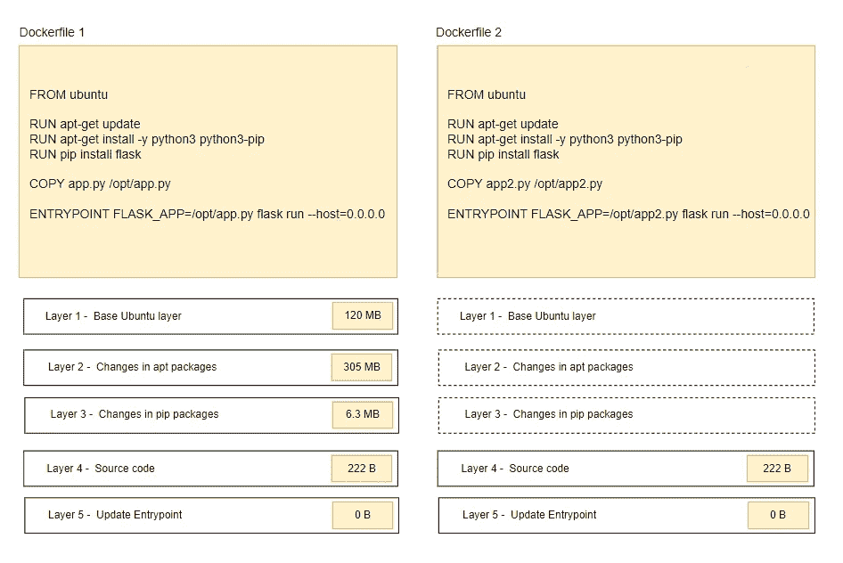
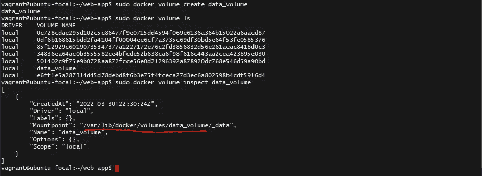

# 高级 Docker — Docker 存储驱动程序和文件系统

> 原文：<https://blog.devgenius.io/advanced-docker-docker-storage-drivers-and-file-systems-81a5340c0761?source=collection_archive---------6----------------------->

在本帖中，我们将讨论高级 docker 概念。我们将看到 docker 如何存储数据，以及它如何管理容器的文件系统。如果你还没有阅读，请在继续之前阅读绝对初学者的文章。

## 文件系统

当你在一个系统上安装 docker 时，它会创建一个 **/var/lib/docker** 文件夹结构，默认情况下存储所有与 docker 主机上运行的映像和容器相关的数据。

那么，docker 到底是如何存储一个图像和一个容器的文件的呢？

要理解这一点，我们需要先了解 docker 容器的分层架构。

## 分层架构

在[之前的帖子](https://yonatan-merkebu.medium.com/docker-for-the-absolute-beginner-8c6dbcd71e4b)中，我们看到了如何建立一个码头工人的形象。当 docker 构建映像时，它构建在一个分层架构中。docker 文件中的每一行指令都会在 docker 映像中创建一个新层，仅包含前一层的更改。

让我们以[前一篇文章](https://yonatan-merkebu.medium.com/docker-for-the-absolute-beginner-8c6dbcd71e4b)中的 docker 文件为例。

第一层是一个基本的 ubuntu 层，随后是第二条指令，它创建了第二层，第二层安装 apt 包，第五层更新入口点。

由于每个层仅存储前一层的更改，因此它也反映在大小上。

为了理解分层架构的优点，让我们考虑另一个应用程序。

新应用程序与之前的应用程序相同，只是源代码不同(app2.py)。

当您运行 **docker build** 命令为这个应用程序构建一个映像时，因为应用程序的前三层是相同的，所以 docker 不会构建它们。它从缓存中重用它们。这种方式 docker 建立图像更快，更有效地节省磁盘空间。

图像图层是只读的。要编辑它们，您必须再次重建您的映像。

当您使用 **docker build** 命令基于您的图像创建容器时，docker 会在图像层之上创建一个新的可写层(容器层)。该层用于存储由容器创建的数据。

当容器被销毁时，层和存储在其中的所有文件也被销毁。

## 卷

那么，如果您希望持久保存这些数据，该怎么办呢？例如，如果您正在处理一个数据库，并且您想要保留由容器创建的数据，您可以向容器添加一个持久的**卷**。

为此，首先使用命令创建一个卷

> sudo docker 创建卷数据 _ 卷

这将在 **/var/lib/docker/volumes** 目录下创建一个 **data_volumes** 文件夹。

然后，当您运行容器时，您可以使用下面两个命令中的任何一个将这个卷挂载到写入层中。建议使用 mount 命令，因为它更详细。在这里阅读更多。

> docker run-d-v data _ volume:/var/lib/MySQL
> 
> docker run -d —挂载类型=卷，源=数据 _ 卷，目标=/var/lib/mysql mysql

这种方法叫做**卷装**。

如果我们的数据已经在另一个地方了，会怎么样？比如在 **/data/mysql** ？

我们可以像提供卷一样提供文件夹的完整路径。

> docker run-d-v/data/MySQL:/var/lib/MySQL MySQL
> 
> docker run -d — mount type=bind，source= /data/mysql，target=/var/lib/mysql mysql

这种方法称为**捆绑安装**。

## 我们有两种坐骑:

**卷挂载**:从卷目录挂载一个卷。

**绑定挂载**:从 docker 主机上的任何位置挂载一个目录。

如果您使用尚不存在的卷启动容器，Docker 会为您创建该卷。

## 那么谁负责所有这些操作呢？

维护分层架构、创建可写层、跨层移动文件等。由**存储驱动**负责。

Docker 使用存储驱动程序来实现分层架构。一些常见的存储驱动程序有 **AUFS、ZFS、BTRFS、设备映射器、覆盖、覆盖 2** 。

存储驱动程序的选择取决于底层操作系统(OS)。例如，ubuntu 的默认存储驱动是 AUFS。Docker 将根据您的操作系统选择最佳的存储驱动程序。

好了，暂时就这样了。我希望这有所帮助。更多关于 Docker、Docker compose、Docker swarm 的高级主题…即将推出！跟着我不要错过他们。