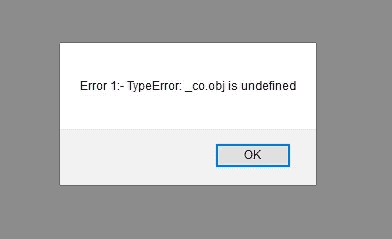

# 利用 Angular 中的依赖注入功能进行高级异常处理

> 原文：<https://blog.devgenius.io/advanced-exception-handling-with-power-of-dependency-injection-in-angular-93cd7422f051?source=collection_archive---------3----------------------->

> 每个应用程序都应该有一个强大的异常处理机制，在大多数情况下，我们希望有一个全局异常处理层来处理所有这些异常，或者记录这些异常，并将它们发送到服务器以存储我们的日志。

在本文中，我们只讨论应用程序错误，而不是 HTTP 错误。因为它们可以使用 HTTP 拦截器来处理。但是对于其他类型的错误，Angular 为我们提供了一个称为错误处理器的接口。我们必须实现这个接口，并在如下模块中提供它。

**全局错误处理器**

**在模块**中提供全局错误处理程序

> 这将开始处理所有错误，并在控制台中打印出来。但是，如果我希望我的应用程序有多个错误处理程序，每个都有各自的用途，该怎么办呢？例如，一个用于打印，一个用于发送到服务器等。我发现的一个解决方案是用另一个类扩展一个类，并调用父类的 super.handleError()。类似下面的东西。

听起来不错。但是，如果我想在这个层次结构之间添加更多的处理程序，这将需要更多的更改。我想实现一个类似 HTTP_INTERCEPTORS 的行为，其中我提供了多个错误处理程序，它应该按顺序调用它们。如果我能做到这一点，添加/删除拦截器只需要添加一个提供者。

> 为此，我需要理解什么是 HTTP_INTERCEPTORS，我查看了 Angular 代码，发现它是一个 InjectionToken 数组。我决定使用相同的方法来实现我想要的行为，并创建了一个名为 ERROR_HANDLERS 的新的 InjectionToken 数组。

完成同样的工作后，这就是我的 providers 数组的样子。

> 我现在可以在我的应用程序中添加任意数量的错误处理程序，它们将在 providers 数组中按使用顺序被调用。让我们看看如何实现这一点。

1.  首先，我们必须定义一个注入令牌数组，比如 HTTP_INTERCEPTORS。

2.现在我想添加我的全局错误处理程序。

**第一个错误处理器**

**第二个错误处理器**

3.现在我们需要一个类来访问我们的 ERROR_HANDLERS，并按照它们被注入的顺序调用它们的 handleError 方法。

这就是依赖注入的力量。我们在那个注入令牌数组中获得了两个错误处理类实例，即 **ERROR_HANDLERS** ，因为我们在 providers 数组中为它们提供了这个令牌。让我们再次看看我们的提供商阵列。

所以我们说 **MyErrorHandler** 类将处理所有错误，现在在这个类中，我们通过使用我们的注入令牌数组(即 ERROR_HANDLERS)从注入器获得所有实例，并且我们调用每个处理程序的 handleError 方法。让我们看看我们的实际实现。我在 app.component.ts 的 ngOnInit 中抛出了异常。

这是输出。

现在，我们可以使用新的注入令牌添加任意数量的全局错误处理程序，例如 **ERROR_HANDLERS** ，就像 HTTP_INTERCEPTORS 一样。

以上内容适用于您或 Angular 抛出的所有类型的异常。我们通常在模板中找不到未定义错误的字段。让我们来看一个例子。

我们忘记了使用安全遍历运算符，即**(？我们通常会得到一个错误的控制台，因为说找不到未定义的名称。如果没有新的错误处理程序，我们会得到如下警告。**

您可以将这些异常发送给 API，以便登录服务器，下次任何用户抱怨异常或应用程序挂起时使用。您有这些日志来检查用户面临的异常。