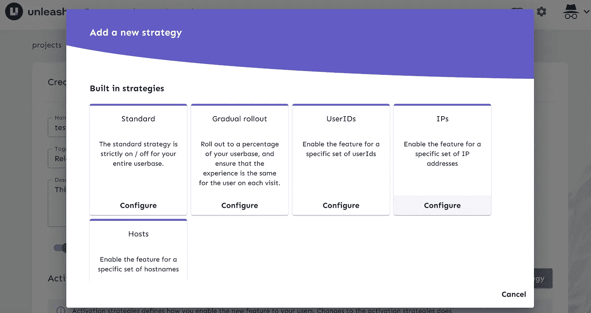
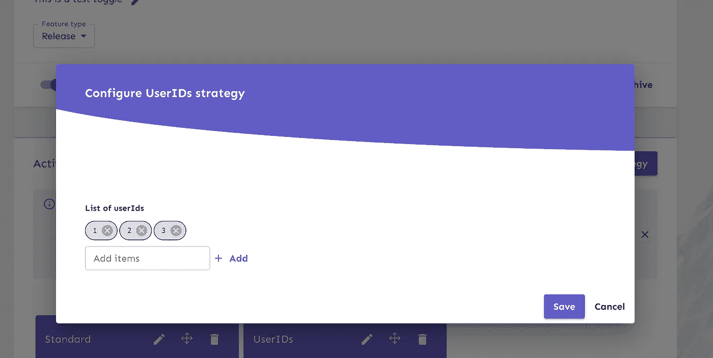
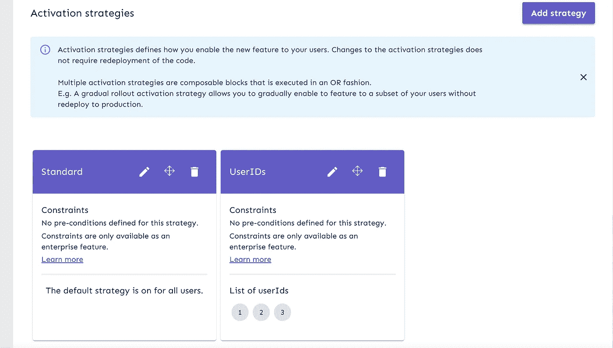
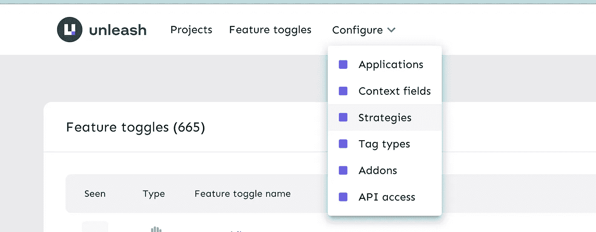
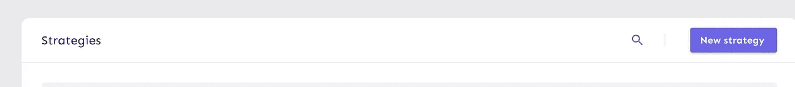
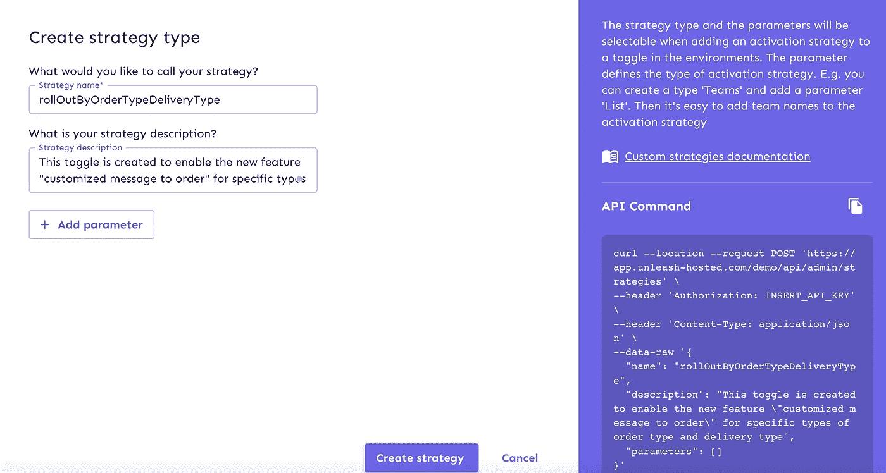
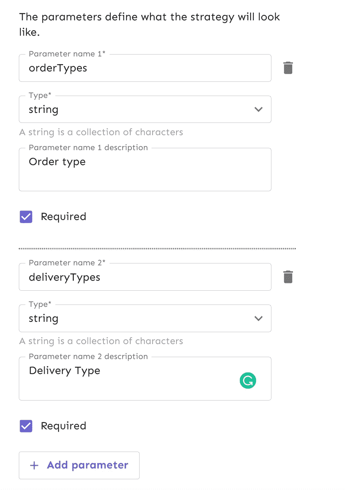
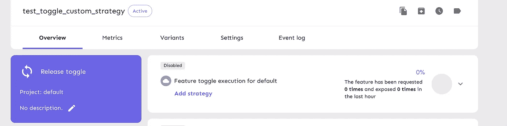
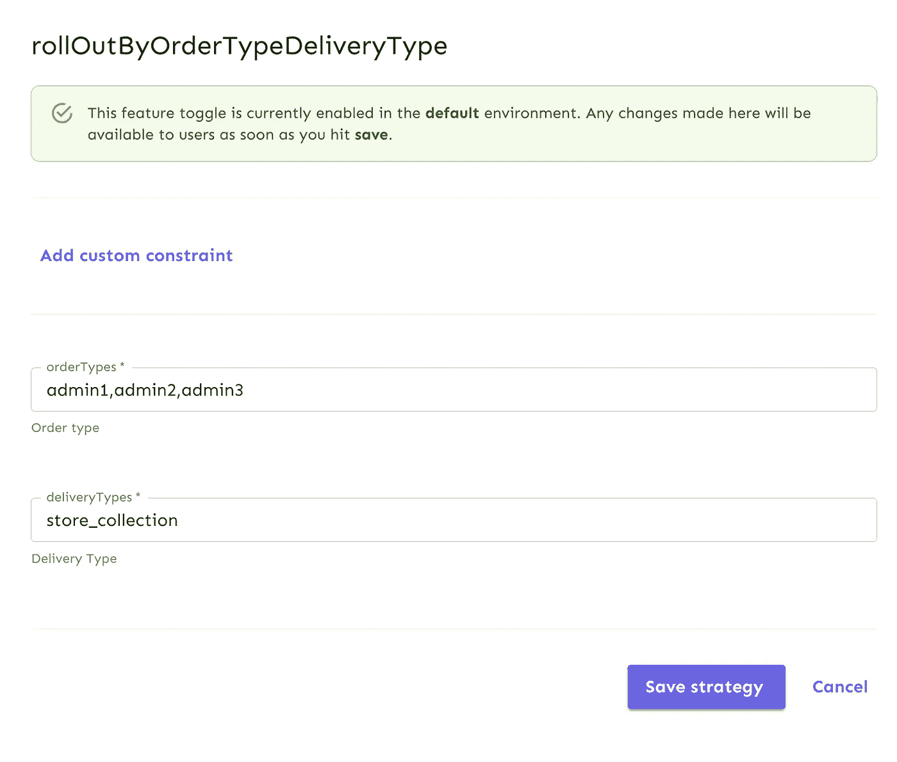

# 使用 Unleash 切换高级功能(Java 实现)

> 原文：<https://blog.devgenius.io/advanced-feature-toggle-using-unleash-java-implementation-5d5e95ed6052?source=collection_archive---------3----------------------->


***在本帖中，我们将介绍功能切换的一个高级用例，以及 Unleash 如何通过客户端和由 Unleash 提供的 Java SDK 帮助实现这一点。***

如果你不熟悉功能切换，它的好处，释放，如何设置，以及它将如何帮助实现功能切换，这里是你可以参考的[帖子](/feature-toggle-using-unleash-d19d17d0366d)

上面的帖子将涵盖什么是策略，但我们将深入探讨每一个策略，以及在何种情况下它可能是有用的，以及如何实现自定义激活策略

**释放中的策略是什么？**

策略是一种条件，通过评估来决定切换是打开还是关闭。“释放”提供了一个内置激活策略列表，可用于决定触发条件。

多个策略可以与一个功能切换相关联。我们可以定义一个策略，并在多个切换中重用相同的策略

下面是每次切换检查时由 Unleash SDK 评估的代码

```
private boolean checkEnabled(String toggleName, UnleashContext context, BiFunction<String, UnleashContext, Boolean> fallbackAction) {
        this.checkIfToggleMatchesNamePrefix(toggleName);
        FeatureToggle featureToggle = this.toggleRepository.getToggle(toggleName);
        UnleashContext enhancedContext = context.applyStaticFields(this.config);
        boolean enabled;
        if (featureToggle == null) {
            enabled = (Boolean)fallbackAction.apply(toggleName, enhancedContext);
        } else if (!featureToggle.isEnabled()) {
            enabled = false;
        } else {
            if (featureToggle.getStrategies().size() == 0) {
                return true;
            }enabled = featureToggle.getStrategies().stream().anyMatch((strategy) -> {
                Strategy configuredStrategy = this.getStrategy(strategy.getName());
                if (configuredStrategy == UNKNOWN_STRATEGY) {
                    LOGGER.warn("Unable to find matching strategy for toggle:{} strategy:{}", toggleName, strategy.getName());
                }return configuredStrategy.isEnabled(strategy.getParameters(), enhancedContext, strategy.getConstraints());
            });
        }return enabled;
    }
```

对于每个切换，都有 2 个检查是由释放 SDK 在内部进行的

1.检查该功能本身是开还是关(第 8 行)

2.为了检查是否有与该特性相关联的策略，以及是否有一个以上的策略可用于切换，SDK 检查是否有任何条件(我们将很快看到每个策略内部检查的具体内容)评估为真(第 15 行)。

请检查 configuredStrategy.isEnabled 方法的第一个参数

**strategy.getParameters()** 它将包含在客户端 UI 中为策略配置的参数。SDK 确保将这些值作为带有键和值的映射从 UI 中传递(键和值是专门为切换配置的)。

下面是现成可用的策略选项列表。为了在我们的 SDK 中使用它们，我们不需要任何改变，因为 SDK 包含了它们的实现。

*   **标准** —默认策略，意味着要么全部开启，要么全部关闭

这是最简单和最直接的策略，可用于释放，如果你想采取二元决策的 100%的流量，然后这是要使用的策略。

Unleash SDK 提供的默认实现如下所示

```
public final class DefaultStrategy implements Strategy {
    private static final String STRATEGY_NAME = "default";public DefaultStrategy() {
    }public String getName() {
        return "default";
    }public boolean isEnabled(Map<String, String> parameters) {
        return true;
    }
}
```

正如您所看到的，因为它是针对 100%的用户的，所以策略评估的默认实现总是返回 TRUE，这使得特性的开/关是唯一的决定因素

*   **用户标识** —我们可以在 Unleash UI 中定义一个用户标识列表，只有那些已定义的用户，切换才会处于打开状态，而其他用户则处于关闭状态

一旦创建了一个切换，您需要在 UI 中专门添加策略，如下所示(点击配置用户 id)



在下一个屏幕中，您应该可以选择将用户 id 列表指定为逗号分隔的值。



并点击保存。下一个屏幕将显示为特性切换配置的策略列表，请注意，至少需要一个与切换相关的策略。



上面列出的 UserId 的值是特定于开关的，并且可以针对与之关联的每个开关进行更改。SDK 实现的 UserId 策略如下所示

```
public final class UserWithIdStrategy implements Strategy {
    protected static final String PARAM = "userIds";
    private static final String STRATEGY_NAME = "userWithId";public UserWithIdStrategy() {
    }public String getName() {
        return "userWithId";
    }public boolean isEnabled(Map<String, String> parameters) {
        return false;
    }public boolean isEnabled(Map<String, String> parameters, UnleashContext unleashContext) {
        return (Boolean)unleashContext.getUserId().map((currentUserId) -> {
            return Optional.ofNullable((String)parameters.get("userIds")).map((userIdString) -> {
                return Arrays.asList(userIdString.split(",\\s?"));
            }).filter((f) -> {
                return f.contains(currentUserId);
            }).isPresent();
        }).orElse(false);
    }
}
```

isEnabled 方法的第一个参数是一个 Map <string string="">,它将包含一个以逗号分隔的 userIds 列表，如下所示</string>

密钥—用户标识

值— 1，2，3

isEnabled 方法的第二个参数是 UnleashContext，它包含以下属性

*appName*

*环境*

***userId***

*会话 Id*

*远程地址*

*映射<字符串，字符串>属性——可用于定制策略(我们将在本博客中看到)*

这些是由 Unleash 提供的内置属性，以迎合各种激活策略。在这个上下文中，当 isEnabled()方法作为 UnleashContext 对象被调用时，应该为 userId 提供当前的 userId

```
isEnabled(UnleashContext.builder().userId("1").build);
```

请注意，在上面的 isEnabled()方法调用中，只需要释放上下文，SDK 负责在内部调用策略，并传递在释放 UI 中配置的值作为逗号分隔值的映射(Key=userIds，value="1，2，3 ")。

正如您在上面的代码中看到的，由 Unleash SDK 提供的现有实现试图检查 Unleash 上下文中存在的 userId 是否存在于地图中(userId 在 Unleash UI 中维护)

我不包括其他策略的实现，因为他们将根据策略类型进行类似的检查。

他们的实现可以在 [**释放 Java SDK Github**](https://github.com/Unleash/unleash-client-java/tree/main/src/main/java/io/getunleash/strategy) 中看到

*   **IP**—我们可以在 Unleash UI 中定义一个 IP 地址列表，只有那些已定义的 IP，切换才会处于打开状态，而其他 IP 则处于关闭状态

与 UserId 策略类似，这需要在 unleash UI 中与 IP 地址列表一起设置，SDK 使用此数据来评估当前 IP 的切换是开/关

*   **主机名** —我们可以在 Unleash UI 中定义一个主机名列表，只有那些已定义的主机名，切换才会处于打开状态，而对于其他主机名，切换会处于关闭状态
*   **逐步推广** —该策略将所有逐步推广策略合并为一个策略。我们可以在这个策略中定义粘性和展示百分比

除了上述策略，我们还可以在 UI 中定义自己的定制策略，并定义其服务器端实现(我们将在另一篇博客中看到)。

多个策略可以与一个功能切换相关联。我们可以定义一个策略，并在多个切换中重用相同的策略

什么是定制策略，如何创建定制策略？

尽管 Unleash 提供了许多内置策略来解码 toggle 状态，但有时我们可能需要验证特定的规则，然后才能决定 toggle 是否打开/关闭，在这种情况下，我们可以创建[自定义策略](https://docs.getunleash.io/advanced/custom_activation_strategy)。

例如，我们有一个应用程序，它从多个来源(店内订单、网站订单、管理订单、来自第三方的订单等)获取客户订单，对其进行处理，然后将汇总的订单发送给供应商。我们希望实现一个功能，其中订单可以包含与产品相关联的定制消息。但是在向公众发布这项功能之前，我们想尝试一下这个功能。因此，我们希望实现一个功能切换，仅当切换打开时，才在供应商订单上应用定制消息。

我们希望只为管理订单测试这些订单，这些订单是在商店收集的，以便以风险较小的方式验证解决方案。

因此，切换评估标准是

*   订单类型应为“管理”
*   交货类型应为“商店 _ 集合”

由于我们有评估切换的定制需求，我们需要在 Unleash UI 中创建一个定制策略，并在服务器端实现该策略。

让我们看看如何创建和实现它

**在 Unleash UI 中创建自定义策略**

导航至释放 UI(如果您没有进行任何设置，请阅读[此](/feature-toggle-using-unleash-d19d17d0366d))并点击配置(高级)>策略



点击下一个屏幕上的新策略



填充切换名称和描述



点击添加参数，然后点击“创建策略”



一旦创建了策略，它就可以与任意数量的切换相关联。创建一个切换(您可以参考[这篇](/feature-toggle-using-unleash-d19d17d0366d)文章了解相关步骤)并通过点击屏幕下方的“添加策略”并选择新创建的策略来链接它



为我们希望启用此新功能的策略填充值，并保存该策略



**如何在服务器端实现自定义策略**

实现一个定制策略并使用它来决定切换状态将需要 2 个变化

1.  **实施自定义策略定义**

我们需要实现由 Unleash 提供的策略接口

```
import java.util.Arrays;
import java.util.Map;import org.springframework.stereotype.Component;
import org.springframework.util.ObjectUtils;import lombok.RequiredArgsConstructor;
import no.finn.unleash.UnleashContext;
import no.finn.unleash.strategy.Strategy;[@Component](http://twitter.com/Component)
[@RequiredArgsConstruc](http://twitter.com/RequiredArgsConstruc)tor
public class RolloutByOrderTypeDeliveryType implements Strategy {protected static final String STRATEGY_NAME = "rolloutByOrderTypeDeliveryType";
    private static final String ORDER_TYPE_PARAM = "orderType";
    private static final String DELIVERY_TYPE_PARAM = "deliveryType";
    private static final String ALLOWED_ORDER_TYPES = "orderTypes";
    private static final String ALLOWED_DELIVERY_TYPES = "deliveryTypes";[@Override](http://twitter.com/Override)
    public String getName() {
        return STRATEGY_NAME;
    }[@Override](http://twitter.com/Override)
    public boolean isEnabled(Map<String, String> map) {
        return false;
    }/**
     * Evaluation method to analyse toggle state for the given order type and delivery type
     * <p>
     * parameters will contain the key value pairs maintained in Unleash UI for instance <orderTypes,"admin1,admin2,admin3">
     * unleashContext.properties should be populated with the current orders order type and delivery type by the calling method
     * with key <orderType,"admin1"> and <deliveryType,"store_collection">
     *
     * [@param](http://twitter.com/param) parameters
     * [@param](http://twitter.com/param) unleashContext
     * [@return](http://twitter.com/return)
     */
    [@Override](http://twitter.com/Override)
    public boolean isEnabled(Map<String, String> parameters, UnleashContext unleashContext) {
        if (parameters == null || unleashContext == null) {
            return false;
        }var orderType = unleashContext.getProperties().get(ORDER_TYPE_PARAM);
        var deliveryType = unleashContext.getProperties().get(DELIVERY_TYPE_PARAM);
        var allowedOrderTypes = parameters.get(ALLOWED_ORDER_TYPES);
        var allowedDeliveryTypes = parameters.get(ALLOWED_DELIVERY_TYPES);if (ObjectUtils.isEmpty(allowedOrderTypes) || ObjectUtils.isEmpty(allowedDeliveryTypes)) {
            return false;
        }return Arrays.asList(allowedOrderTypes.split(",\\s*")).stream().anyMatch(appIdList -> appIdList.contains(orderType)) &&
               Arrays.asList(allowedDeliveryTypes.split(",\\s*")).stream().anyMatch(institutionIdList -> institutionIdList.contains(deliveryType));
    }}
```

请注意，该类用“@Component”进行了注释，因此它可以连接到 unleash config 类。

上面的实现需要被挂钩，以将配置作为 bean 释放，以便它在实例化期间被获取，并且在运行时释放将能够调用策略并传递 UI 中维护的值

Bean 可能看起来像这样

```
[@Bean](http://twitter.com/Bean)
    public Unleash unleash(final UnleashConfig unleashConfig, List<Strategy> strategies) {
        return new DefaultUnleash(unleashConfig, strategies.toArray(Strategy[]::new));
    }
```

正如您在上面看到的，我们的新策略实现和内置策略实现将在实例化期间被挑选出来，并将被提供给释放配置

**2 使用切换按钮**

一旦自定义策略实现并自动连接到释放配置，我们就可以开始调用释放 isEnabled 方法来决定切换是开还是关

```
[@RequiredArgsConstruc](http://twitter.com/RequiredArgsConstruc)tor
[@Component](http://twitter.com/Component)
public class MyService {// Service provided by Unleash SDK which contains in built method to // perform the toggle evaluation
private final Unleash unleash;/**
     * Existing service which process order and pass order to suppliers
     * If toggle is enabled, processOrder with custom message if not follows existing order process order flow
     *
     * [@param](http://twitter.com/param) order
     * [@return](http://twitter.com/return)
     */
    public OrderResponse processOrder(Order order) { if (unleash.isEnabled("test_toggle_custom_strategy",  UnleashContext.builder().addProperty("orderType", order.getType()).addProperty("deliveryType", order.getDeliveryType()).build())) {
            return processOrder(order, order.getMessages());
        } // Existing flow
        return processOrder(order);
    }
}
```

请注意，我们需要将切换名称和当前处理订单的现有订单类型和交付类型(作为映射)传递给 isEnabled 方法，该方法将调用我们提供的定制策略实现，并能够决定切换状态

这个帖子就到这里，希望这个内容有用。另一篇文章再见！