# 高级 Node.js 主题:缓存。

> 原文：<https://blog.devgenius.io/advanced-node-js-topics-caching-e3d17dc1d738?source=collection_archive---------0----------------------->

## 通过使用 Redis 缓存经常提取的数据来提高服务器性能。


雷迪斯

# 简介:

Redis 是一个内存数据库，以 key: value 格式存储数据，因为它在内存中，所以速度快得离谱。

**Redis 提供数据结构，如字符串、散列、列表、集合、有序集合**

> Redis 是一个开源的(BSD 许可的)，内存中的**数据结构存储**，用作数据库、缓存、消息代理和流引擎。Redis 提供了数据结构，如[字符串](https://redis.io/topics/data-types-intro#strings)、[哈希](https://redis.io/topics/data-types-intro#hashes)、[列表](https://redis.io/topics/data-types-intro#lists)、[集合](https://redis.io/topics/data-types-intro#sets)、[排序集合](https://redis.io/topics/data-types-intro#sorted-sets)、位图、[超级日志](https://redis.io/topics/data-types-intro#hyperloglogs)、[地理空间索引](https://redis.io/commands/geoadd)和[流](https://redis.io/topics/streams-intro)。Redis 内置了[复制](https://redis.io/topics/replication)、 [Lua 脚本](https://redis.io/commands/eval)、 [LRU 驱逐](https://redis.io/topics/lru-cache)、[事务](https://redis.io/topics/transactions)和不同级别的[磁盘持久化](https://redis.io/topics/persistence)，通过 [Redis Sentinel](https://redis.io/topics/sentinel) 和 [Redis 集群](https://redis.io/topics/cluster-tutorial)自动分区提供高可用性。 [redi.io](https://redis.io/docs/about/)

# 案例使用:

为什么应该在服务器中实现缓存层，以及它将如何提高应用程序的性能。

*   定期获取数据
    缓存获取过于频繁的数据是一个很好的实践，你不会让用户等太久才获得基本数据
*   减少针对数据库的查询执行
    通过使用缓存，您将减少针对数据库执行的查询数量，除了性能提升之外，您还可以避免数据库被返回相同结果的重复查询淹没。
    此外，如果你在一个昂贵的托管服务提供商那里托管你的应用，你会节省宝贵的带宽
*   提高应用性能
    缓存不仅可以提高数据库性能并保护数据库，还可以提高服务器-客户端的整体性能。
    为了理解这个概念，让我们假设你的服务器有一个名为 getArticle 的路由，到达这个路由的每个请求将花费大约半秒钟(~500 毫秒)来获得响应，通过缓存，第一个请求将花费大约半秒钟或更长时间，但是每个下一个请求将花费大约(~20 毫秒)！神奇吧？！
    我会用自己的应用证明这一点

# 缓存与无缓存:

我在我的服务器上做了一个简单的基准测试(在单个 API 上，看看在没有缓存的情况下如何完成请求，并在有缓存的情况下重新测试同一个 API，看看改进情况。)

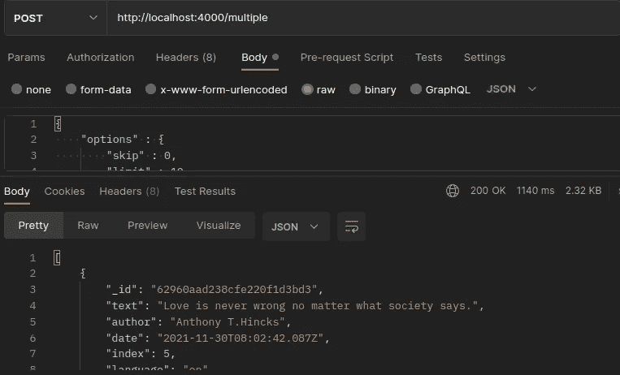

不缓存

上面的图片向你展示了，我的服务器花了一秒多的时间来完成请求，当然，每次我发出一个请求都要花差不多的时间！

下图是我在服务器的 API 中引入缓存机制的时候，你可以自己看到时间上的差异(我没有在请求中做任何改变)

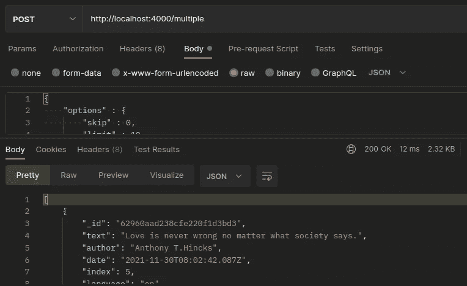

引入缓存

在接下来的时间里，完成同样的请求所需的时间已经减少到大约 10 毫升，这是一个显著的进步！

我希望现在您对在自己的项目中实现这种技术感到兴奋。

# 安装:

## 在您的机器上安装 ***Redis***

在 Linux 中，您可以通过在终端中键入来安装它

```
sudo apt-get -y install redis
```

在 macOS 中，在终端中发出以下命令

```
brew install redis
```

在 windows 中，在 windows 上获得 Redis 有点困难，因为它在 windows 中没有得到官方支持。

> Redis 在 Windows 上不受官方支持。但是，您可以按照下面的说明在 Windows 上安装 Redis 进行开发。
> 
> 要在 Windows 上安装 Redis，首先需要启用[wsl 2](https://docs.microsoft.com/en-us/windows/wsl/install)(Linux 的 Windows 子系统)。WSL2 允许您在 Windows 上本地运行 Linux 二进制文件。要使用这种方法，您需要运行 Windows 10 2004 版或更高版本或 Windows 11。
> 
> [https://redis . io/docs/getting-started/installation/install-redis-on-windows/](https://redis.io/docs/getting-started/installation/install-redis-on-windows/)

## 将 node-Redis 安装到项目中:

node-Redis 是 Node.js 的一个现代化、高性能的 Redis 客户端。

```
npm install redis
```

现在我们安装了 Redis 和 node-redis 包，让我们用这些伟大的工具做简单的工作，然后在一个真实的例子中尝试一下！

## Redis 快速入门:

```
// IMPORTANT : before you can establish connection to redis,// you must start the redis-serverconst redis = require('redis');// create client to communicate redis DBvar client = redis.createClient();(async function () {await client.connect()})()// connect and error eventsclient.on('error', function (err) {console.log('Something went wrong ', err)});client.on('connect', function () {console.log('Redis Connected!')});
```

## 连接到 Redis 服务器:

要启动 Redis 服务器，您需要在终端中运行:

```
redis-server
```

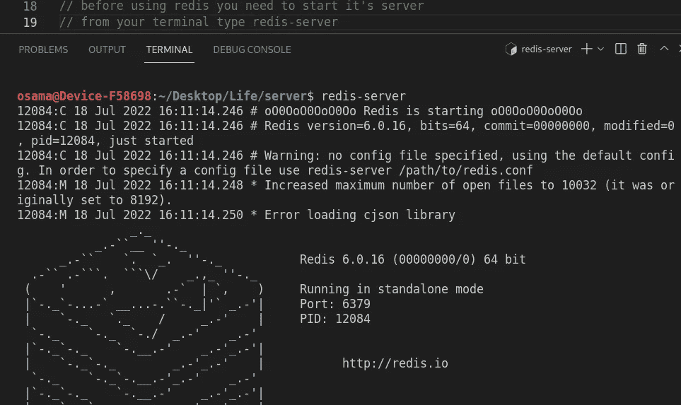

启动 Redis 服务器

示例:

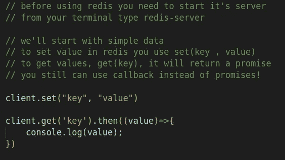

set()和 get()

上面我们创建了一个客户端，并开始连接 Redis 服务器，现在我们可以使用所有的功能。

```
// used to put data into redis
client.set("key" , "some value")// used to get data from redis
client.get("key")
// output = "some value"
```

# 现实世界的例子:

现在最大的问题是，我如何利用这些简单的函数 set()和 get()，来提高我的服务器性能？

让我们看看我自己的服务器(express server 从 MongoDB atlas 中获取报价并发送回。)

该基准测试来自我自己的报价 API(将很快在 RapidAPI 中发布)，我们将看到当我们请求 1000、3000 和 5000 个数据文档时所用时间的差异，这次我将通过从缓存中获取相同的数据来重复测试。

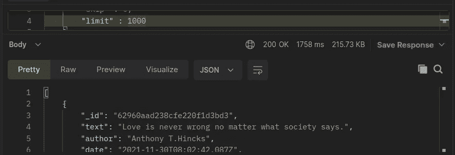

提取 1000 个未缓存的文档

从数据库中获取 1000 个文档几乎需要 2 秒钟

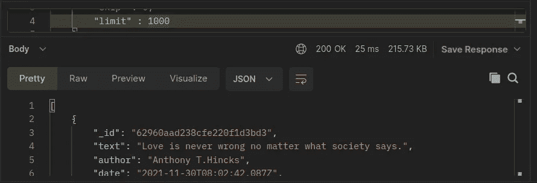

从缓存中取出同样的 1000 个文档

但是从缓存中获取相同数量的数据只需要 25 毫秒！

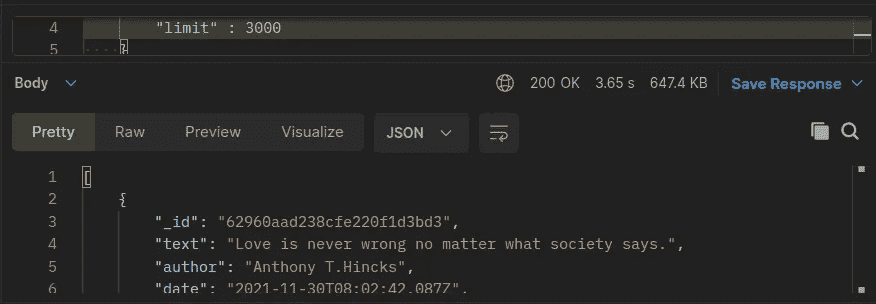

在没有缓存的情况下获取了 3000 个文档

从数据库中获取 3000 个文档几乎花了 4 秒钟！

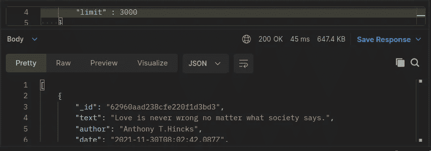

从缓存中获取 3000 个文档

但是从缓存中获取相同数量的数据只需要 45 毫秒！

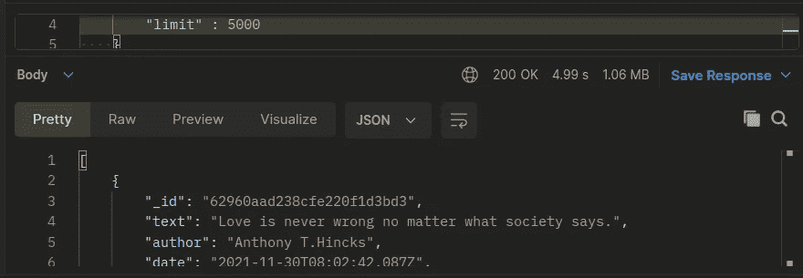

在没有缓存的情况下获取了 5000 个文档

从数据库中获取 5000 个文档几乎花了 5 秒钟！

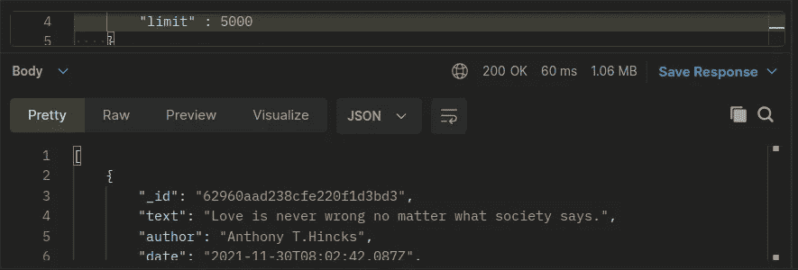

从缓存中获取 5000 个文档

但是从缓存来看，只用了 60 毫秒！

很神奇吧？？

## 缓存机制:

缓存只是在您的服务器上添加另一层，这一层将拦截您的数据库将要执行的查询，它将搜索该查询之前是否被缓存，如果是，它将返回缓存的数据作为响应，而不会将查询发送到数据库，如果查询之前没有被缓存，它将把查询发送到数据库以执行，然后将结果存储在缓存(Redis)中以备即将到来的请求。

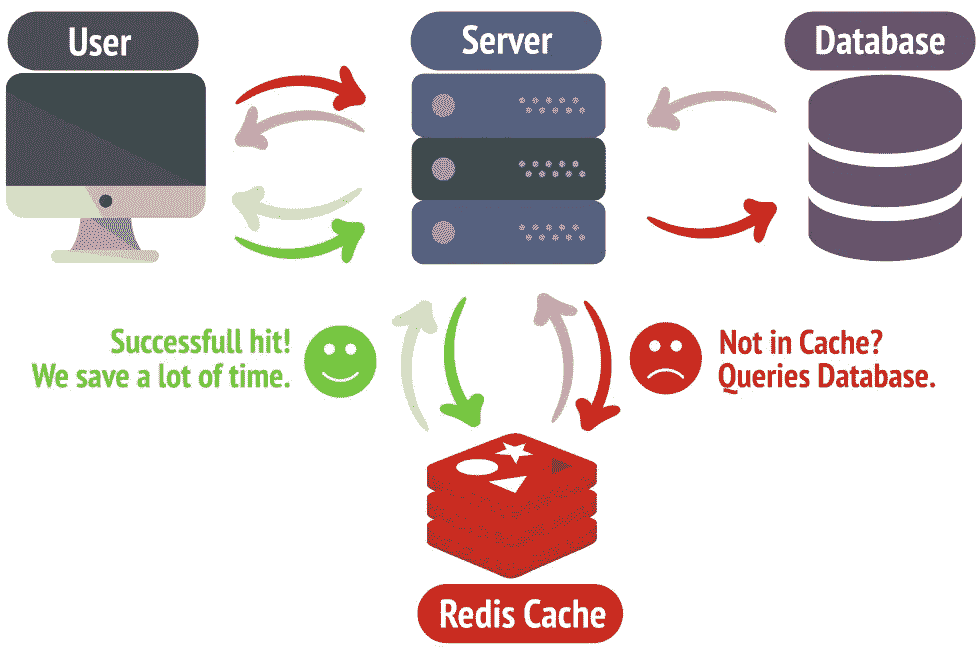

[Linuxiac](https://linuxiac.com/redis-as-cache/) 的积分

所以为了阐明我们想要做的事情:

1.  使用上面的代码将服务器连接到 Redis
2.  我们想要劫持(拦截、中断，随你怎么称呼)向数据库发送查询的过程，这样我们就可以决定这个查询之前是否被缓存
3.  如果缓存了，则返回缓存的数据并结束响应。不要向数据库发送任何内容
4.  如果没有缓存，发送查询以执行，并将结果作为响应发送，然后将结果存储在缓存中以供新请求使用。

首先，您需要在您的项目中创建一个名为 cache.js 的新文件，您可以随意命名它，如果您有服务目录，可以将其放在任何地方。

这个文件将包含我们的服务器缓存数据和从 Redis 检索数据所需的所有逻辑。

开始时，我们需要连接到 Redis 并确保它工作正常

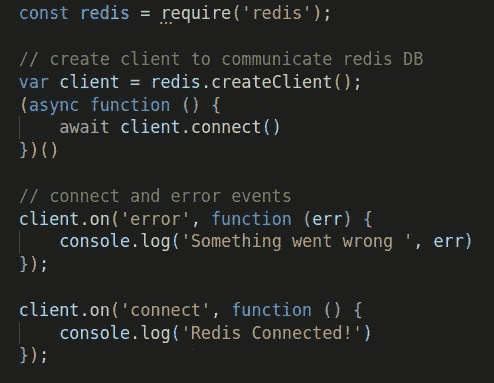

## 密钥创建:

为了在 Redis 中存储数据，我们需要给每个查询一个惟一且一致的键，这样我们就可以在请求到达时检索正确的查询。

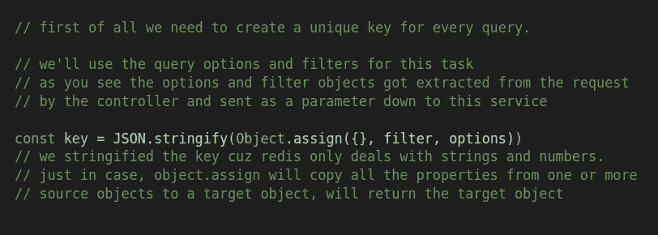

Redis 数据库的密钥创建

基本上，对任何数据库的每个查询都有过滤器和选项来获取特定的文档或记录。

我们将利用这个东西，把这些过滤器变成一个字符串

```
JSON.stringfy({ {title : "story"} , {skip : 10} })
// our key = "{{"title" : "story" }, {"skip" : 10}}"
// everytime any client will request the data that can be fetched
// with this query, the server will repsonse with the cached data
```

现在，我们有了需要在数据库中执行的每个查询的键，接下来我们要做的是在 Redis 中搜索这个键，如果它确实存在，则返回它的值而不是执行查询，如果没有找到，则在数据库中执行查询，并将查询结果及其键存储在 Redis 中以供下次请求使用，然后将结果发送给用户。

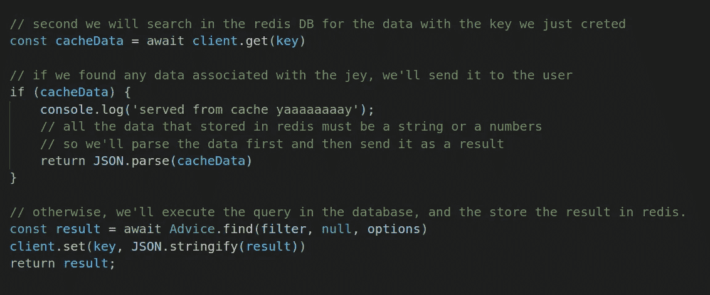

Redis 缓存数据

```
// this line will add the data fetched from mongoDB to redis
client.set(key, JSON.stringify(result))
// always remember, Redis only store values as a string or numbers 
```

## 总结:

首先，您需要为每个查询创建一个惟一且一致的键。

第二，在 Redis 中搜索这个键，如果找到了，返回它的值，如果没有，执行查询并将结果存储在 Redis 中，最后发送给用户。

# 参考资料:

深入学习 node.js 的所有课程中最好的。

[https://www.udemy.com/course/advanced-node-for-developers/?ran mid = 39197&rane aid = saystvligq&ranSiteID = saystvligq-edfb 120 pgycjlhnknsebp 4 q&lsn pubid = saystvligq&UTM _ source = aff-campaign&UTM _ medium = udemyads](https://www.udemy.com/course/advanced-node-for-developers/?ranMID=39197&ranEAID=SAyYsTvLiGQ&ranSiteID=SAyYsTvLiGQ-EDfB120pgYcJlhkNSEBp4Q&LSNPUBID=SAyYsTvLiGQ&utm_source=aff-campaign&utm_medium=udemyads)

[](https://www.digitalocean.com/community/tutorials/how-to-implement-caching-in-node-js-using-redis) [## 如何使用 Redis | DigitalOcean 在 Node.js 中实现缓存

### 大多数应用程序都依赖于数据，无论数据来自数据库还是 API。从 API 获取数据会向网络发送…

www.digitalocean.com](https://www.digitalocean.com/community/tutorials/how-to-implement-caching-in-node-js-using-redis) [](https://blog.risingstack.com/redis-node-js-introduction-to-caching/) [## Redis + Node.js:缓存- RisingStack 工程简介

### 我认为理解和使用缓存是编写代码的一个非常重要的方面，所以在这篇文章中，我将解释…

blog.risingstack.com](https://blog.risingstack.com/redis-node-js-introduction-to-caching/) [](https://dev.to/franciscomendes10866/caching-in-node-js-using-redis-2o80) [## 使用 Redis 在 Node.js 中缓存

### 这一次我们将使用 Redis 在现有的 node.js 应用程序中实现缓存，但是首先让我们了解…

开发到](https://dev.to/franciscomendes10866/caching-in-node-js-using-redis-2o80) [](https://medium.com/geekculture/fasten-your-node-js-application-with-a-powerful-caching-mechanism-using-redis-fd76b8aa482f) [## 使用 Redis 的强大缓存机制来保护您的 Node JS 应用程序

### 使用 Redis 提高应用程序的速度

medium.com](https://medium.com/geekculture/fasten-your-node-js-application-with-a-powerful-caching-mechanism-using-redis-fd76b8aa482f)  [## Node.js 的 Redis OM

### 学习如何用 Redis Stack 和 Node.js 构建这个教程将向你展示如何用 Node.js 和 Redis 构建一个 API

redis.io](https://redis.io/docs/stack/get-started/tutorials/stack-node/) 

感谢您的阅读，如果您有任何关于 javascript 或本系列的问题，请随时提问，我非常感谢您对我的内容的任何反馈。

我希望你能在 [Twitter](https://twitter.com/Osam1010) 、 [Github](https://github.com/osama865/) 和 [my portfolio](http://o-portfolio.netlify.com/) 上找到我。