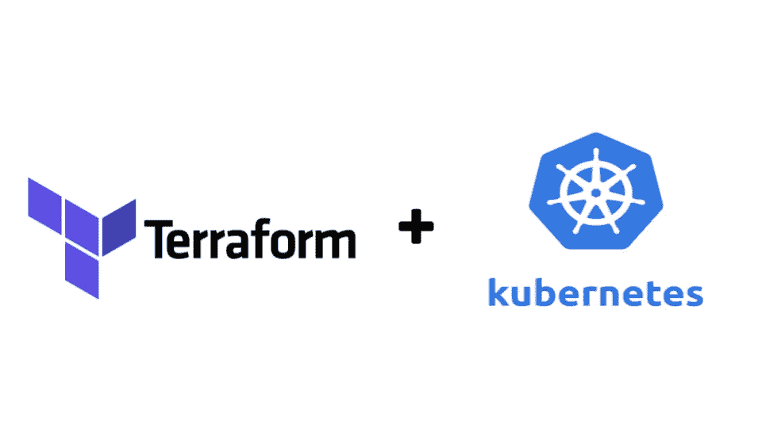

# 高级地形编码方法

> 原文：<https://blog.devgenius.io/advanced-terraform-coding-methods-f9e8ae92fd24?source=collection_archive---------3----------------------->

本文将介绍在云自动化过程中部署 Terraform 时使用的一些概念和方法。本文将遵循使用 Terraform 在 EKS 集群上创建 Kubernetes 应用程序的路径。我们将深入探讨一些用于克服挑战性问题的先进方法和技巧。

**背景:**

接下来的用例是我在为基于 AWS 的登录区构建自动化时面临的一项任务。简而言之，着陆区是一个完整的基于云的环境，其目标是让客户在采用云的几个小时内运行生产级工作负载。这使客户能够在一个设计良好、安全的环境中专注于发展业务。作为我们着陆区产品的一部分，我的团队开发了一种安全应用部署的方法。应用程序部署特性支持几种部署方法，其中之一是使用 EKS 服务在 AWS 上部署基于 Kubernetes 的应用程序。登陆区允许客户从零开始创建大型、复杂和完全定制的云架构，因此 EKS 集群、包含该集群的 VPC、Kubernetes 应用程序和支持资源都将从零开始创建，作为单个 Terraform 模块。

**文章范围:**

我们将探索基于 EKS 的应用程序部署流程的一个特定部分，它负责在集群内创建 Kubernetes 对象(意味着通过在新创建的 EKS 集群内创建 Kubernetes 部署、pod 和服务来创建应用程序本身)。一个重要的部署需求是允许用户提供他们自己的 Kubernetes 清单文件，这意味着我们必须构建能够对所提供的清单文件中的几乎任何应用程序定义做出反应的 Terraform 代码。这个需求的一个关键特性是允许 Kubernetes 应用程序能够与非 Kubernetes、AWS 资源进行交互，这些资源通常不属于 EKS 集群。这是许多障碍的原因，我们将在本文的后续部分看到。

**在我们开始之前:**

在开始之前，我们需要弄清楚几件事:

1.  本文中没有显示所有的资源。为了保持这篇文章的正常长度，并把重点放在有趣的东西上，我们不打算详细介绍基本的设置。就本文而言，我们已经在 Terraform 创建了一个包含 EKS 集群的 VPC，我们的 Terraform Kubernetes 提供程序允许我们访问该集群。如果您想继续学习，可以在这篇文章之后进入文章的起点:[https://space lift . io/blog/how-to-provision-AWS-eks-kubernetes-cluster-with-terraform](https://spacelift.io/blog/how-to-provision-aws-eks-kubernetes-cluster-with-terraform)
2.  代码中没有显示“local-app-path”和“subnet_ids”的变量定义，但是使用了变量值。每个都有非常简单的功能。

太好了！我们开始吧-

**代码:**

清单 1

让我们概述一下这段代码做了什么，以及我们在这里看到的 Terraform 资源。

1.  Kubectl_manifest(第 6–10 行)—这是一个 Terraform 资源，是 Kubernetes on Terraform 产品的一部分。该资源将在 YAML 获取一个原始的 Kubernetes 配置文件，并简单地在集群中应用已定义的资源。这相当于在普通的 Kubernetes 集群中运行 *kubectl apply -f file.yaml* 。
2.  aws_ebs_volume(第 12–16 行)—这是一个创建 aws 块存储(可以连接到 EKS 集群节点的磁盘)的 terraform 资源。存储在 Kubernetes Pods 或卷中的数据不是持久的，一旦切换 pod 或集群更新，数据就会丢失。为此，我们在 AWS 中创建 EBS 卷，这样数据将存储在持久的 AWS 资源中，而不是 Kubernetes 资源中。
3.  Path local(第 2 行)——这是一个局部变量，帮助确定构成应用程序的 Kubernetes 清单文件存储在哪里。由用户提供，如果不是由用户提供，则默认为具有默认 pod YAML 定义的模块。
4.  Volumes local(第 3 行)—这有助于确定需要创建多少个 EBS 卷(将在本文后面更详细地讨论)。

这段代码实际上做了什么:

这段代码将使用用户提供的 Kubernetes 清单文件将应用程序部署到 EKS 集群。kubectl_manifest 资源使用 for_each 循环来部署位于用户提供的路径中的每个 YAML 文件。所有需要安装卷的 Kubernetes 对象都将收到一个唯一的 EBS 卷。

**问题陈述:**

1.  我们面临的一个主要问题是让我们在 EKS 集群中创建的 pod 能够在 EBS 卷中存储数据(网络存储等解决方案是不可能的)。为了让 pod 或部署将数据存储到 EBS 卷，需要将 EBS 卷挂载到 Kubernetes 清单文件中的 pod。这个坐骑看起来太-

清单 2

正如我们在清单 2 中看到的，第 16 行需要卷 ID。正如我们前面提到的，Kubernetes 清单文件是由用户提供的(在部署期间)，并且随着 EBS 卷 ID 的不同，每个部署都会有所不同。这使得在一个自动化周期内创建 EBS 并将卷附加到 pod 变得非常困难。

2.每个 EBS 卷只能连接到一个单元/部署。这造成了双重问题。

*   用户提供 Kubernetes 清单文件，我们如何知道有多少 pods 将调用清单 2 中所示的 EBS 卷 ID？我们需要创建多少 EBS 卷？
*   一旦我们创建了正确数量的 EBS 卷，我们如何确保每个单元都将收到一个唯一的 EBS 卷 ID(因为每个 EBS 卷只能安装到一个单元/部署中)。

**解决方案:**

**在本解决方案中，我们假设用户提供了 3 个文件(pod.yaml、dep.yaml 和 service.yaml at /opt。文件 pod.yaml 和 dep.yaml 调用了一个 EBS 文件(如清单 2 的第 9–17 行所示)**

1.  我们将从解决第二个问题(如何知道要创建多少 EBS 卷)开始，因为第二个问题是解决方案的基础。我们使用 volumes 局部变量来创建地图。这个映射非常简单，它不存储任何重要的数据，它的唯一目的是保存需要 EBS 卷附加到其上的文件名。文件名存储为地图的*键*。映射中的键数量将告诉我们要创建多少 EBS 卷，这可以从 EBS 资源中使用的 for_each 循环中看出(见清单 1 中的第 13 行)。volumes local 使用 for 循环动态迭代用户提供的路径目录中的每个文件名来创建映射。如果 文件满足本地卷中映射后的 if 语句的条件，循环将添加文件名作为映射中的下一个关键字 ***。在我们的例子中，存储在本地卷中的映射看起来是这样的:
    - `{pod.yaml = "file", dep.yaml = "file"}`
    现在有趣的是，我们如何确保只有需要 EBS 卷的文件被添加到映射中？
    为此，我们有了局部变量的第二部分，即以一种非常酷的方式利用 Terraform 的 *if* 语句:
    - `if length(regexall("volumeMount", file("${local.path}/${file}")))>0 == true`
    我们将从 if 语句的中心向外展开，并理解它将文件名作为键添加到 map
    - `file("${local.path}/${file}")`
    的标准。这部分代码使用 file()函数将 Kubernets YAML 文件的内容打开到 Terraform 部署。使用 *local.path* 调用将文件路径传递给函数，使用循环迭代器 *file* 完成文件名。
    - `regexall("volumeMount", file("${local.path}/${file}"))`
    在 if 语句中，我们将使用当前迭代中的 Kubernetes 清单文件的内容(由 file()函数检索)作为 regexall()函数的第二个参数。第一个参数是“volumeMount”。regexall()函数将扫描清单文件文本，查找“volumeMount”的匹配项，并返回一个数组，其中包含找到的每个匹配项。因此，在我们的示例中，如果 for 循环的当前迭代在 *pod.yaml* 处，并且我们知道该文件需要一个 EBS 卷，那么函数将返回一个数组，就像这样`["volumeMount"]`
    - `if length(regexall("volumeMount", file("${local.path}/${file}"))) > 0 == true`
    我们的 if 语句的最后一步是简单地测量 regexall()函数在当前迭代中返回的数组的长度。这是使用 length()函数完成的，如果长度大于 0，则该语句为真，并且文件名将被添加为映射中的下一个键，因为它是一个需要 EBS 卷 ID 的文件。***
2.  为了解决提到的第一个问题(如何将 EBS 卷 ID 实时传递给 Kubernetes 清单),我们需要理解我们使用 kubectl_manifest 资源的方式(清单 1，第 6–10 行)。该资源使用了一个 for_each 循环(第 7 行),该循环遍历所有。yaml”文件放在用户使用 fileset()函数提供的目录路径中。
    在我们的示例 kubernetes 清单的上下文中，资源将运行 3 次，因为我们有 3 个文件(dep.yaml、pod.yaml、service.yaml)。为了提供要求 yaml 原始输入的“yaml_body”需求(第 8 行),我们使用了 templatefile()函数。这允许我们传递文件的内容，同时为文件中预定义的变量集提供值。templatefile()函数的工作方式如下:
    `templatefile(<file_name>, {<map_of_variables_and_values>})`
    传递给函数的第二个参数接受变量和值的映射。变量是您要传递给函数的文件中的占位符。然后，文件中的这个变量将被替换为与映射中的那个变量相关联的值。
    在我们的例子中，映射中唯一的变量是“volumeID”，这意味着 kubernetes 清单文件，当被用户传递到 Terraform 模块时(通过被放置在“local-path-value”目录中并具有一个。yaml "扩展)应该是这样的:

清单 3 中第 14 行的＄{ volumeID }将被替换为对应于“volumeID”键的 map 值，在 map 中作为 templatefile()函数的第二个参数传递(清单 1，第 8 行)。

现在是最后一关！
我们如何确保每个 kubernetes 清单文件(在“volumes”映射中命名)都传递一个唯一的 EBS ID(而不是传递给几个文件的同一个 EBS ID)。
为此，我们将使用 contains()函数来控制传递给 templatefile()映射的值部分的内容。代码看起来是这样的:
- `volumeID = contains(keys(local.volumes), each.key) == true ? aws_ebs_volume.pv[each.key].id : "volume"`
规定上述代码片段逻辑的底层方法是使用映射键来控制资源合作的概念。在我们的示例中，我们迭代 dep.yaml、pod.yaml 和 service.yaml 文件，这些文件都位于/opt 目录中。这个迭代是由 kubectl_manifest 资源中的 for_each 循环完成的。当在“volumes”本地构建映射时，相同目录中的这些完全相同的文件以相同的方式被迭代，并且文件名被用作映射中的键。
这意味着 kubectl_manifest for_each 循环的键值和 local.volumes 中包含的映射的映射键几乎相同。唯一的区别是 local.volumes 映射只包含需要 EBS ID 的文件作为键。这允许我们使用 kubectl_manifest 资源创建所有资源(无论它们是否需要 EBS ID ),并使用 contains()函数过滤 EBS ID 关联。
过滤是通过将来自 for_each 迭代器的每个文件名(迭代器将始终指向一个文件名，因为文件名是文件集函数的键)与 local.volumes 映射的键进行匹配来完成的。当找到一个匹配时，我们知道要添加下一个 EBS 卷 ID，否则传递一个无害的字符串“volume”将无效。

**包装完毕**

在这篇文章中，我们研究了一些非常先进的方法，这些方法用于将一组极其动态的任务链接到一个自动化周期中。我们看到在这里投入使用的主要技能是:

1.  将传统编码实践转化为 Terraform。这在 local.volumes 变量中可以看到，我们在 for 循环中将多个函数链接成一组复杂的 if-else 语句。
2.  使用地图作为动态资源之间的协调器。
3.  使用强大的自动化功能，轻松实现完全定制的部署。