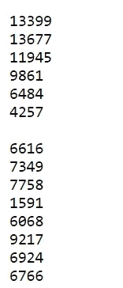
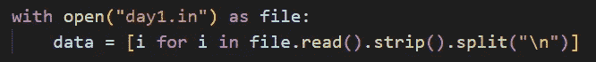
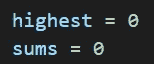
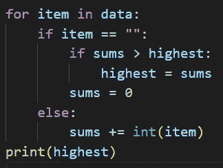
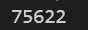
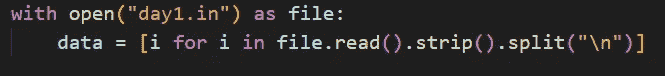
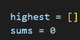
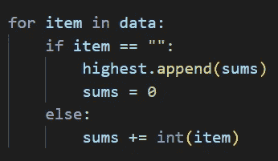
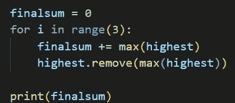
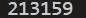

# 代码 2022 的出现—第一天[Python]

> 原文：<https://blog.devgenius.io/advent-of-code-2022-day-1-python-fa66f3e8ff3?source=collection_archive---------0----------------------->

在本文中，我将解决 code 2022 编码日历问世的第一天。

任务:[https://adventofcode.com/2022/day/1](https://adventofcode.com/2022/day/1)

在这个任务中，我们得到了一个输入，这个输入由几组数字组成，这些数字应该代表一个小精灵携带的不同卡路里。在任务的第一部分，我们应该找到卡路里含量最高的精灵。

# 第一部分

输入如下所示:

这是我的输入，你的可能由不同的数字组成，但仍然有相同的结构

每个方块代表一个精灵拿着的东西。在这项任务中，我们将对每个模块求和，然后检查它是否是最高和，然后对下一个模块求和。让我解释得更清楚些。

首先将输入数据加载到程序中:

读入输入

其中 day1.in 是我将从任务中获得的输入放在其中的文件。然后，我将它放入一个名为 data 的列表中，这样我就可以搜索输入的每一行。

接下来要做的是设置一些变量来记录卡路里，以及哪个 elf 包含的变量最多:

最高->最高热量，总和->每个精灵的热量总和

在我们完成这个设置后，是时候遍历我们保存在数据列表中的值，并找出哪一个的卡路里含量最高。

for-loop 确定最高热量总和

这个 for 循环检查给定的行是空的(item == " ")还是包含一个值(else:)。如果这一行是空的，它将检查前一个块的新的卡路里总和是否大于存储在最高变量中的最高值。如果是这样，它用这个和的值替换最大变量的值。

如果该行不为空并且包含一个值，则它会将该值添加到该块的总和中。

for 循环完成后，也就是。它遍历了输入的所有行，打印出问题的答案。

我的回答是:(显示在终端中)

我的回答

# 第二部分

在这一部分，我们应该找到携带最多卡路里的前三个精灵。

输入与第 1 部分相同，我们只需要对第 1 部分的代码做一些修改就可以解决第 2 部分的问题。

仍然像我们在第 1 部分中所做的那样打开输入:

获取输入数据

并分配变量来保存值(这次最高的变量将是一个列表) :

设置变量

然后，我们遍历输入数据列表中的值，如果行上没有值，则将总和保存到最高的列表中，如果行上有值，则将总和相加。(就像我们在第 1 部分中做的那样)

for 循环

然后在这个循环运行完成后，创建一个名为 finalsum 的变量，它将保存前三个精灵的卡路里的最终总和。然后创建一个循环 3 次的 for 循环，将卡路里列表中的最大值(最高值)加到最终的和中。然后从卡路里列表中删除这个值，这样它就不会被添加两次。

循环查找前 3 名

最后，程序打印出最终的总数，这样你就可以得到问题的答案。

我的回答是:(显示在终端中)

我的回答

希望这能帮助你解决这个问题！