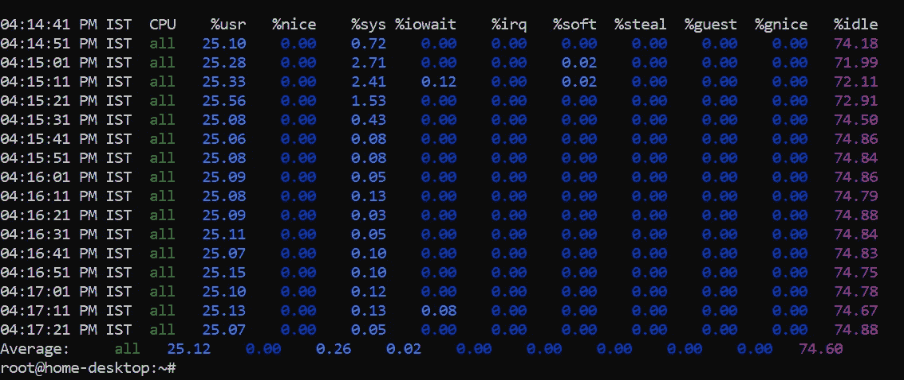

# 在一个美好的周末与树莓派一起冒险

> 原文：<https://blog.devgenius.io/adventures-with-raspberry-pi-over-a-great-weekend-dd04d04df7e3?source=collection_archive---------4----------------------->

## 好吧，就像马克·吐温说的那样。(也是与 Pi 的非正式研究)

# PS:为 UBUNTU 20.10 更新- Groovy Gorilla

在我结束周五的时候收到了 4GB 版的 Raspberry Pi4 之后，没有什么比这个即将到来的周末更有活力的了。

成为一名发烧友并不是用明显的炫耀和华而不实的方式来炫耀这个标签，而是伴随着做事情的强烈欲望——不是带着完全可量化的目标，而是为了纯粹的快乐！为了快乐！

我对家庭自动化的热情可以追溯到 2015 年。当我第一次看到一个带有简单 C 程序的 Arduino 板可以用来打开/关闭世界另一端的灯时，我非常兴奋！这种新的理解让我在很多方面都有了思考！

我当然很好奇，而且更确定我想做更多！但是受到时间、学术、机会和知识的限制。理解整个设置的复杂性并不容易。前面的路也很模糊。就像在黑暗中行走。我确实不太确定该朝哪个方向前进。

虽然那时候“我已经放弃了”——但唯有时间追踪一切。我确实屈服于当时的冲动和需要，但是，我非常勤奋地、非常用心地继续努力理解这些计算机背后的真正“科学”。

我了解了计算机架构——从一组触发器或所谓的寄存器流出的每一位数据是如何与处理器传递的指令相匹配的。指令集是如何在每次迭代改进中产生巨大差异的。最后，x86 体系结构是如何进入名人堂的！然后一切都开始到位了——操作系统、计算机架构、流水线等等！

在这一切进行的同时，在 2018 年，我又做了一次尝试，看看我是否能做得更多！比 Arduino 更重要的东西！而这一次我很自然的选了一个“Pi”——树莓 Pi Zero W。甚至在我尝试之前，我又光荣地失败了。这一次，我被自己对网络理解的局限弄糊涂了。命运又给了我两粒药丸——都是同样的“现在就放弃”。意识到“保护好奇心”比得到微薄的结果更重要，我决心保护我的每一点热情。但是被逼到了绝境，别无选择，我选择了“现在放弃”。在内心深处，我向自己保证，我会暂时放弃，但“以后再继续”。

正如我前面提到的，随着时间的推移，事情就有了着落。最终，所有的网络协议都开始变得有意义，经过努力，我很高兴地尝试了它们。我能够实现它们。在 Kubernetes 和 Docker 获得专业知识后，我几乎没有意识到我正在为未来做准备！

就在这个黎明——我的好奇心被唤醒的黎明。这是一个黎明，我的知识已经形成了足够的形式，我可以运用它！这一次没有屈服于形势的压力。

我保护、庇护和培养健康好奇心的努力最终达到了一致。就在这个周末，我终于给自己提供了另一个机会，看看我是否能为所有的毅力完成一些更令人满意的事情。

在这里，我列出了一些我的实验和我的观察(当然是根据事实)

*   Raspberry Pi(桌面体验)的最佳操作系统——Raspbian、Ubuntu GNOME、Ubuntu MATE。
*   一些有用的应用程序自行托管
*   关于日常使用的观察和澄清

# 树莓 Pi 最佳操作系统(桌面环境)

树莓派不是你日常使用的笔记本电脑。它是建立在 ARM 之上的--这种架构与我们所习惯的通常基于 x86 风格的普通强大 PC 有着明显的区别。最简单地说，Raspberry Pi 功能强大，但不如你日常使用的 PC/Mac 电脑强大(考虑到现在是 2020 年)。所以，它不能取代你家里的台式机(除非你是一个非常轻度的用户)。IK，这对于一个拉斯扁迷来说太残酷了。虽然根据我的经验，这是非常正确的，但它仍然是家庭自动化和其他惊人用途的通用机器之一，如果不是最好的话。在我看来，这是最实惠的迷你服务器。

因此，对于桌面环境来说，虽然 Raspberry PI 操作系统确实服务于绝大多数用户，但也有一个非常强大的替代品——Ubuntu。请注意 [Ubuntu 已经过树莓 PI](https://ubuntu.com/blog/ubuntu-20-04-lts-is-certified-for-the-raspberry-pi) 认证。

Ubuntu 20.10——Groovy Gorilla edition 特别关注树莓 pi。值得注意的是，已经有了很大的改进。一个显著的改进是 CPU 负载。与之前观察到的 Ubuntu 20.04 的 60%-70%相比，空闲状态下的平均 CPU 消耗现在只有 25%。RAM 消耗也有了很大的改进，Groovy Gorilla 真的试图保持低消耗，只消耗大约 1GB 以下的内存。

这使得整体体验更加流畅，但是，Ubuntu MATE 仍然比其他替代品流畅得多。

总而言之——我的选择是——**Ubuntu MATE**，但是，默认的 GNOME 在 Ubuntu 20.10 中比之前的 20.04 做得更好。

Ubuntu 20.10 Groovy Gorilla EDITION 上的 CPU 消耗

# 应用程序测试使用—

为了测试上述操作系统，我不得不选择一组特定的应用程序，作为一个特殊崇拜的爱好者，那些喜欢自托管并感到被授权的人，我选择了下面的列表

*   Pi-Hole(显然)
*   NextCloud
*   FTP 服务器
*   Nginx —带有静态本地网页
*   便携式集装箱
*   Gotubecast

此外，我试着在上述所有操作系统中播放 Youtube 视频，但我觉得它是 Ubuntu MATE 中最好的。请注意，所有上述应用程序在所有三个操作系统上都运行良好，但是在 Ubuntu 上有些迟缓

# 皮霍尔

在被超出任何可能容忍水平的 Youtube 广告惹恼后，我想编写一个定制的 Nginx 模块，通过使用 ML 逻辑来动态阻止流量，但是，我推迟了一段时间，并继续使用基于 DNS 的方法，在许多可用的选择中，一个明显的选择是 PiHole。因为我的路由器允许我更改 DHCP 设置，所以我也让 PiHole 管理我的 DHCP。

在为我的 Raspberry Pi 设置了一个静态 IP(本地)并使用一个[命令](https://docs.pi-hole.net/main/basic-install/)安装了 Pihole 之后，我转到设置屏幕并选择了默认值。

并且，添加了至少十几个广告列表，阻止了超过 200 万个列表

# NextCloud

这是另一个令人惊叹的自托管应用程序，它有一个非常容易使用的 Windows/Linux/MAC/WEB/Android 客户端。简而言之，这可以把你的 Pi+Pendrive 变成一个微型的本地云存储服务器等等。我很惊讶，它有广泛的集成，甚至与 JIRA 和 GIT！

设置非常简单，只需要[一个 docker 命令](https://hub.docker.com/_/nextcloud/)和一个附加到其容器的卷(ext4 格式的 Pendrive)。用 ext4 格式化它非常重要。

# ftp 服务器

我试图了解 FTP、SFTP 和 FTPS 之间的差异，在推断出差异非常巨大后，我决定使用普通的 FTP 服务器(因为我无论如何都肯定会使用 NextCloud)。但是，总的来说，FTP 服务器是非常可能的。更令人惊讶的是，PlayStore 上甚至没有一个好的 Android FTP 客户端，也没有一个默认的 FTP 客户端。反正管用！

[我按照这个教程整理了一下](https://www.raspberrypi.org/documentation/remote-access/ftp.md)！

# Nginx

对我来说，圆周率是我的实验箱。这是我想为一个小网站提供服务的机器。考虑到这个目标，Nginx 是显而易见的。安装又一次成了 docker 单独的命令。嗯，这很有效！

# 便携式集装箱

在 Nirmata 和 Kubernetes 上工作后，我想知道为什么我从来没有听说过这个神奇的东西！Portainer 是任何人都可以在他们的树莓 PI 上安装的最好的应用程序——如果你想继续尝试各种 docker 应用程序的话。它给出了安装在独立的 Raspberry PI 上的所有 docker 容器的美丽视图。虽然它可以做许多其他事情，但从这个单一的惊人的仪表板管理其他容器的能力非常有用！如果你有太多的容器，那就更重要了。

Portainer 也可以只通过一个命令启动——[docker run！](https://www.portainer.io/installation/)

# Gotubecast

由于我将我的 PI 与我的电视相连，我本来是用它来播放 Youtube 视频的，现在我的 Pi 正在运行，我必须想办法让我的家人不受阻碍地继续使用。这个小小的[程序](https://github.com/cbix/gotubecast)做着同样的事情，只需要很少的黑客攻击。虽然仍然需要初始设置，但是这是一个很好的方法！

这个软件让我在圆周率上的时间变得有价值，而且没有打扰到其他人！

# 判决！

虽然两周的时间可能不足以得出一个坚如磐石的结论，但这不是一个博士学位！这当然是在闲暇时做的事情。

凭借 Ubuntu 的承诺和能力以及 Ubuntu-MATE 的“优雅”，我认为它最适合桌面环境，而且，它也非常适合托管上述应用程序。

现在，虽然购买 Pi 的主要目的是使用 GPIO 引脚，但我还没有机会。我希望我能很快有机会恢复这种尝试。

激情、毅力、知识，最重要的是健康的好奇心的伟大结合——这是产生满足感的秘诀！而且，如果幸运的话，作为成功的口头禅，这当然足够好了！

总的来说，圆周率很不错！