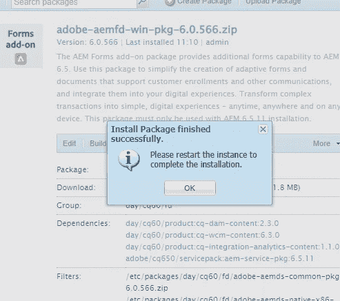
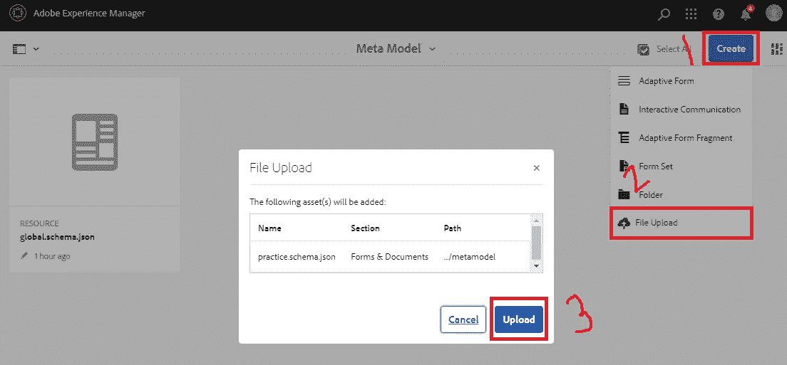
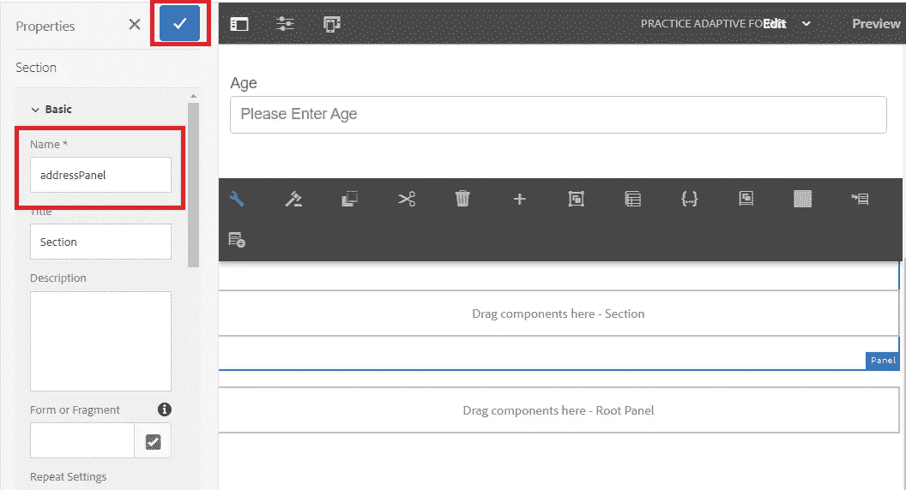
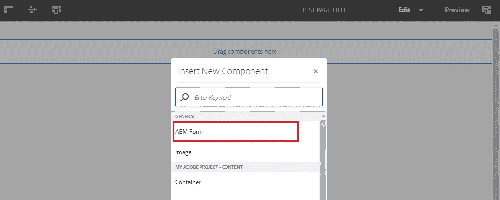
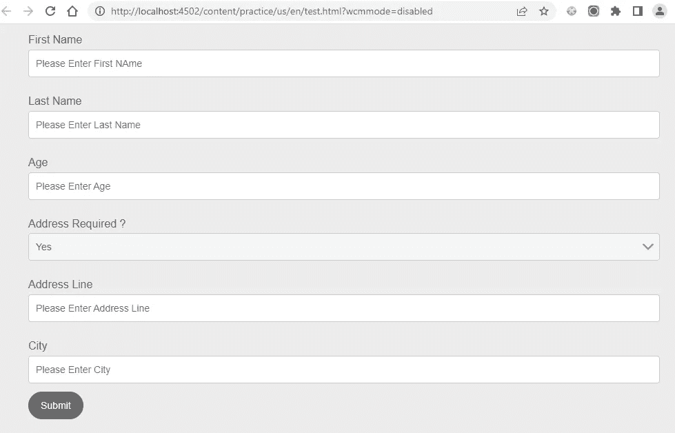

# AEM 自适应表单

> 原文：<https://blog.devgenius.io/aem-adaptive-forms-1ad4a583ee9e?source=collection_archive---------1----------------------->

AEM 表单为我们提供了在运行时创建、更新、发布和管理表单的能力。使用 AEM 表单，我们可以添加、更新和删除 AEM 表单中的任何字段。

作为本博客的一部分，我们将讨论以下主题:

1.  为什么我们需要 AEM 表格？
2.  在本地 AEM 实例中设置 AEM 表单
3.  问题陈述
4.  表单是如何工作的？
5.  (计划或理论的)纲要
6.  表单创建和与模式的集成
7.  AEM 表单与 servlet 的集成

## 让我们试着理解为什么我们首先需要 AEM 表格？

假设我们有一个使用下面的 HTML 代码创建的传统表单，放在 form.html 内部

```
<form action="/bin/submitform">
  <label>First name:</label><br>
  <input type="text" id="fname"><br>
  <label>Last name:</label><br>
  <input type="text" id="lname">
</form>
```

# 作为代码的一部分部署在服务器上的上述 HTML 表单的问题:

1.  **任何与字段标签、类型或验证**相关的更新都需要更改代码并重新构建。
2.  **添加新字段或删除旧字段**也需要代码更改和新构建。
3.  为了**更新或添加表单，提交动作 URL** 也需要构建。
4.  添加新表单也需要构建。
5.  简而言之，做任何与形式相关的改变都需要一个构建。

**AEM 自适应表单使我们能够在运行时进行上述所有更改，而无需构建。**

# 在本地 AEM 实例中设置 Adobe 表单

1.  这将需要从[链接](https://experience.adobe.com/#/downloads/content/software-distribution/en/aem.html?fulltext=forms*&orderby=%40jcr%3Acontent%2Fjcr%3AlastModified&orderby.sort=desc&layout=list&p.offset=0&p.limit=24)安装适应性表单包。在左侧导航中搜索表单。


**重要提示:**

*   请检查您的 AEM 本地实例版本，并安装相同版本的 adaptive forms 软件包。按照以下步骤检查您的本地 AEM 实例版本:


*   确保根据操作系统安装所需的。它可能发生在我们可以在 windows 操作系统上安装 Linux 表单包的地方，反之亦然。
*   如果您无法访问上述 URL 来下载自适应表单包，请联系您的主管或管理员。

2.接受 EULA 条款和条件，并点击下载下载此表格包。


3.进入[包管理器](http://localhost:4502/crx/packmgr/index.jsp)上传上面下载的**adobe-AEM FD-win-pkg-6 . 0 . 566 . zip**包。


4.单击 install 在 AEM 服务器上安装这个包，如下所示。

软件包安装可能需要大约 10-15 分钟。


5.成功安装后，将出现下面的弹出窗口，要求重启 AEM 服务器。

让我们重新启动 AEM 服务器并进行验证。



5.打开下面的 [URL](http://localhost:4502/sites.html/content) 以验证表单包是否成功安装。


# 形成问题陈述

1.  作为此博客的一部分，我们将创建以下表单:


2.在表单提交时，它将生成以下 JSON

```
{
 "fistName": "",
 "lastName": "",
 "age": "",
 "address": {
  "addressLine": "",
  "city": ""
 }
}
```

3.调用定制的 AEM servlet，以步骤 2 中提到的预定义 JSON 格式收集表单提交数据。

# 表单提交流程

表单包含多个字段。众所周知，在表单提交时，第三方 API 或 servlet 总是希望数据采用某种预定义的格式。

作为这个博客的一部分，我们将使用 **JSON Schema** 以 servlet 和第三方 API 期望的相同预定义格式收集数据。


# Adobe 表单实现

1.  打开下面的[网址](http://localhost:4502/sites.html/content)，点击表格平铺。


2.点击下面的表格和文档标题:


## 创建和上传模式

3.如前所述，让我们创建一个如下所示的 **JSON 模式**，Servlet 或第三方 API 将接受该模式。

用 **<文件名> .schema.json** 扩展名存储下面的模式文件。

```
{
  "$schema": "[http://json-schema.org/draft-07/schema#](http://json-schema.org/draft-07/schema#)",
  "$id": "[http://example.com/product.schema.json](http://example.com/product.schema.json)",
  "title": "User",
  "description": "User Form",
  "type": "object",
  "properties": {
    "firstName": {
      "type": "string"
    },
    "lastName": {
      "type": "string"
    },
    "age": {
      "type": "string"
    },
    "address": {
      "type": "object",
      "properties": {
        "addressline": {
          "type": "string"
        },
        "city": {
          "type": "string"
        }
      }
    }
  }
}
```

上面的 **JSON 模式**将创建下面的 **JSON** 作为输出

```
{
 "fistName": "",
 "lastName": "",
 "age": "",
 "address": {
  "addressLine1": "",
  "city": ""
 }
}
```

4.如下图所示选择元模型图块。


5.点击创建按钮，选择**文件上传**选项，上传 **JSON 模式**。选择上面的模式文件并点击上传按钮，如下所示。



6.它将在成功上传时开始出现，如下所示:


# 创建表单

7.返回并点击下方的**表单&文档**平铺，如下图所示:


8.选择**空白模板**创建自适应表单，点击**下一个**按钮。


9.在基本选项卡上输入**标题**和**名称**。


10.选择**表单模型**选项卡，然后选择**模式作为选择自字段的一部分。选择我们在步骤 6 中上传的模式。**选定的 JSON 模式将帮助我们映射表单字段。相同的 JSON 将作为 post 请求数据的一部分。这与 servlet 和第三方 API 期望的 JSON 格式相同:

点击**创建**按钮创建一个表单。


11.单击“编辑”按钮编辑表单，以添加字段、提交操作和其他必需的详细信息。


12.突出显示的第 1 点是我们将在后续步骤中讨论的内容。

突出显示的 2 号点将显示我们要拖放的内容或字段层次结构。

突出显示的第 3 点是拖放表单字段。


13.导航到下面突出显示的选项，并验证模式结构是否存在。


13.点击**拖动组件到这里——根面板** parsys 会弹出一个选择**面板**的窗口。


14.选择**拖拽组件到**段，点击 **+** 按钮拖拽组件。


15.选择下面的**文本框**选项，以拥有一个文本字段。


16.选择文本框 parsys 并单击配置按钮将打开左侧导航菜单，以填写字段特定信息。


17.提供名称、将成为字段标签的标题、占位符，选中**必填字段**复选框，提供必填字段错误消息。

下面我们来详细讨论一下高亮显示的**绑定引用**字段的红色。该字段将帮助我们在创建的字段和先前上传的模式之间建立联系。


18.点击绑定参考选项后，将出现以下屏幕。选择必填字段，然后单击确定。


19.对姓氏和年龄重复第 15、16、17 和 18 步。


20.作为此步骤的一部分，拖放作者下拉列表。


注意:这个下拉菜单我们只是用来学习的，它将帮助我们学习更多关于表单的特性。

21.配置下拉列表并填写下面突出显示的值:


22.平行于第一个面板再拖放一个面板。为面板提供自定义名称。



23.在**第二个面板**中，拖放地址行和城市字段的剩余部分，重复步骤 15、16、17 和 18。

**注意:不要将地址行和城市字段设为必填。**


24.我们希望在页面上隐藏的地址相关字段。这可以通过使用 OOTB 配置逐个隐藏所有字段来实现，这将是一项繁琐的任务。作为替代，我们可以隐藏面板本身，在面板下拖放所有与地址相关的字段，如下所示。


25.作为表单**预览的一部分，**地址相关字段将不会出现。


26.我们希望在选择**必填字段**“是”选项时显示所有地址字段。

选择下面突出显示选项来定义规则。


27.单击下面的“创建”按钮来定义规则:


28.从所需的**地址中选择“是”选项时，定义以下规则至显示的地址部分及其所有字段？**字段，点击**完成**按钮。


29.进入预览选项，选择**是选项，地址栏显示如下:**


30.作为该步骤的一部分，我们将编写自定义代码，以在选择所需的发件人地址的**否**选项时再次隐藏地址部分。领域。

重复步骤 26 和 27。

选择下面的选项以遍历代码编辑器:


31.在内联代码编辑器中粘贴下面的代码。

```
if (this.value == "no") {
    alert("Selected No");
    addressPanel.visible = false;
}
```


32.在选择选项为**时，No** 将弹出警告并隐藏地址部分及其字段。


33.让我们为表单提交编写一个**提交按钮**:


34.选择顶部容器并点击配置按钮以执行表单级创作，并选择**提交动作**下拉字段下的**提交至 REST 端点**选项。

表单提交将是一个 POST 请求调用，因为我们将发送用户表单数据作为请求有效负载的一部分。

选择**启用 POST 请求**复选框，并提供第三方 API 或 servlet URL 作为 POST 请求字段的 **URL 的一部分。**


# 创建内容页面并使用 AEM 表单

35.选中复选框，允许**常规**组下的 **AEM 表单**作为模板的一部分拖放到页面上。


36.创建页面，拖放 AEM 表单组件。



37.使用下面突出显示的选项配置组件。


38.在“资产路径”字段下提供我们作为此博客的一部分创建的 AEM 表单路径，然后单击“确定”将在页面上加载 AEM 表单。

作为该对话框的一部分，我们还可以提供感谢页面 URL 或消息。


39.它将加载下面的 AEM 表单内容页面



40.创建下面的 POST Servlet 来收集数据

提交的数据以参数的形式出现，可以使用下面的语法进行收集。

**req . getparameter(" data XML ")**

```
import org.apache.sling.api.SlingHttpServletRequest;
import org.apache.sling.api.SlingHttpServletResponse;
import org.apache.sling.api.servlets.HttpConstants;
import org.apache.sling.api.servlets.SlingAllMethodsServlet;
import org.osgi.framework.Constants;
import org.osgi.service.component.annotations.Component;
import org.slf4j.Logger;
import org.slf4j.LoggerFactory;

import javax.servlet.Servlet;
import java.io.IOException;

@Component(
    service=Servlet.class,
    property={
        Constants.*SERVICE_DESCRIPTION* + "=Custom Servlet",
        "sling.servlet.methods=" + HttpConstants.*METHOD_POST*,
        "sling.servlet.paths=" + "/bin/user"
    }
)
public class UserDetailServletByPath extends SlingAllMethodsServlet {
    private static final long *serialVersionUID* = 1L;
    private final Logger logger = LoggerFactory.*getLogger*(getClass());

    @Override
    protected void doPost(final SlingHttpServletRequest req,
        final SlingHttpServletResponse resp) throws IOException { logger.error("User >>>> {}", **req.getParameter("dataXml")**); resp.setStatus(SlingHttpServletResponse.*SC_OK*);
        resp.setContentType("application/json;charset=UTF-8");
        resp.getWriter().print("{\"response message\" : \" Service Called\"}");
    }
}
```

41.在表单中填入以下值，并在提交后收集值作为 Post servlet (/bin/user)的一部分。


## 输出:

检查 error.log 文件以验证作为表单的一部分提交的值。


```
{
 "afData": {
  "afUnboundData": {
   "data": {
    "address": "yes"
   }
  },
  "afBoundData": {
   **"data": {
    "firstName": "John",
    "lastName": "Carter",
    "age": "28",
    "address": {
     "addressline": "Victoria",
     "city": "Washington"
    }**
   **}**
  },
  "afSubmissionInfo": {
   "computedMetaInfo": {},
   "stateOverrides": {},
   "signers": {}
  }
 }
}
```

成功的表单提交将进行以下三次后续调用:


我希望你发现这篇文章有趣且内容丰富。请分享给你的朋友来传播知识。

您可以关注我即将发布的博客[关注](https://medium.com/@toimrank)。
谢谢！