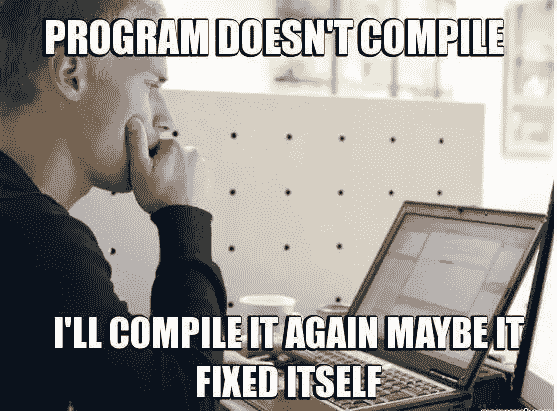

# 在作为一名计算机科学学生完成两年大学学业后

> 原文：<https://blog.devgenius.io/after-finishing-2-years-of-college-as-a-computer-science-student-a5a5db667c41?source=collection_archive---------29----------------------->

## 我希望两年前就知道的事情。

约翰·施诺布里奇在 [Unsplash](https://unsplash.com?utm_source=medium&utm_medium=referral) 上的照片

*本文针对:*

*   计算机科学专业的 HS 大四学生，想知道自己在做什么…
*   自学成才的工程师/开发人员想知道他们在大学里教什么…
*   经验丰富的工程师/开发人员只是好奇他们现在在 CS 课程中教给孩子们什么。
*   任何偶然读到这篇文章的人。欢迎继续阅读…

我的大学一年级(2018 年)是我第一次接触到与计算机科学(CS)相关的任何东西。之前，我甚至不知道 CS 是什么，也不知道这份工作包括什么。我对技术有着浓厚的兴趣(如果这就是你所谓的熬夜看 YouTube 视频的话),并渴望开发自己的应用程序，这最终让我宣布自己的专业是计算机科学。天啊，要是我知道我会让自己陷入什么样的境地就好了…

老实说，我很幸运我的专业完全符合我的愿望。计算机科学是一个奇妙的领域，它为新技术和研究提供了广阔的空间，带来了丰厚的报酬、机遇和挑战。*目前我在《新冠肺炎时报》写这篇文章，它只是放大了社会、企业、学校、政府是如何依赖技术的*。那么美国的大学是如何教授计算机科学课程的呢(至少在前两年是这样)。我将这篇文章分成三个部分:**你将学到的主题**，**你将面临的斗争**，**我学到的最大的教训**。我的目的是通过这三个部分，让你对大学的头两年有一个大致的了解，你可以期待看到一些东西。

*** *免责声明:这仅仅是我的观点。情况总是变化的，这符合 CS 的一个基本原则:没有一套原则适用于所有用例。****

# **您将学习的主题**

每个学院的结构、格式和名称可能不同。但最重要的是，你可以期待参加这些领域的课程:

*   使用强大的编程语言，如:Python、C++、Java 或 Go。
*   编程基础:数据类型、循环、条件、函数、类等。
*   数据结构+算法(排序/搜索)和算法分析的基础和实现。
*   一个简化的低级类(即计算机如何在引擎盖下工作),涉及汇编语言/ Bits /内存如何工作
*   一点数据库设计和 SQL。
*   学习面向对象的基础知识和可扩展应用程序的程序设计。

如果你是新来的，这可能看起来很吓人。相信我，在第一天上课后，我也在质疑自己的学习能力。但是如果你什么都不懂也不用担心。我估计在你第一年之后，你可能会解释几乎一半的列表(考虑到这篇文章的标题，这是意料之中的)。正如许多有经验的工程师和开发人员会告诉你的那样，学习计算机科学的头几周将是最令人沮丧的。这将引导我进入下一部分…

*下一部分*前的快速注释:

虽然你可能在课程中涵盖了很多信息，但大多数时候只是一些基础知识。我可以自信地说，我在 CS **的大部分主要学习和进步都是在课堂**之外。大多数大学课程每周只有几次 50-55 分钟的会面。所以你不会面面俱到(你会发现 CS 的范围实在是太宏大了)。所以我强烈建议**课外学习(至少选 3 个)**:

*   申请实习
*   黑客马拉松
*   竞争性编程
*   浏览在线课程
*   为开源项目做贡献
*   制作自己的项目
*   阅读关于某个主题的编程书籍
*   学习一些你感兴趣的东西
*   在线制作免费视频
*   创建自己的博客
*   向他人教授您所学的主题
*   开始一项技术业务

选择什么不重要，重要的是你在*做*某件事。试着不要对别人的成就和他们的所作所为感到沮丧，这很容易做到。关注你的成长。最重要的是你正在**学习**和**做课外的**事情，不管是什么事情。这个概念叫做对你的学习负责。

> 成功是一颗种子，从根、水、阳光和环境的辛勤工作中发芽。你可能几天、几周甚至几个月什么也看不见。但是园丁喜欢每天起床在花园里工作。然后有一天，突然，有一个绿色的小点穿过所有的污垢。

# **你将面临的斗争**

每个程序员都面临的体验，希望他们的程序能够工作。图片来源:谷歌图片。

你将面临挣扎！你会问，奋斗从何而来？计算机科学就像学习一门不熟悉的语言，一种另类的思维方式。如果你觉得:

*   挫败感。
*   想要退出。
*   霸道。

理解这是正常的。每当你学习新东西时，你都会有一段不舒服的开始期。你知道吗:A " *我不知道我在做什么，我可能看起来很傻*，"学习需要心态。我将在*我学到的最大教训* 一节中更多地谈论这一点，但当我刚开始时，我在课堂上挣扎了很久，我只是在我的 IDE 中尝试一些愚蠢的事情——慢慢地学习“哦…所以如果我这样做，这是可行的，但这样做是行不通的”。

此外，除了传统的计算机科学之外，还有许多与技术相关的职业让你远离所有的编程。但是，话虽如此，如果在不到一年的时间里，你完全讨厌你的生活，那么换专业或职业是没问题的。

# **我学到的最大教训**

那么，经过 2 年漫长而艰苦的编程，我学到了什么？老实说，不多。我确实学到了一些东西(当你开始的时候，我已经把它们分成了两个最重要的主题)，但是我的意思是我还没有掌握任何东西。计算机科学不是一项需要掌握的技能，相反，我认为它是一种学习的订阅。这就引出了我的第一点…

## 学问

1.  我明白了**学会如何学习**是一个软件开发人员/工程师能够拥有的最重要的技能。
2.  你永远不会成为计算机科学领域的大师。旅程比目的地更重要，学会拥有关心旅程的心态。
3.  对你的学习负责任，或者说知道你不知道的东西。

帮助你入门的好书:*掌握:成功和长期满足的关键*乔治·伦纳德著。

精彩文章:[你在编程方面将会失败的 10 个迹象——乔纳森·布鲁斯](https://blog.usejournal.com/10-signs-you-will-suck-at-programming-5497a6a52c5c)

## 斗争

1.  通过*练习* : **自律、坚持、一致和关注细节**来建立这些品质。
2.  如果感觉你没有进步，没关系。我们大部分的学习都是突然发生的，但是被一个叫做高原的概念所支配。(伦纳德在*掌握*中讨论过)。
3.  **休息一下**。工作、工作、工作的心态对你的身体、思想和灵魂都没有好处。放下笔记本电脑。
4.  计算机科学很难(雇主不会白给他们钱)，做好这方面的准备，如果你在一周的学习中没有自动获得所有东西，也不要惊讶。
5.  永远不要放弃。

# **关闭**

我真的希望这有帮助！任何人都可能成为成功的软件工程师，但这取决于你的品质和特点。谢谢你一直坚持到最后。敬请关注第二部分上帝的意愿！一如既往，上帝保佑。

如果你正在读这篇文章，你真的很优秀！如果你感兴趣，我会在我的新 [*YouTube 频道*](https://www.youtube.com/channel/UCxhUW6cZDuHg3z9SAy6Fdew) *上传更多建议和技巧。看看吧！*

佩顿的标志