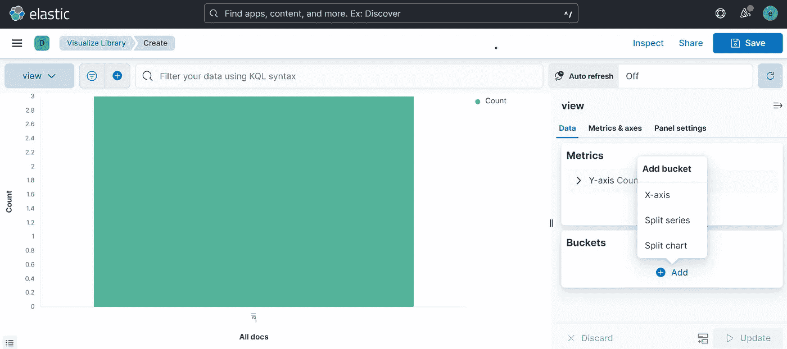
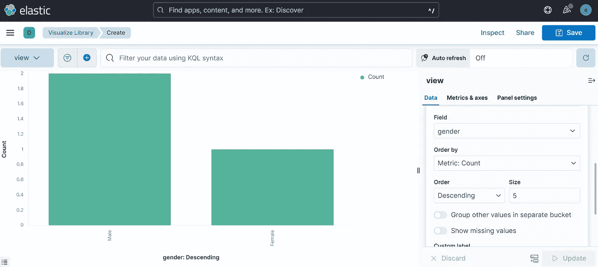
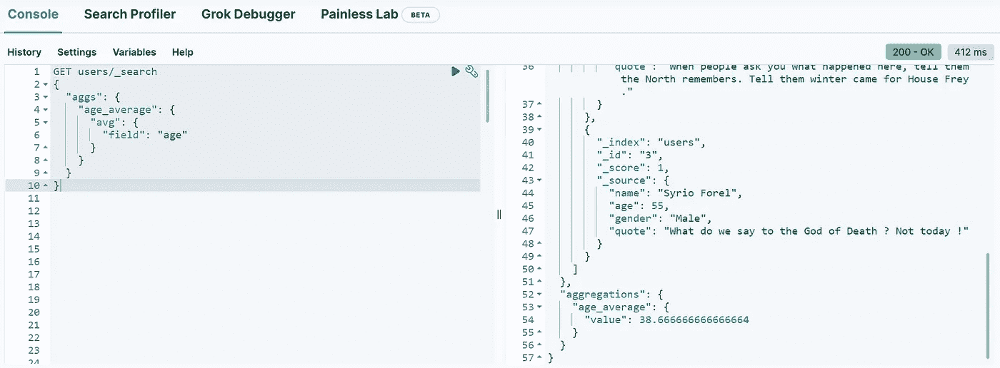

# 弹性研究中的聚合

> 原文：<https://blog.devgenius.io/aggregations-in-elasticsearch-495503d78b7d?source=collection_archive---------10----------------------->


什么是好人？很高兴在这个系列中再次见到你😁！今天我们就简单说一下 Elasticsearch 中*聚合*的概念。

**汇总**是将数据汇总成指标或统计数据以便进行分析的操作📊。它将帮助您回答以下问题:

*   最常去的城市有哪些？
*   用户平均年龄是多少？
*   按性别划分的用户比例是多少？

现在让我们看看如何将 Elasticsearch 用于分析。对于本教程，我们将使用在[上一篇文章](https://medium.com/@mhdabdel151/the-essentials-of-data-search-in-elasticsearch-ca2efee5509e)中使用的相同索引，如果你还没有的话，我建议你读一读。

```
PUT users 
{
  "settings": {
    "number_of_shards": 2,
    "number_of_replicas": 1
  },
  "mappings": {
    "properties": {
      "name": {
        "type": "text"
      },
      "age": {
        "type": "short"
      },
      "gender": {
        "type": "keyword"
      },
      "quote": {
        "type": "text"
      }
    }
  }
}
```

进入菜单的*分析*标签，打开*可视化库*。让我们创建一个新的基于*聚合的*可视化，然后选择*竖条*表示。您必须通过引用与我们的索引相对应的*索引模式*来创建一个视图，这里是**用户**。完成后，仪表板应如下所示:



添加一个新的 *X 轴* **桶**，并为聚合字段选择*术语*。我们想要按性别划分的比例，所以我们将在性别方面采取行动。我们的图表生成了。



请注意，这种表示在这里没有用，因为我们的数据集中只有 3 个用户，这对于大型数据库非常有用。

通过使用 API，我们可以进行聚合。再次打开控制台，我们可以对我们的**用户**索引进行 **GET** 请求，如下所示:

```
GET users/_search
{
 "aggs": {
  "age_average": {
   "avg": {
    "field": "age"
   }
  }
 }
}
```

这里我们不定义查询，而是进行聚合。在它的定义中，我们会给它一个*的名字(age_average)* 和一个*的类型*。有一套工具可供使用，例如允许按类别对数据进行分组，或计算平均值( *avg* )，以及总和和许多其他操作。在这里，我们指定想要用户索引中字段*年龄*的平均值，并打印结果。



Elasticsearch 将聚合分为三组:

*   [**度量聚合**](https://www.elastic.co/guide/en/elasticsearch/reference/current/search-aggregations-metrics.html) 基于我们可以从文档中提取或通过脚本生成的值，计算平均值等值。这里不支持子聚合。
*   [**桶聚合**](https://www.elastic.co/guide/en/elasticsearch/reference/current/search-aggregations-bucket.html) 将文档全部分组在一起。例如，我们可以通过使用*城市*字段上的*术语聚合*来检索文档中的所有*城市*，并检索 5 个最频繁出现的城市。
    弹性搜索将为每个*城市*生成一个存储桶，其中包含这些存储桶中的文档数量。与度量聚合不同，桶聚合支持*子聚合*。例如，可将*年龄*平均值添加到此聚合中。因此，将计算每个时段的平均值。
*   [**管道聚合**](https://www.elastic.co/guide/en/elasticsearch/reference/current/search-aggregations-pipeline.html) 关注其他聚合的结果，而不是文档。有许多不同的品种被分成两个重要的家族。

您可以在同一个查询中运行*多个聚合*、返回聚合类型、*在聚合中使用脚本*等多种操作。[这个链接](https://www.elastic.co/guide/en/elasticsearch/reference/current/search-aggregations.html#search-aggregations)到官方文档将会介绍你在🧗.探险中需要的所有东西

今天就到这里。感谢阅读，如果您对本文有任何疑问或评论，请在下面留言。

下次我会看到你更多的帖子🚀。

Abdoul-Bagui M .