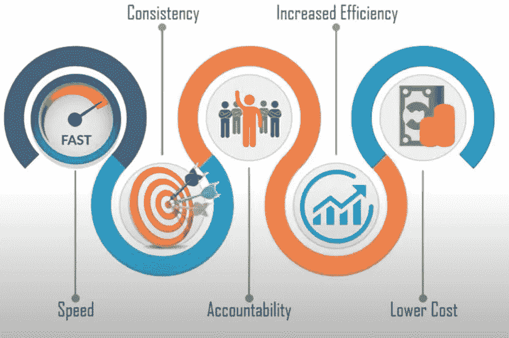
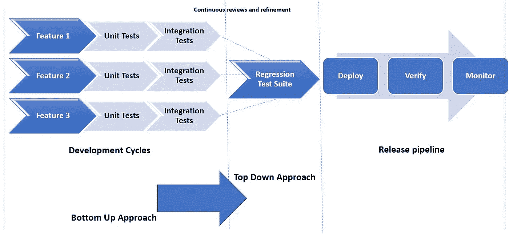
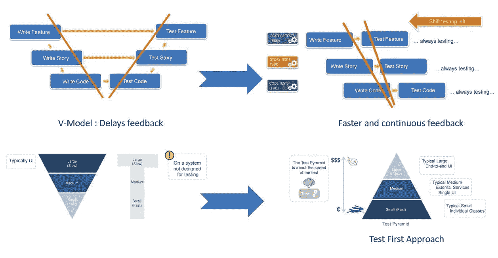

# 敏捷:提高生产力和团队士气的精益思维

> 原文：<https://blog.devgenius.io/agile-a-lean-mindset-to-boost-productivity-and-team-morale-b3f092f0c8d0?source=collection_archive---------17----------------------->

*有经验的软件工程师都知道，最好的工程师在解决问题时往往是删除代码，而不是添加代码。*

精益思维——团队士气的助推器

# 问题陈述:

到目前为止，在我从事的几乎每个软件项目和产品中，我都反复面临这些挑战。此外，我在不同的项目中多次从开发、质量保证和项目领导那里听说过这些问题。他们是…

1.  长的测试自动化执行周期需要更长的时间来完成，消耗长的 CPU 周期
2.  拥有数千个测试用例的大型测试套件
3.  维护 Junit / API / UI 测试自动化套件的大量维护工作
4.  过多的粒度测试用例增加了分析和维护的开销，降低了可追溯性
5.  测试结果的不一致性和较低的可预测性
6.  团队总是缺乏发布的测试能力，负担过重

所有这些问题导致周转时间长，团队的多任务能力降低，发布时间表推迟，最糟糕的是降低了团队的士气。

# 方法:

S 简单性允许更快、更具成本效益的创新。大多数时候，我们把事情设计得过于复杂，但是许多问题可以通过简单的简化来解决。你不需要每次都想着创新伟大的技术。简化需要成为任何开发过程的基础，以与敏捷的精益思想保持一致。

ean 是一种专注于减少流程中浪费的方法。精益依赖于消除浪费(任何对客户没有价值的努力)、优化整体(从“概念到现金”)、快速交付、提高质量、尊重员工和建立最佳标准的理念。

一个典型的测试过程或方法有很多的填充和额外的负担，这使它变得沉重和庞大。如果我们以某种方式消除了不必要的或浪费的东西，我们最终会得到精益测试。描述浪费最简单的方式是“任何不增加价值的东西”这些浪费包含在你的产品或服务的成本中，要么抬高了生产成本，要么吞噬了利润。精益测试的主要目标是:通过整体地、早期地、持续地测试系统来减少浪费(返工、缺陷、腐蚀),同时测量真正重要的东西并逐渐提高质量。

但是请记住，精益不是偷工减料。完全符合我们所知道的[吻](https://en.wikipedia.org/wiki/KISS_principle)原理。我们需要用更少的努力交付高质量的产品。简而言之，提高生产力，提高团队士气。

> 精益测试:消除浪费，扩大学习，定期修改，快速响应，协作和沟通，保持透明和信任，看到大图片。

由于专注于精益思想和简化，到目前为止，我能够在许多项目和产品中实现以下目标。这里提到的百分比是平均值(在许多项目中更高)。除了这些可测量的改进，主要和重要的变化是提高了团队士气。

1.  测试周期时间和资源使用减少 **50%**
2.  **跨职能团队的自动化测试执行效率提高了 40%**
3.  减少缺陷泄漏 **80%** 用于 **25+** 年生产部署

# 云优先:

传统的大量开发和部署、漫长的发布和测试周期已经成为过去。我们身处云应用的世界，可伸缩性、可扩展性、高可用性、自我修复、弹性、灾难恢复和监控是常见的维度。

市场上存在一场竞赛，即在我们的竞争对手推出新功能或新技术之前推出新功能或新技术，成为市场上的第一家，并尽早获得最大的市场份额。我们需要赢得这场比赛，让我们的生意成功。我们需要快速思考、快速行动和快速反应。因此，在我们的思考、计划和实施中保持精简和简单是非常重要的。

> 目标:减少成本和时间，最大限度地提高利润，赢得竞争。

# 简化:

以下是帮助我的团队克服上述挑战的步骤。

1.  **对测试套件进行分类，以最大化 ROI** :确保高效、可预测和一致的测试周期
2.  **关注 API 层而不是 UI 层**:最小化测试维护工作
3.  **构建质量**:测试优先方法，最小化等待状态
4.  **持续探索和学习周期**:分析差距和生产问题以减少缺陷泄漏

**注**:这里我不是在谈论如何通过使用技术进步来减少周期时间，即以更快的速度和更少的成本并行运行数以千计的测试。为此，我们有多种工具、框架和方法，如 Selenium 并行执行模式、在主从设置中分配负载、以更低的成本使用 AWS lambda 进行并行执行等等…..在这里，我用测试套件和过程来解决组织问题。

> 有经验的软件工程师都知道，最好的工程师在解决问题的时候往往是删除代码，而不是添加代码。当涉及到代码、系统和过程时，移除总是更好的选择。

## **1。分类测试套件以最大化 ROI :**

将测试套件想象成一种负担或开销，当您通过里程碑时，您需要随身携带。同时，你需要敏捷，有能力对情况做出更快的反应，并需要欢迎变化。你能承受沉重且杂乱无章的负担吗？这是否降低了您的实际敏捷能力？

因此，处理这个问题的方法是根据 ROI 对测试套件进行分类。测试套件需要定期在产品层面上进行整合，需要精简，并且只覆盖变更/发布应该覆盖的内容。

**1a。去除测试套件中的冗余:** 测试库和代码库一样。因为我们需要不断检查代码库中的死代码、冗余代码和缺口。同样，我们需要不断审查测试存储库，无论是手动的还是自动的。如果测试没有增加任何价值，我们就不需要花费精力来运行测试。简单！如果您在开发冲刺阶段创建了 1000 个测试用例，并不意味着所有的测试用例都需要集成到未来版本的回归测试套件中。随着我们在开发冲刺阶段的进展，需求会随着时间而细化，这些细化也需要在测试库中完成。我们错过了测试套件维护中的这个基本步骤。请记住，增加测试数量、预算规模或固定费用没有额外的加分。在发布周期中运行的每个测试自动化代码都会消耗 CPU 延迟反馈，因此需要增加价值。此外，当你有许多粒度测试用例时，可能在那些测试中有多余的步骤，包括登录、注销、页面导航等。这些也需要通过测试和自动化代码的合并来移除。

**1b。基于 ROI 的测试分类:** 这是另一个基本步骤，我发现在许多项目中都缺少了。在开发冲刺阶段，我们关注单元测试，特定的单元/功能，但是在将这些测试用例引入回归测试套件时，我们需要从最终用户/业务的角度来看待应用程序的整体视图，然后组织测试套件。我们需要采取自上而下的方法。我明白了，团队总是不断地向测试套件添加测试用例，测试套件随着产品呈指数增长。

当我们想到产品测试套件时，我们需要从将要使用产品的业务用户(角色)的角度来考虑。

**转换方法:在开发冲刺阶段从下到上**
**从下到上的方法**:当我们在开发冲刺阶段测试特性时，我们需要关注特性需求，并深入测试特性，以发现特性级和集成级所有可能的问题。
**转移到自顶向下的方法**:一旦特性稳定，代码被合并到发布分支，审查、提炼和巩固测试自动化代码。

*   分析每个**测试**的 ROI，并将其**放入正确的类别**
*   将粒度测试整合成覆盖端到端流程的几个测试，以**删除冗余代码**

转变方法:自下而上至上而下

**测试分类:**
我们可以很容易地应用[帕累托分析](https://en.wikipedia.org/wiki/Pareto_analysis)中提到的 80/20 规则对测试套件进行分类。
**冒烟测试** :
*整个测试套件中 20%到 25%的测试
*涵盖业务用户最频繁操作的测试
*最高 ROI 和失败的测试是 S1(阻断器)问题
*需要保持最新的功能更新
*需要与每个部署的构建验收测试集成
**回归测试:** * 整个测试套件中 40%到 50%的测试
*涵盖业务用户完成的所有主要业务场景的测试(包括端到端操作)
*高投资回报率和失败的测试是 S1 / S2(主要业务影响)的问题
*需要使用功能的最新更新进行良好维护
*需要根据需要与构建进行集成
**其他测试:** * 整个测试套件中 25%到 40%的测试
*涵盖低价值测试，例如极限情况、边缘条件、边界值
*低投资回报率和失败的测试是 S3 / S4(低业务影响)的问题
*最好保持最新的功能更新
*最好根据需要集成构建以供执行

按照同样的顺序，冒烟测试优先于回归测试，然后是其他剩余类别的测试。

## **2。关注 API 层:**

寻找每一个机会来涵盖 API 级别的最大可能场景。尽量减少 UI 级测试，主要是为了验证 UI 验证、导航和端到端功能。这个想法是用 UI 测试来测试在 UI 层编写的代码。所有其他测试都需要在 API 层覆盖。与 API 不同，UI 测试套件需要大量的维护，并且需要更多的执行时间。

## 3.构建质量:测试优先方法，最小化等待状态

请记住，测试不再是数学之后的活动，测试的看门人方法已经成为过去。质量是一个重要的维度，从我们开始理解需求和创建架构的那一天起，它就需要被测量和处理。我仍然看到许多团队试图寻找这样的问题的答案:我们是如何在将代码推广到生产之前，在测试中没有识别出弹性问题的？我们如何通过测试来发现弹性问题？我们需要构建和设计具有弹性的应用程序。弹性测试只是对设计的验证，而不是发现问题的机会。如果您没有很好地设计您的应用程序来处理弹性，那么在编写代码之后测试和发现弹性问题是没有意义的。我们增加了成本，这是很容易避免的。性能、安全性、高可用性和灾难恢复也是如此。这些都需要从体系结构和设计层面加以考虑。因此，简而言之，质量需要建立在应用程序设计和开发过程中。

左移(测试优先)方法、结对编程、测试驱动开发和行为驱动开发都是我们熟知的。左移方法有助于在周期的早期发现问题，而倒金字塔测试有助于减少测试执行的时间，并节省返工和测试的成本。

左移—测试第一种方法

## 4.持续探索和学习周期:

我们都有无限想法的能力。我们需要“还有什么”这个问题会遇到一长串的答案，以至于我们要永远尝试所有的答案。它的意思是，我们永远不应该满足于我们所拥有的。当你知道自己还没完成时，你就会创新。每个产品问题都是我们学习的机会，不断迭代学习周期，将学习周期带回测试套件、代码和流程。

**数字越高，可信度越高？** 我看到团队倾向于将信心水平与执行的测试用例数量联系起来——如果你的测试没有覆盖所有领域，如果你有许多重复和冗余的测试用例，它们一直在消耗 CPU 周期，那该怎么办？我不是一个大测试计数的粉丝，因为它只是一个侥幸，大数字很容易误导你。经过组织、分类和良好维护的测试套件可以事半功倍，因此这就是目标。你可以通过执行 5000 个测试用例来达到的质量水平，同样可以通过合并好的、正确分类的 500 个测试用例来达到。一周的工作可以减少到仅仅 1-2 天，几天的工作可以减少到几个小时。

**零缺陷产品？** 零缺陷产品是一个神话，没有产品是完美的。完美需要大量的坚持、反复和时间。有一天你认为产品是完美的，这意味着你不能再创新，不能再有任何不同的想法。如果没有人发现一个产品的缺陷，并不意味着这个产品没有任何缺陷。只是缺陷可能不在产品的核心区域，而可能会在遇到问题时显现出来。软件、硬件、模块、平台、集成层之间有如此多的依赖关系，因此任何时候任何层都可能出现问题。在投资之前考虑投资回报率。我们需要追求完美，但我们不需要相信我们已经达到了完美。

测试一切并不意味着你在生产高质量的产品。我们永远不会有时间或资源以我们想要的方式完成事情，所以我们需要以我们需要的方式完成事情。有太多事情要做，而时间太少是好的。在一个项目中不做所有你想做的事情是健康的，因为做所有你想做的事情是低效的。您的堆栈级别上的最后一件事永远不会完成，我们都应该对此感到高兴。有了分类的和组织良好的测试套件，你将有能力在任何时候选择正确的测试集。

# 结论:

简化需要关注、规划和持续的努力。战略需要根据问题进行改进和改变。没有放之四海而皆准的方法。策略需要根据问题进行改进和改变。但是我经历过上面提到的这些简单的步骤帮助很大，回报也很高。到目前为止，我已经在许多项目和产品中实施了这些指导方针，并体验到了其中的好处。

> 好的软件测试是一个具有挑战性的智力过程。只有通过经验、判断和技能，在整个项目中合作地运用，我们才能在正确的时间做正确的事情来有效地测试我们的产品。

尽管在这里我提到了具体的问题，并且主要讨论了测试和测试自动化的领域，但是精益原则适用于软件工程的所有领域和流程。

最后，我想说的是，这本书结束的时间更长了…我开始打算写一个简短的笔记，但却以一些描述性的东西结束。感谢您花时间阅读本文，如果您有任何意见、问题或建议，请随时发表。