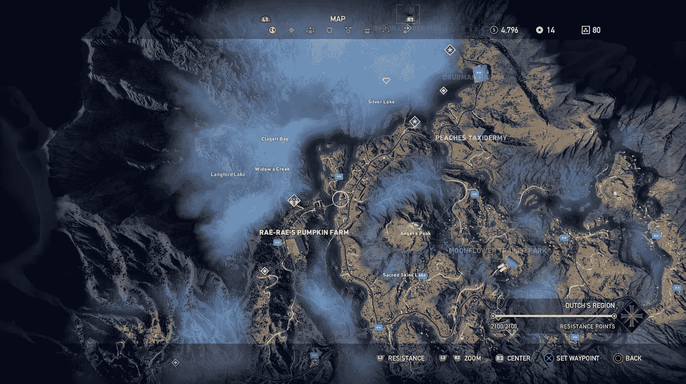

# 敏捷与战争迷雾

> 原文：<https://blog.devgenius.io/agile-and-the-fog-of-war-f2e402c41eba?source=collection_archive---------29----------------------->

战争迷雾代表了评估冲突区域时所经历的[不确定性或缺乏态势感知](https://en.wikipedia.org/wiki/Fog_of_war)。我丈夫经常玩使用地图的第一人称射击游戏，用来描绘战争的迷雾。这张地图给了你一个大致的概念，但是直到你到达标记的地点，细节才会被透露，直到你亲自去那里或者派一个侦察兵。当你清理一个区域时，那部分地图就会显现出来。随着你处理和征服更多的地点，并把地图放入清晰的视野，最终，你赢得了游戏。

图片来自[https://www . polygon . com/far-cry-5-guide/2018/3/26/17164422/map-武器-獠牙-出租-挑战-津贴-直升机-隐形-街机](https://www.polygon.com/far-cry-5-guide/2018/3/26/17164422/map-weapons-fangs-for-hire-challenges-perks-helicopter-stealth-arcade)

我最近花时间观看了我丈夫的戏剧《T4 惊魂 5》。我经常认为这些游戏和我丈夫花在策略上的时间是理所当然的，尤其是在有非常开放的世界的游戏中。然而，当我想到他玩游戏的方式，尤其是那些涉及战争迷雾的游戏时，我现在看到了很多与这种策略以及敏捷如何工作的相似之处。

敏捷是一种软件开发、交付和管理方法，由短的迭代周期组成，以便向客户交付增值。它呼应了这个问题背后的情绪——如何吃掉一头大象？答案是一次一口。软件团队不是试图一次确定所有的需求，而是在小范围内进行发现，并基于这些发现进行交付。代码更改被设计得很小，目的是在过程的早期发现失败，以便团队可以调整并采取另一种方式。

对我来说，这和处理战争迷雾时的游戏策略没什么不同。

1.  权衡你所有的选择

在这些第一人称游戏的开始，你通常会得到一件简单的武器(或者有时，只是你的智慧)，没有弹药，运输工具，盟友等。为了建立你的武器库和资源，你必须决定什么是最重要的，哪条路线可以让你收集这些东西。有时候，你决定攻击一个前哨站，即使战斗很艰难，生命和肢体有很大的风险，但你知道你在那里得到的补给是值得的。

照片由 [Unsplash](https://unsplash.com?utm_source=medium&utm_medium=referral) 上的[延斯·勒列](https://unsplash.com/@leliejens?utm_source=medium&utm_medium=referral)拍摄

在软件开发中，通常有多种方法来解决同一个问题。有些是昂贵的，但是允许你在更短的时间内交付软件。然而，一些经过验证的路径可能需要更长的时间，但是提供了更高的一致性和可靠性。这完全取决于在做决定的时候，车队最重要的目标是什么。

2.在合理的时间内收集尽可能多的数据

在第一人称射击游戏中，有时可能会派出一名侦察兵去查看该地区的范围和与之相关的风险，这可能是你以前不知道的。在敏捷方法中，开发团队通常可以执行所谓的[尖峰](http://agiledictionary.com/209/spike/)——这是一个发现过程，通常有时间限制，以确定并潜在地测试可行的解决方案，并更好地理解目标或需求，如果不是定义明确的话。时间限制是这里的关键——只花最少的时间获得你需要的数据，然后离开。

3.不要冒不必要的风险

在根据你收集的数据权衡你的选择后，你仍然会在前进的道路上遇到风险，当你处理一个敌人的区域或者当你开发一个解决方案时。例如，您可以决定使用单实例还是多复制数据存储解决方案。要问的问题是，如果我的决定被证明是不充分的，我愿意处理什么？我失去了什么，我是否愿意接受，或者我能否承受这种损失？如果风险的可能性很低，和/或可以用很少或没有成本来减轻，那么为了更快地实现回报，风险可能是值得的。

照片由[迈克尔·香农](https://unsplash.com/@mgshannon?utm_source=medium&utm_medium=referral)在 [Unsplash](https://unsplash.com?utm_source=medium&utm_medium=referral) 上拍摄

4.快速失败

有时候，游戏会提供附带任务让玩家获得经验，或者让玩家暂时从游戏的更大目标中转移注意力。迷你任务通常很容易进入和退出，有时可以提供未来更多事情的预览。然而，由于这些任务的性质，这些短暂的冒险也可以为玩家尝试有限范围内的事情铺平道路，并允许他们快速失败。在敏捷中，快速失败的想法很重要，因为我们越早发现原始实现的问题，就越容易减少损失并转向另一个解决方案。一次又一次，研究表明[在开发周期的后期](https://medium.com/@ryancohane/financial-cost-of-software-bugs-51b4d193f107)发现缺陷，尤其是当软件已经普遍可用时，对于一个组织来说，在金钱和声誉方面都是昂贵的。快速失败的目标是创造非常短和紧密的反馈循环，这样我们就可以在下一次努力中学习和发扬这些经验。如果错过了这个教训，那么快速失败只会为开发团队制造不必要的噪音和焦虑，并且很容易摧毁士气。

我现在对我丈夫玩游戏的方法有了更好的理解，并且意识到某些敏捷的理念可以在日常生活中找到它们的方式，并且可以为我们提供一般如何处理问题的课程。